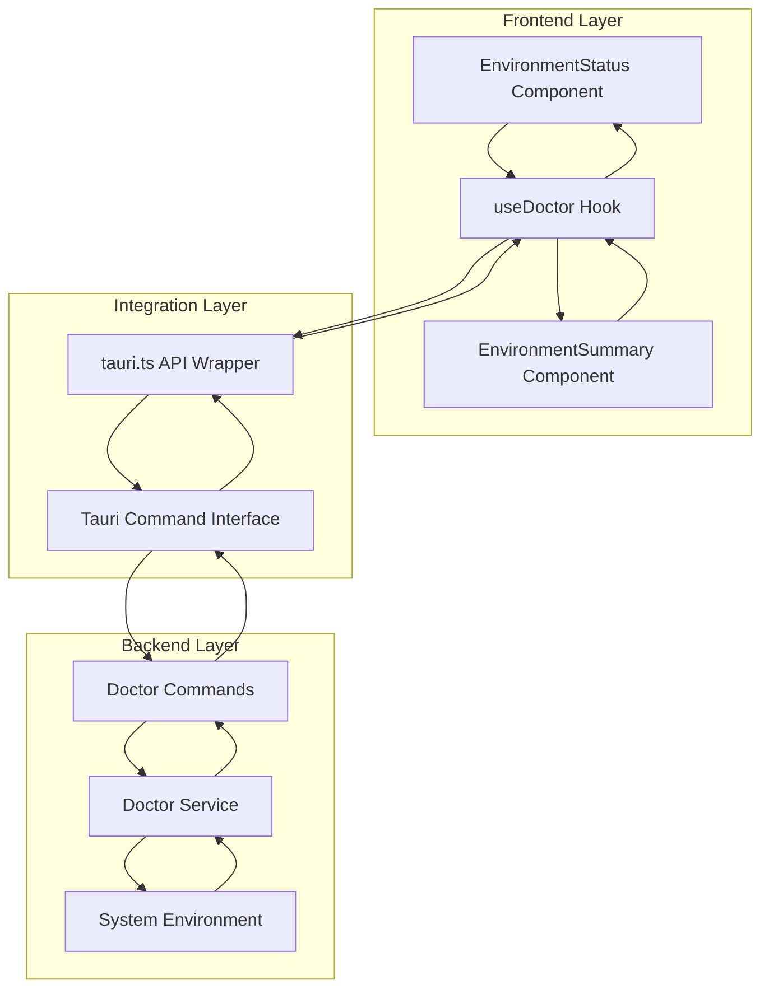
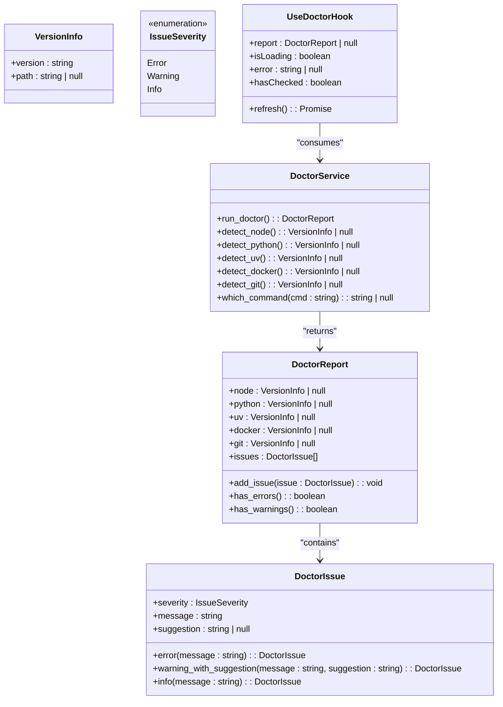
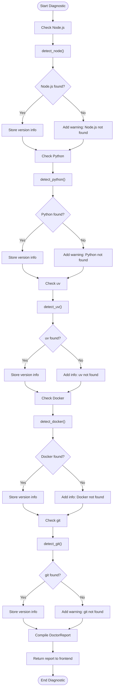
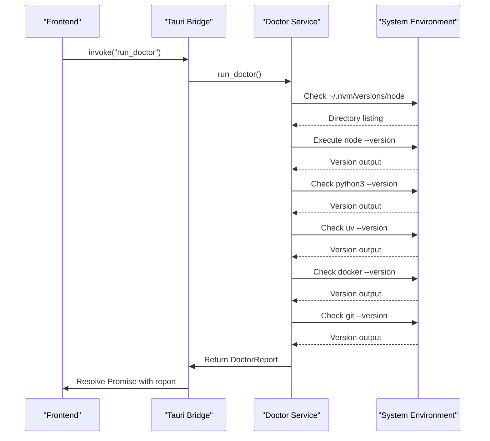
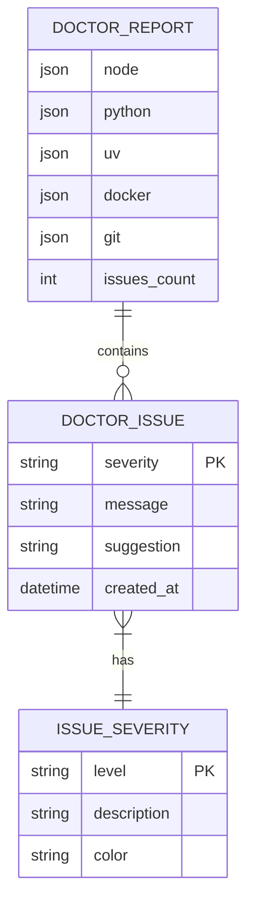

# Doctor Service

<cite>
**Referenced Files in This Document**   
- [doctor.rs](file://src-tauri/src/services/doctor.rs#L1-L330)
- [doctor.rs](file://src-tauri/src/models/doctor.rs#L1-L184)
- [doctor.rs](file://src-tauri/src/commands/doctor.rs#L1-L9)
- [useDoctor.ts](file://src/hooks/useDoctor.ts#L1-L80)
- [tauri.ts](file://src/lib/tauri.ts#L146-L148)
- [EnvironmentStatus.tsx](file://src/components/settings/EnvironmentStatus.tsx#L1-L316)
- [EnvironmentSummary.tsx](file://src/components/dashboard/EnvironmentSummary.tsx#L1-L153)
</cite>

## Table of Contents

1. [Introduction](#introduction)
2. [Architecture Overview](#architecture-overview)
3. [Core Components](#core-components)
4. [Diagnostic Workflows](#diagnostic-workflows)
5. [Dependency Checking](#dependency-checking)
6. [Issue Reporting](#issue-reporting)
7. [Performance Considerations](#performance-considerations)
8. [Troubleshooting Guide](#troubleshooting-guide)

## Introduction

The Doctor service in the MCP Nexus application is a comprehensive diagnostic tool designed to validate the system environment, detect missing dependencies, and identify configuration issues that could affect MCP server functionality. The service performs automated checks on essential runtime dependencies and provides actionable feedback to users through a structured reporting system. It operates as a bridge between the frontend interface and the system environment, enabling users to quickly identify and resolve setup issues.

The service is implemented as a Tauri command that executes on the backend Rust layer, allowing it to access system-level information and execute shell commands to detect installed software. The results are then propagated through the application layer to various UI components that display the diagnostic information to users. The service includes caching mechanisms to optimize performance and reduce redundant system checks.

**Section sources**

- [doctor.rs](file://src-tauri/src/services/doctor.rs#L1-L330)
- [useDoctor.ts](file://src/hooks/useDoctor.ts#L1-L80)

## Architecture Overview

The Doctor service follows a layered architecture that separates concerns between the user interface, application logic, and system interaction layers. The service is exposed through a Tauri command interface, allowing the frontend to invoke diagnostic checks while maintaining security boundaries. The architecture enables bidirectional communication between the frontend React components and the backend Rust implementation through Tauri's invoke system.

**Diagram sources **

- [doctor.rs](file://src-tauri/src/services/doctor.rs#L1-L330)
- [useDoctor.ts](file://src/hooks/useDoctor.ts#L1-L80)
- [tauri.ts](file://src/lib/tauri.ts#L146-L148)

**Section sources**

- [doctor.rs](file://src-tauri/src/services/doctor.rs#L1-L330)
- [useDoctor.ts](file://src/hooks/useDoctor.ts#L1-L80)

## Core Components

The Doctor service consists of several interconnected components that work together to provide comprehensive system diagnostics. At the core is the `run_doctor` function in the services layer, which orchestrates all diagnostic checks and compiles the results into a structured report. This function is exposed to the frontend through a Tauri command, making it accessible to React components.

The service utilizes a model-driven approach with the `DoctorReport` and `DoctorIssue` structures that define the schema for diagnostic results. The `DoctorReport` contains detection results for various runtime dependencies (Node.js, Python, uv, Docker, and git), while the `DoctorIssue` structure captures problems found during the diagnostic process with severity levels and suggested resolutions.

The frontend integration is facilitated by the `useDoctor` custom hook, which provides a React-friendly interface to the Doctor service with state management for loading states, error handling, and result caching. This hook implements a 5-minute caching mechanism to prevent excessive system checks while maintaining up-to-date diagnostic information.

**Diagram sources **

- [doctor.rs](file://src-tauri/src/models/doctor.rs#L1-L184)
- [doctor.rs](file://src-tauri/src/services/doctor.rs#L1-L330)
- [useDoctor.ts](file://src/hooks/useDoctor.ts#L1-L80)

**Section sources**

- [doctor.rs](file://src-tauri/src/models/doctor.rs#L1-L184)
- [doctor.rs](file://src-tauri/src/services/doctor.rs#L1-L330)
- [useDoctor.ts](file://src/hooks/useDoctor.ts#L1-L80)

## Diagnostic Workflows

The Doctor service implements a systematic diagnostic workflow that checks for the presence and proper configuration of essential runtime dependencies required for MCP server operation. When invoked, the service follows a sequential execution pattern that checks each dependency and compiles findings into a comprehensive report. The workflow begins with Node.js detection, followed by Python, uv, Docker, and git, ensuring that all critical components are evaluated.

The diagnostic process employs multiple detection strategies for each runtime to maximize accuracy across different system configurations. For example, the Node.js detection first checks nvm-managed installations by scanning common directory paths, then falls back to checking standard installation locations and finally attempts to locate Node.js through the system PATH. This multi-layered approach ensures comprehensive detection regardless of the installation method used.

**Diagram sources **

- [doctor.rs](file://src-tauri/src/services/doctor.rs#L1-L330)

**Section sources**

- [doctor.rs](file://src-tauri/src/services/doctor.rs#L1-L330)

## Dependency Checking

The Doctor service performs comprehensive dependency checking for the core runtime environments required by MCP servers. Each dependency check follows a consistent pattern of detection, version extraction, and path resolution, with specialized logic tailored to the characteristics of each runtime environment. The service checks for Node.js, Python, uv, Docker, and git, covering the primary execution environments used by MCP servers.

For Node.js detection, the service implements a sophisticated multi-path strategy that first checks nvm-managed installations by scanning the `~/.nvm/versions/node` directory for installed versions. It sorts these by modification time to identify the most recently used version, then verifies the executable and extracts version information. If no nvm installations are found, it checks common installation paths and finally falls back to using the system PATH to locate the Node.js executable.

Python detection prioritizes `python3` over `python` to ensure compatibility with Python 3.x, which is required for Python-based MCP servers. The service handles cases where version information might be output to stderr instead of stdout, ensuring reliable detection across different Python installations and configurations. Docker detection checks for the Docker CLI tool, which is necessary for managing Docker-based MCP servers, while git detection verifies the presence of the git command-line tool required for installing servers from GitHub repositories.

**Diagram sources **

- [doctor.rs](file://src-tauri/src/services/doctor.rs#L1-L330)
- [doctor.rs](file://src-tauri/src/commands/doctor.rs#L1-L9)

**Section sources**

- [doctor.rs](file://src-tauri/src/services/doctor.rs#L1-L330)

## Issue Reporting

The Doctor service implements a structured issue reporting system that categorizes diagnostic findings by severity level and provides actionable suggestions for resolution. Issues are classified into three severity levels: Error (critical issues that prevent functionality), Warning (issues that may cause problems), and Info (informational messages). This tiered approach helps users prioritize their attention on the most critical issues first.

When a dependency is not found, the service generates appropriate issues with specific suggestions for installation. For example, if Node.js is not detected, a warning is added with a suggestion to install Node.js via nvm or from the official website. Similarly, missing git results in a warning with installation suggestions, while the absence of optional tools like uv generates informational messages rather than warnings.

The reporting system is designed to minimize false positives by using multiple detection methods and fallback strategies. For instance, the Node.js detection checks both nvm-managed installations and standard system paths, reducing the likelihood of incorrectly reporting Node.js as missing when it is installed in a non-standard location. The service also includes robust error handling to ensure that failures in one detection process do not affect the overall diagnostic workflow.

**Diagram sources **

- [doctor.rs](file://src-tauri/src/models/doctor.rs#L1-L184)

**Section sources**

- [doctor.rs](file://src-tauri/src/models/doctor.rs#L1-L184)

## Performance Considerations

The Doctor service incorporates several performance optimizations to ensure responsive user experience while maintaining comprehensive diagnostic capabilities. The most significant optimization is the 5-minute caching mechanism implemented in the `useDoctor` hook, which prevents redundant system checks when the diagnostic results are likely to remain unchanged. This caching strategy significantly reduces the frequency of expensive system operations while still providing reasonably up-to-date diagnostic information.

The service minimizes system overhead by organizing dependency checks in a logical sequence and using efficient detection algorithms. For example, the Node.js detection prioritizes fast directory existence checks before executing potentially slower command-line operations. The service also limits the scope of file system searches to commonly used paths rather than performing exhaustive directory traversals, balancing thoroughness with performance.

To further optimize performance, the service uses a modular design that allows individual components to be tested and optimized independently. The separation between the detection logic and the reporting structure enables targeted improvements without affecting the overall service architecture. Additionally, the use of Rust for the backend implementation ensures efficient memory management and fast execution of system commands.

**Section sources**

- [useDoctor.ts](file://src/hooks/useDoctor.ts#L1-L80)
- [doctor.rs](file://src-tauri/src/services/doctor.rs#L1-L330)

## Troubleshooting Guide

The Doctor service provides valuable troubleshooting information for common setup issues encountered when configuring MCP servers. When the service detects missing dependencies, it generates specific error messages with actionable suggestions for resolution. For example, if Node.js is not found, the service recommends installing Node.js via nvm or from the official Node.js website, providing users with clear next steps.

Common diagnostic findings and their recommended resolutions include:

- **Node.js not found**: Install Node.js via nvm (recommended) or download from nodejs.org
- **Python not found**: Install Python 3.x from python.org or using a package manager
- **git not found**: Install git from git-scm.com or via Xcode Command Line Tools on macOS
- **Docker not found**: Install Docker Desktop from docker.com for Docker-based servers

The service helps users identify configuration problems that could prevent MCP servers from functioning correctly. By running the Doctor service, users can proactively address dependency issues before attempting to install or run servers, reducing frustration and support requests. The service's integration with both the settings page and dashboard ensures that diagnostic information is readily accessible when needed.

**Section sources**

- [EnvironmentStatus.tsx](file://src/components/settings/EnvironmentStatus.tsx#L1-L316)
- [EnvironmentSummary.tsx](file://src/components/dashboard/EnvironmentSummary.tsx#L1-L153)
- [doctor.rs](file://src-tauri/src/services/doctor.rs#L1-L330)
