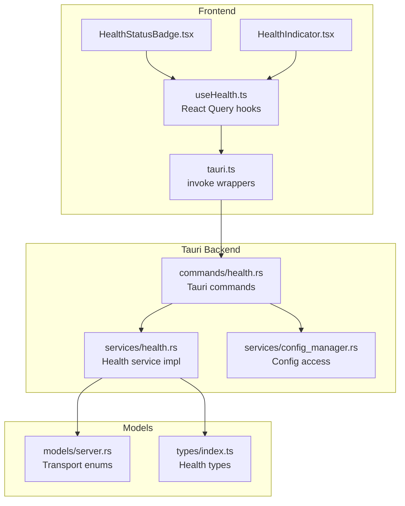
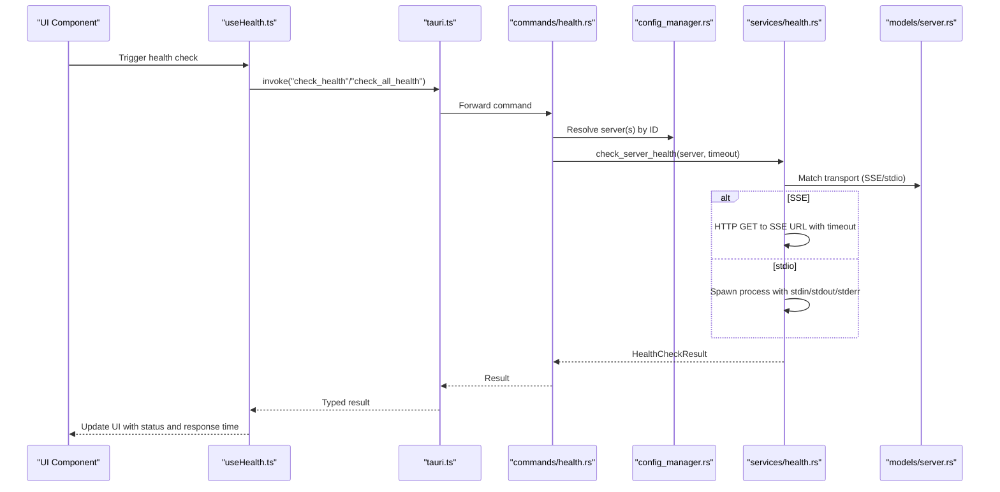
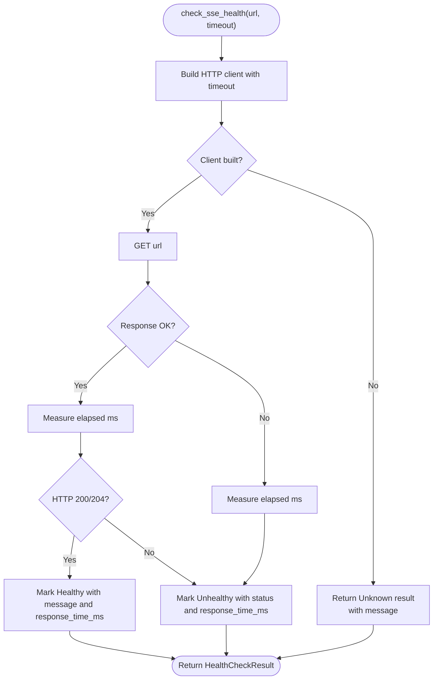
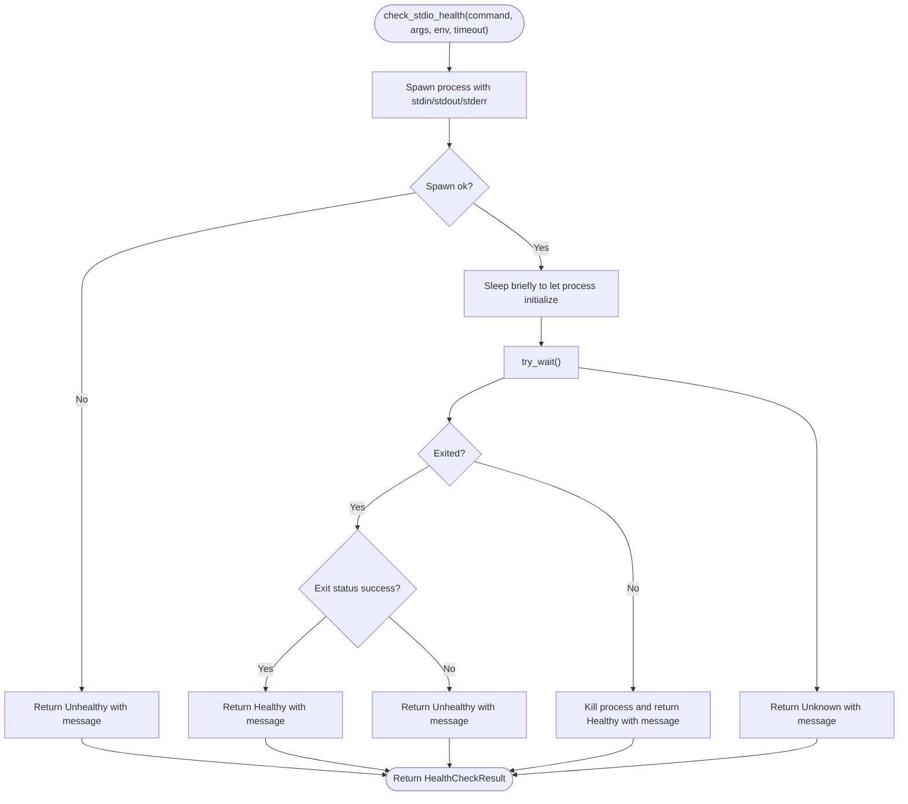
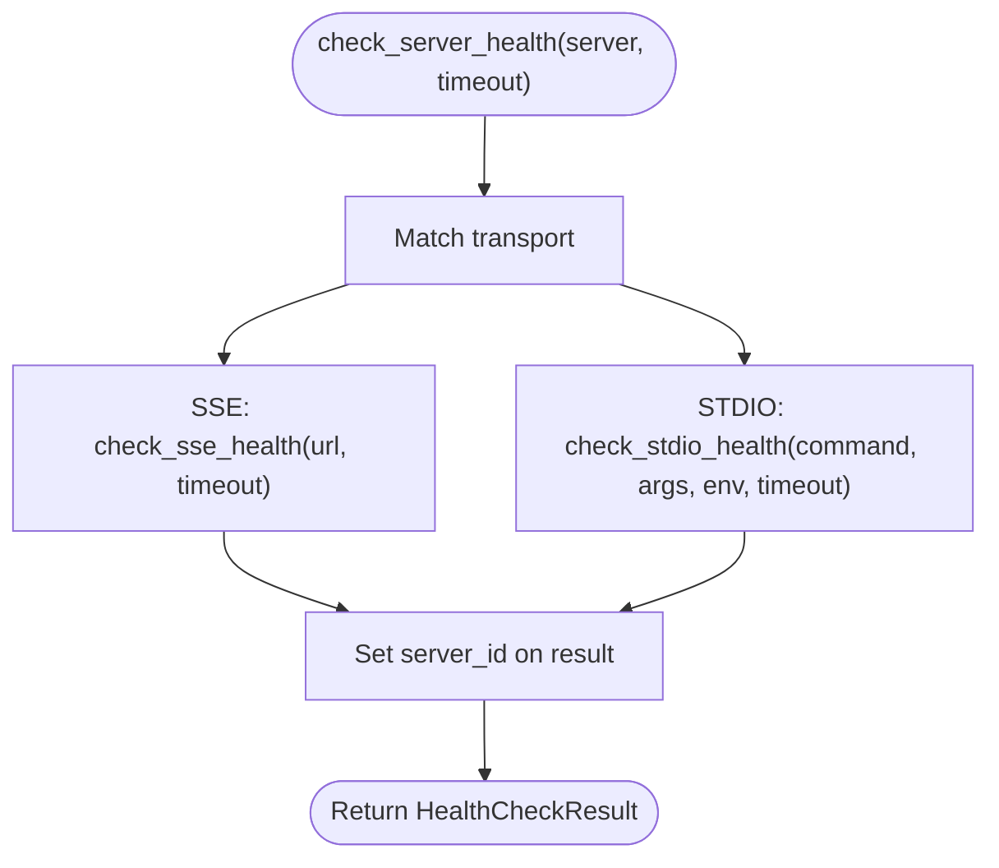
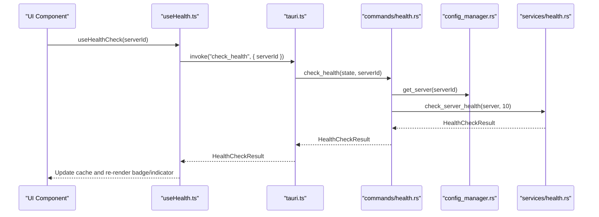
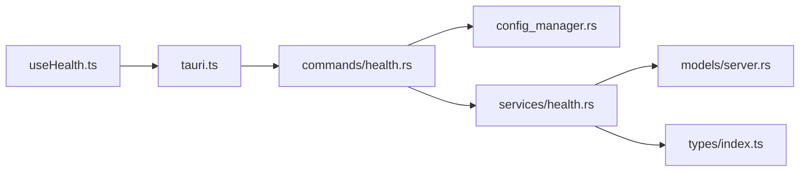

# Health Service

<cite>
**Referenced Files in This Document**
- [useHealth.ts](file://src/hooks/useHealth.ts)
- [health.rs (commands)](file://src-tauri/src/commands/health.rs)
- [health.rs (service)](file://src-tauri/src/services/health.rs)
- [tauri.ts](file://src/lib/tauri.ts)
- [HealthStatusBadge.tsx](file://src/components/servers/HealthStatusBadge.tsx)
- [HealthIndicator.tsx](file://src/components/common/HealthIndicator.tsx)
- [server.rs (models)](file://src-tauri/src/models/server.rs)
- [index.ts (types)](file://src/types/index.ts)
- [config_manager.rs](file://src-tauri/src/services/config_manager.rs)
</cite>

## Table of Contents

1. [Introduction](#introduction)
2. [Project Structure](#project-structure)
3. [Core Components](#core-components)
4. [Architecture Overview](#architecture-overview)
5. [Detailed Component Analysis](#detailed-component-analysis)
6. [Dependency Analysis](#dependency-analysis)
7. [Performance Considerations](#performance-considerations)
8. [Troubleshooting Guide](#troubleshooting-guide)
9. [Conclusion](#conclusion)

## Introduction

This document explains the Health service that monitors MCP servers configured in the application. It covers how health checks are executed for two transport types—stdio and SSE—how response time is measured, how statuses are determined, and how the frontend integrates with the backend. It also documents the service’s interface methods, their parameters and return values, and provides troubleshooting guidance for common issues such as timeouts, connection errors, false negatives, network latency, and server startup delays.

## Project Structure

The Health service spans the frontend React hooks and UI components, the Tauri command layer, and the Rust service that performs the actual checks.

**Diagram sources**

- [useHealth.ts](file://src/hooks/useHealth.ts#L1-L120)
- [health.rs (commands)](file://src-tauri/src/commands/health.rs#L1-L100)
- [health.rs (service)](file://src-tauri/src/services/health.rs#L1-L207)
- [tauri.ts](file://src/lib/tauri.ts#L336-L364)
- [server.rs (models)](file://src-tauri/src/models/server.rs#L31-L49)
- [index.ts (types)](file://src/types/index.ts#L409-L426)
- [config_manager.rs](file://src-tauri/src/services/config_manager.rs#L163-L175)

**Section sources**

- [useHealth.ts](file://src/hooks/useHealth.ts#L1-L120)
- [health.rs (commands)](file://src-tauri/src/commands/health.rs#L1-L100)
- [health.rs (service)](file://src-tauri/src/services/health.rs#L1-L207)
- [tauri.ts](file://src/lib/tauri.ts#L336-L364)
- [server.rs (models)](file://src-tauri/src/models/server.rs#L31-L49)
- [index.ts (types)](file://src/types/index.ts#L409-L426)
- [config_manager.rs](file://src-tauri/src/services/config_manager.rs#L163-L175)

## Core Components

- Frontend hooks and UI:
  - React Query hooks for single and all-server health checks, plus a quick status getter.
  - UI components that render health status and response time.
- Backend commands:
  - Tauri commands that resolve a server by ID, run health checks, and return typed results.
- Health service:
  - Implements SSE and stdio health checks, measures response time, and determines status.
- Models and types:
  - Transport variants define stdio vs SSE; HealthStatus and HealthCheckResult types unify the contract.

**Section sources**

- [useHealth.ts](file://src/hooks/useHealth.ts#L1-L120)
- [health.rs (commands)](file://src-tauri/src/commands/health.rs#L30-L100)
- [health.rs (service)](file://src-tauri/src/services/health.rs#L9-L34)
- [server.rs (models)](file://src-tauri/src/models/server.rs#L31-L49)
- [index.ts (types)](file://src/types/index.ts#L409-L426)

## Architecture Overview

The health pipeline is a layered flow from UI to backend commands to the health service implementation.

**Diagram sources**

- [useHealth.ts](file://src/hooks/useHealth.ts#L1-L67)
- [tauri.ts](file://src/lib/tauri.ts#L340-L364)
- [health.rs (commands)](file://src-tauri/src/commands/health.rs#L30-L99)
- [health.rs (service)](file://src-tauri/src/services/health.rs#L180-L191)
- [server.rs (models)](file://src-tauri/src/models/server.rs#L31-L49)
- [config_manager.rs](file://src-tauri/src/services/config_manager.rs#L163-L175)

## Detailed Component Analysis

### Health Status and Result Types

- HealthStatus enumerates possible outcomes: healthy, unhealthy, unknown, running, stopped.
- HealthCheckResult carries serverId, status, optional message, checkedAt timestamp, and optional response_time_ms.

These types are defined consistently on both the frontend and backend to ensure serialization and deserialization compatibility.

**Section sources**

- [health.rs (service)](file://src-tauri/src/services/health.rs#L9-L34)
- [index.ts (types)](file://src/types/index.ts#L409-L426)

### SSE Health Check

- Protocol: HTTP GET to the SSE endpoint URL.
- Timeout: Controlled by the provided timeout_secs parameter.
- Response time measurement: Captured from Instant at start until completion.
- Status determination:
  - Success responses (including 200 and 204) are considered healthy.
  - Other HTTP statuses are considered unhealthy.
  - Network errors or client creation failures are recorded as unknown or unhealthy with a message.

**Diagram sources**

- [health.rs (service)](file://src-tauri/src/services/health.rs#L36-L92)

**Section sources**

- [health.rs (service)](file://src-tauri/src/services/health.rs#L36-L92)

### stdio Health Check

- Protocol: Spawns the configured command with provided arguments and environment variables.
- Response time measurement: Captured from Instant at start until process state is evaluated.
- Status determination:
  - If the process exits immediately, success is healthy; non-zero exit is unhealthy.
  - If the process is still running after a short sleep, it is treated as healthy and the process is killed to avoid leaving zombies.
  - Errors spawning or checking process status are reported as unknown or unhealthy with a message.

**Diagram sources**

- [health.rs (service)](file://src-tauri/src/services/health.rs#L94-L178)

**Section sources**

- [health.rs (service)](file://src-tauri/src/services/health.rs#L94-L178)

### Server Health Orchestration

- The orchestrator selects the appropriate check based on the server’s transport variant.
- It sets the server_id on the result before returning.

**Diagram sources**

- [health.rs (service)](file://src-tauri/src/services/health.rs#L180-L191)

**Section sources**

- [health.rs (service)](file://src-tauri/src/services/health.rs#L180-L191)

### Tauri Commands and Frontend Integration

- Commands:
  - check_health(serverId): resolves server by ID, runs health check with a 10-second timeout, returns HealthCheckResult.
  - check_all_health(): retrieves all servers, runs health checks concurrently, returns a vector of results.
  - get_server_status(serverId): returns HealthStatus based on server enabled state (placeholder behavior).
- Frontend:
  - useServerHealth(serverId): React Query hook that fetches a single server’s health with caching and refresh intervals.
  - useAllServerHealth(): Fetches all servers’ health.
  - useHealthCheck()/useHealthCheckAll(): Mutations to trigger manual checks and update caches.
  - UI components render status, color-coded labels, and response times.

**Diagram sources**

- [useHealth.ts](file://src/hooks/useHealth.ts#L1-L67)
- [tauri.ts](file://src/lib/tauri.ts#L340-L364)
- [health.rs (commands)](file://src-tauri/src/commands/health.rs#L30-L67)
- [health.rs (service)](file://src-tauri/src/services/health.rs#L180-L191)
- [config_manager.rs](file://src-tauri/src/services/config_manager.rs#L163-L175)

**Section sources**

- [health.rs (commands)](file://src-tauri/src/commands/health.rs#L30-L99)
- [useHealth.ts](file://src/hooks/useHealth.ts#L1-L67)
- [tauri.ts](file://src/lib/tauri.ts#L340-L364)
- [HealthStatusBadge.tsx](file://src/components/servers/HealthStatusBadge.tsx#L1-L53)
- [HealthIndicator.tsx](file://src/components/common/HealthIndicator.tsx#L1-L83)

### Transport Variants and Data Models

- Transport enum defines stdio and sse variants with associated fields.
- These variants drive the selection of SSE or stdio health check logic.

**Section sources**

- [server.rs (models)](file://src-tauri/src/models/server.rs#L31-L49)

## Dependency Analysis

- Frontend depends on typed results from the backend via invoke wrappers.
- Backend commands depend on the configuration manager to resolve servers by ID.
- Health service depends on model enums to select the correct check path.
- Both SSE and stdio checks rely on precise timing and error handling to produce deterministic status outcomes.

**Diagram sources**

- [useHealth.ts](file://src/hooks/useHealth.ts#L1-L120)
- [tauri.ts](file://src/lib/tauri.ts#L336-L364)
- [health.rs (commands)](file://src-tauri/src/commands/health.rs#L1-L100)
- [health.rs (service)](file://src-tauri/src/services/health.rs#L1-L207)
- [server.rs (models)](file://src-tauri/src/models/server.rs#L31-L49)
- [index.ts (types)](file://src/types/index.ts#L409-L426)
- [config_manager.rs](file://src-tauri/src/services/config_manager.rs#L163-L175)

**Section sources**

- [health.rs (commands)](file://src-tauri/src/commands/health.rs#L1-L100)
- [health.rs (service)](file://src-tauri/src/services/health.rs#L1-L207)
- [server.rs (models)](file://src-tauri/src/models/server.rs#L31-L49)
- [index.ts (types)](file://src/types/index.ts#L409-L426)
- [config_manager.rs](file://src-tauri/src/services/config_manager.rs#L163-L175)

## Performance Considerations

- Concurrency:
  - The all-servers health check runs checks sequentially in the current implementation. For large server lists, consider parallelizing with bounded concurrency to reduce total runtime while avoiding resource saturation.
- Caching and polling:
  - Frontend uses short staleTime and refetch intervals to keep UI responsive. Tune these values based on server startup times and acceptable staleness.
- Response time measurement:
  - Response time is captured per check and surfaced in the UI for healthy states. This helps identify slow endpoints or heavy server loads.
- Resource impact:
  - stdio checks spawn processes; ensure cleanup and avoid long-lived processes. SSE checks use HTTP requests with timeouts to prevent hanging connections.

[No sources needed since this section provides general guidance]

## Troubleshooting Guide

Common issues and resolutions:

- Timeouts:
  - SSE checks enforce a timeout via the HTTP client builder. If a server is slow to respond, the result will reflect unhealthy with a connection failure message. Increase timeout in the command layer if needed, or adjust network conditions.
  - stdio checks measure elapsed time and surface it in the result. Very long durations may indicate slow startup or heavy workload.

- Connection errors:
  - SSE checks return unhealthy when the HTTP request fails. Verify the SSE URL, network connectivity, and any required headers. Check for DNS resolution or TLS issues.
  - stdio checks return unhealthy when spawning or waiting on the process fails. Confirm the command path, arguments, and environment variables are correct.

- Malformed responses:
  - SSE checks treat non-success HTTP responses as unhealthy. Inspect the HTTP status and canonical reason included in the result message.
  - stdio checks treat non-zero exit codes as unhealthy. Review server logs or stdout/stderr capture to diagnose startup failures.

- False negatives:
  - SSE endpoints may return 200/204 for healthy states; ensure your endpoint semantics align with these expectations.
  - stdio processes may appear healthy even if they fail shortly after startup. Consider adding a readiness probe or longer initialization delay in the server itself.

- Network latency:
  - Response time is measured and shown for healthy states. Use this metric to identify latency hotspots and adjust polling intervals accordingly.

- Server startup delays:
  - stdio checks briefly wait before evaluating process status. If servers take longer to become ready, consider adding a separate readiness check or adjusting the initial delay.

**Section sources**

- [health.rs (service)](file://src-tauri/src/services/health.rs#L36-L92)
- [health.rs (service)](file://src-tauri/src/services/health.rs#L94-L178)
- [health.rs (commands)](file://src-tauri/src/commands/health.rs#L30-L67)
- [HealthIndicator.tsx](file://src/components/common/HealthIndicator.tsx#L66-L82)

## Conclusion

The Health service provides a robust, transport-aware mechanism to monitor MCP servers. SSE checks use HTTP with timeouts and explicit success criteria, while stdio checks validate process lifecycle and resource cleanup. The frontend integrates seamlessly with React Query to present timely, color-coded status indicators and response times. By tuning concurrency, caching, and timeouts—and by addressing common issues like network latency and startup delays—the system delivers reliable health insights with minimal system impact.
