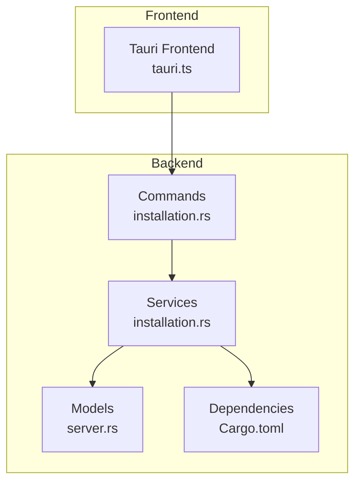
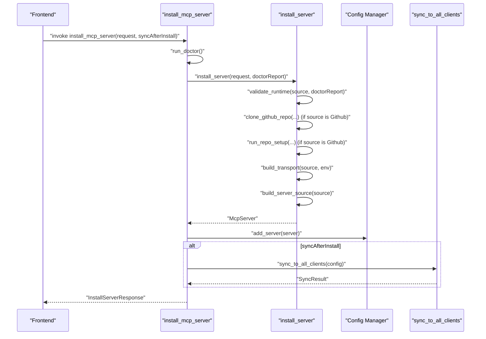
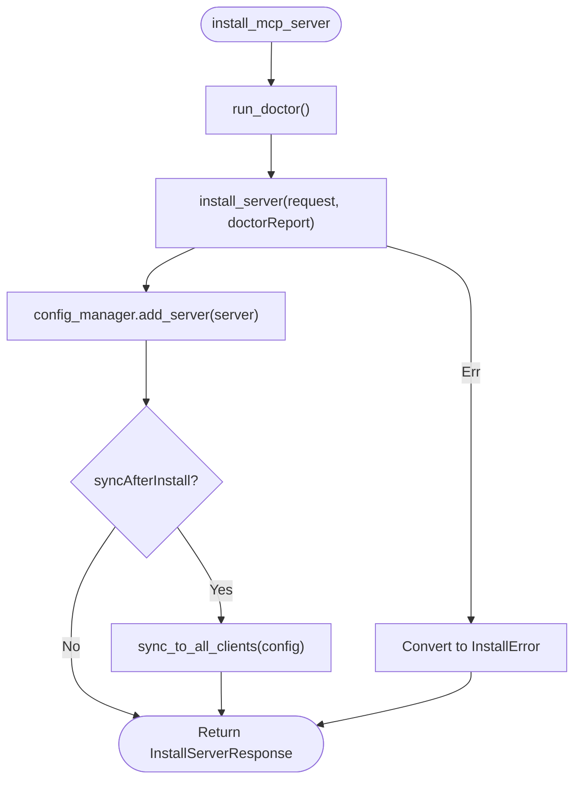
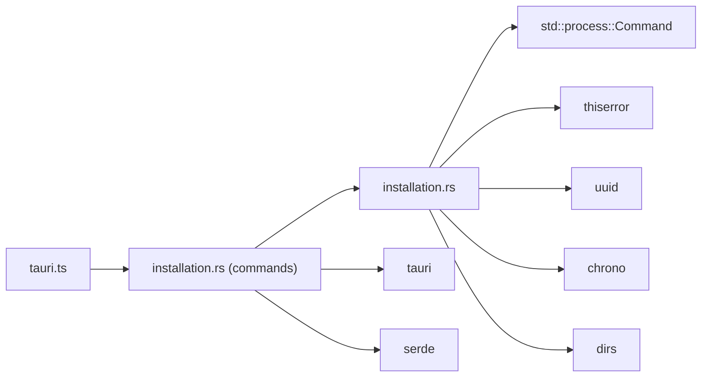

# Installation Service

<cite>
**Referenced Files in This Document**
- [installation.rs](file://src-tauri/src/services/installation.rs)
- [installation_commands.rs](file://src-tauri/src/commands/installation.rs)
- [server_models.rs](file://src-tauri/src/models/server.rs)
- [services_mod.rs](file://src-tauri/src/services/mod.rs)
- [Cargo.toml](file://src-tauri/Cargo.toml)
- [tauri_frontend.ts](file://src/lib/tauri.ts)
- [mvp_gap_analysis.md](file://docs/mvp-gap-analysis.md)
- [CODEBASE_EVALUATION.md](file://CODEBASE_EVALUATION.md)
</cite>

## Table of Contents

1. [Introduction](#introduction)
2. [Project Structure](#project-structure)
3. [Core Components](#core-components)
4. [Architecture Overview](#architecture-overview)
5. [Detailed Component Analysis](#detailed-component-analysis)
6. [Dependency Analysis](#dependency-analysis)
7. [Performance Considerations](#performance-considerations)
8. [Troubleshooting Guide](#troubleshooting-guide)
9. [Conclusion](#conclusion)
10. [Appendices](#appendices)

## Introduction

This document describes the Installation service responsible for adding MCP servers to the system via multiple installation sources. It covers supported sources (npm, uvx, local, github, docker, remote), runtime validation, transport configuration, filesystem interactions, and error handling. It also explains how the service integrates with the frontend via Tauri commands, how asynchronous execution is structured, and provides troubleshooting guidance for common issues.

## Project Structure

The Installation service is implemented in Rust within the Tauri backend and exposed to the frontend through Tauri commands. The key files are:

- Services: installation logic and models
- Commands: Tauri command handlers that orchestrate installation and expose typed responses
- Models: server and transport definitions
- Frontend bindings: TypeScript wrappers around Tauri commands

**Diagram sources**

- [tauri_frontend.ts](file://src/lib/tauri.ts#L224-L272)
- [installation_commands.rs](file://src-tauri/src/commands/installation.rs#L90-L135)
- [installation.rs](file://src-tauri/src/services/installation.rs#L1-L122)
- [server_models.rs](file://src-tauri/src/models/server.rs#L1-L50)
- [Cargo.toml](file://src-tauri/Cargo.toml#L20-L33)

**Section sources**

- [tauri_frontend.ts](file://src/lib/tauri.ts#L224-L272)
- [installation_commands.rs](file://src-tauri/src/commands/installation.rs#L90-L135)
- [installation.rs](file://src-tauri/src/services/installation.rs#L1-L122)
- [server_models.rs](file://src-tauri/src/models/server.rs#L1-L50)
- [Cargo.toml](file://src-tauri/Cargo.toml#L20-L33)

## Core Components

- InstallServerRequest: Describes the installation request with name, description, source, enabled clients, optional source URL, and environment variables.
- InstallSource: Enumerates supported installation sources with variant-specific fields:
  - Npm: package, optional version, additional args
  - Uvx: package, additional args
  - Local: path, optional command, args
  - Github: repo, optional branch, optional run_command
  - Docker: image, additional docker_args
  - Remote: url, headers
- Transport: Defines how to communicate with the server:
  - Stdio: command, args, env
  - Sse: url, headers
- ServerSource: Mirrors InstallSource for persisted configuration.
- InstallationError: Custom error type covering runtime requirements, IO, invalid URLs, and setup failures.
- InstallResult: Encapsulates installation outcome, optional server, error message, and warnings.

These types define the contract for installation workflows and ensure consistent serialization/deserialization across the frontend and backend.

**Section sources**

- [installation.rs](file://src-tauri/src/services/installation.rs#L36-L122)
- [server_models.rs](file://src-tauri/src/models/server.rs#L1-L50)

## Architecture Overview

The installation flow is orchestrated by Tauri commands that call into the Installation service. The service validates runtime requirements, performs source-specific setup (e.g., cloning GitHub repos), builds transport configuration, and constructs a server definition. Finally, the server is persisted and optionally synced to clients.

**Diagram sources**

- [installation_commands.rs](file://src-tauri/src/commands/installation.rs#L90-L135)
- [installation.rs](file://src-tauri/src/services/installation.rs#L479-L520)
- [server_models.rs](file://src-tauri/src/models/server.rs#L51-L131)

## Detailed Component Analysis

### Supported Installation Sources

- NPM (npx): Installs via npx with optional version pinning and additional args. Transport uses Stdio with npx command and arguments.
- uvx (Python): Executes Python packages via uvx. Transport uses Stdio with uvx command and arguments.
- Local: Runs a local executable or script. Command is inferred from file extension (.py -> python3, .js/.mjs -> node) or explicitly provided. Transport uses Stdio with command and args.
- GitHub: Clones a repository (shallow clone) into ~/.mcp-nexus/repos, updates existing clones, and runs setup (package manager detection and install). Transport uses Stdio with configured run command or defaults to node index.js.
- Docker: Spawns containers via docker run with provided args and image. Transport uses Stdio with docker command and arguments.
- Remote: Uses Server-Sent Events (SSE) to connect to a remote URL with optional headers. Transport uses SSE.

Validation ensures required runtimes are present before attempting installation, except for Remote which validates URL format.

**Section sources**

- [installation.rs](file://src-tauri/src/services/installation.rs#L124-L183)
- [installation.rs](file://src-tauri/src/services/installation.rs#L334-L453)
- [installation.rs](file://src-tauri/src/services/installation.rs#L455-L477)

### Runtime Validation and Environment Checks

- NPM requires Node.js availability.
- Uvx requires either uv or Python availability.
- Local requires the path to exist.
- GitHub requires git availability.
- Docker requires Docker availability.
- Remote requires a URL starting with http:// or https://.

Validation errors are surfaced as InstallationError variants with suggestions for resolving missing runtimes.

**Section sources**

- [installation.rs](file://src-tauri/src/services/installation.rs#L124-L183)

### Transport and Server Source Construction

- Transport is built based on the InstallSource:
  - NPM: npx with package and args
  - Uvx: uvx with package and args
  - Local: detected or provided command with path and args
  - Github: run command or default node index.js with MCP_SERVER_DIR injected
  - Docker: docker run with provided args and image
  - Remote: SSE transport with url and headers
- ServerSource mirrors InstallSource for persistence.

**Section sources**

- [installation.rs](file://src-tauri/src/services/installation.rs#L334-L453)
- [installation.rs](file://src-tauri/src/services/installation.rs#L455-L477)
- [server_models.rs](file://src-tauri/src/models/server.rs#L1-L50)

### File System Interactions

- Repositories for GitHub sources are stored under ~/.mcp-nexus/repos with shallow clones and updates via git pull when the directory already exists.
- Local path validation ensures the path exists before proceeding.
- Docker images are not automatically removed on cleanup; users can prune images separately.

**Section sources**

- [installation.rs](file://src-tauri/src/services/installation.rs#L185-L252)
- [installation.rs](file://src-tauri/src/services/installation.rs#L531-L555)

### Asynchronous Execution and Error Handling

- Tauri commands are declared async and wrap service operations. They convert service errors into InstallError with typed error_type for frontend handling.
- The service itself executes external commands synchronously via std::process::Command. While the service functions are synchronous, the Tauri commands are async, enabling non-blocking UI behavior.
- Custom Result types unify error handling across the service and commands.

**Diagram sources**

- [installation_commands.rs](file://src-tauri/src/commands/installation.rs#L90-L135)
- [installation.rs](file://src-tauri/src/services/installation.rs#L479-L520)

**Section sources**

- [installation_commands.rs](file://src-tauri/src/commands/installation.rs#L1-L71)
- [installation_commands.rs](file://src-tauri/src/commands/installation.rs#L90-L135)
- [installation.rs](file://src-tauri/src/services/installation.rs#L479-L520)

### Frontend Integration

- Frontend exposes typed wrappers for Tauri commands:
  - installMcpServer(request, syncAfterInstall)
  - uninstallMcpServer(serverId, cleanupResources, syncAfterUninstall)
  - validateInstall(source)
  - checkRuntimeForRegistry(registry)
- These wrappers invoke Tauri commands and return typed responses.

**Section sources**

- [tauri_frontend.ts](file://src/lib/tauri.ts#L224-L272)

### Example Workflows

- Installing an NPM server:
  - Source: Npm with package and optional version
  - Transport: Stdio with npx and package args
  - Outcome: McpServer persisted and optionally synced
- Installing a GitHub server:
  - Source: Github with repo and optional branch
  - Action: Clone/update repo, run setup, then configure transport
  - Outcome: McpServer persisted and optionally synced
- Installing a Docker server:
  - Source: Docker with image and docker_args
  - Transport: Stdio with docker run and provided args
  - Outcome: McpServer persisted and optionally synced

**Section sources**

- [installation.rs](file://src-tauri/src/services/installation.rs#L334-L453)
- [installation_commands.rs](file://src-tauri/src/commands/installation.rs#L90-L135)

## Dependency Analysis

- Dependencies include Tauri, serde, uuid, chrono, thiserror, dirs, tokio, reqwest, and keyring.
- The installation service uses std::process::Command for external commands and thiserror for unified error handling.
- Frontend depends on Tauri core for invoking commands.

**Diagram sources**

- [installation.rs](file://src-tauri/src/services/installation.rs#L1-L12)
- [installation_commands.rs](file://src-tauri/src/commands/installation.rs#L1-L10)
- [Cargo.toml](file://src-tauri/Cargo.toml#L20-L33)
- [tauri_frontend.ts](file://src/lib/tauri.ts#L224-L272)

**Section sources**

- [Cargo.toml](file://src-tauri/Cargo.toml#L20-L33)
- [installation.rs](file://src-tauri/src/services/installation.rs#L1-L12)
- [installation_commands.rs](file://src-tauri/src/commands/installation.rs#L1-L10)
- [tauri_frontend.ts](file://src/lib/tauri.ts#L224-L272)

## Performance Considerations

- External command execution is synchronous and blocking. While Tauri commands are async, the underlying installation steps (e.g., git clone, package installs) can be long-running. Consider batching or limiting concurrent external operations to avoid UI stalls.
- Parallel installations: The current implementation does not explicitly parallelize multiple installations. If you need parallelism, coordinate via a shared queue or semaphore to avoid resource contention (e.g., multiple git operations or package manager installs).
- Caching and reuse: For GitHub sources, shallow clones and existing directories reduce overhead. For Docker, reusing images avoids repeated pulls.
- Network timeouts: External operations (git, package managers) should handle timeouts gracefully. The codebase includes robust error handling for IO and process failures.

[No sources needed since this section provides general guidance]

## Troubleshooting Guide

Common issues and resolutions:

- Missing runtime:
  - Symptoms: Installation fails with a runtime requirement error.
  - Resolution: Install the required tool (Node.js for NPM, Python/uv for uvx, git for GitHub, Docker for Docker).
- Invalid local path:
  - Symptoms: Installation fails indicating the path does not exist.
  - Resolution: Verify the path exists and is accessible.
- Invalid URL for Remote:
  - Symptoms: Installation fails due to URL format.
  - Resolution: Ensure the URL starts with http:// or https://.
- Git clone/update failure:
  - Symptoms: Failure during repository clone or pull.
  - Resolution: Check network connectivity, repository URL, and git credentials.
- Setup command failure:
  - Symptoms: Package manager install fails in a cloned repository.
  - Resolution: Inspect stderr output, verify environment, and retry with verbose logs.
- Permission errors:
  - Symptoms: Failures when writing to config or cloning repositories.
  - Resolution: Ensure the user has write permissions to the target directories and that the shell environment has necessary PATH entries.
- Network failures:
  - Symptoms: Timeout or connection errors during external operations.
  - Resolution: Retry later, check proxy/firewall settings, and verify DNS resolution.
- Incompatible runtimes:
  - Symptoms: Errors when running scripts or binaries.
  - Resolution: Match the runtime to the project’s requirements (e.g., Node.js version, Python interpreter).

**Section sources**

- [installation.rs](file://src-tauri/src/services/installation.rs#L124-L183)
- [installation.rs](file://src-tauri/src/services/installation.rs#L191-L252)
- [installation.rs](file://src-tauri/src/services/installation.rs#L254-L332)
- [CODEBASE_EVALUATION.md](file://CODEBASE_EVALUATION.md#L272-L310)

## Security Practices

- Command injection risks: When constructing command lines, avoid concatenating untrusted input directly. The service builds arguments from known fields and validated inputs; ensure future extensions follow strict argument separation and sanitization.
- Environment variables: Respect env propagation carefully. Avoid leaking sensitive data and validate header values for remote sources.
- File permissions: The codebase enforces secure permissions for config files and directories. Ensure any new filesystem operations mirror these practices.
- Docker usage: Validate docker_args to prevent unintended host access or privilege escalation.

[No sources needed since this section provides general guidance]

## Conclusion

The Installation service provides a robust, extensible framework for adding MCP servers from diverse sources. It validates environments, manages filesystem resources, constructs appropriate transports, and integrates cleanly with the frontend via Tauri commands. By following the troubleshooting and security guidance, you can reliably deploy and operate servers across platforms and environments.

[No sources needed since this section summarizes without analyzing specific files]

## Appendices

### API Surface and Method Signatures

- install_mcp_server(request, syncAfterInstall)
  - Parameters: InstallServerRequest, optional boolean to trigger sync
  - Returns: InstallServerResponse with install_result and optional sync_result
- uninstall_mcp_server(serverId, cleanupResources, syncAfterUninstall)
  - Parameters: serverId string, optional cleanup flag, optional sync flag
  - Returns: UninstallServerResponse with success, server_name, optional sync_result, and optional error
- validate_install(source)
  - Parameters: InstallSource
  - Returns: ValidateInstallResponse with valid, optional error, missing_runtime, and suggestion
- check_runtime_for_registry(registry)
  - Parameters: registry string (npm, pypi, docker, github)
  - Returns: ValidateInstallResponse with valid, optional error, missing_runtime, and suggestion

**Section sources**

- [installation_commands.rs](file://src-tauri/src/commands/installation.rs#L90-L135)
- [installation_commands.rs](file://src-tauri/src/commands/installation.rs#L137-L192)
- [installation_commands.rs](file://src-tauri/src/commands/installation.rs#L194-L287)
- [tauri_frontend.ts](file://src/lib/tauri.ts#L224-L272)

### Installation Workflow References

- Frontend invocation examples:
  - [installMcpServer](file://src/lib/tauri.ts#L236-L241)
  - [uninstallMcpServer](file://src/lib/tauri.ts#L251-L261)
  - [validateInstall](file://src/lib/tauri.ts#L268-L271)
  - [checkRuntimeForRegistry](file://src/lib/tauri.ts#L279-L283)

**Section sources**

- [tauri_frontend.ts](file://src/lib/tauri.ts#L224-L283)
