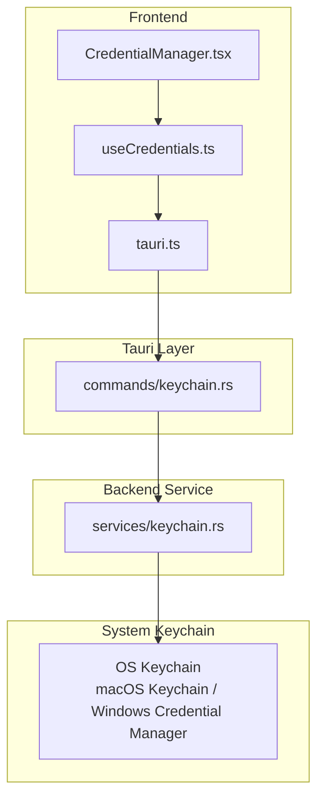
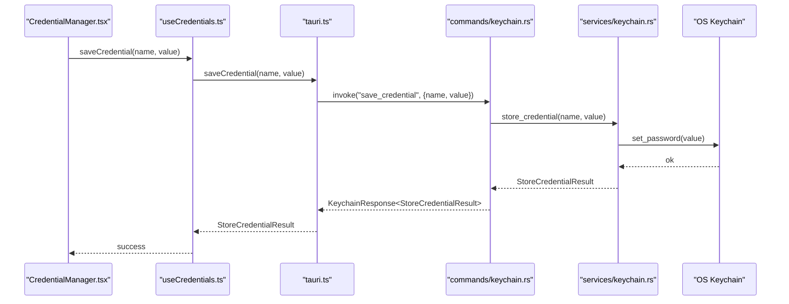
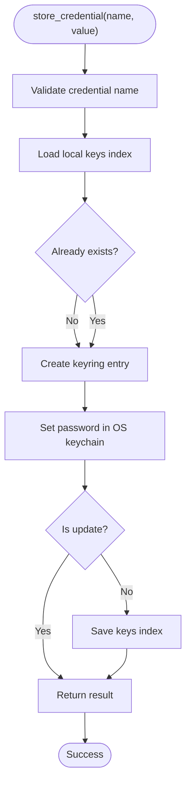
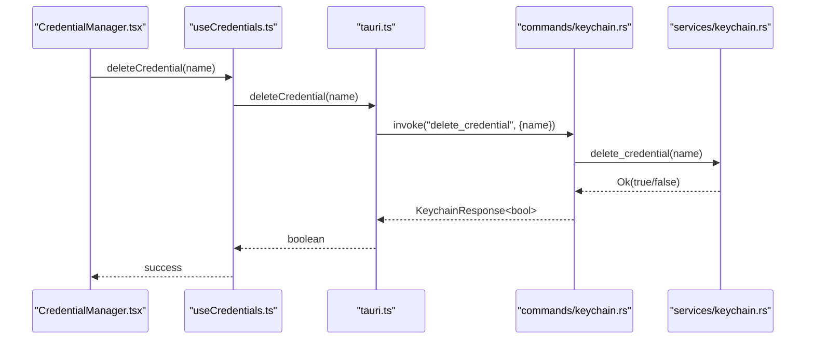
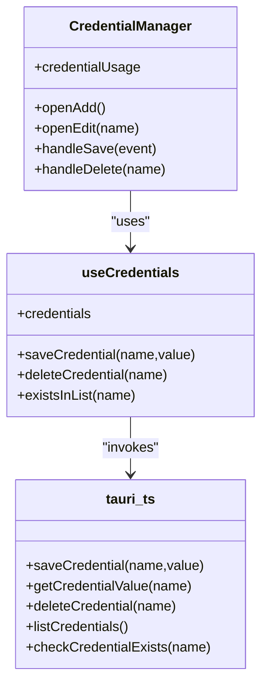
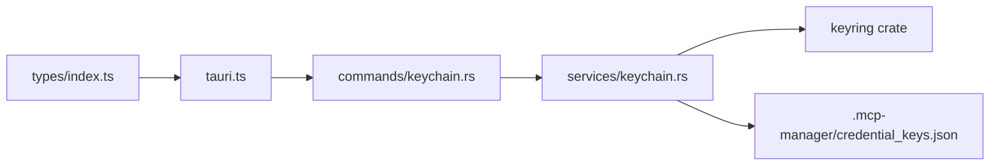

# Keychain Service

<cite>
**Referenced Files in This Document**
- [keychain.rs](file://src-tauri/src/services/keychain.rs)
- [keychain.rs](file://src-tauri/src/commands/keychain.rs)
- [tauri.ts](file://src/lib/tauri.ts)
- [useCredentials.ts](file://src/hooks/useCredentials.ts)
- [CredentialManager.tsx](file://src/components/settings/CredentialManager.tsx)
- [index.ts](file://src/types/index.ts)
- [Cargo.toml](file://src-tauri/Cargo.toml)
</cite>

## Table of Contents

1. [Introduction](#introduction)
2. [Project Structure](#project-structure)
3. [Core Components](#core-components)
4. [Architecture Overview](#architecture-overview)
5. [Detailed Component Analysis](#detailed-component-analysis)
6. [Dependency Analysis](#dependency-analysis)
7. [Performance Considerations](#performance-considerations)
8. [Troubleshooting Guide](#troubleshooting-guide)
9. [Security Best Practices](#security-best-practices)
10. [Conclusion](#conclusion)

## Introduction

This document explains the Keychain service that securely stores and retrieves secrets using the operating system’s native keychain (macOS Keychain, Windows Credential Manager, etc.). It covers the service’s interface methods, error handling, integration with the credential management UI, and operational workflows such as permission prompts, encryption guarantees, and credential lifecycle management. It also provides troubleshooting guidance for common issues like access denied errors, keychain corruption, and migration scenarios.

## Project Structure

The Keychain service spans backend Rust code, Tauri command bindings, frontend helpers, and UI components:

- Backend service: secure storage, retrieval, deletion, listing, and reference resolution
- Tauri commands: typed wrappers around service functions
- Frontend helpers: typed invocations and response unwrapping
- Hooks and UI: credential listing, adding/updating, and deletion
- Types: shared response and result types

**Diagram sources**

- [CredentialManager.tsx](file://src/components/settings/CredentialManager.tsx#L1-L347)
- [useCredentials.ts](file://src/hooks/useCredentials.ts#L1-L63)
- [tauri.ts](file://src/lib/tauri.ts#L145-L195)
- [keychain.rs](file://src-tauri/src/commands/keychain.rs#L47-L122)
- [keychain.rs](file://src-tauri/src/services/keychain.rs#L162-L206)

**Section sources**

- [keychain.rs](file://src-tauri/src/services/keychain.rs#L1-L60)
- [keychain.rs](file://src-tauri/src/commands/keychain.rs#L1-L46)
- [tauri.ts](file://src/lib/tauri.ts#L145-L195)
- [useCredentials.ts](file://src/hooks/useCredentials.ts#L1-L63)
- [CredentialManager.tsx](file://src/components/settings/CredentialManager.tsx#L1-L120)

## Core Components

- Keychain service (Rust): provides secure storage, retrieval, deletion, listing, existence checks, and reference resolution
- Tauri commands: typed wrappers that forward to service functions and return standardized responses
- Frontend helpers: typed invocations that unwrap KeychainResponse and surface errors
- Hooks and UI: credential listing, add/update, and delete flows
- Types: shared KeychainResponse and StoreCredentialResult

Key responsibilities:

- Secure storage: uses OS keychain via the keyring crate
- Reference resolution: resolves keychain:NAME and ${keychain:NAME} placeholders in environment values
- Lifecycle: create/update/delete/list/exists
- Safety: validates credential names, avoids exposing secret values unnecessarily, and persists a local index of stored keys

**Section sources**

- [keychain.rs](file://src-tauri/src/services/keychain.rs#L162-L206)
- [keychain.rs](file://src-tauri/src/services/keychain.rs#L208-L261)
- [keychain.rs](file://src-tauri/src/services/keychain.rs#L262-L304)
- [keychain.rs](file://src-tauri/src/commands/keychain.rs#L47-L122)
- [tauri.ts](file://src/lib/tauri.ts#L145-L195)
- [index.ts](file://src/types/index.ts#L388-L407)

## Architecture Overview

The Keychain service follows a layered architecture:

- UI triggers actions (add/update/delete/list)
- Hooks call frontend helpers
- Helpers invoke Tauri commands
- Commands call service functions
- Service interacts with OS keychain and maintains a local keys index

**Diagram sources**

- [CredentialManager.tsx](file://src/components/settings/CredentialManager.tsx#L99-L121)
- [useCredentials.ts](file://src/hooks/useCredentials.ts#L22-L35)
- [tauri.ts](file://src/lib/tauri.ts#L161-L168)
- [keychain.rs](file://src-tauri/src/commands/keychain.rs#L47-L57)
- [keychain.rs](file://src-tauri/src/services/keychain.rs#L162-L192)

## Detailed Component Analysis

### Service Functions and Responsibilities

- store_credential(name, value): validates name, checks existence, writes to OS keychain, updates local keys index
- get_credential(name): validates name, reads from OS keychain
- delete_credential(name): deletes from OS keychain, removes from local keys index
- list_credentials(): returns sorted list of stored credential names
- credential_exists(name): checks presence in local keys index
- resolve_keychain_reference(value): resolves keychain:NAME or ${keychain:NAME} placeholders
- is_keychain_reference(value): detects reference syntax
- extract_credential_name(value): extracts NAME from reference syntax

**Diagram sources**

- [keychain.rs](file://src-tauri/src/services/keychain.rs#L162-L192)
- [keychain.rs](file://src-tauri/src/services/keychain.rs#L65-L127)

**Section sources**

- [keychain.rs](file://src-tauri/src/services/keychain.rs#L162-L206)
- [keychain.rs](file://src-tauri/src/services/keychain.rs#L208-L261)
- [keychain.rs](file://src-tauri/src/services/keychain.rs#L262-L304)

### Tauri Commands and Typed Responses

- save_credential(name, value): returns KeychainResponse<StoreCredentialResult>
- get_credential_value(name): returns KeychainResponse<string>
- delete_credential(name): returns KeychainResponse<bool>
- list_credentials(): returns KeychainResponse<Vec<string>>
- check_credential_exists(name): returns KeychainResponse<bool>
- validate_credential_references(envVars): returns KeychainResponse<Vec<string>>

**Diagram sources**

- [CredentialManager.tsx](file://src/components/settings/CredentialManager.tsx#L123-L133)
- [useCredentials.ts](file://src/hooks/useCredentials.ts#L30-L35)
- [tauri.ts](file://src/lib/tauri.ts#L174-L178)
- [keychain.rs](file://src-tauri/src/commands/keychain.rs#L71-L78)
- [keychain.rs](file://src-tauri/src/services/keychain.rs#L208-L235)

**Section sources**

- [keychain.rs](file://src-tauri/src/commands/keychain.rs#L47-L122)
- [index.ts](file://src/types/index.ts#L388-L407)

### Frontend Integration and UI

- useCredentials hook: lists credentials, saves/deletes via mutations, invalidates queries on success
- CredentialManager UI: adds/edit updates credentials, shows usage by servers, prevents displaying existing secret values
- Frontend helpers unwrap KeychainResponse and throw on error

**Diagram sources**

- [CredentialManager.tsx](file://src/components/settings/CredentialManager.tsx#L41-L121)
- [useCredentials.ts](file://src/hooks/useCredentials.ts#L1-L63)
- [tauri.ts](file://src/lib/tauri.ts#L161-L195)

**Section sources**

- [CredentialManager.tsx](file://src/components/settings/CredentialManager.tsx#L1-L120)
- [useCredentials.ts](file://src/hooks/useCredentials.ts#L1-L63)
- [tauri.ts](file://src/lib/tauri.ts#L145-L195)

## Dependency Analysis

- External dependency: keyring crate provides cross-platform secure storage
- Local keys index: stored under ~/.mcp-manager/credential_keys.json with strict permissions
- Frontend types: KeychainResponse<T> and StoreCredentialResult define the contract

**Diagram sources**

- [keychain.rs](file://src-tauri/src/services/keychain.rs#L1-L39)
- [Cargo.toml](file://src-tauri/Cargo.toml#L31-L33)
- [keychain.rs](file://src-tauri/src/commands/keychain.rs#L1-L20)
- [tauri.ts](file://src/lib/tauri.ts#L1-L40)
- [index.ts](file://src/types/index.ts#L388-L407)

**Section sources**

- [Cargo.toml](file://src-tauri/Cargo.toml#L31-L33)
- [keychain.rs](file://src-tauri/src/services/keychain.rs#L1-L39)
- [index.ts](file://src/types/index.ts#L388-L407)

## Performance Considerations

- Keychain operations are I/O bound and generally fast; avoid frequent polling
- Reference resolution is O(n) over environment variables; keep environment maps small
- Local keys index is a small JSON file; atomic writes ensure durability
- Cache policy for secrets: frontend caches values only briefly to minimize exposure

[No sources needed since this section provides general guidance]

## Troubleshooting Guide

Common issues and resolutions:

- Access denied or keychain access errors
  - Cause: OS keychain prompt declined or insufficient permissions
  - Resolution: Re-run the operation and approve the prompt; ensure the app has access to the keychain
  - Detection: Errors mapped to KeychainError::KeyringError and surfaced via KeychainResponse::error
  - Section sources
    - [keychain.rs](file://src-tauri/src/services/keychain.rs#L20-L48)
    - [keychain.rs](file://src-tauri/src/commands/keychain.rs#L52-L57)

- Credential not found
  - Cause: Name mismatch or credential deleted
  - Resolution: Verify the credential name; re-add if missing
  - Section sources
    - [keychain.rs](file://src-tauri/src/services/keychain.rs#L20-L48)

- Invalid credential name
  - Cause: Name contains unsupported characters or length exceeded
  - Resolution: Use alphanumeric, hyphens, underscores, and periods; limit length to 256
  - Section sources
    - [keychain.rs](file://src-tauri/src/services/keychain.rs#L129-L154)

- Keychain corruption or unreadable keys file
  - Symptom: Errors reading/writing ~/.mcp-manager/credential_keys.json
  - Resolution: Back up and delete the file; re-add credentials; ensure filesystem permissions are correct
  - Section sources
    - [keychain.rs](file://src-tauri/src/services/keychain.rs#L65-L83)
    - [keychain.rs](file://src-tauri/src/services/keychain.rs#L84-L127)

- Migration scenario: moving from another keychain or manual backup
  - Steps: export/import credentials via UI; verify references in server environments; validate references
  - Section sources
    - [keychain.rs](file://src-tauri/src/commands/keychain.rs#L100-L122)
    - [CredentialManager.tsx](file://src/components/settings/CredentialManager.tsx#L1-L120)

- Permission requests and prompts
  - Behavior: OS may prompt for access; approve to allow read/write operations
  - Section sources
    - [keychain.rs](file://src-tauri/src/services/keychain.rs#L156-L161)

## Security Best Practices

- Never log or display secret values; the UI intentionally hides existing values
- Use minimal privilege: grant access only when prompted
- Validate references before runtime: use validate_credential_references to detect missing credentials
- Keep credential names restricted to safe characters and lengths
- Limit cache lifetime for secrets in the frontend
- Ensure local keys index file permissions are restrictive (0600 on Unix)

**Section sources**

- [CredentialManager.tsx](file://src/components/settings/CredentialManager.tsx#L84-L121)
- [tauri.ts](file://src/lib/tauri.ts#L150-L195)
- [keychain.rs](file://src-tauri/src/services/keychain.rs#L129-L154)
- [keychain.rs](file://src-tauri/src/services/keychain.rs#L84-L127)

## Conclusion

The Keychain service provides a robust, cross-platform mechanism for secure credential storage and retrieval. It integrates tightly with the UI and Tauri command layer, enforces strong validation, and offers practical workflows for managing credentials and resolving references in server environments. By following the troubleshooting steps and security best practices outlined here, you can reliably operate the service across platforms while maintaining strong security posture.
