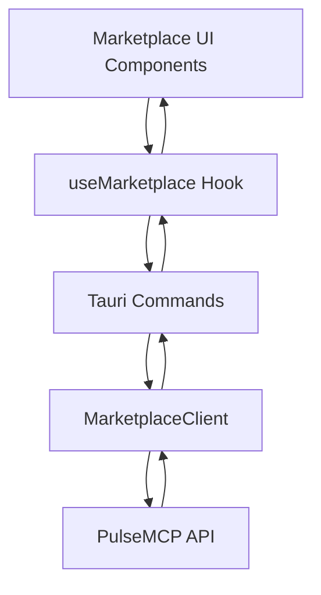
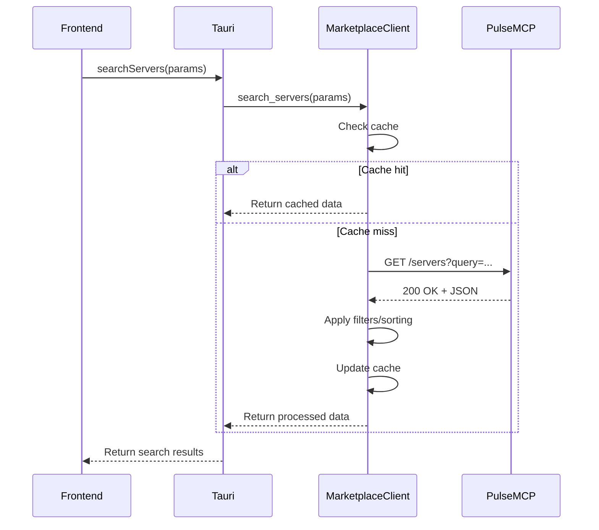
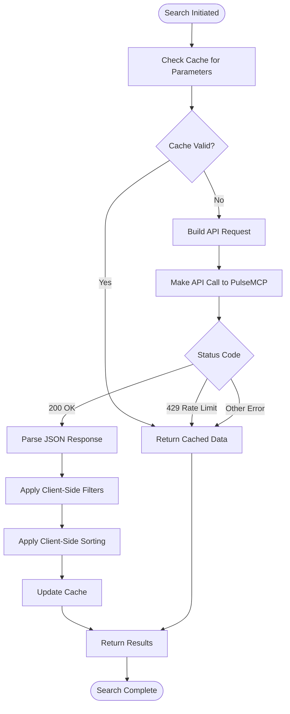
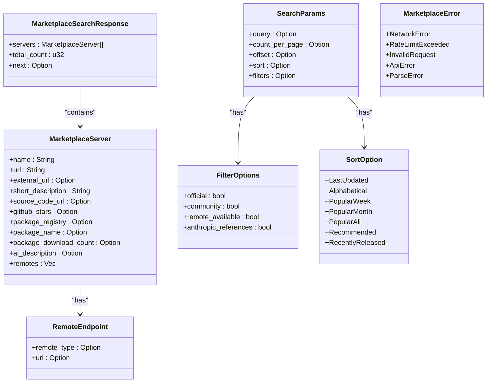
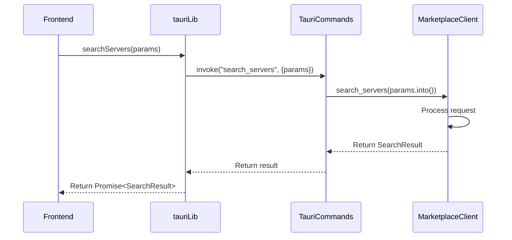
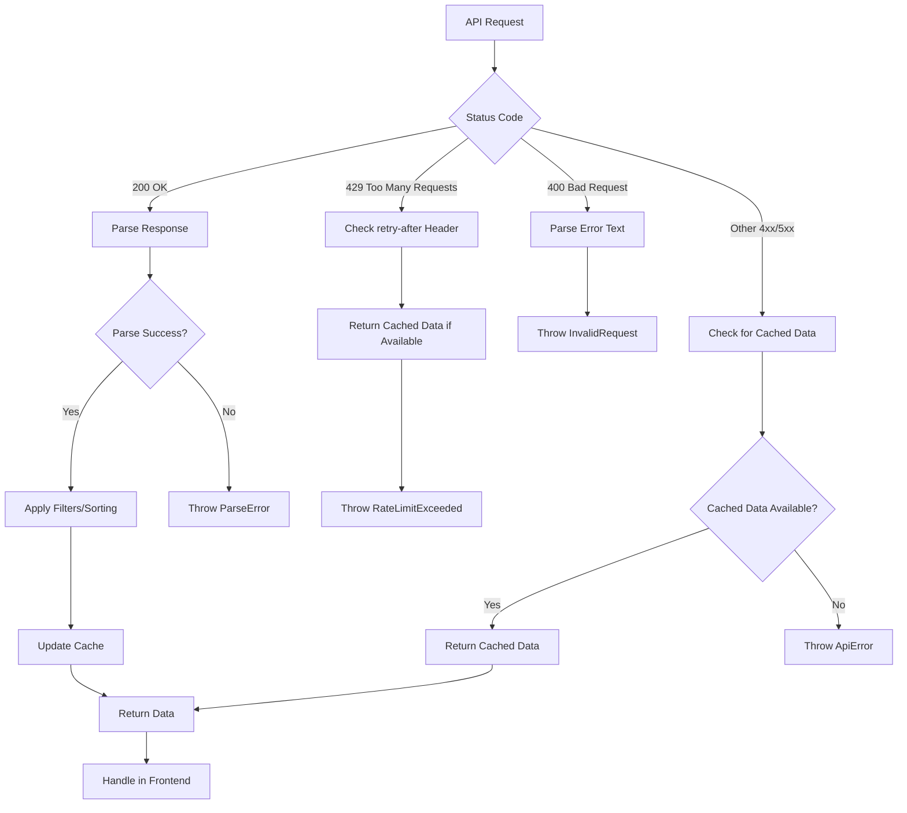
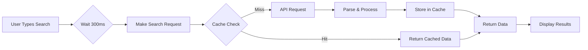

# Marketplace Client Service

<cite>
**Referenced Files in This Document**   
- [marketplace_client.rs](file://src-tauri/src/services/marketplace_client.rs)
- [marketplace.rs](file://src-tauri/src/models/marketplace.rs)
- [marketplace.rs](file://src-tauri/src/commands/marketplace.rs)
- [useMarketplace.ts](file://src/hooks/useMarketplace.ts)
- [tauri.ts](file://src/lib/tauri.ts)
- [index.ts](file://src/types/index.ts)
- [Marketplace.tsx](file://src/pages/Marketplace.tsx)
- [MarketplaceCard.tsx](file://src/components/marketplace/MarketplaceCard.tsx)
- [SearchBar.tsx](file://src/components/marketplace/SearchBar.tsx)
- [FilterPanel.tsx](file://src/components/marketplace/FilterPanel.tsx)
- [SortDropdown.tsx](file://src/components/marketplace/SortDropdown.tsx)
- [ServerDetailModal.tsx](file://src/components/marketplace/ServerDetailModal.tsx)
</cite>

## Table of Contents

1. [Introduction](#introduction)
2. [Core Components](#core-components)
3. [API Communication with PulseMCP](#api-communication-with-pulsemcp)
4. [Server Listing Retrieval and Search Logic](#server-listing-retrieval-and-search-logic)
5. [Response Parsing and Data Models](#response-parsing-and-data-models)
6. [Interface Methods and Parameters](#interface-methods-and-parameters)
7. [Authentication, Rate Limiting, and Error Handling](#authentication-rate-limiting-and-error-handling)
8. [Common Issues and Troubleshooting](#common-issues-and-troubleshooting)
9. [Performance Considerations](#performance-considerations)
10. [Security Practices](#security-practices)

## Introduction

The Marketplace Client service is a core component of the MCP Nexus application that enables users to discover, search, and install MCP (Model Context Protocol) servers from the PulseMCP directory. This service provides a comprehensive interface for interacting with the PulseMCP API, handling server discovery, detailed information retrieval, and integration with the local client environment. The implementation spans both Rust backend services and TypeScript frontend components, creating a seamless experience for users to explore and deploy MCP servers.

The service architecture follows a layered approach with clear separation between the frontend UI components, the Tauri command bridge, and the Rust implementation. This design enables efficient API communication, robust error handling, and responsive user interfaces. The marketplace functionality is critical for onboarding new users and expanding the ecosystem of available MCP servers.

**Section sources**

- [marketplace_client.rs](file://src-tauri/src/services/marketplace_client.rs#L1-L415)
- [Marketplace.tsx](file://src/pages/Marketplace.tsx#L1-L290)

## Core Components

The Marketplace Client service consists of several interconnected components that work together to provide a complete server discovery and installation experience. At the core is the `MarketplaceClient` struct implemented in Rust, which handles all API communication with PulseMCP. This client is wrapped by Tauri commands that expose its functionality to the frontend application through a secure bridge.

On the frontend, the `useMarketplace` hook provides a React interface for consuming marketplace data, while various UI components like `MarketplaceCard`, `SearchBar`, and `FilterPanel` create an intuitive user experience. The `ServerDetailModal` component allows users to view detailed information about a server and initiate the installation process.

The data flow begins with user interactions in the UI components, which trigger the `useMarketplace` hook to call Tauri commands. These commands are routed to the Rust implementation, where the `MarketplaceClient` performs API requests, applies client-side filtering and sorting, and manages caching. The response data is then serialized and returned to the frontend for display.

**Diagram sources**

- [marketplace_client.rs](file://src-tauri/src/services/marketplace_client.rs#L23-L32)
- [useMarketplace.ts](file://src/hooks/useMarketplace.ts#L15-L71)
- [Marketplace.tsx](file://src/pages/Marketplace.tsx#L18-L289)

**Section sources**

- [marketplace_client.rs](file://src-tauri/src/services/marketplace_client.rs#L23-L32)
- [useMarketplace.ts](file://src/hooks/useMarketplace.ts#L15-L71)
- [Marketplace.tsx](file://src/pages/Marketplace.tsx#L18-L289)
- [MarketplaceCard.tsx](file://src/components/marketplace/MarketplaceCard.tsx#L30-L107)
- [SearchBar.tsx](file://src/components/marketplace/SearchBar.tsx#L10-L80)
- [FilterPanel.tsx](file://src/components/marketplace/FilterPanel.tsx#L48-L97)
- [SortDropdown.tsx](file://src/components/marketplace/SortDropdown.tsx#L19-L100)
- [ServerDetailModal.tsx](file://src/components/marketplace/ServerDetailModal.tsx#L572-L590)

## API Communication with PulseMCP

The Marketplace Client service communicates with the PulseMCP API through a well-defined interface that handles all aspects of HTTP communication, including request construction, response handling, and error management. The service is configured to connect to the base URL `https://api.pulsemcp.com/v0beta`, which serves as the entry point for all marketplace operations.

The communication is implemented using the `reqwest` HTTP client in Rust, which provides robust support for asynchronous operations and connection pooling. The client is configured with a 30-second timeout and a custom user agent (`mcp-nexus/0.1.0`) to identify requests. This configuration ensures that the service can handle network latency while preventing requests from hanging indefinitely.

API requests are constructed dynamically based on search parameters, with query parameters properly URL-encoded to ensure compatibility with the API. The service supports pagination through offset and count parameters, allowing efficient retrieval of large result sets. For search operations, the service builds URLs with appropriate query parameters for text search, sorting, and filtering.

**Diagram sources**

- [marketplace_client.rs](file://src-tauri/src/services/marketplace_client.rs#L75-L200)
- [marketplace.rs](file://src-tauri/src/commands/marketplace.rs#L128-L153)

**Section sources**

- [marketplace_client.rs](file://src-tauri/src/services/marketplace_client.rs#L11-L22)
- [marketplace_client.rs](file://src-tauri/src/services/marketplace_client.rs#L40-L54)
- [marketplace_client.rs](file://src-tauri/src/services/marketplace_client.rs#L91-L111)

## Server Listing Retrieval and Search Logic

The server listing retrieval and search functionality is a core feature of the Marketplace Client service, enabling users to discover MCP servers based on various criteria. The search process begins with the `search_servers` method in the `MarketplaceClient`, which accepts `SearchParams` containing query text, pagination settings, sorting preferences, and filter options.

When a search request is initiated, the service first checks its in-memory cache for existing results that match the search parameters. The cache key is generated from the query, page size, and offset, ensuring that identical searches return cached results when available. This caching mechanism significantly improves performance and reduces API load, with a default TTL of 300 seconds (5 minutes).

For uncached requests, the service constructs an API call to the PulseMCP servers endpoint, including query parameters for text search, pagination, and sorting. The API returns a `MarketplaceSearchResponse` containing a list of matching servers and metadata about the result set. After receiving the response, the service applies client-side filtering and sorting based on the original search parameters.

The filtering logic supports several criteria:

- **Remote available**: Filters servers that support SSE/remote connections
- **Official**: Includes only servers verified by MCP maintainers
- **Community**: Includes only servers created by the community

Sorting options include alphabetical, popularity-based (by GitHub stars), and API-provided orderings like "Recommended" and "Last Updated". The service also handles pagination through offset-based navigation, allowing users to browse through large result sets efficiently.

**Diagram sources**

- [marketplace_client.rs](file://src-tauri/src/services/marketplace_client.rs#L75-L200)
- [marketplace.rs](file://src-tauri/src/models/marketplace.rs#L103-L146)

**Section sources**

- [marketplace_client.rs](file://src-tauri/src/services/marketplace_client.rs#L75-L200)
- [marketplace.rs](file://src-tauri/src/models/marketplace.rs#L84-L102)
- [FilterPanel.tsx](file://src/components/marketplace/FilterPanel.tsx#L1-L97)
- [SortDropdown.tsx](file://src/components/marketplace/SortDropdown.tsx#L1-L101)

## Response Parsing and Data Models

The Marketplace Client service uses a comprehensive set of data models to represent the structure of API responses and ensure type safety throughout the application. These models are defined in Rust using Serde for JSON serialization and deserialization, and mirrored in TypeScript for frontend type safety.

The primary response model is `MarketplaceSearchResponse`, which contains a list of `MarketplaceServer` objects, a total count of matching servers, and a URL for the next page of results. Each `MarketplaceServer` includes essential information such as the server name, description, source code URL, GitHub stars, package registry details, and remote endpoints.

The `RemoteEndpoint` model represents SSE-based server connections, with fields for the endpoint type and URL. This enables the application to support both local (stdio) and remote (SSE) connection methods for MCP servers. The service also defines error models like `MarketplaceError` to handle various failure scenarios with appropriate error types and messages.

On the frontend, these models are mirrored in the TypeScript types file, ensuring consistency between the backend and frontend. The `MarketplaceServer` interface includes all the same fields as its Rust counterpart, with appropriate TypeScript types. This type alignment enables seamless data transfer between the Rust backend and TypeScript frontend through the Tauri command bridge.

**Diagram sources**

- [marketplace.rs](file://src-tauri/src/models/marketplace.rs#L5-L51)
- [marketplace.rs](file://src-tauri/src/models/marketplace.rs#L53-L62)
- [marketplace.rs](file://src-tauri/src/models/marketplace.rs#L64-L83)
- [marketplace.rs](file://src-tauri/src/models/marketplace.rs#L85-L102)
- [marketplace.rs](file://src-tauri/src/models/marketplace.rs#L104-L122)
- [marketplace.rs](file://src-tauri/src/models/marketplace.rs#L164-L178)

**Section sources**

- [marketplace.rs](file://src-tauri/src/models/marketplace.rs#L5-L321)
- [index.ts](file://src/types/index.ts#L178-L202)

## Interface Methods and Parameters

The Marketplace Client service exposes a well-defined interface through Tauri commands that are consumed by the frontend application. These methods provide a clean API for performing marketplace operations while abstracting the underlying implementation details.

The primary interface methods include:

- `search_servers`: Searches for servers in the marketplace with specified parameters
- `get_server_details`: Retrieves detailed information about a specific server by name
- `clear_marketplace_cache`: Clears the in-memory cache for manual refresh
- `check_marketplace_cache`: Checks if cached data exists for a search query

The `search_servers` method accepts `SearchServersParams` with the following parameters:

- `query`: Search text for filtering servers by name or description
- `pageSize`: Number of results per page (default: 20)
- `page`: Page number for pagination (0-indexed)
- `sort`: Sorting option (e.g., "recommended", "popular_week")
- `officialOnly`: Filter for official servers only
- `communityOnly`: Filter for community servers only
- `remoteAvailable`: Filter for servers with remote/SSE support

The `get_server_details` method accepts a server name and returns detailed information about that server. This method works by performing a search with the exact server name and returning the matching result.

On the frontend, these methods are wrapped by functions in the `tauri.ts` library, which provide TypeScript type safety and handle the Tauri invoke calls. The `useMarketplace` hook further abstracts these functions into a React-friendly interface that handles loading states, error handling, and data caching.

**Diagram sources**

- [marketplace.rs](file://src-tauri/src/commands/marketplace.rs#L128-L153)
- [marketplace.rs](file://src-tauri/src/commands/marketplace.rs#L156-L167)
- [marketplace.rs](file://src-tauri/src/commands/marketplace.rs#L169-L176)
- [marketplace.rs](file://src-tauri/src/commands/marketplace.rs#L179-L189)
- [tauri.ts](file://src/lib/tauri.ts#L198-L203)

**Section sources**

- [marketplace.rs](file://src-tauri/src/commands/marketplace.rs#L58-L236)
- [tauri.ts](file://src/lib/tauri.ts#L198-L222)
- [useMarketplace.ts](file://src/hooks/useMarketplace.ts#L25-L71)

## Authentication, Rate Limiting, and Error Handling

The Marketplace Client service implements robust error handling and rate limiting strategies to ensure reliable operation even under adverse network conditions. While the PulseMCP API does not require authentication for read operations, the service is designed to handle various error scenarios gracefully.

Rate limiting is handled through HTTP status code 429 (Too Many Requests). When this status is received, the service checks the "retry-after" header to determine when the rate limit will reset. Importantly, the service implements a fallback strategy where it returns cached data even when rate-limited, ensuring that users can still access previously retrieved information.

The error handling system categorizes errors into several types:

- `NetworkError`: Indicates connectivity issues or API unavailability
- `RateLimitExceeded`: Indicates the API rate limit has been reached
- `InvalidRequest`: Indicates malformed request parameters
- `ApiError`: Indicates a server-side error with the API
- `ParseError`: Indicates issues parsing the JSON response

For all error types except network errors, the service attempts to return cached data if available. This ensures that users can continue to browse previously loaded content even when the API is temporarily unavailable. The error types are translated from Rust to a frontend-friendly format through the `MarketplaceCommandError` struct, which includes human-readable messages and additional metadata.

The service also implements client-side validation of search parameters, such as capping the page size at 5000 (the API maximum) and providing default values for optional parameters. This prevents invalid requests from being sent to the API and improves the user experience.

**Diagram sources**

- [marketplace_client.rs](file://src-tauri/src/services/marketplace_client.rs#L124-L166)
- [marketplace_client.rs](file://src-tauri/src/services/marketplace_client.rs#L169-L175)
- [marketplace.rs](file://src-tauri/src/commands/marketplace.rs#L24-L56)

**Section sources**

- [marketplace_client.rs](file://src-tauri/src/services/marketplace_client.rs#L124-L166)
- [marketplace_client.rs](file://src-tauri/src/services/marketplace_client.rs#L169-L175)
- [marketplace.rs](file://src-tauri/src/commands/marketplace.rs#L24-L56)
- [marketplace.rs](file://src-tauri/src/models/marketplace.rs#L164-L203)

## Common Issues and Troubleshooting

The Marketplace Client service is designed to handle several common issues that may arise during normal operation. Understanding these issues and their solutions is essential for maintaining a reliable user experience.

**API Downtime**: When the PulseMCP API is unavailable, the service returns cached data if available, allowing users to continue browsing previously loaded content. If no cached data is available, the frontend displays an error message with a "Try again" button that triggers a refresh. Users should check their internet connection and verify the API status at the PulseMCP status page.

**Malformed Responses**: If the API returns invalid JSON, the service throws a `ParseError` and attempts to return cached data. This scenario is rare but can occur during API deployments or network corruption. The service logs the parsing error for debugging purposes, and users can clear the cache and retry the request.

**Search Performance**: For large result sets, search performance may be impacted by network latency and API response times. The service mitigates this through caching and pagination. Users experiencing slow searches should ensure they have a stable internet connection and consider narrowing their search criteria. The default page size of 42 provides a balance between performance and usability.

**Cache Invalidation**: The service automatically invalidates cache entries after 5 minutes (300 seconds). Users who need fresh data can manually refresh by clicking the refresh button in the UI, which clears the cache and reloads data from the API. This is implemented through the `clear_marketplace_cache` command and the `refresh` function in the `useMarketplace` hook.

**Filter Conflicts**: The UI prevents conflicting filter selections by automatically deselecting "Community" when "Official" is selected, and vice versa. This ensures that filter combinations are logical and prevents empty result sets from contradictory filters.

**Section sources**

- [marketplace_client.rs](file://src-tauri/src/services/marketplace_client.rs#L81-L88)
- [marketplace_client.rs](file://src-tauri/src/services/marketplace_client.rs#L154-L160)
- [Marketplace.tsx](file://src/pages/Marketplace.tsx#L157-L186)
- [FilterPanel.tsx](file://src/components/marketplace/FilterPanel.tsx#L57-L69)
- [useMarketplace.ts](file://src/hooks/useMarketplace.ts#L56-L59)

## Performance Considerations

The Marketplace Client service incorporates several performance optimizations to ensure responsive operation and efficient resource usage. The most significant optimization is the in-memory caching system, which stores search results for 5 minutes by default. This reduces API calls, improves response times, and decreases bandwidth usage.

The cache is implemented using a `HashMap` wrapped in an `Arc<RwLock>` for thread-safe access across async tasks. Cache keys are generated from search parameters to ensure that identical searches return the same results. The cache is checked before making any API requests, and results are stored after successful API calls.

Pagination is another key performance feature, with a default page size of 42 servers per request. This balances the need for sufficient results with API performance considerations. The maximum page size is capped at 5000 to prevent excessively large responses.

The service also implements debouncing in the search interface, with a 300ms delay before triggering search requests as users type. This prevents excessive API calls during active typing and improves perceived performance.

Network performance is optimized through the use of an HTTP client with connection pooling and a 30-second timeout. The client is configured with a descriptive user agent to help API monitoring and rate limiting decisions.

**Diagram sources**

- [marketplace_client.rs](file://src-tauri/src/services/marketplace_client.rs#L29-L31)
- [marketplace_client.rs](file://src-tauri/src/services/marketplace_client.rs#L81-L88)
- [SearchBar.tsx](file://src/components/marketplace/SearchBar.tsx#L24-L32)

**Section sources**

- [marketplace_client.rs](file://src-tauri/src/services/marketplace_client.rs#L15-L16)
- [marketplace_client.rs](file://src-tauri/src/services/marketplace_client.rs#L29-L31)
- [marketplace_client.rs](file://src-tauri/src/services/marketplace_client.rs#L81-L88)
- [SearchBar.tsx](file://src/components/marketplace/SearchBar.tsx#L24-L32)
- [useMarketplace.ts](file://src/hooks/useMarketplace.ts#L46-L47)

## Security Practices

The Marketplace Client service follows several security best practices to protect users and ensure the integrity of API communications. While the service primarily consumes public data from the PulseMCP API, it implements security measures to prevent common vulnerabilities.

The service uses HTTPS for all API communications, ensuring that data is encrypted in transit. The HTTP client is configured to validate SSL certificates by default, preventing man-in-the-middle attacks. The base API URL is hardcoded as a constant to prevent URL injection attacks.

Input validation is performed on search parameters to prevent malformed requests. The service sanitizes query parameters through URL encoding before including them in API requests, preventing injection attacks. The page size is capped at 5000 to prevent resource exhaustion from excessively large requests.

Error messages are carefully crafted to provide useful information without exposing sensitive system details. The service does not expose internal implementation details in error messages, reducing the attack surface for potential attackers.

The Tauri command bridge provides a secure interface between the frontend and backend, with all marketplace commands explicitly registered in the `tauri::generate_handler!` macro. This prevents unauthorized access to backend functionality and ensures that only approved commands can be invoked from the frontend.

**Section sources**

- [marketplace_client.rs](file://src-tauri/src/services/marketplace_client.rs#L12-L13)
- [marketplace_client.rs](file://src-tauri/src/services/marketplace_client.rs#L96-L98)
- [marketplace_client.rs](file://src-tauri/src/services/marketplace_client.rs#L101-L103)
- [lib.rs](file://src-tauri/src/lib.rs#L35-L85)
