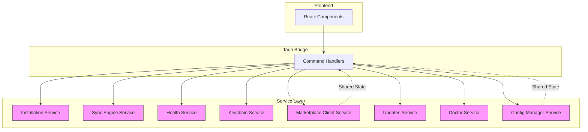
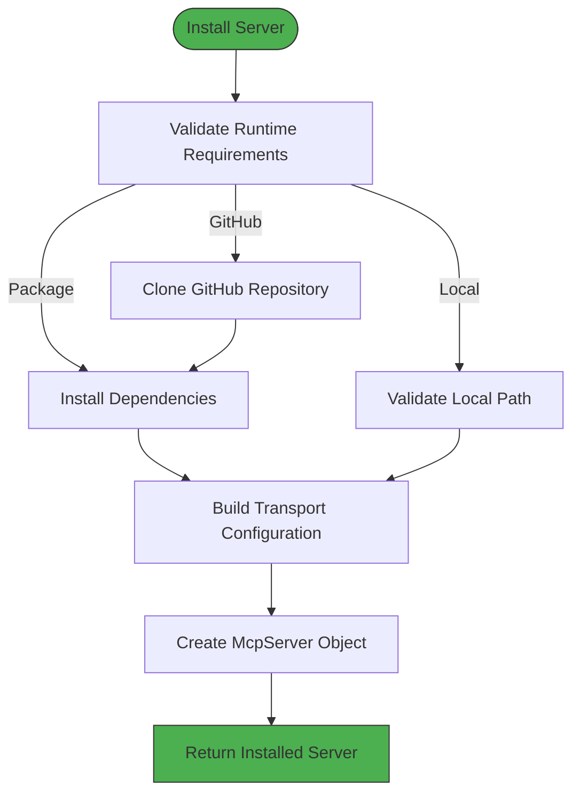
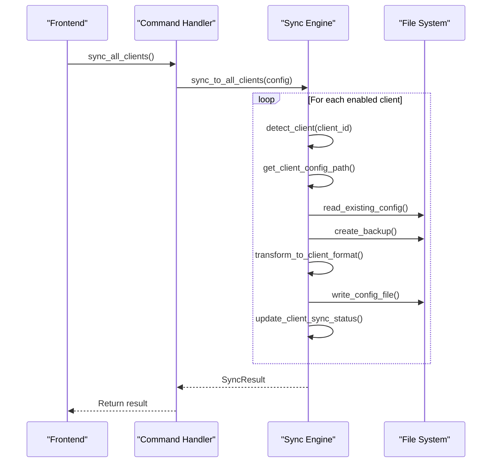
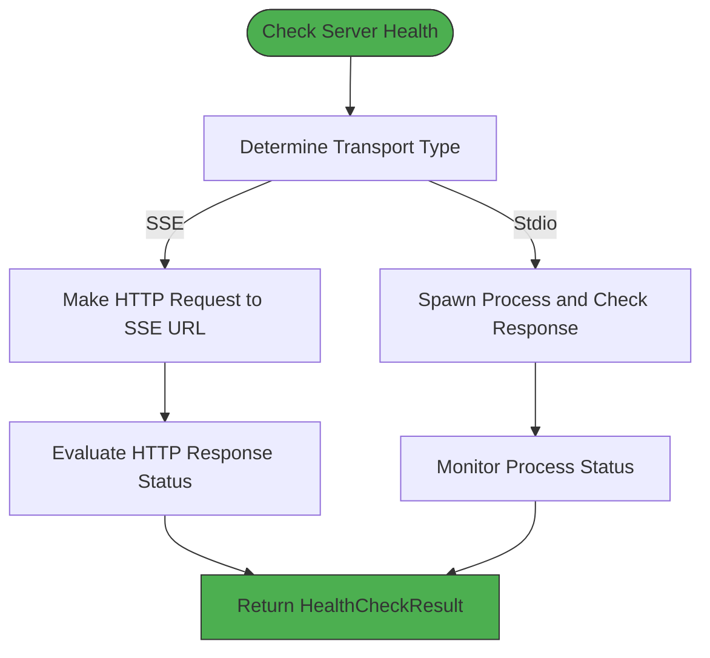
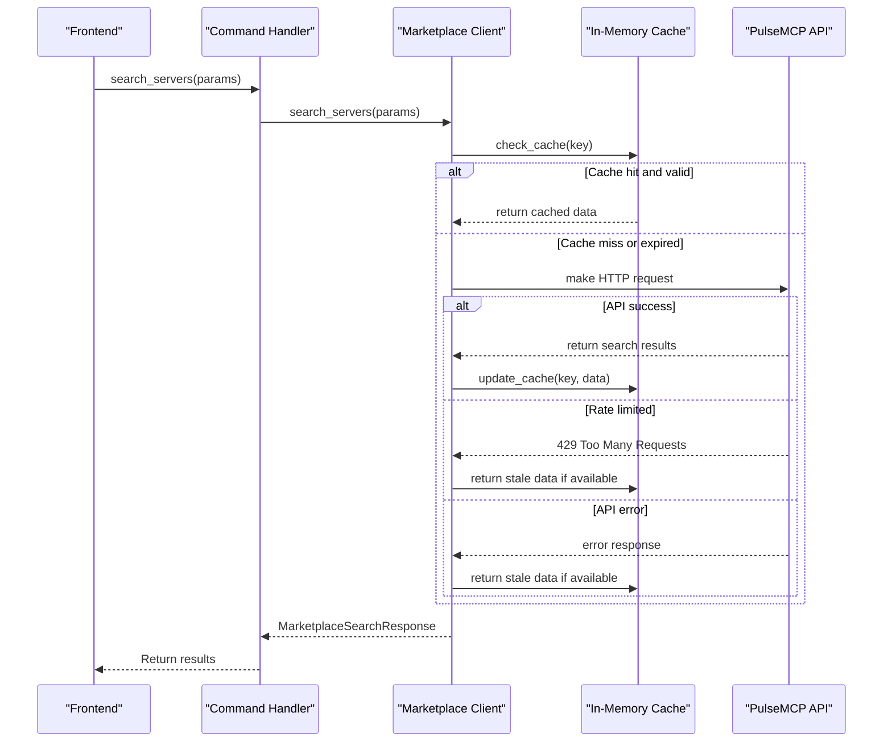
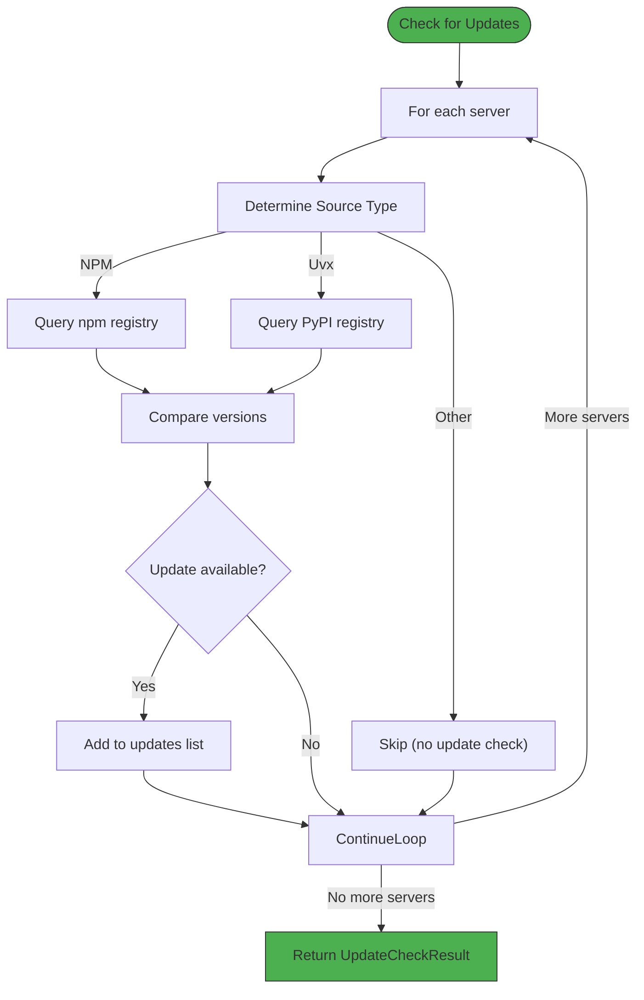
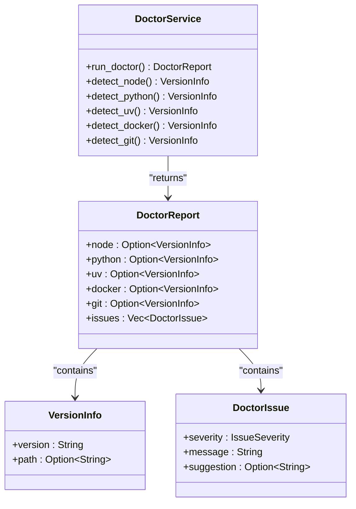
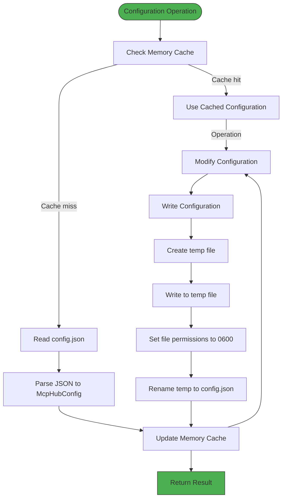
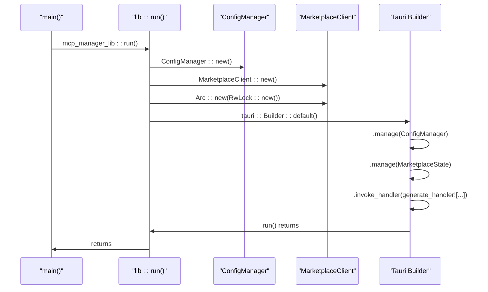
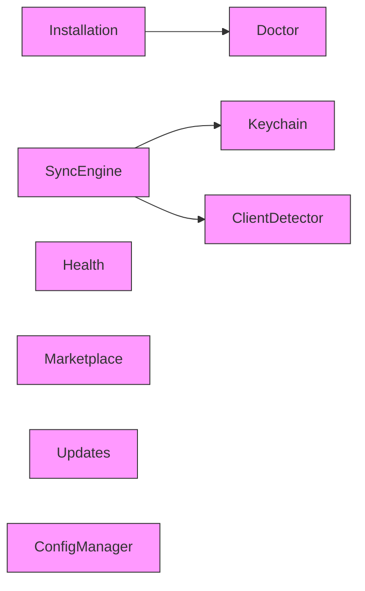

# Service Layer

<cite>
**Referenced Files in This Document**   
- [mod.rs](file://src-tauri/src/services/mod.rs)
- [lib.rs](file://src-tauri/src/lib.rs)
- [main.rs](file://src-tauri/src/main.rs)
- [Cargo.toml](file://src-tauri/Cargo.toml)
- [installation.rs](file://src-tauri/src/services/installation.rs)
- [sync_engine.rs](file://src-tauri/src/services/sync_engine.rs)
- [health.rs](file://src-tauri/src/services/health.rs)
- [keychain.rs](file://src-tauri/src/services/keychain.rs)
- [marketplace_client.rs](file://src-tauri/src/services/marketplace_client.rs)
- [updates.rs](file://src-tauri/src/services/updates.rs)
- [doctor.rs](file://src-tauri/src/services/doctor.rs)
- [config_manager.rs](file://src-tauri/src/services/config_manager.rs)
</cite>

## Table of Contents

1. [Introduction](#introduction)
2. [Service-Oriented Architecture](#service-oriented-architecture)
3. [Core Services](#core-services)
   - [Installation Service](#installation-service)
   - [Sync Engine Service](#sync-engine-service)
   - [Health Service](#health-service)
   - [Keychain Service](#keychain-service)
   - [Marketplace Client Service](#marketplace-client-service)
   - [Updates Service](#updates-service)
   - [Doctor Service](#doctor-service)
   - [Config Manager Service](#config-manager-service)
4. [Service Composition and Initialization](#service-composition-and-initialization)
5. [Inter-Service Communication](#inter-service-communication)
6. [Error Handling and Result Types](#error-handling-and-result-types)
7. [Performance Considerations](#performance-considerations)
8. [Security Practices](#security-practices)
9. [Conclusion](#conclusion)

## Introduction

The MCP Nexus backend service layer implements a modular, service-oriented architecture that manages MCP (Model Context Protocol) servers and their integration with AI clients. This documentation provides a comprehensive overview of the service layer's design, responsibilities, and interactions. The services are designed to be independent yet cohesive, each handling specific aspects of server management, configuration, and health monitoring.

The service layer follows a clean separation of concerns, with each service encapsulating specific functionality. Services communicate through well-defined interfaces and are composed together in the application's initialization phase. The architecture leverages Rust's strong type system, async/await patterns with Tokio, and proper error handling to create a robust and maintainable system.

**Section sources**

- [mod.rs](file://src-tauri/src/services/mod.rs)
- [lib.rs](file://src-tauri/src/lib.rs)

## Service-Oriented Architecture

The MCP Nexus backend employs a service-oriented design pattern where each service has a clearly defined responsibility and interface. This architectural approach provides several benefits:

- **Modularity**: Each service can be developed, tested, and maintained independently
- **Reusability**: Services can be composed and reused across different parts of the application
- **Testability**: Isolated services are easier to unit test with mock dependencies
- **Maintainability**: Changes to one service have minimal impact on others
- **Scalability**: Services can be optimized independently based on their specific requirements

The services are organized in the `src-tauri/src/services` directory, with each service implemented in its own module file. The top-level `mod.rs` file exports the public interfaces of each service, making them available to the rest of the application.

Services in this architecture follow several key principles:

- **Single Responsibility**: Each service handles one specific domain of functionality
- **Stateless Operations**: Most service functions are stateless and operate on input parameters
- **Pure Functions**: Functions have no side effects and return predictable results
- **Error Propagation**: Errors are properly handled and propagated using custom Result types
- **Async Operations**: Long-running operations are implemented asynchronously using Tokio

The service layer interacts with the Tauri frontend through command handlers, which serve as the bridge between the frontend and backend services. This separation ensures that the business logic remains independent of the UI concerns.



**Diagram sources**

- [mod.rs](file://src-tauri/src/services/mod.rs)
- [lib.rs](file://src-tauri/src/lib.rs)

## Core Services

### Installation Service

The Installation Service handles the installation of MCP servers from multiple sources including NPM, Python packages (via uvx), local file paths, GitHub repositories, Docker images, and remote SSE endpoints. The service provides a unified interface for server installation regardless of the source type.

Key responsibilities of the Installation Service include:

- Validating runtime requirements for different installation sources
- Cloning GitHub repositories and setting up dependencies
- Building transport configurations for server execution
- Creating server metadata and configuration
- Cleaning up resources when uninstalling servers

The service uses an enum-based approach to handle different installation sources, with `InstallSource` defining the various types (NPM, Uvx, Local, Github, Docker, Remote). Each source type has specific validation and installation logic. For example, NPM packages require Node.js, Python packages require Python or uv, and GitHub repositories require git.

The installation process follows these steps:

1. Validate that required runtimes are available using the Doctor service
2. For GitHub sources, clone the repository to a managed directory
3. For package-based sources, set up dependencies (npm install, pip install, etc.)
4. Build the transport configuration based on the source type
5. Create the McpServer object with appropriate metadata
6. Return the installed server or propagate installation errors



**Diagram sources**

- [installation.rs](file://src-tauri/src/services/installation.rs)

**Section sources**

- [installation.rs](file://src-tauri/src/services/installation.rs)

### Sync Engine Service

The Sync Engine Service manages configuration synchronization between the MCP Nexus application and AI clients such as Claude, Cursor, and VS Code. It handles both pushing configurations to clients and importing existing configurations from clients.

Key responsibilities of the Sync Engine Service include:

- Transforming server configurations to client-specific formats
- Writing configuration files to client-specific locations
- Creating backups of existing configuration files
- Importing server configurations from client configurations
- Managing client sync status and checksums

The service supports multiple configuration formats:

- **Standard format**: {"mcpServers": {"name": {...}, ...}}
- **VS Code format**: {"mcp": {"servers": {"name": {...}, ...}}}
- **Continue.dev format**: Standard format with additional settings preserved

When syncing to a client, the service:

1. Determines the client's configuration format and sync mode
2. Reads the existing configuration (if any) to preserve other settings
3. Creates a backup of the current configuration
4. Transforms the server configurations to the appropriate format
5. Writes the new configuration atomically
6. Updates the client's sync status with timestamp and checksum

For credential handling, the service can resolve keychain references to actual values when syncing to client configs, while preserving references in manual configuration displays.



**Diagram sources**

- [sync_engine.rs](file://src-tauri/src/services/sync_engine.rs)

**Section sources**

- [sync_engine.rs](file://src-tauri/src/services/sync_engine.rs)

### Health Service

The Health Service performs health checks on MCP servers using either stdio or SSE (Server-Sent Events) depending on the server's transport type. It provides real-time status monitoring for servers to ensure they are functioning correctly.

Key responsibilities of the Health Service include:

- Checking the health of stdio servers by attempting to spawn and communicate with them
- Checking the health of SSE servers by making HTTP requests to their endpoints
- Providing detailed health check results with status, messages, and response times
- Supporting configurable timeout settings for health checks

For stdio servers, the service attempts to spawn the server process and verifies that it starts successfully. It gives the process a moment to initialize and checks if it's still running, killing it afterward since this is just a health check. For SSE servers, the service makes an HTTP GET request to the server's URL and evaluates the response status.

The health check process returns a `HealthCheckResult` containing:

- Server ID
- Health status (Healthy, Unhealthy, Unknown, Running, Stopped)
- Message describing the result
- Timestamp of the check
- Response time in milliseconds



**Diagram sources**

- [health.rs](file://src-tauri/src/services/health.rs)

**Section sources**

- [health.rs](file://src-tauri/src/services/health.rs)

### Keychain Service

The Keychain Service provides secure credential storage using the operating system's keychain (macOS Keychain, Windows Credential Manager, etc.). It enables secure handling of sensitive information such as API keys and authentication tokens.

Key responsibilities of the Keychain Service include:

- Storing credentials securely in the OS keychain
- Retrieving credentials by name
- Deleting credentials from the keychain
- Listing stored credential names
- Resolving keychain references in configuration values
- Validating credential names and managing metadata

The service uses the `keyring` crate to interface with the OS keychain and maintains a separate JSON file (`credential_keys.json`) to track which credential names exist. This allows for listing credentials without retrieving their actual values, enhancing security.

Credential references in configuration values can be specified in two formats:

- `keychain:credential-name`
- `${keychain:credential-name}`

The service can resolve these references to actual values when needed, such as when syncing configurations to clients. This allows users to store sensitive information securely while still using it in server configurations.

```mermaid
classDiagram
class KeychainService {
+store_credential(name, value)
+get_credential(name)
+delete_credential(name)
+list_credentials()
+credential_exists(name)
+resolve_keychain_reference(value)
+is_keychain_reference(value)
+extract_credential_name(value)
}
class KeychainError {
+KeyringError(message)
+NotFound(name)
+KeysFileReadError(message)
+KeysFileWriteError(message)
+InvalidName(name)
+HomeNotFound
}
class StoreCredentialResult {
+name : String
+success : bool
+is_update : bool
}
KeychainService --> KeychainError : "returns"
KeychainService --> StoreCredentialResult : "returns"
KeychainService --> "OS Keychain" : "uses"
KeychainService --> "credential_keys.json" : "manages"
```

**Diagram sources**

- [keychain.rs](file://src-tauri/src/services/keychain.rs)

**Section sources**

- [keychain.rs](file://src-tauri/src/services/keychain.rs)

### Marketplace Client Service

The Marketplace Client Service fetches and filters servers from the PulseMCP API, providing a gateway to discoverable MCP servers. It implements client-side caching to improve performance and reduce API calls.

Key responsibilities of the Marketplace Client Service include:

- Searching for servers in the PulseMCP marketplace
- Getting details for specific servers
- Applying client-side filtering and sorting
- Caching search results to minimize API calls
- Handling rate limiting and network errors gracefully

The service uses an HTTP client to communicate with the PulseMCP API at `https://api.pulsemcp.com/v0beta`. It implements a caching mechanism using an in-memory `HashMap` protected by a `RwLock`, with a default TTL of 5 minutes. When a search is performed, the service first checks the cache before making an API call.

Client-side filtering options include:

- Remote available (servers with SSE endpoints)
- Official (servers with package registry)

Client-side sorting options include:

- Alphabetical
- Popular (by GitHub stars)
- Recommended
- Last updated

The service handles rate limiting by returning cached data when a 429 Too Many Requests response is received, ensuring the UI remains functional even when API rate limits are reached.



**Diagram sources**

- [marketplace_client.rs](file://src-tauri/src/services/marketplace_client.rs)

**Section sources**

- [marketplace_client.rs](file://src-tauri/src/services/marketplace_client.rs)

### Updates Service

The Updates Service checks for server updates by comparing installed versions against package registries (npm for Node.js packages, PyPI for Python packages). It provides detailed information about available updates.

Key responsibilities of the Updates Service include:

- Checking for updates on npm and PyPI registries
- Comparing version numbers to determine if updates are available
- Returning detailed update information including version numbers and package sources
- Handling version comparison with proper semantic versioning logic
- Aggregating update results across multiple servers

The service implements version comparison logic that handles common version formats, including:

- Standard semantic versions (1.2.3)
- Versions with 'v' prefix (v1.2.3)
- Pre-release versions (1.2.3-beta.1)
- Build metadata (1.2.3+build.123)

For each server, the service determines the appropriate registry to check based on the server's source type:

- NPM packages are checked against the npm registry
- Python packages (uvx) are checked against PyPI
- Other source types (local, docker, github, remote) cannot be checked for updates

The update check process returns an `UpdateCheckResult` containing:

- List of servers with available updates
- Total servers checked
- Number of updates available
- Number of servers skipped (no update check possible)
- Any errors encountered during the check
- Timestamp of the check



**Diagram sources**

- [updates.rs](file://src-tauri/src/services/updates.rs)

**Section sources**

- [updates.rs](file://src-tauri/src/services/updates.rs)

### Doctor Service

The Doctor Service performs system diagnostics to identify potential issues with the user's environment that might affect MCP server functionality. It checks for the presence of required runtimes and tools.

Key responsibilities of the Doctor Service include:

- Detecting installed versions of Node.js, Python, uv, Docker, and git
- Checking for nvm-managed Node.js installations
- Verifying the presence of required tools for different server types
- Generating a comprehensive diagnostic report
- Providing suggestions for resolving missing dependencies

The service runs a series of detection functions for each runtime:

- **Node.js**: Checks nvm paths first, then common installation locations, then PATH
- **Python**: Tries python3 first, then python, verifying it's Python 3.x
- **uv**: Checks for the uv package manager
- **Docker**: Verifies Docker is installed and available
- **git**: Checks for git installation

For each missing or problematic dependency, the service adds an issue to the diagnostic report with a severity level (error, warning, info) and suggested resolution. This helps users understand and fix environment issues that might prevent certain server types from working.



**Diagram sources**

- [doctor.rs](file://src-tauri/src/services/doctor.rs)

**Section sources**

- [doctor.rs](file://src-tauri/src/services/doctor.rs)

### Config Manager Service

The Config Manager Service handles application configuration, providing CRUD operations for server configurations and managing the central configuration file. It implements atomic write operations and file permission security.

Key responsibilities of the Config Manager Service include:

- Loading and saving the central configuration file
- Managing a memory cache of the configuration for performance
- Implementing atomic write operations to prevent corruption
- Setting secure file permissions (0600 on Unix)
- Providing CRUD operations for servers
- Managing server enablement for specific clients

The service stores the configuration in `~/.mcp-nexus/config.json` and creates the directory with 0700 permissions for security. Configuration writes use an atomic pattern: writing to a temporary file first, setting permissions, then renaming to the final location.

The service implements a simple cache using `RwLock<Option<McpHubConfig>>` to avoid reading from disk for every operation. The cache is updated on every write and can be invalidated when needed.

CRUD operations provided by the service include:

- `add_server`: Add a new server to the configuration
- `get_server`: Retrieve a server by ID
- `get_servers`: Retrieve all servers
- `update_server`: Update an existing server
- `remove_server`: Remove a server by ID
- `toggle_server_client`: Enable or disable a server for a specific client



**Diagram sources**

- [config_manager.rs](file://src-tauri/src/services/config_manager.rs)

**Section sources**

- [config_manager.rs](file://src-tauri/src/services/config_manager.rs)

## Service Composition and Initialization

Services are composed and initialized in the application's main module (`lib.rs`), where they are instantiated and shared with the Tauri application state. This initialization process follows a dependency injection pattern, where services are created with their dependencies and then made available to command handlers.

The initialization process in `lib.rs` follows these steps:

1. Create a new ConfigManager instance to handle application configuration
2. Create a new MarketplaceClient instance for marketplace operations
3. Wrap the MarketplaceClient in an Arc<RwLock> for shared ownership and thread safety
4. Register services with Tauri's state management system using `.manage()`
5. Register command handlers that can access the managed services



**Diagram sources**

- [lib.rs](file://src-tauri/src/lib.rs)
- [main.rs](file://src-tauri/src/main.rs)

**Section sources**

- [lib.rs](file://src-tauri/src/lib.rs)
- [main.rs](file://src-tauri/src/main.rs)

## Inter-Service Communication

Services communicate with each other through direct function calls and shared state, following a layered architecture where higher-level services may depend on lower-level ones. The communication patterns are designed to maintain loose coupling while enabling necessary interactions.

Key inter-service communication patterns include:

1. **Direct Function Calls**: Services call functions from other services when they need specific functionality. For example:
   - The Installation Service calls the Doctor Service to validate runtime requirements
   - The Sync Engine Service calls the Keychain Service to resolve credential references
   - The Updates Service operates independently but uses shared models

2. **Shared State via Tauri Manage**: Some services are shared as application state and can be accessed by multiple command handlers:
   - ConfigManager is managed state for configuration operations
   - MarketplaceClient is managed state for marketplace operations

3. **Data Flow Through Command Handlers**: Most service interactions occur through command handlers, which orchestrate multiple services for a single operation:
   - The `install_mcp_server` command uses Installation Service with Doctor Service validation
   - The `sync_all_clients` command uses Sync Engine Service with Config Manager
   - The `check_for_updates` command uses Updates Service with Config Manager

4. **Model Sharing**: Services share data through common models defined in the `models` module, ensuring consistent data structures across the application.

The service dependencies form a directed acyclic graph with the following relationships:

- Installation Service depends on Doctor Service
- Sync Engine Service depends on Keychain Service and Client Detector
- Health Service has no dependencies
- Marketplace Client Service has no dependencies
- Updates Service has no dependencies
- Doctor Service has no dependencies
- Config Manager Service has no dependencies
- Keychain Service has no dependencies

This dependency structure ensures that services remain focused on their specific responsibilities while allowing necessary cross-service interactions.



**Diagram sources**

- [mod.rs](file://src-tauri/src/services/mod.rs)
- [lib.rs](file://src-tauri/src/lib.rs)

**Section sources**

- [mod.rs](file://src-tauri/src/services/mod.rs)
- [lib.rs](file://src-tauri/src/lib.rs)

## Error Handling and Result Types

The service layer implements robust error handling using Rust's type system and the `thiserror` crate for custom error types. Each service defines its own error enum that implements `std::error::Error`, providing clear and descriptive error messages.

Key error handling patterns include:

1. **Custom Error Enums**: Each service defines a specific error type that covers all possible failure modes:

   ```rust
   #[derive(Error, Debug)]
   pub enum InstallationError {
       #[error("Missing required runtime: {0}. {1}")]
       MissingRuntime(String, String),
       #[error("Failed to validate local path: {0}")]
       InvalidLocalPath(String),
       // ... other variants
   }
   ```

2. **Error Propagation**: Functions return `Result<T, E>` types, allowing errors to be propagated up the call stack using the `?` operator:

   ```rust
   pub fn validate_runtime(
       source: &InstallSource,
       doctor_report: &DoctorReport,
   ) -> Result<(), InstallationError> {
       // ... validation logic
       Ok(())
   }
   ```

3. **Error Conversion**: The `From` trait is implemented to convert between error types, enabling seamless error propagation across service boundaries:

   ```rust
   impl From<keyring::Error> for KeychainError {
       fn from(err: keyring::Error) -> Self {
           match err {
               keyring::Error::NoEntry => KeychainError::NotFound("No entry found".to_string()),
               _ => KeychainError::KeyringError(err.to_string()),
           }
       }
   }
   ```

4. **Comprehensive Error Coverage**: Error types include variants for all possible failure modes, including:
   - IO errors
   - Serialization/deserialization errors
   - Validation errors
   - Network errors
   - Missing resources
   - Permission issues

5. **Descriptive Error Messages**: Error messages are designed to be user-friendly and provide actionable information, often including suggestions for resolution.

The error handling approach ensures that errors are properly handled at the appropriate level, with detailed information available for debugging while providing clear feedback to users through the frontend.

**Section sources**

- [installation.rs](file://src-tauri/src/services/installation.rs)
- [sync_engine.rs](file://src-tauri/src/services/sync_engine.rs)
- [health.rs](file://src-tauri/src/services/health.rs)
- [keychain.rs](file://src-tauri/src/services/keychain.rs)
- [marketplace_client.rs](file://src-tauri/src/services/marketplace_client.rs)
- [updates.rs](file://src-tauri/src/services/updates.rs)
- [doctor.rs](file://src-tauri/src/services/doctor.rs)
- [config_manager.rs](file://src-tauri/src/services/config_manager.rs)

## Performance Considerations

The service layer incorporates several performance optimizations to ensure responsive operation, particularly for operations that involve external systems or potentially slow operations.

Key performance considerations include:

1. **Async Operations**: All I/O-bound operations are implemented asynchronously using Tokio, preventing blocking of the main thread:
   - HTTP requests to the PulseMCP API
   - File system operations for configuration management
   - Process spawning for health checks
   - Network operations for SSE health checks

2. **Caching**: Strategic caching is implemented to reduce redundant operations:
   - Marketplace Client caches API responses for 5 minutes
   - Config Manager caches the configuration in memory
   - Doctor Service results could be cached (though not currently implemented)

3. **Concurrent Operations**: Where appropriate, operations are performed concurrently:
   - Health checks for multiple servers can be run in parallel
   - Update checks for multiple servers are performed concurrently
   - Multiple command handlers can operate simultaneously

4. **Efficient Data Structures**: The service layer uses appropriate data structures for performance:
   - HashMaps for O(1) lookups of servers by ID
   - Vec for ordered collections of servers
   - RwLock for shared state with efficient read access

5. **Batch Operations**: Some services support batch operations to reduce overhead:
   - Sync Engine can sync to all enabled clients in a single operation
   - Updates Service checks for updates on all servers at once

6. **Resource Management**: The service layer carefully manages system resources:
   - Processes spawned for health checks are properly cleaned up
   - File handles are properly closed
   - Memory usage is monitored through caching limits

7. **Atomic Operations**: Critical operations like configuration writes use atomic patterns to prevent corruption while maintaining performance.

These performance considerations ensure that the service layer remains responsive even when handling multiple servers and frequent operations, providing a smooth user experience.

**Section sources**

- [marketplace_client.rs](file://src-tauri/src/services/marketplace_client.rs)
- [config_manager.rs](file://src-tauri/src/services/config_manager.rs)
- [health.rs](file://src-tauri/src/services/health.rs)
- [updates.rs](file://src-tauri/src/services/updates.rs)

## Security Practices

The service layer implements several security practices to protect user data and system integrity, particularly for handling sensitive information like credentials.

Key security practices include:

1. **Secure Credential Storage**: Credentials are stored using the operating system's keychain (macOS Keychain, Windows Credential Manager) through the `keyring` crate, ensuring they are encrypted and protected by the OS security mechanisms.

2. **File Permissions**: Configuration files and directories are created with restrictive permissions:
   - Configuration directory: 0700 (user read/write/execute only)
   - Configuration file: 0600 (user read/write only)
   - Credential keys file: 0600 (user read/write only)

3. **Atomic Writes**: Configuration files are written using an atomic pattern (write to temp file, set permissions, rename) to prevent corruption and ensure data integrity.

4. **Input Validation**: All user inputs are validated:
   - Credential names are validated for allowed characters
   - URLs are validated for proper format
   - File paths are validated for existence and accessibility

5. **Environment Variable Security**: When resolving keychain references in environment variables, the service ensures that only properly formatted references are processed, preventing injection attacks.

6. **Process Security**: When spawning processes for health checks, the service:
   - Uses explicit command and argument separation
   - Controls stdin/stdout/stderr pipes
   - Properly cleans up spawned processes

7. **Network Security**: HTTP requests use appropriate timeouts and handle errors gracefully, preventing denial of service from unresponsive servers.

8. **Memory Safety**: As a Rust application, the service layer benefits from Rust's memory safety guarantees, preventing common vulnerabilities like buffer overflows and use-after-free errors.

These security practices ensure that the MCP Nexus application handles sensitive data responsibly and protects the user's system from potential vulnerabilities.

**Section sources**

- [keychain.rs](file://src-tauri/src/services/keychain.rs)
- [config_manager.rs](file://src-tauri/src/services/config_manager.rs)
- [health.rs](file://src-tauri/src/services/health.rs)

## Conclusion

The MCP Nexus backend service layer demonstrates a well-architected, modular design that effectively separates concerns while enabling cohesive functionality. Each service has a clearly defined responsibility and interface, following service-oriented architecture principles that promote maintainability, testability, and scalability.

Key architectural strengths include:

- **Clear Separation of Concerns**: Each service handles a specific domain of functionality
- **Robust Error Handling**: Comprehensive error types with descriptive messages
- **Asynchronous Operations**: Non-blocking I/O using Tokio for responsive performance
- **Secure Credential Management**: Integration with OS keychain for secure storage
- **Efficient Caching**: Strategic caching to improve performance and reduce API calls
- **Atomic Operations**: Safe configuration management with atomic writes
- **Comprehensive Testing**: Extensive unit tests for each service

The service composition through Tauri's state management system enables effective sharing of resources while maintaining loose coupling. The inter-service communication patterns ensure that services can collaborate when needed without creating tight dependencies.

For future improvements, potential enhancements could include:

- Implementing caching for Doctor Service results
- Adding more sophisticated dependency management for server installations
- Expanding the marketplace filtering and sorting capabilities
- Implementing rate limiting for command handlers
- Adding more comprehensive monitoring and logging

Overall, the service layer provides a solid foundation for the MCP Nexus application, effectively managing MCP servers and their integration with AI clients while maintaining security, performance, and reliability.

**Section sources**

- [mod.rs](file://src-tauri/src/services/mod.rs)
- [lib.rs](file://src-tauri/src/lib.rs)
