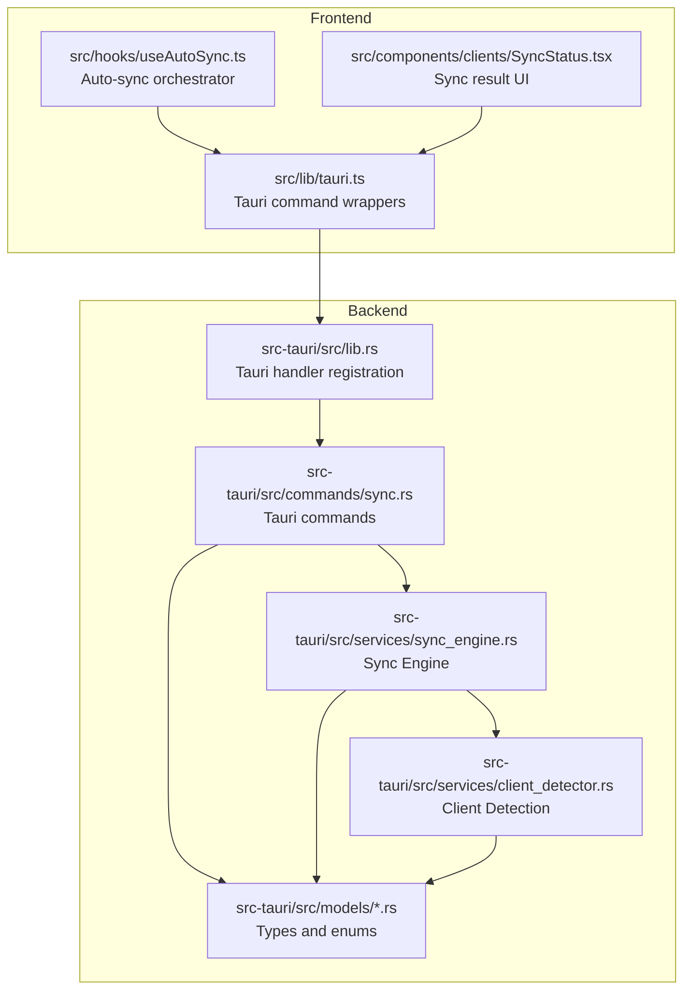
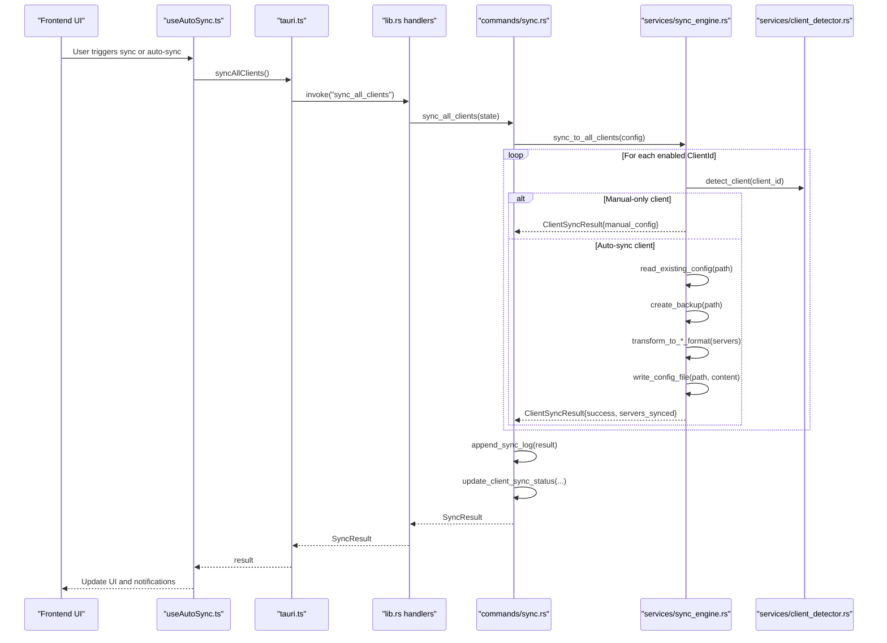
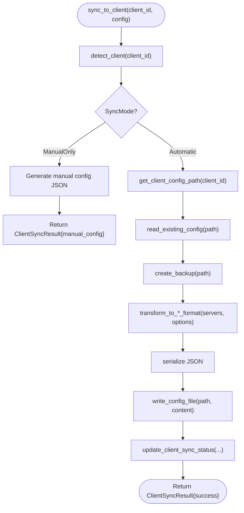
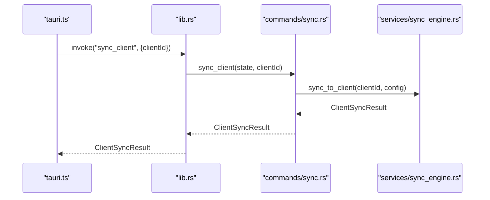
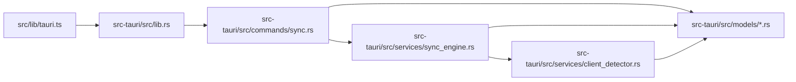

# Sync Engine Service

<cite>
**Referenced Files in This Document**
- [sync_engine.rs](file://src-tauri/src/services/sync_engine.rs)
- [client_detector.rs](file://src-tauri/src/services/client_detector.rs)
- [sync.rs](file://src-tauri/src/commands/sync.rs)
- [client.rs](file://src-tauri/src/models/client.rs)
- [config.rs](file://src-tauri/src/models/config.rs)
- [server.rs](file://src-tauri/src/models/server.rs)
- [lib.rs](file://src-tauri/src/lib.rs)
- [tauri.ts](file://src/lib/tauri.ts)
- [useAutoSync.ts](file://src/hooks/useAutoSync.ts)
- [SyncStatus.tsx](file://src/components/clients/SyncStatus.tsx)
</cite>

## Table of Contents

1. [Introduction](#introduction)
2. [Project Structure](#project-structure)
3. [Core Components](#core-components)
4. [Architecture Overview](#architecture-overview)
5. [Detailed Component Analysis](#detailed-component-analysis)
6. [Dependency Analysis](#dependency-analysis)
7. [Performance Considerations](#performance-considerations)
8. [Troubleshooting Guide](#troubleshooting-guide)
9. [Conclusion](#conclusion)
10. [Appendices](#appendices)

## Introduction

This document explains the Sync Engine service responsible for synchronizing MCP server configurations to supported AI clients. It covers configuration synchronization logic, client detection mechanisms, file system operations, and integration with Tauri commands. It also documents the service’s interface methods, invocation relationships, auto-sync and manual sync workflows, conflict handling, data integrity, file permissions, and common issues such as sync failures, file locking, and client path misconfigurations.

## Project Structure

The Sync Engine resides in the Rust backend under src-tauri/src/services and integrates with Tauri commands under src-tauri/src/commands. Frontend bindings live in src/lib/tauri.ts, and React hooks orchestrate auto-sync behavior in src/hooks/useAutoSync.ts. UI components render sync results in src/components/clients/SyncStatus.tsx.

**Diagram sources**

- [lib.rs](file://src-tauri/src/lib.rs#L31-L88)
- [sync.rs](file://src-tauri/src/commands/sync.rs#L53-L85)
- [sync_engine.rs](file://src-tauri/src/services/sync_engine.rs#L318-L446)
- [client_detector.rs](file://src-tauri/src/services/client_detector.rs#L123-L216)
- [client.rs](file://src-tauri/src/models/client.rs#L1-L167)
- [config.rs](file://src-tauri/src/models/config.rs#L60-L127)
- [server.rs](file://src-tauri/src/models/server.rs#L1-L131)

**Section sources**

- [lib.rs](file://src-tauri/src/lib.rs#L31-L88)
- [sync.rs](file://src-tauri/src/commands/sync.rs#L53-L85)
- [sync_engine.rs](file://src-tauri/src/services/sync_engine.rs#L318-L446)
- [client_detector.rs](file://src-tauri/src/services/client_detector.rs#L123-L216)
- [client.rs](file://src-tauri/src/models/client.rs#L1-L167)
- [config.rs](file://src-tauri/src/models/config.rs#L60-L127)
- [server.rs](file://src-tauri/src/models/server.rs#L1-L131)

## Core Components

- Sync Engine: Implements configuration transformation, file read/write, backup creation, and client-specific formatting. Provides functions to sync to a single client and to all enabled clients, plus import from a client’s config.
- Client Detector: Determines whether a client is installed, detects its config file path, counts servers in existing configs, and classifies sync mode and format.
- Tauri Commands: Expose sync operations to the frontend, manage logging of failed syncs, and update client settings after successful syncs.
- Models: Define ClientId, SyncMode, ConfigFormat, McpHubConfig, McpServer, and related structures used across the service.

Key responsibilities:

- Transform MCP server definitions into client-specific JSON formats.
- Read, backup, and atomically write client config files with appropriate permissions.
- Detect clients and decide whether to auto-sync or require manual configuration.
- Track sync status and checksums for conflict detection.

**Section sources**

- [sync_engine.rs](file://src-tauri/src/services/sync_engine.rs#L318-L446)
- [client_detector.rs](file://src-tauri/src/services/client_detector.rs#L123-L216)
- [sync.rs](file://src-tauri/src/commands/sync.rs#L71-L141)
- [client.rs](file://src-tauri/src/models/client.rs#L92-L167)
- [config.rs](file://src-tauri/src/models/config.rs#L60-L127)
- [server.rs](file://src-tauri/src/models/server.rs#L1-L131)

## Architecture Overview

The Sync Engine sits between Tauri commands and client detection services. It transforms the central configuration into client-specific formats, writes files safely, and records sync metadata.

**Diagram sources**

- [useAutoSync.ts](file://src/hooks/useAutoSync.ts#L16-L48)
- [tauri.ts](file://src/lib/tauri.ts#L112-L122)
- [lib.rs](file://src-tauri/src/lib.rs#L53-L59)
- [sync.rs](file://src-tauri/src/commands/sync.rs#L107-L141)
- [sync_engine.rs](file://src-tauri/src/services/sync_engine.rs#L318-L446)
- [client_detector.rs](file://src-tauri/src/services/client_detector.rs#L123-L216)

## Detailed Component Analysis

### Sync Engine Service

Responsibilities:

- Transform servers to client-specific formats (standard, VS Code, Continue).
- Read existing client config, preserve non-MCP settings, and merge MCP entries.
- Generate manual configuration JSON for manual-only clients (e.g., Warp).
- Create backups, serialize JSON, and write files atomically with secure permissions.
- Compute checksums and update client sync metadata.

Key functions and behaviors:

- Transform options control credential resolution during sync versus display.
- Sync to a single client:
  - Detect client and mode.
  - Resolve config path.
  - Read existing config and create backup.
  - Transform and serialize.
  - Write with atomic rename and platform-specific permissions.
  - Record success/failure and server counts.
- Sync to all clients:
  - Iterate enabled clients and aggregate results.
  - Count manual-required, successful, and failed.
- Import from client:
  - Parse raw config, infer transport and source, and add to central config.
- Update client sync status:
  - Persist last sync timestamp and checksum for conflict detection.

**Diagram sources**

- [sync_engine.rs](file://src-tauri/src/services/sync_engine.rs#L318-L446)
- [client_detector.rs](file://src-tauri/src/services/client_detector.rs#L123-L216)

**Section sources**

- [sync_engine.rs](file://src-tauri/src/services/sync_engine.rs#L318-L446)
- [sync_engine.rs](file://src-tauri/src/services/sync_engine.rs#L448-L485)
- [sync_engine.rs](file://src-tauri/src/services/sync_engine.rs#L487-L633)
- [sync_engine.rs](file://src-tauri/src/services/sync_engine.rs#L635-L663)

### Client Detection Service

Responsibilities:

- Resolve client config file paths per OS and client type.
- Detect installation presence and parse existing configs to count servers.
- Classify clients by SyncMode and ConfigFormat.
- Provide detailed config info for import operations.

Highlights:

- Special handling for manual-only clients (e.g., Warp).
- OS-aware paths and fallback detection heuristics.
- Parsing supports standard, VS Code, and Continue formats.

**Section sources**

- [client_detector.rs](file://src-tauri/src/services/client_detector.rs#L23-L53)
- [client_detector.rs](file://src-tauri/src/services/client_detector.rs#L123-L216)
- [client_detector.rs](file://src-tauri/src/services/client_detector.rs#L224-L236)
- [client.rs](file://src-tauri/src/models/client.rs#L92-L167)

### Tauri Commands and Frontend Integration

Commands exposed:

- sync_client(clientId): Sync a single client.
- sync_all_clients(): Sync all enabled clients.
- import_client_servers(clientId, overwriteExisting): Import servers from a client’s config.
- get_manual_config(clientId): Retrieve manual config JSON for manual-only clients.
- set_client_sync_enabled(clientId, enabled): Toggle sync enablement per client.

Frontend integration:

- tauri.ts wraps Tauri invocations for all commands.
- useAutoSync.ts debounces and triggers auto-sync when preferences allow.
- SyncStatus.tsx renders sync results and restart notices.

**Diagram sources**

- [tauri.ts](file://src/lib/tauri.ts#L112-L122)
- [lib.rs](file://src-tauri/src/lib.rs#L53-L59)
- [sync.rs](file://src-tauri/src/commands/sync.rs#L71-L105)
- [sync_engine.rs](file://src-tauri/src/services/sync_engine.rs#L318-L446)

**Section sources**

- [sync.rs](file://src-tauri/src/commands/sync.rs#L71-L141)
- [sync.rs](file://src-tauri/src/commands/sync.rs#L144-L205)
- [sync.rs](file://src-tauri/src/commands/sync.rs#L206-L245)
- [tauri.ts](file://src/lib/tauri.ts#L112-L143)
- [useAutoSync.ts](file://src/hooks/useAutoSync.ts#L16-L48)
- [SyncStatus.tsx](file://src/components/clients/SyncStatus.tsx#L1-L231)

### Data Models

- ClientId: Enumerates supported clients and provides identifiers and display names.
- SyncMode: Automatic vs ManualOnly.
- ConfigFormat: Standard, VS Code, Continue.
- McpHubConfig: Central configuration with servers, client settings, and preferences.
- McpServer: Server definition with source and transport, plus client enablement flags.
- ClientSyncStatus: Tracks sync enablement, timestamps, checksums, and external modifications.

These models define the contract between the Sync Engine, commands, and UI.

**Section sources**

- [client.rs](file://src-tauri/src/models/client.rs#L1-L167)
- [config.rs](file://src-tauri/src/models/config.rs#L60-L127)
- [server.rs](file://src-tauri/src/models/server.rs#L1-L131)

## Dependency Analysis

- sync.rs depends on sync_engine.rs for core logic and on client_detector.rs indirectly via sync_to_client.
- sync_engine.rs depends on models for types and on client_detector.rs for path resolution and detection.
- lib.rs registers Tauri handlers for all commands, including sync commands.
- Frontend relies on tauri.ts wrappers and React hooks for orchestration.

**Diagram sources**

- [lib.rs](file://src-tauri/src/lib.rs#L31-L88)
- [sync.rs](file://src-tauri/src/commands/sync.rs#L53-L85)
- [sync_engine.rs](file://src-tauri/src/services/sync_engine.rs#L318-L446)
- [client_detector.rs](file://src-tauri/src/services/client_detector.rs#L123-L216)
- [client.rs](file://src-tauri/src/models/client.rs#L1-L167)
- [config.rs](file://src-tauri/src/models/config.rs#L60-L127)
- [server.rs](file://src-tauri/src/models/server.rs#L1-L131)

**Section sources**

- [lib.rs](file://src-tauri/src/lib.rs#L31-L88)
- [sync.rs](file://src-tauri/src/commands/sync.rs#L53-L85)
- [sync_engine.rs](file://src-tauri/src/services/sync_engine.rs#L318-L446)
- [client_detector.rs](file://src-tauri/src/services/client_detector.rs#L123-L216)
- [client.rs](file://src-tauri/src/models/client.rs#L1-L167)
- [config.rs](file://src-tauri/src/models/config.rs#L60-L127)
- [server.rs](file://src-tauri/src/models/server.rs#L1-L131)

## Performance Considerations

- Debounce auto-sync: The frontend hook debounces rapid changes to reduce redundant syncs. Tune the debounce delay to balance responsiveness and performance.
- Atomic writes: The Sync Engine writes to a temporary file and renames atomically to minimize partial writes and improve reliability.
- Permissions: On Unix systems, files are written with restrictive permissions to protect sensitive credentials.
- Checksums: After successful sync, checksums are computed and stored to detect external modifications and prevent conflicts.
- Batch operations: sync_all_clients iterates enabled clients; consider limiting concurrent writes to avoid filesystem contention.

[No sources needed since this section provides general guidance]

## Troubleshooting Guide

Common issues and resolutions:

- Sync failures:
  - Inspect auto-sync logs under ~/.mcp-nexus/logs/auto-sync.log for detailed error messages.
  - Review ClientSyncResult.error for per-client reasons.
- File locking or permission errors:
  - Ensure the target config file is not locked by another process.
  - On Unix, verify the file and directory permissions are correct (user-only read/write).
- Client path misconfigurations:
  - Confirm the client’s config path is resolvable; client_detector resolves OS-specific locations.
  - For manual-only clients (e.g., Warp), use get_manual_config to obtain the JSON for manual paste.
- Conflicts and external modifications:
  - The Sync Engine computes and stores checksums; if a client modifies its config externally, the checksum mismatch can be detected later.
- Frequent sync operations:
  - Use the frontend’s auto-sync preference to control automatic syncing frequency and avoid excessive writes.

Operational tips:

- Restart affected AI clients after sync to apply changes.
- Validate credentials and environment variables; keychain references are resolved during sync but not during manual display.

**Section sources**

- [sync.rs](file://src-tauri/src/commands/sync.rs#L16-L69)
- [sync_engine.rs](file://src-tauri/src/services/sync_engine.rs#L268-L305)
- [sync_engine.rs](file://src-tauri/src/services/sync_engine.rs#L635-L663)
- [client_detector.rs](file://src-tauri/src/services/client_detector.rs#L23-L53)
- [SyncStatus.tsx](file://src/components/clients/SyncStatus.tsx#L186-L206)

## Conclusion

The Sync Engine provides robust, client-aware configuration synchronization with strong safety guarantees: atomic file writes, backups, permission enforcement, and checksum-based conflict detection. Its integration with Tauri commands and frontend hooks enables both manual and automated workflows, while client detection ensures accurate targeting across platforms and formats.

[No sources needed since this section summarizes without analyzing specific files]

## Appendices

### Interface Methods and Invocation Relationships

- Frontend wrappers:
  - syncClient(clientId): Invokes Tauri command to sync a single client.
  - syncAllClients(): Invokes Tauri command to sync all enabled clients.
  - importClientServers(clientId, overwriteExisting): Imports servers from a client’s config.
  - getManualConfig(clientId): Retrieves manual config JSON for manual-only clients.
  - setClientSyncEnabled(clientId, enabled): Enables/disables syncing for a client.
- Backend commands:
  - sync_client: Loads config, calls sync_to_client, updates settings, and saves.
  - sync_all_clients: Loads config, calls sync_to_all_clients, logs failures, updates settings, and saves.
  - import_client_servers: Loads config, calls import_from_client, saves updated config.
  - get_manual_config: Generates manual config JSON for manual-only clients.
  - set_client_sync_enabled: Updates client settings and saves config.

**Section sources**

- [tauri.ts](file://src/lib/tauri.ts#L112-L143)
- [sync.rs](file://src-tauri/src/commands/sync.rs#L71-L205)
- [sync_engine.rs](file://src-tauri/src/services/sync_engine.rs#L318-L446)
- [sync_engine.rs](file://src-tauri/src/services/sync_engine.rs#L448-L485)
- [sync_engine.rs](file://src-tauri/src/services/sync_engine.rs#L585-L633)

### Auto-Sync and Manual Sync Workflows

- Auto-sync:
  - useAutoSync.ts listens to configuration changes and triggers syncAllClients after a debounce period.
  - On completion, it invalidates client statuses and notifies about failures.
- Manual sync:
  - Users invoke syncAllClients manually; results are displayed in SyncStatus.tsx with restart guidance.

**Section sources**

- [useAutoSync.ts](file://src/hooks/useAutoSync.ts#L16-L48)
- [SyncStatus.tsx](file://src/components/clients/SyncStatus.tsx#L1-L231)
- [tauri.ts](file://src/lib/tauri.ts#L112-L122)

### Conflict Handling and Data Integrity

- Backups: Before writing, a backup file is created if the target exists.
- Atomic writes: Temporary file is written and renamed to ensure atomicity.
- Checksums: After successful write, the file content is checksummed and stored in client settings for future conflict detection.
- Manual-only clients: No automatic file writes; manual JSON is generated for user copy/paste.

**Section sources**

- [sync_engine.rs](file://src-tauri/src/services/sync_engine.rs#L256-L305)
- [sync_engine.rs](file://src-tauri/src/services/sync_engine.rs#L635-L663)
- [client_detector.rs](file://src-tauri/src/services/client_detector.rs#L123-L216)

### Security Practices in File Manipulation

- Restrictive permissions: On Unix, files are written with 0600 (user-only read/write).
- Directory creation: Parent directories are created with 0700 (user-only).
- Credential handling: During sync, keychain references are resolved; during manual display, references are preserved for safe user handling.

**Section sources**

- [sync_engine.rs](file://src-tauri/src/services/sync_engine.rs#L268-L305)
- [sync_engine.rs](file://src-tauri/src/services/sync_engine.rs#L90-L155)
