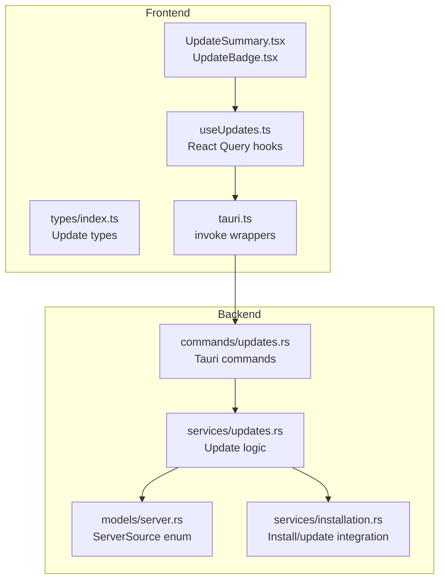
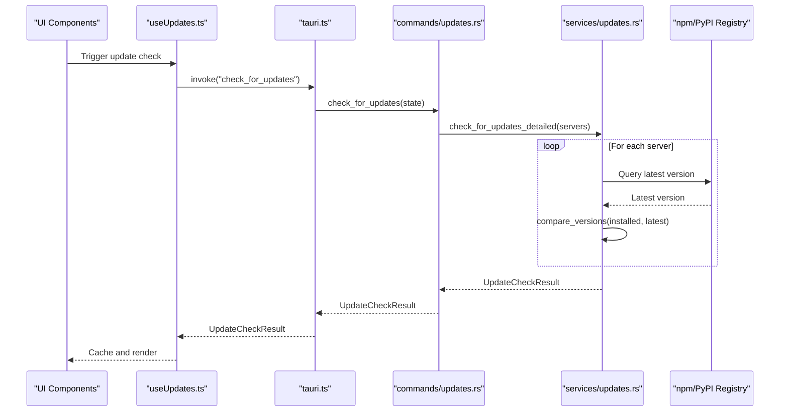
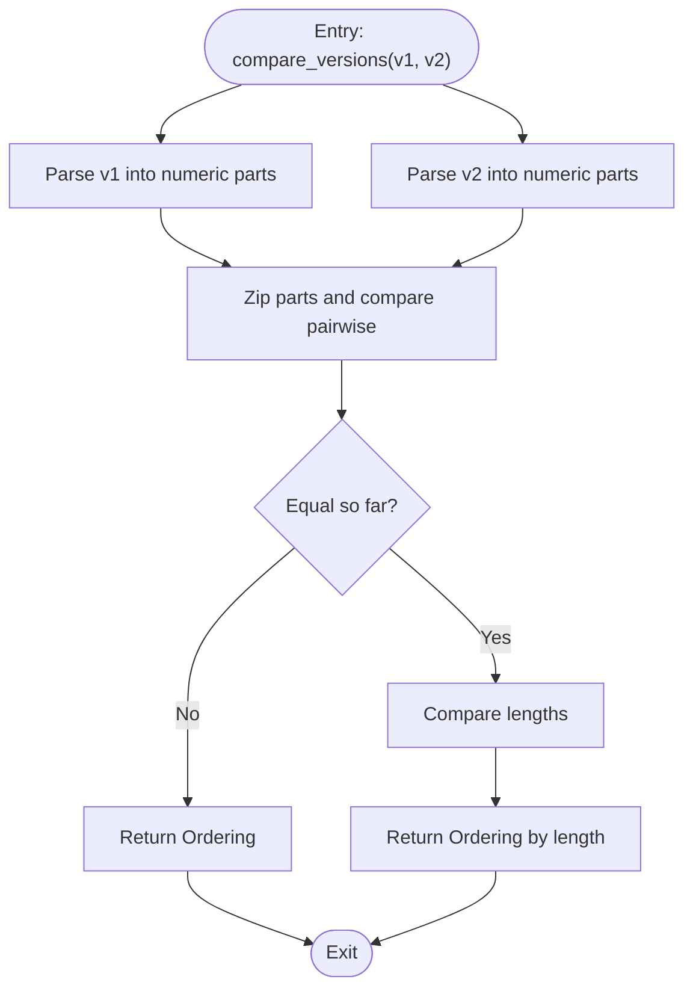
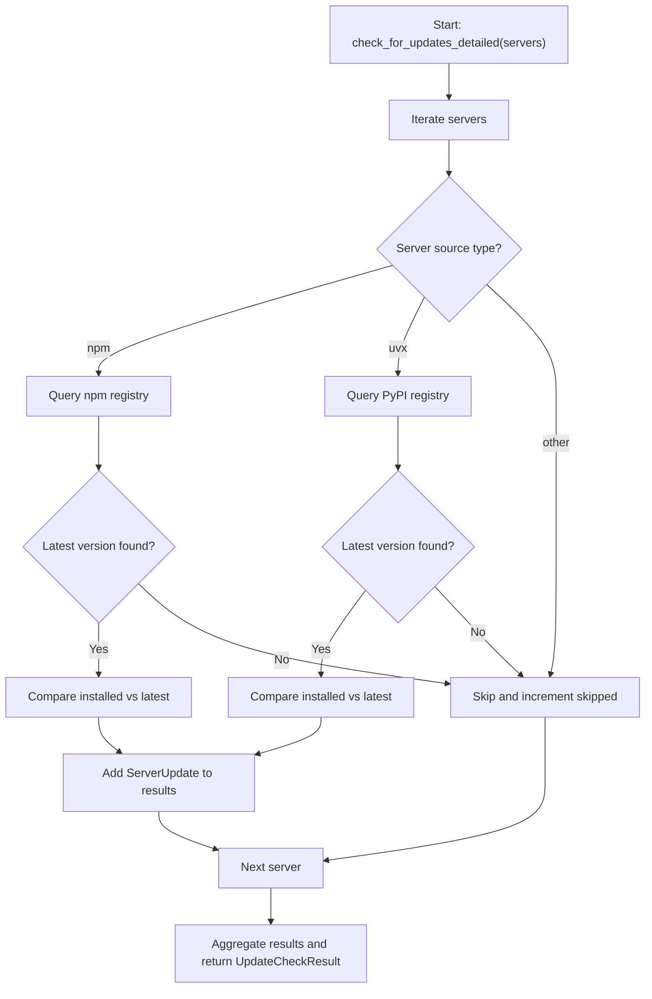
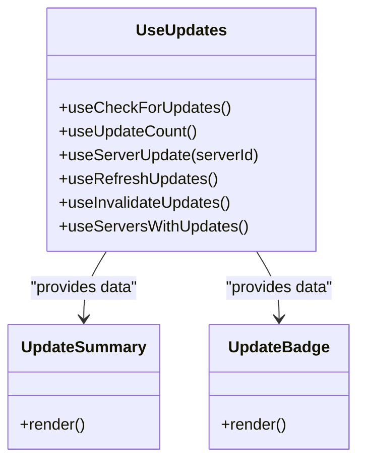
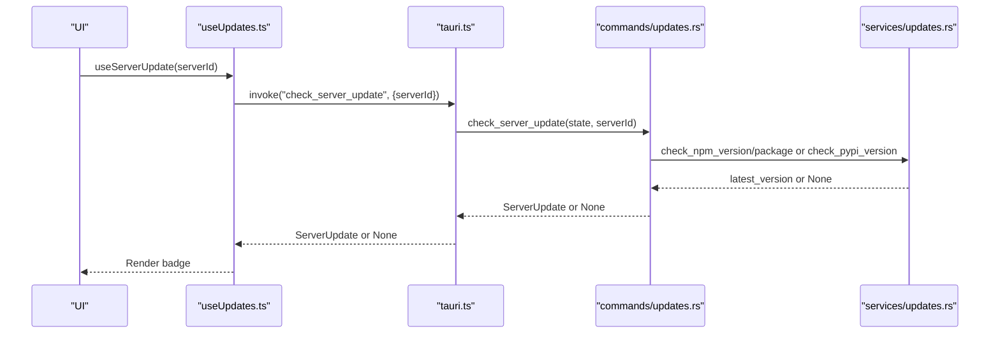
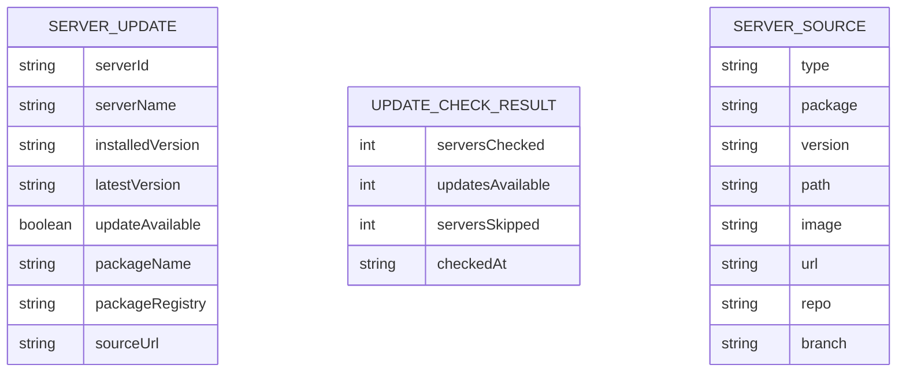
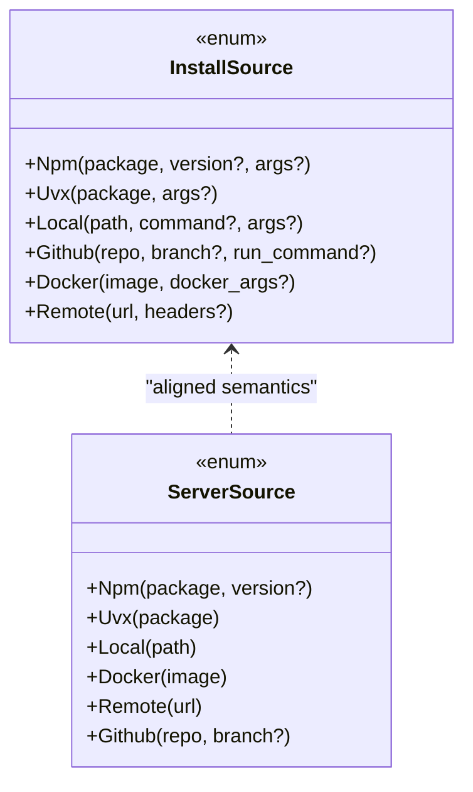
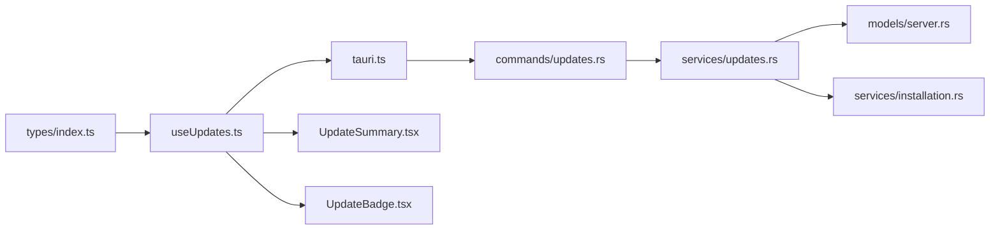

# Updates Service

<cite>
**Referenced Files in This Document**
- [useUpdates.ts](file://src/hooks/useUpdates.ts)
- [updates.rs (commands)](file://src-tauri/src/commands/updates.rs)
- [updates.rs (service)](file://src-tauri/src/services/updates.rs)
- [tauri.ts](file://src/lib/tauri.ts)
- [types/index.ts](file://src/types/index.ts)
- [server.rs (models)](file://src-tauri/src/models/server.rs)
- [UpdateSummary.tsx](file://src/components/dashboard/UpdateSummary.tsx)
- [UpdateBadge.tsx](file://src/components/servers/UpdateBadge.tsx)
- [installation.rs (service)](file://src-tauri/src/services/installation.rs)
- [notificationStore.ts](file://src/stores/notificationStore.ts)
- [notifications.ts](file://src/lib/notifications.ts)
</cite>

## Table of Contents

1. [Introduction](#introduction)
2. [Project Structure](#project-structure)
3. [Core Components](#core-components)
4. [Architecture Overview](#architecture-overview)
5. [Detailed Component Analysis](#detailed-component-analysis)
6. [Dependency Analysis](#dependency-analysis)
7. [Performance Considerations](#performance-considerations)
8. [Troubleshooting Guide](#troubleshooting-guide)
9. [Conclusion](#conclusion)
10. [Appendices](#appendices)

## Introduction

This document provides a comprehensive guide to the Updates service in the project. It explains how the service detects available updates for installed MCP servers, compares versions across different registries, and integrates with the installation service to apply updates. It also covers the frontend hooks and UI components that surface update information, error handling, and performance considerations for background checks and user experience.

## Project Structure

The Updates service spans both the frontend and backend:

- Frontend:
  - React Query hooks for update checks and counts
  - UI components to display update status and badges
  - Type definitions for update results and package version checks
- Backend:
  - Tauri commands that orchestrate update checks
  - Rust service functions that query registries and compare versions
  - Model definitions for server sources and update metadata

**Diagram sources**

- [useUpdates.ts](file://src/hooks/useUpdates.ts#L1-L120)
- [updates.rs (commands)](file://src-tauri/src/commands/updates.rs#L1-L243)
- [updates.rs (service)](file://src-tauri/src/services/updates.rs#L1-L318)
- [tauri.ts](file://src/lib/tauri.ts#L285-L335)
- [types/index.ts](file://src/types/index.ts#L326-L385)
- [server.rs (models)](file://src-tauri/src/models/server.rs#L1-L90)
- [installation.rs (service)](file://src-tauri/src/services/installation.rs#L55-L108)

**Section sources**

- [useUpdates.ts](file://src/hooks/useUpdates.ts#L1-L120)
- [updates.rs (commands)](file://src-tauri/src/commands/updates.rs#L1-L243)
- [updates.rs (service)](file://src-tauri/src/services/updates.rs#L1-L318)
- [tauri.ts](file://src/lib/tauri.ts#L285-L335)
- [types/index.ts](file://src/types/index.ts#L326-L385)
- [server.rs (models)](file://src-tauri/src/models/server.rs#L1-L90)
- [installation.rs (service)](file://src-tauri/src/services/installation.rs#L55-L108)

## Core Components

- Frontend hooks:
  - Full update check for all servers
  - Single server update check
  - Update count retrieval
  - Manual refresh mutation
  - Filtering to servers with updates
- Backend commands:
  - Full update check command
  - Single server update check command
  - Package version check command
  - Update count command
- Backend service:
  - Version parsing and comparison
  - Registry queries (npm and PyPI)
  - Update result aggregation
- UI components:
  - Dashboard update summary
  - Per-server update badge
  - Update count badge

**Section sources**

- [useUpdates.ts](file://src/hooks/useUpdates.ts#L1-L120)
- [updates.rs (commands)](file://src-tauri/src/commands/updates.rs#L49-L243)
- [updates.rs (service)](file://src-tauri/src/services/updates.rs#L33-L232)
- [UpdateSummary.tsx](file://src/components/dashboard/UpdateSummary.tsx#L1-L104)
- [UpdateBadge.tsx](file://src/components/servers/UpdateBadge.tsx#L1-L184)

## Architecture Overview

The update workflow is a client-server pipeline:

- Frontend invokes Tauri commands via typed wrappers
- Backend loads server configurations and determines update eligibility
- For eligible servers, the backend queries npm or PyPI to fetch latest versions
- Version comparison yields update availability
- Results are returned to the frontend, which caches and renders UI components

**Diagram sources**

- [useUpdates.ts](file://src/hooks/useUpdates.ts#L20-L31)
- [tauri.ts](file://src/lib/tauri.ts#L287-L306)
- [updates.rs (commands)](file://src-tauri/src/commands/updates.rs#L49-L67)
- [updates.rs (service)](file://src-tauri/src/services/updates.rs#L146-L232)

## Detailed Component Analysis

### Version Comparison and Parsing

The service implements a simple but robust version comparison suitable for most package registries:

- Parses version strings, trimming leading prefixes and splitting on separators
- Compares numeric segments left-to-right
- Uses length as a tie-breaker when segments are equal
- Handles prerelease and build metadata by treating them as numeric segments

**Diagram sources**

- [updates.rs (service)](file://src-tauri/src/services/updates.rs#L51-L81)

**Section sources**

- [updates.rs (service)](file://src-tauri/src/services/updates.rs#L51-L81)

### Update Availability Detection

The backend determines whether an update is available by:

- Inspecting server source types
- Querying npm or PyPI for the latest version
- Comparing the installed version with the latest version
- Recording errors and skipping unsupported sources

**Diagram sources**

- [updates.rs (service)](file://src-tauri/src/services/updates.rs#L146-L232)

**Section sources**

- [updates.rs (service)](file://src-tauri/src/services/updates.rs#L146-L232)

### Frontend Hooks and UI Integration

- Full update check:
  - Uses React Query to fetch results and cache them
  - Stale time balances freshness and performance
- Single server check:
  - Fetches per-server update info
- Update count:
  - Lightweight query for dashboard badges
- Manual refresh:
  - Mutation to re-run checks and update cache
- Filtering:
  - Utility hook to return only servers with updates

**Diagram sources**

- [useUpdates.ts](file://src/hooks/useUpdates.ts#L1-L120)
- [UpdateSummary.tsx](file://src/components/dashboard/UpdateSummary.tsx#L1-L104)
- [UpdateBadge.tsx](file://src/components/servers/UpdateBadge.tsx#L1-L184)

**Section sources**

- [useUpdates.ts](file://src/hooks/useUpdates.ts#L1-L120)
- [UpdateSummary.tsx](file://src/components/dashboard/UpdateSummary.tsx#L1-L104)
- [UpdateBadge.tsx](file://src/components/servers/UpdateBadge.tsx#L1-L184)

### Tauri Commands and Typed Wrappers

- Full update check:
  - Loads servers from configuration
  - Delegates to service function
- Single server update:
  - Validates server ID
  - Queries registry based on source type
- Package version check:
  - Supports npm and pypi
  - Returns update availability for a given package
- Update count:
  - Runs a lightweight check and returns the number of updates

**Diagram sources**

- [updates.rs (commands)](file://src-tauri/src/commands/updates.rs#L69-L140)
- [tauri.ts](file://src/lib/tauri.ts#L302-L306)
- [updates.rs (service)](file://src-tauri/src/services/updates.rs#L83-L144)

**Section sources**

- [updates.rs (commands)](file://src-tauri/src/commands/updates.rs#L49-L243)
- [tauri.ts](file://src/lib/tauri.ts#L287-L335)

### Data Models and Types

- ServerUpdate and UpdateCheckResult define the shape of update metadata
- ServerSource enumerates supported installation sources
- Frontend types mirror backend structures for type safety

**Diagram sources**

- [updates.rs (service)](file://src-tauri/src/services/updates.rs#L11-L50)
- [server.rs (models)](file://src-tauri/src/models/server.rs#L1-L90)
- [types/index.ts](file://src/types/index.ts#L326-L385)

**Section sources**

- [updates.rs (service)](file://src-tauri/src/services/updates.rs#L11-L50)
- [server.rs (models)](file://src-tauri/src/models/server.rs#L1-L90)
- [types/index.ts](file://src/types/index.ts#L326-L385)

### Integration with Installation Service

- The installation service defines InstallSource variants that align with server sources
- While the update service focuses on detecting updates, the installation service handles applying updates by installing/updating servers
- Both services share the same source model to ensure consistency

**Diagram sources**

- [installation.rs (service)](file://src-tauri/src/services/installation.rs#L55-L108)
- [server.rs (models)](file://src-tauri/src/models/server.rs#L1-L90)

**Section sources**

- [installation.rs (service)](file://src-tauri/src/services/installation.rs#L55-L108)
- [server.rs (models)](file://src-tauri/src/models/server.rs#L1-L90)

## Dependency Analysis

- Frontend depends on typed wrappers in tauri.ts to call backend commands
- Backend commands depend on service functions for version comparison and registry queries
- Service functions depend on models for server source types
- UI components depend on hooks for reactive data fetching

**Diagram sources**

- [types/index.ts](file://src/types/index.ts#L326-L385)
- [useUpdates.ts](file://src/hooks/useUpdates.ts#L1-L120)
- [tauri.ts](file://src/lib/tauri.ts#L285-L335)
- [updates.rs (commands)](file://src-tauri/src/commands/updates.rs#L1-L243)
- [updates.rs (service)](file://src-tauri/src/services/updates.rs#L1-L318)
- [server.rs (models)](file://src-tauri/src/models/server.rs#L1-L90)
- [UpdateSummary.tsx](file://src/components/dashboard/UpdateSummary.tsx#L1-L104)
- [UpdateBadge.tsx](file://src/components/servers/UpdateBadge.tsx#L1-L184)
- [installation.rs (service)](file://src-tauri/src/services/installation.rs#L55-L108)

**Section sources**

- [useUpdates.ts](file://src/hooks/useUpdates.ts#L1-L120)
- [tauri.ts](file://src/lib/tauri.ts#L285-L335)
- [updates.rs (commands)](file://src-tauri/src/commands/updates.rs#L1-L243)
- [updates.rs (service)](file://src-tauri/src/services/updates.rs#L1-L318)
- [server.rs (models)](file://src-tauri/src/models/server.rs#L1-L90)
- [UpdateSummary.tsx](file://src/components/dashboard/UpdateSummary.tsx#L1-L104)
- [UpdateBadge.tsx](file://src/components/servers/UpdateBadge.tsx#L1-L184)
- [installation.rs (service)](file://src-tauri/src/services/installation.rs#L55-L108)

## Performance Considerations

- Network cost:
  - Each eligible server triggers a registry query; batch operations can be expensive
  - Consider limiting concurrent requests or staggering checks
- Caching:
  - React Query caches results with a 5-minute stale time to reduce repeated network calls
  - Use invalidation after install/uninstall to keep data fresh
- UI responsiveness:
  - Use separate hooks for counts and full results to avoid heavy rendering
  - Debounce manual refresh actions to prevent rapid repeated checks
- Background checks:
  - The current implementation relies on manual triggers; future enhancements could add periodic checks with user-configurable intervals

[No sources needed since this section provides general guidance]

## Troubleshooting Guide

Common issues and resolutions:

- False positives:
  - Version parsing treats prerelease/build identifiers as numeric segments; ensure your registry versions follow predictable patterns
  - Verify installed versions are present in server records before comparison
- Network failures:
  - Registry queries may fail due to timeouts or rate limits; handle gracefully and surface user-friendly messages
  - Consider retry logic with exponential backoff for transient errors
- Unsupported sources:
  - Local, Docker, remote, and GitHub sources are skipped; this is expected behavior
  - Users should rely on external tools for updates in these cases
- Error handling:
  - Commands return structured errors; surface actionable messages to users
  - Use notifications to inform users of failures and suggest next steps

**Section sources**

- [updates.rs (service)](file://src-tauri/src/services/updates.rs#L146-L232)
- [updates.rs (commands)](file://src-tauri/src/commands/updates.rs#L1-L48)
- [notificationStore.ts](file://src/stores/notificationStore.ts#L1-L95)
- [notifications.ts](file://src/lib/notifications.ts#L1-L48)

## Conclusion

The Updates service provides a reliable mechanism to detect available updates for servers installed via npm or PyPI. Its design separates frontend UX from backend logic, enabling efficient caching and responsive UI. Integration with the installation service ensures a smooth path from discovery to application of updates. With careful attention to version parsing, network resilience, and user experience, the service delivers a robust update workflow.

[No sources needed since this section summarizes without analyzing specific files]

## Appendices

### API Surface and Method Signatures

- Full update check:
  - Frontend: [checkForUpdates](file://src/lib/tauri.ts#L293-L295)
  - Backend: [check_for_updates](file://src-tauri/src/commands/updates.rs#L49-L67)
- Single server update:
  - Frontend: [checkServerUpdate](file://src/lib/tauri.ts#L302-L306)
  - Backend: [check_server_update](file://src-tauri/src/commands/updates.rs#L69-L140)
- Package version check:
  - Frontend: [checkPackageVersion](file://src/lib/tauri.ts#L317-L325)
  - Backend: [check_package_version](file://src-tauri/src/commands/updates.rs#L142-L226)
- Update count:
  - Frontend: [getUpdateCount](file://src/lib/tauri.ts#L332-L334)
  - Backend: [get_update_count](file://src-tauri/src/commands/updates.rs#L228-L243)

**Section sources**

- [tauri.ts](file://src/lib/tauri.ts#L287-L335)
- [updates.rs (commands)](file://src-tauri/src/commands/updates.rs#L49-L243)
