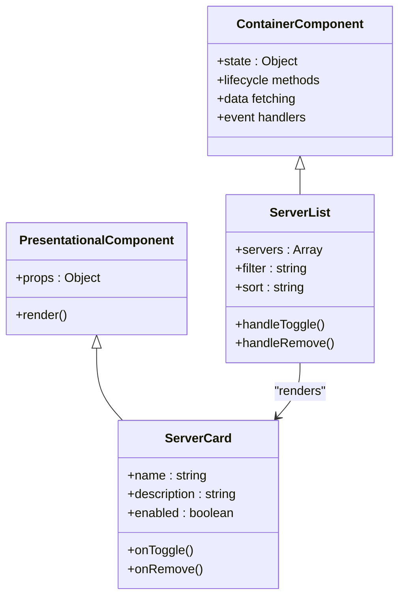
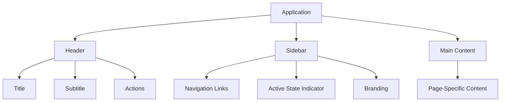
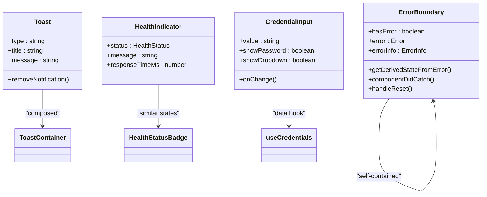
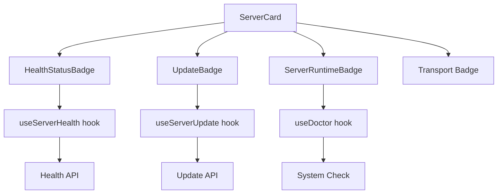

# Component Structure

<cite>
**Referenced Files in This Document**   
- [Header.tsx](file://src/components/layout/Header.tsx)
- [Sidebar.tsx](file://src/components/layout/Sidebar.tsx)
- [ErrorBoundary.tsx](file://src/components/common/ErrorBoundary.tsx)
- [Toast.tsx](file://src/components/common/Toast.tsx)
- [CredentialInput.tsx](file://src/components/common/CredentialInput.tsx)
- [HealthIndicator.tsx](file://src/components/common/HealthIndicator.tsx)
- [ServerCard.tsx](file://src/components/servers/ServerCard.tsx)
- [HealthStatusBadge.tsx](file://src/components/servers/HealthStatusBadge.tsx)
- [UpdateBadge.tsx](file://src/components/servers/UpdateBadge.tsx)
- [ServerRuntimeBadge.tsx](file://src/components/servers/ServerRuntimeBadge.tsx)
- [MarketplaceCard.tsx](file://src/components/marketplace/MarketplaceCard.tsx)
- [SummaryCard.tsx](file://src/components/dashboard/SummaryCard.tsx)
- [ClientCard.tsx](file://src/components/clients/ClientCard.tsx)
- [CredentialManager.tsx](file://src/components/settings/CredentialManager.tsx)
</cite>

## Table of Contents

1. [Introduction](#introduction)
2. [Domain-Based Component Organization](#domain-based-component-organization)
3. [Presentational vs Container Components](#presentational-vs-container-components)
4. [Layout Components](#layout-components)
5. [Reusable Common Components](#reusable-common-components)
6. [Component Composition Patterns](#component-composition-patterns)
7. [Styling and Responsive Design](#styling-and-responsive-design)
8. [Accessibility and Keyboard Navigation](#accessibility-and-keyboard-navigation)

## Introduction

The MCP Nexus frontend component structure follows a domain-based organization pattern, grouping components by functional areas such as servers, clients, marketplace, dashboard, settings, and common utilities. This documentation provides a comprehensive overview of the component architecture, highlighting the distinction between presentational and container components, layout structures, reusable common components, and key design patterns. The component library leverages React with TypeScript and uses Tailwind CSS for styling, ensuring consistency, reusability, and maintainability across the application.

## Domain-Based Component Organization

The component structure is organized into domain-specific directories that correspond to major application features:

- **servers/**: Components related to server management, including ServerCard, HealthStatusBadge, UpdateBadge, and ServerRuntimeBadge
- **clients/**: Components for client management, including ClientCard and ManualConfigModal
- **marketplace/**: Components for browsing and selecting servers from the marketplace, including MarketplaceCard and FilterPanel
- **dashboard/**: Components for the dashboard view, including summary cards and activity indicators
- **settings/**: Components for application settings and configuration
- **common/**: Reusable components used across multiple domains
- **layout/**: Structural components that provide consistent application layout

This domain-based organization improves code discoverability and maintainability by grouping related functionality together. Each domain directory contains components specific to that feature area, making it easier for developers to locate and modify functionality.

**Section sources**

- [ServerCard.tsx](file://src/components/servers/ServerCard.tsx)
- [ClientCard.tsx](file://src/components/clients/ClientCard.tsx)
- [MarketplaceCard.tsx](file://src/components/marketplace/MarketplaceCard.tsx)
- [SummaryCard.tsx](file://src/components/dashboard/SummaryCard.tsx)

## Presentational vs Container Components

The component architecture distinguishes between presentational components (which focus on how things look) and container components (which manage state and behavior).

### Presentational Components

Presentational components are primarily concerned with rendering UI elements and are typically stateless. They receive data and callbacks through props and are focused on visual presentation. Examples include:

- **Badges**: HealthStatusBadge, UpdateBadge, and ServerRuntimeBadge provide visual indicators of server status, update availability, and runtime requirements
- **Cards**: ServerCard, ClientCard, and MarketplaceCard display information in a consistent card format with actions and status indicators
- **Indicators**: HealthIndicator provides a standardized way to display health status across the application

These components are designed to be reusable and composable, with clear props interfaces that define their behavior and appearance.

### Container Components

Container components manage state, data fetching, and business logic. They often wrap presentational components and provide them with data and callbacks. Examples include:

- **Dashboard components**: ServerSummary and ClientSummary fetch data using hooks and pass it to SummaryCard for display
- **Settings components**: CredentialManager manages credential state and interactions, coordinating between the UI and backend services
- **List components**: ServerList and ClientList manage collections of items, handling filtering, sorting, and selection state

This separation of concerns allows for greater component reusability and makes testing easier, as presentational components can be tested in isolation with mock data.

**Diagram sources **

- [ServerCard.tsx](file://src/components/servers/ServerCard.tsx)
- [ClientCard.tsx](file://src/components/clients/ClientCard.tsx)

**Section sources**

- [ServerCard.tsx](file://src/components/servers/ServerCard.tsx)
- [ClientCard.tsx](file://src/components/clients/ClientCard.tsx)
- [CredentialManager.tsx](file://src/components/settings/CredentialManager.tsx)

## Layout Components

Layout components provide the consistent structural framework for the application, ensuring a cohesive user experience across different views.

### Header Component

The Header component displays the current page title and subtitle, along with contextual actions. It accepts props for:

- **title**: Main heading text
- **subtitle**: Optional secondary text
- **actions**: React nodes to display as action buttons or controls

The header uses a responsive layout with flexbox, ensuring proper alignment and spacing across different screen sizes.

### Sidebar Component

The Sidebar component provides navigation between major application sections. Key features include:

- **Navigation items**: Links to Dashboard, Marketplace, Servers, Clients, and Settings
- **Visual indicators**: Active state highlighting for the current page
- **Application branding**: Displays the MCP Nexus logo and version information
- **Responsive design**: Fixed width layout that collapses gracefully on smaller screens

The sidebar uses react-router-dom's NavLink component for navigation, with custom styling to indicate the active route. It follows accessibility best practices with proper semantic HTML and keyboard navigation support.

**Diagram sources **

- [Header.tsx](file://src/components/layout/Header.tsx)
- [Sidebar.tsx](file://src/components/layout/Sidebar.tsx)

**Section sources**

- [Header.tsx](file://src/components/layout/Header.tsx)
- [Sidebar.tsx](file://src/components/layout/Sidebar.tsx)

## Reusable Common Components

The common directory contains utility components that are used across multiple domains in the application.

### ErrorBoundary

The ErrorBoundary component provides a robust error handling mechanism for React components. It:

- Catches JavaScript errors in child components
- Displays a user-friendly error message with recovery options
- Provides error details for debugging
- Allows users to try again or navigate to a safe location

The component uses React's error boundary lifecycle methods to catch errors and maintain application stability.

### Toast

The Toast component provides non-intrusive notifications for user feedback. Features include:

- Multiple notification types (success, error, warning, info)
- Automatic dismissal
- Manual dismissal option
- Visual distinction by type using color and icons
- Stackable notifications that appear in sequence

The ToastContainer manages the notification queue and renders individual ToastItem components.

### HealthIndicator

The HealthIndicator component displays server health status with visual feedback. It supports multiple states:

- Healthy: Green indicator with checkmark
- Unhealthy: Red indicator with warning symbol
- Running: Blue indicator with play symbol
- Stopped: Gray indicator with square symbol
- Unknown: Gray indicator with question mark

The component includes response time information when available and provides tooltips with detailed messages.

### CredentialInput

The CredentialInput component provides a secure way to handle sensitive values. Key features:

- Password masking with toggle visibility
- Integration with system keychain for secure storage
- Dropdown selection of stored credentials
- Visual indication of keychain references
- Clear button for resetting values

The component manages its own state for visibility toggling and dropdown interaction while accepting the current value and change handler as props.

**Diagram sources **

- [ErrorBoundary.tsx](file://src/components/common/ErrorBoundary.tsx)
- [Toast.tsx](file://src/components/common/Toast.tsx)
- [HealthIndicator.tsx](file://src/components/common/HealthIndicator.tsx)
- [CredentialInput.tsx](file://src/components/common/CredentialInput.tsx)

**Section sources**

- [ErrorBoundary.tsx](file://src/components/common/ErrorBoundary.tsx)
- [Toast.tsx](file://src/components/common/Toast.tsx)
- [HealthIndicator.tsx](file://src/components/common/HealthIndicator.tsx)
- [CredentialInput.tsx](file://src/components/common/CredentialInput.tsx)

## Component Composition Patterns

The component library demonstrates several effective composition patterns that promote reusability and maintainability.

### ServerCard Composition

The ServerCard component integrates multiple specialized badges to provide comprehensive server information:

- **HealthStatusBadge**: Shows real-time health status with loading and error states
- **UpdateBadge**: Indicates available updates with version information
- **ServerRuntimeBadge**: Displays required runtime environment (Node.js, Python, Docker)

These badges are composed within the ServerCard to provide a complete overview of server status. The ServerCard passes necessary data (server ID, update information, runtime requirements) to each badge component through props.

### Badge Integration Example

The composition pattern follows these principles:

- **Single Responsibility**: Each badge handles one specific aspect of server status
- **Loose Coupling**: Badges are independent and can be used separately
- **Consistent Styling**: All badges follow the same visual language with colored backgrounds and icons
- **State Management**: Each badge manages its own loading and error states
- **Accessibility**: All interactive elements have appropriate ARIA labels and keyboard support

This approach allows for flexible composition while maintaining consistency across the application. The same badge components can be reused in other contexts, such as lists or tables, without modification.

**Section sources**

- [ServerCard.tsx](file://src/components/servers/ServerCard.tsx)
- [HealthStatusBadge.tsx](file://src/components/servers/HealthStatusBadge.tsx)
- [UpdateBadge.tsx](file://src/components/servers/UpdateBadge.tsx)
- [ServerRuntimeBadge.tsx](file://src/components/servers/ServerRuntimeBadge.tsx)

## Styling and Responsive Design

The component library uses Tailwind CSS for styling, following a utility-first approach that promotes consistency and reduces custom CSS.

### Tailwind CSS Implementation

Key styling principles include:

- **Consistent Spacing**: Using Tailwind's spacing scale (px-4, py-2, etc.) for uniform padding and margins
- **Color Palette**: Leveraging a defined color system with light and dark mode variants
- **Typography**: Standardized font sizes, weights, and line heights
- **Responsive Breakpoints**: Using Tailwind's responsive prefixes (sm:, md:, lg:) for adaptive layouts
- **Dark Mode**: Supporting dark theme through dark: variants and system preference detection

### Responsive Design Considerations

Components are designed to work across different screen sizes:

- **Mobile-First Approach**: Base styles optimized for mobile, with enhancements for larger screens
- **Flexible Layouts**: Using flexbox and grid for adaptable component arrangements
- **Truncation**: Implementing line-clamp and truncate utilities for text overflow
- **Touch Targets**: Ensuring adequate size for interactive elements on touch devices
- **Adaptive Behavior**: Modifying component behavior based on screen size (e.g., sidebar collapse)

The responsive design ensures that the application remains usable and visually consistent across desktop, tablet, and mobile devices.

**Section sources**

- [ServerCard.tsx](file://src/components/servers/ServerCard.tsx)
- [ClientCard.tsx](file://src/components/clients/ClientCard.tsx)
- [MarketplaceCard.tsx](file://src/components/marketplace/MarketplaceCard.tsx)

## Accessibility and Keyboard Navigation

The component library prioritizes accessibility to ensure the application is usable by all users, including those who rely on assistive technologies.

### Accessibility Features

Key accessibility implementations include:

- **Semantic HTML**: Using appropriate HTML elements (buttons, links, headings) for proper document structure
- **ARIA Attributes**: Adding aria-label, aria-describedby, and other attributes to enhance screen reader experience
- **Focus Management**: Ensuring all interactive elements are keyboard accessible with visible focus indicators
- **Color Contrast**: Maintaining sufficient contrast ratios for text and interactive elements
- **Keyboard Navigation**: Supporting tab navigation, arrow key controls, and keyboard shortcuts

### Keyboard Navigation Support

Components implement keyboard navigation patterns:

- **Tab Order**: Logical tab sequence that follows visual flow
- **Escape to Close**: Using Escape key to dismiss modals and dropdowns
- **Arrow Key Navigation**: For menu items and selectable lists
- **Enter/Space Activation**: For buttons and interactive elements
- **Focus Trapping**: In modal dialogs to prevent focus from leaving the modal

These accessibility features ensure that users can navigate and interact with all components using only a keyboard, meeting WCAG 2.1 AA standards.

**Section sources**

- [Sidebar.tsx](file://src/components/layout/Sidebar.tsx)
- [CredentialInput.tsx](file://src/components/common/CredentialInput.tsx)
- [ErrorBoundary.tsx](file://src/components/common/ErrorBoundary.tsx)
- [Toast.tsx](file://src/components/common/Toast.tsx)
