# Data Fetching and Hooks

<cite>
**Referenced Files in This Document**
- [index.ts](file://src/hooks/index.ts)
- [tauri.ts](file://src/lib/tauri.ts)
- [useAutoSync.ts](file://src/hooks/useAutoSync.ts)
- [useDoctor.ts](file://src/hooks/useDoctor.ts)
- [useCredentials.ts](file://src/hooks/useCredentials.ts)
- [useKeyboard.ts](file://src/hooks/useKeyboard.ts)
- [useConfig.ts](file://src/hooks/useConfig.ts)
- [useServers.ts](file://src/hooks/useServers.ts)
- [useClients.ts](file://src/hooks/useClients.ts)
- [types/index.ts](file://src/types/index.ts)
- [Dashboard.tsx](file://src/pages/Dashboard.tsx)
- [Servers.tsx](file://src/pages/Servers.tsx)
- [notifications.ts](file://src/lib/notifications.ts)
</cite>

## Table of Contents

1. [Introduction](#introduction)
2. [Project Structure](#project-structure)
3. [Core Components](#core-components)
4. [Architecture Overview](#architecture-overview)
5. [Detailed Component Analysis](#detailed-component-analysis)
6. [Dependency Analysis](#dependency-analysis)
7. [Performance Considerations](#performance-considerations)
8. [Troubleshooting Guide](#troubleshooting-guide)
9. [Conclusion](#conclusion)
10. [Appendices](#appendices)

## Introduction

This document explains the data fetching architecture and custom hooks system in MCP Nexus. It focuses on how hooks integrate with the Tauri backend via the tauri.ts utility, how React Query is used for caching, invalidation, and error handling, and how each hook manages lifecycle events. It also documents the export strategy via index.ts, error handling patterns, loading states, and practical usage in components.

## Project Structure

The hooks live under src/hooks and expose a unified export surface via index.ts. The tauri.ts utility wraps Tauri commands and exposes typed functions for all backend operations. Types are centralized in src/types to ensure strong typing across the frontend and backend boundary.

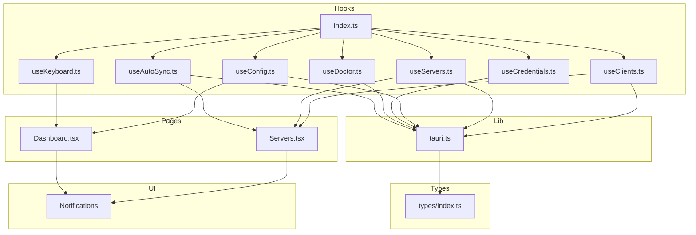

**Diagram sources**

- [index.ts](file://src/hooks/index.ts#L1-L9)
- [tauri.ts](file://src/lib/tauri.ts#L1-L364)
- [useAutoSync.ts](file://src/hooks/useAutoSync.ts#L1-L53)
- [useDoctor.ts](file://src/hooks/useDoctor.ts#L1-L80)
- [useCredentials.ts](file://src/hooks/useCredentials.ts#L1-L63)
- [useKeyboard.ts](file://src/hooks/useKeyboard.ts#L1-L97)
- [useConfig.ts](file://src/hooks/useConfig.ts#L1-L42)
- [useServers.ts](file://src/hooks/useServers.ts#L1-L182)
- [useClients.ts](file://src/hooks/useClients.ts#L1-L138)
- [types/index.ts](file://src/types/index.ts#L1-L426)
- [Dashboard.tsx](file://src/pages/Dashboard.tsx#L1-L125)
- [Servers.tsx](file://src/pages/Servers.tsx#L1-L355)
- [notifications.ts](file://src/lib/notifications.ts#L1-L161)

**Section sources**

- [index.ts](file://src/hooks/index.ts#L1-L9)
- [tauri.ts](file://src/lib/tauri.ts#L1-L364)
- [types/index.ts](file://src/types/index.ts#L1-L426)

## Core Components

- tauri.ts: Thin wrapper around Tauri invoke for all backend commands. Provides typed functions for configuration, servers, clients, marketplace, installation, updates, health checks, and keychain operations. Includes a helper to unwrap keychain responses and raise on failures.
- useAutoSync: Debounced orchestration hook that triggers global sync when preferences allow, invalidates client status caches, and surfaces errors via notifications.
- useDoctor: Local caching and refresh hook for environment diagnostics with module-level cache and optional auto-refresh.
- useCredentials: CRUD for keychain credentials using React Query’s useQuery/useMutation with cache invalidation and secret-safe caching policies.
- useKeyboard: Non-data hook for global keyboard shortcuts and navigation.
- useConfig: Centralized configuration fetch and partial preference updates with optimistic UI and cache updates.
- useServers: Comprehensive server management with list, single item, update, remove, toggle client, install/uninstall, and sync mutations; integrates with useAutoSync.
- useClients: Client discovery, statuses, single-client sync, manual config, enable/disable sync, import from client, and combined view merging detected clients with statuses.

**Section sources**

- [tauri.ts](file://src/lib/tauri.ts#L1-L364)
- [useAutoSync.ts](file://src/hooks/useAutoSync.ts#L1-L53)
- [useDoctor.ts](file://src/hooks/useDoctor.ts#L1-L80)
- [useCredentials.ts](file://src/hooks/useCredentials.ts#L1-L63)
- [useKeyboard.ts](file://src/hooks/useKeyboard.ts#L1-L97)
- [useConfig.ts](file://src/hooks/useConfig.ts#L1-L42)
- [useServers.ts](file://src/hooks/useServers.ts#L1-L182)
- [useClients.ts](file://src/hooks/useClients.ts#L1-L138)

## Architecture Overview

The hooks layer sits between React components and the Tauri backend. Each hook composes React Query primitives to:

- Fetch data with automatic caching and background refetching
- Mutate data with optimistic updates and cache invalidation
- Surface loading and error states
- Integrate with UI notifications and lifecycle controls

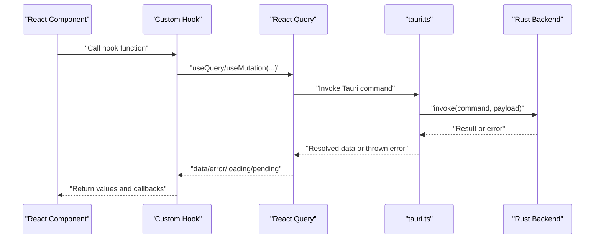

**Diagram sources**

- [useServers.ts](file://src/hooks/useServers.ts#L1-L182)
- [useClients.ts](file://src/hooks/useClients.ts#L1-L138)
- [useCredentials.ts](file://src/hooks/useCredentials.ts#L1-L63)
- [useAutoSync.ts](file://src/hooks/useAutoSync.ts#L1-L53)
- [tauri.ts](file://src/lib/tauri.ts#L1-L364)

## Detailed Component Analysis

### useAutoSync

- Purpose: Debounced global sync triggered when preferences allow. Prevents concurrent runs and clears pending timers on subsequent changes.
- Dependencies: useConfig for preferences, useQueryClient for cache invalidation, tauri.ts syncAllClients, notifications for error reporting.
- Return values: triggerAutoSync callback.
- Integration with React Query: Invalidates client statuses cache after completion to reflect fresh sync results.
- Lifecycle: Uses refs to guard against overlapping runs and a debounce timer to batch rapid changes.

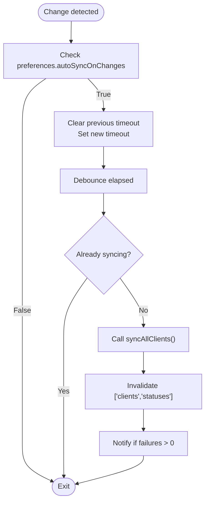

**Diagram sources**

- [useAutoSync.ts](file://src/hooks/useAutoSync.ts#L1-L53)
- [tauri.ts](file://src/lib/tauri.ts#L119-L122)

**Section sources**

- [useAutoSync.ts](file://src/hooks/useAutoSync.ts#L1-L53)

### useDoctor

- Purpose: Run environment doctor checks with module-level caching and optional auto-refresh on mount.
- Dependencies: tauri.ts runDoctor, internal cache and timestamps.
- Return values: report, isLoading, error, refresh, hasChecked.
- Integration with React Query: Not using React Query here; maintains its own cache and refresh logic with a TTL.

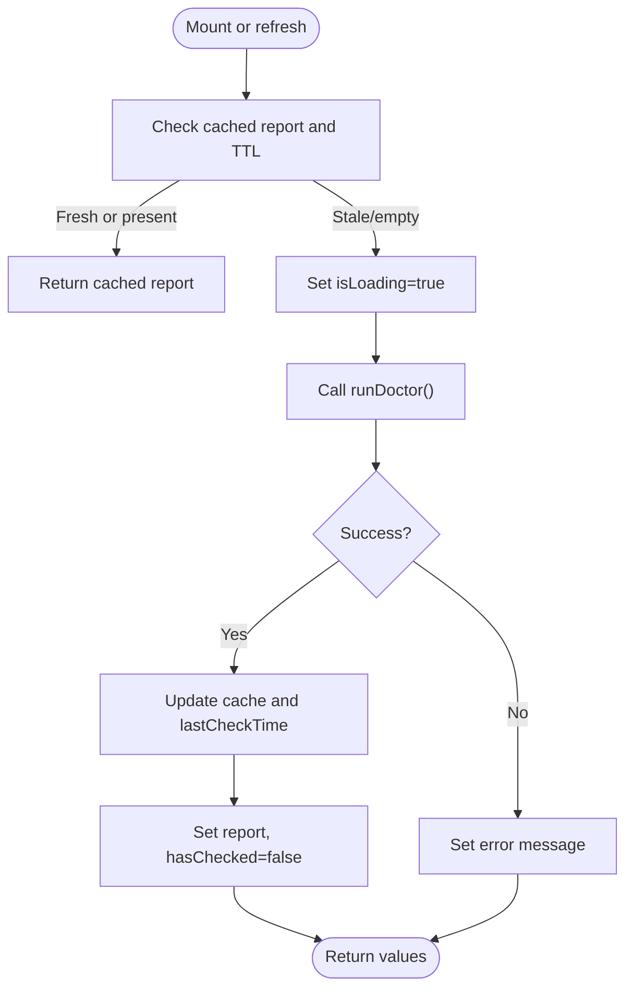

**Diagram sources**

- [useDoctor.ts](file://src/hooks/useDoctor.ts#L1-L80)
- [tauri.ts](file://src/lib/tauri.ts#L146-L148)

**Section sources**

- [useDoctor.ts](file://src/hooks/useDoctor.ts#L1-L80)

### useCredentials

- Purpose: Manage system keychain credentials with React Query.
- Dependencies: tauri.ts listCredentials, saveCredential, deleteCredential, getCredentialValue.
- Return values: credentials list, loading/error states, refetch, mutateAsync for save/delete, isSaving/isDeleting booleans, helper existsInList.
- Integration with React Query: useQuery for listing; useMutation for save/delete; invalidateQueries on success; separate useCredentialValue hook for fetching individual values with short-lived cache and disabled by default.

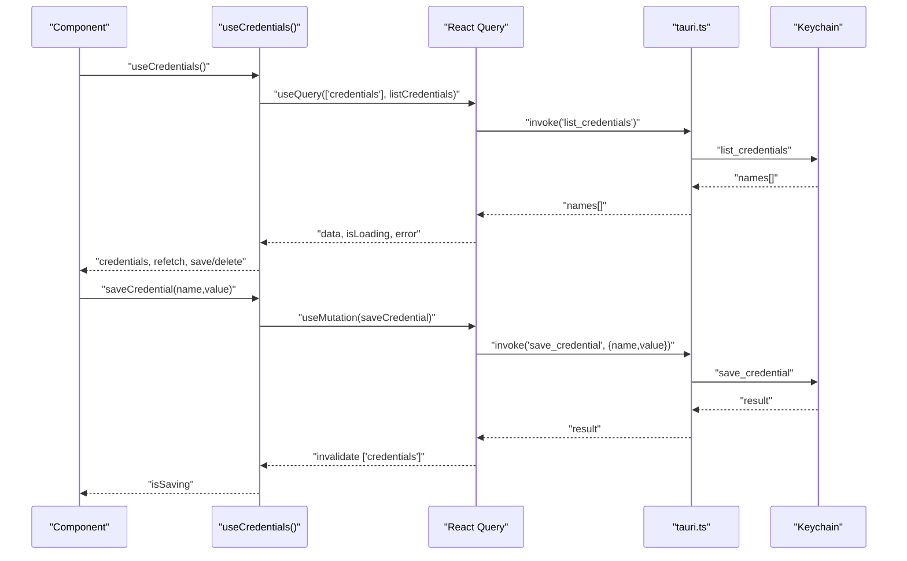

**Diagram sources**

- [useCredentials.ts](file://src/hooks/useCredentials.ts#L1-L63)
- [tauri.ts](file://src/lib/tauri.ts#L162-L187)

**Section sources**

- [useCredentials.ts](file://src/hooks/useCredentials.ts#L1-L63)
- [tauri.ts](file://src/lib/tauri.ts#L162-L187)

### useKeyboard

- Purpose: Register global keyboard shortcuts and provide navigation helpers.
- Dependencies: react-router-dom useNavigate, DOM keyboard events.
- Return values: useKeyboardShortcuts returns nothing; useGlobalKeyboardShortcuts returns the shortcut list and registers listeners.
- Integration with React Query: None; pure UI behavior hook.

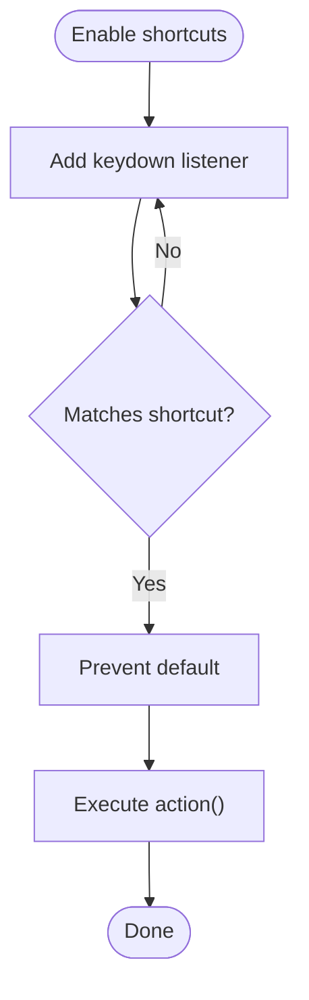

**Diagram sources**

- [useKeyboard.ts](file://src/hooks/useKeyboard.ts#L1-L97)

**Section sources**

- [useKeyboard.ts](file://src/hooks/useKeyboard.ts#L1-L97)

### useConfig

- Purpose: Fetch and update the central configuration.
- Dependencies: tauri.ts getConfig, saveConfig.
- Return values: useConfig returns query result; useUpdatePreferences returns mutation result with optimistic updates and cache writeback.

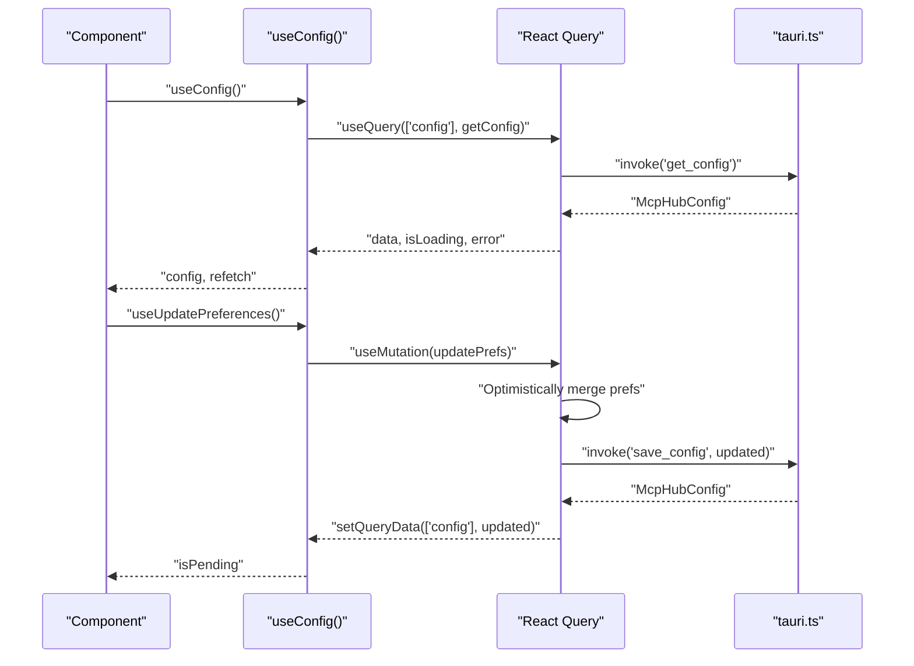

**Diagram sources**

- [useConfig.ts](file://src/hooks/useConfig.ts#L1-L42)
- [tauri.ts](file://src/lib/tauri.ts#L43-L50)

**Section sources**

- [useConfig.ts](file://src/hooks/useConfig.ts#L1-L42)
- [tauri.ts](file://src/lib/tauri.ts#L43-L50)

### useServers

- Purpose: Full server management with list, single item, update, remove, toggle client, install/uninstall, and sync.
- Dependencies: tauri.ts for all server commands; useAutoSync for post-change sync; React Query for caching and invalidation.
- Return values: Combined hook returns servers, loading/error/refetch plus mutation callbacks and flags.

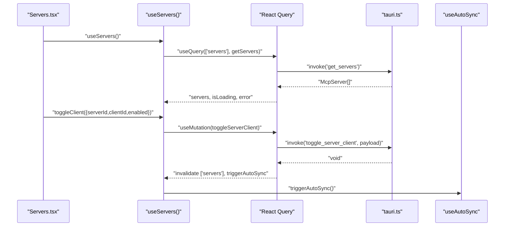

**Diagram sources**

- [useServers.ts](file://src/hooks/useServers.ts#L1-L182)
- [useAutoSync.ts](file://src/hooks/useAutoSync.ts#L1-L53)
- [tauri.ts](file://src/lib/tauri.ts#L77-L84)

**Section sources**

- [useServers.ts](file://src/hooks/useServers.ts#L1-L182)

### useClients

- Purpose: Client discovery, statuses, single-client sync, manual config, enable/disable sync, import from client, and merged view.
- Dependencies: tauri.ts for client commands; useAutoSync for post-import sync.
- Return values: Combined hook merges detected clients with statuses and exposes loading/error/refetch.

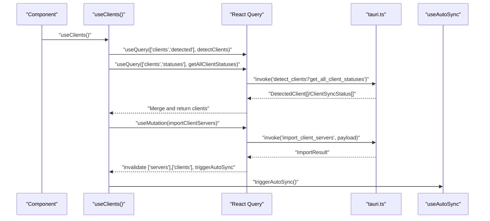

**Diagram sources**

- [useClients.ts](file://src/hooks/useClients.ts#L1-L138)
- [useAutoSync.ts](file://src/hooks/useAutoSync.ts#L1-L53)
- [tauri.ts](file://src/lib/tauri.ts#L88-L103)

**Section sources**

- [useClients.ts](file://src/hooks/useClients.ts#L1-L138)

### Hook Composition and Usage in Components

- Dashboard.tsx: Uses useServerList and useDetectedClients to render summaries and quick actions. Calls initializeConfig directly for first-run setup.
- Servers.tsx: Uses useServers for list and mutations; demonstrates passing onSuccess/onError callbacks to mutateAsync for notifications and UI feedback.

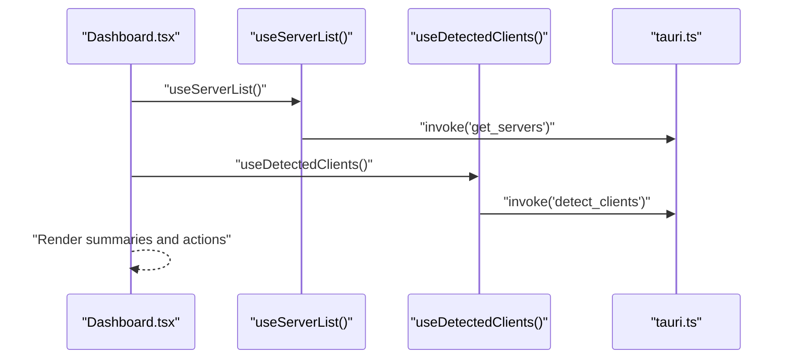

**Diagram sources**

- [Dashboard.tsx](file://src/pages/Dashboard.tsx#L1-L125)
- [useServers.ts](file://src/hooks/useServers.ts#L1-L182)
- [useClients.ts](file://src/hooks/useClients.ts#L1-L138)
- [tauri.ts](file://src/lib/tauri.ts#L53-L91)

**Section sources**

- [Dashboard.tsx](file://src/pages/Dashboard.tsx#L1-L125)
- [Servers.tsx](file://src/pages/Servers.tsx#L1-L355)

## Dependency Analysis

- Export surface: index.ts re-exports all hooks for convenient imports across the app.
- Internal dependencies:
  - useAutoSync depends on useConfig, useQueryClient, tauri.ts syncAllClients, and notifications.
  - useServers and useClients depend on tauri.ts commands and useAutoSync.
  - useCredentials depends on tauri.ts keychain commands and React Query.
  - useDoctor depends on tauri.ts runDoctor and maintains its own cache.
  - useKeyboard is standalone and UI-only.
- Type safety: All hooks rely on types/index.ts for strongly typed payloads and responses.

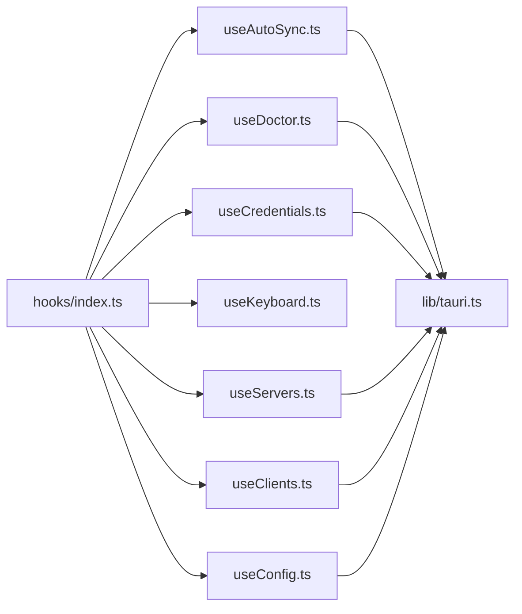

**Diagram sources**

- [index.ts](file://src/hooks/index.ts#L1-L9)
- [tauri.ts](file://src/lib/tauri.ts#L1-L364)
- [useAutoSync.ts](file://src/hooks/useAutoSync.ts#L1-L53)
- [useDoctor.ts](file://src/hooks/useDoctor.ts#L1-L80)
- [useCredentials.ts](file://src/hooks/useCredentials.ts#L1-L63)
- [useKeyboard.ts](file://src/hooks/useKeyboard.ts#L1-L97)
- [useConfig.ts](file://src/hooks/useConfig.ts#L1-L42)
- [useServers.ts](file://src/hooks/useServers.ts#L1-L182)
- [useClients.ts](file://src/hooks/useClients.ts#L1-L138)

**Section sources**

- [index.ts](file://src/hooks/index.ts#L1-L9)

## Performance Considerations

- Caching and staleness:
  - useServers.ts sets a short staleTime for servers and statuses to balance freshness and performance.
  - useClients.ts uses short staleTimes for frequent operations like sync statuses.
  - useCredentials.ts sets staleTime to 0 for single credential values and a small GC time to limit secret exposure.
  - useDoctor.ts uses module-level cache with a 5-minute TTL to avoid repeated heavy checks.
- Debouncing:
  - useAutoSync debounces global sync to prevent thrashing on rapid config changes.
- Optimistic updates:
  - useConfig’s useUpdatePreferences optimistically updates preferences and writes back to cache before saving to backend.
- Invalidation:
  - Hooks invalidate targeted query keys to keep views consistent after mutations.

[No sources needed since this section provides general guidance]

## Troubleshooting Guide

- Error handling patterns:
  - useCredentials.ts uses onSuccess to invalidate queries and exposes isSaving/isDeleting flags for UI feedback.
  - useAutoSync.ts catches errors and notifies via notifications; it also reports failures from syncAllClients results.
  - useServers.ts and useClients.ts pass onSuccess/onError callbacks to mutateAsync to drive notifications and UI state.
  - useDoctor.ts sets an error string on failure and returns hasChecked to indicate whether a check occurred.
- Loading states:
  - useServers.ts and useClients.ts expose isLoading and error for graceful empty/error states.
  - useCredentials.ts exposes isLoading and error for list and individual value fetches.
- Notifications:
  - notifications.ts provides standardized helpers for install/uninstall, sync, and credential operations, with safe error message extraction.

**Section sources**

- [useCredentials.ts](file://src/hooks/useCredentials.ts#L1-L63)
- [useAutoSync.ts](file://src/hooks/useAutoSync.ts#L1-L53)
- [useServers.ts](file://src/hooks/useServers.ts#L1-L182)
- [useClients.ts](file://src/hooks/useClients.ts#L1-L138)
- [useDoctor.ts](file://src/hooks/useDoctor.ts#L1-L80)
- [notifications.ts](file://src/lib/notifications.ts#L1-L161)

## Conclusion

MCP Nexus employs a clean, consistent data fetching pattern:

- All backend calls are wrapped in tauri.ts with typed functions.
- React Query powers caching, invalidation, and error handling for most hooks.
- useAutoSync orchestrates global sync with debouncing and cache invalidation.
- useDoctor provides a local caching layer for environment checks.
- useCredentials implements secure secret handling with short-lived caching and keychain wrappers.
- useKeyboard remains UI-only, enabling global shortcuts.
- index.ts centralizes exports for easy consumption across the app.
- Components compose hooks to deliver responsive, resilient UIs with clear loading and error states.

[No sources needed since this section summarizes without analyzing specific files]

## Appendices

### Pattern: Wrapping Tauri Commands with React Query

- useQuery: For reads with caching and staleTime.
- useMutation: For writes with optimistic updates and cache invalidation.
- invalidateQueries: After mutations to keep UI consistent.
- mutateAsync: Expose async mutation calls with onSuccess/onError callbacks for UI feedback.

**Section sources**

- [useServers.ts](file://src/hooks/useServers.ts#L1-L182)
- [useClients.ts](file://src/hooks/useClients.ts#L1-L138)
- [useCredentials.ts](file://src/hooks/useCredentials.ts#L1-L63)
- [useConfig.ts](file://src/hooks/useConfig.ts#L1-L42)

### Example: Hook Composition in a Component

- Servers.tsx composes useServers to render lists and handle install/remove/toggle/sync operations, demonstrating:
  - Using isLoading/error/refetch for UX
  - Passing callbacks to mutateAsync for notifications
  - Conditional rendering based on loading and error states

**Section sources**

- [Servers.tsx](file://src/pages/Servers.tsx#L1-L355)
