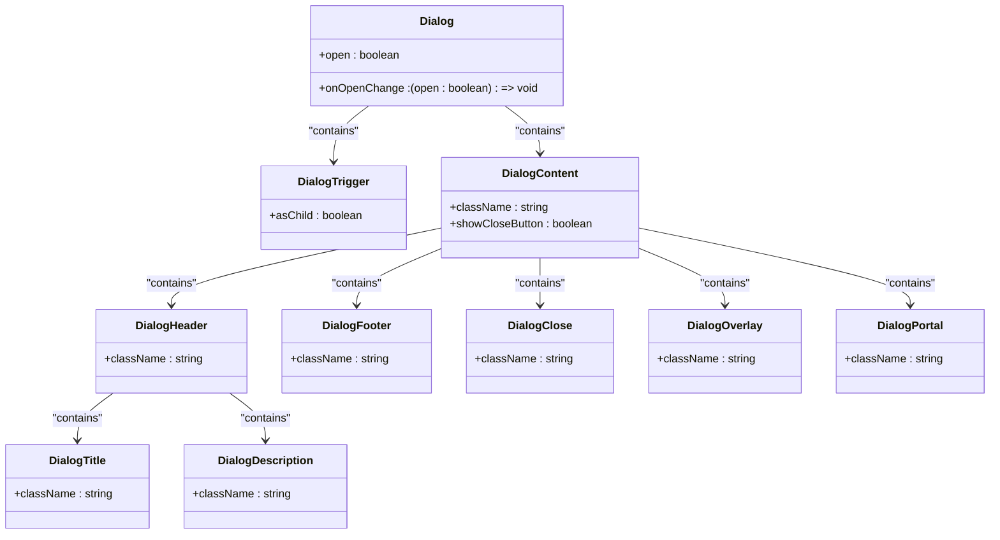
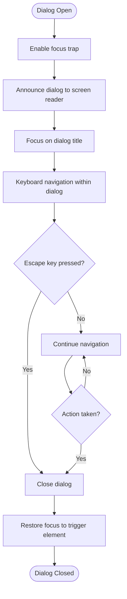
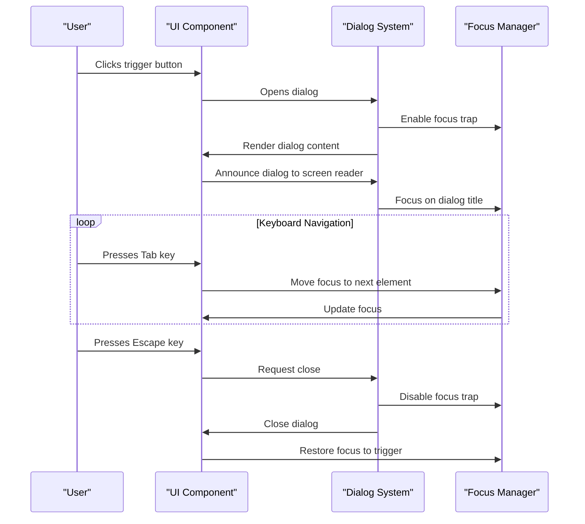
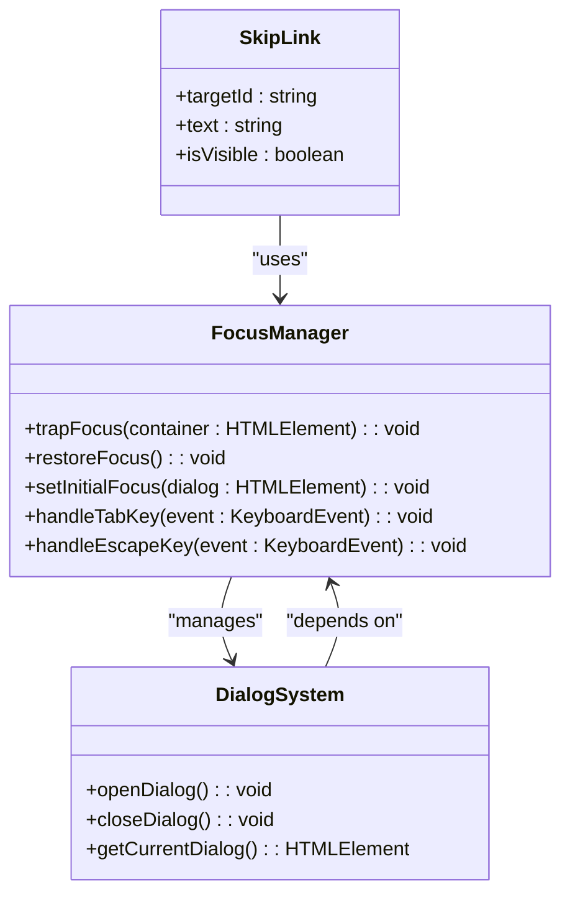
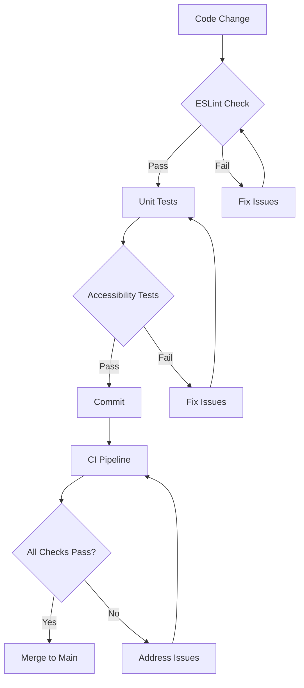

# Dialog Accessibility Standardization

<cite>
**Referenced Files in This Document**   
- [dialog.tsx](file://src/components/ui/dialog.tsx)
- [ServerDetailModal.tsx](file://src/components/marketplace/ServerDetailModal.tsx)
- [ManualConfigModal.tsx](file://src/components/clients/ManualConfigModal.tsx)
- [AddServerModal.tsx](file://src/components/servers/AddServerModal.tsx)
- [ui-patterns.md](file://docs/ui-patterns.md)
- [useKeyboard.ts](file://src/hooks/useKeyboard.ts)
- [COMMIT_PLAN.md](file://COMMIT_PLAN.md)
- [ErrorBoundary.tsx](file://src/components/common/ErrorBoundary.tsx)
- [utils.ts](file://src/lib/utils.ts)
</cite>

## Table of Contents

1. [Introduction](#introduction)
2. [Core Dialog Components](#core-dialog-components)
3. [Accessibility Implementation](#accessibility-implementation)
4. [Dialog Patterns and Usage](#dialog-patterns-and-usage)
5. [Focus Management](#focus-management)
6. [Testing and Validation](#testing-and-validation)
7. [Best Practices](#best-practices)
8. [Conclusion](#conclusion)

## Introduction

The MCP Nexus application implements a comprehensive dialog accessibility standardization system to ensure all modal components are accessible, consistent, and user-friendly. This documentation details the implementation of dialog components, accessibility features, and standardized patterns used throughout the application.

The dialog system is built on shadcn/ui Dialog primitives, which provide a solid foundation for accessible modal dialogs. The implementation follows WCAG 2.1 AA guidelines and includes features such as automatic focus trapping, keyboard navigation, screen reader support, and proper ARIA attributes.

**Section sources**

- [ui-patterns.md](file://docs/ui-patterns.md#L1-L274)

## Core Dialog Components

The dialog system in MCP Nexus consists of a base dialog component and several specialized modal implementations. The core dialog component is implemented in `dialog.tsx` and provides the foundation for all modal dialogs in the application.

The base dialog component exports several sub-components that follow the shadcn/ui pattern:

- `Dialog`: The root component that manages the open/closed state
- `DialogTrigger`: The element that opens the dialog
- `DialogContent`: The main dialog container
- `DialogHeader`: Header section with title and description
- `DialogTitle`: The dialog title with proper ARIA labeling
- `DialogDescription`: Descriptive text for screen readers
- `DialogFooter`: Footer section for action buttons
- `DialogClose`: Close button with proper accessibility attributes
- `DialogOverlay`: Semi-transparent overlay that prevents interaction with background content
- `DialogPortal`: Ensures the dialog is rendered in the correct DOM position

The `DialogContent` component includes several accessibility features:

- Proper ARIA attributes (aria-modal, aria-labelledby, aria-describedby)
- Automatic focus trap that prevents tab navigation outside the modal
- Escape key handling to close the dialog
- Focus restoration to the trigger element when the dialog is closed
- Proper z-index management through portal rendering

Specialized modal components that use this base implementation include:

- `ServerDetailModal`: Displays detailed information about a server from the marketplace
- `ManualConfigModal`: Provides manual configuration instructions for clients that require it
- `AddServerModal`: Allows users to manually add a new server from various sources

**Diagram sources**

- [dialog.tsx](file://src/components/ui/dialog.tsx#L7-L141)

**Section sources**

- [dialog.tsx](file://src/components/ui/dialog.tsx#L7-L141)
- [ServerDetailModal.tsx](file://src/components/marketplace/ServerDetailModal.tsx#L6-L12)
- [ManualConfigModal.tsx](file://src/components/clients/ManualConfigModal.tsx#L6-L12)
- [AddServerModal.tsx](file://src/components/servers/AddServerModal.tsx#L5-L11)

## Accessibility Implementation

The dialog system in MCP Nexus implements comprehensive accessibility features to ensure all users can effectively interact with modal dialogs. These features follow WCAG 2.1 AA guidelines and include proper ARIA attributes, keyboard navigation, screen reader support, and focus management.

### ARIA Attributes and Semantic HTML

All dialog components use proper ARIA attributes to provide context for assistive technologies:

- `aria-modal="true"` on the dialog content to indicate it's a modal dialog
- `aria-labelledby` that references the dialog title element
- `aria-describedby` that references the dialog description element
- Proper heading hierarchy with `DialogTitle` as an h2 element
- Semantic HTML elements for proper document structure

The close button includes a visually hidden "Close" text using the `sr-only` class, which is read by screen readers but hidden from visual users. This ensures screen reader users understand the purpose of the close button.

### Keyboard Navigation

The dialog system supports full keyboard navigation:

- Tab key cycles through focusable elements within the dialog
- Shift+Tab cycles backward through focusable elements
- Escape key closes the dialog
- Enter key activates the currently focused button or link
- Arrow keys can be used to navigate radio buttons and other controls

The `useKeyboard` hook provides additional keyboard shortcut support throughout the application, including global shortcuts like Cmd+K for search and Cmd+number for navigation between main sections.

### Screen Reader Support

The dialog components are designed to work well with screen readers:

- Dialog titles are announced when the dialog opens
- Dialog descriptions provide additional context for screen reader users
- Form fields are properly labeled and described
- Loading states are announced with appropriate ARIA attributes
- Error messages are announced and focused when they appear

Several components include `aria-label` attributes for icon-only buttons, ensuring screen reader users understand their purpose. For example, the loading spinner includes `aria-label="Loading"` to indicate its function.

**Diagram sources**

- [dialog.tsx](file://src/components/ui/dialog.tsx#L31-L78)
- [ui-patterns.md](file://docs/ui-patterns.md#L48-L54)
- [COMMIT_PLAN.md](file://COMMIT_PLAN.md#L346-L361)

**Section sources**

- [dialog.tsx](file://src/components/ui/dialog.tsx#L31-L78)
- [ui-patterns.md](file://docs/ui-patterns.md#L110-L150)
- [COMMIT_PLAN.md](file://COMMIT_PLAN.md#L346-L361)
- [ManualConfigModal.tsx](file://src/components/clients/ManualConfigModal.tsx#L139)

## Dialog Patterns and Usage

The application implements consistent patterns for using dialog components across different use cases. These patterns ensure a uniform user experience and maintain accessibility standards throughout the application.

### Server Detail Modal

The `ServerDetailModal` component displays detailed information about a server from the marketplace. It uses the standard dialog structure with a header containing the server name and transport type badges, a scrollable content area with server details, and a footer with action buttons.

Key accessibility features in this modal:

- Proper heading hierarchy with the server name as the dialog title
- Descriptive labels for all form elements
- Keyboard navigation through all interactive elements
- Loading state with appropriate ARIA attributes
- Clear visual feedback for selected clients

The modal supports both stdio and SSE transport types, with appropriate UI elements to help users understand the differences between these connection methods.

### Manual Configuration Modal

The `ManualConfigModal` component provides instructions for manually configuring clients that don't support automatic configuration. This modal includes:

- Clear instructions with numbered steps
- A copy button with visual feedback when clicked
- Links to documentation for additional help
- A loading state when configuration is being generated

Accessibility features include:

- Descriptive title and description for screen readers
- Proper labeling of the copy button
- Visual and text feedback when the configuration is copied
- Clear error messages if configuration generation fails

### Add Server Modal

The `AddServerModal` component allows users to manually add a new server from various sources. This complex form includes:

- Multiple source type options (local, remote, npm, uvx, docker, github)
- Dynamic form fields based on the selected source type
- Environment variable management
- Client selection with select all/deselect all functionality

Accessibility features include:

- Clear labels and instructions for all form fields
- Required field indicators
- Proper grouping of related form elements
- Keyboard navigation through all form controls
- Visual feedback for form validation

**Diagram sources**

- [ServerDetailModal.tsx](file://src/components/marketplace/ServerDetailModal.tsx#L193-L563)
- [ManualConfigModal.tsx](file://src/components/clients/ManualConfigModal.tsx#L59-L184)
- [AddServerModal.tsx](file://src/components/servers/AddServerModal.tsx#L266-L699)

**Section sources**

- [ServerDetailModal.tsx](file://src/components/marketplace/ServerDetailModal.tsx#L193-L563)
- [ManualConfigModal.tsx](file://src/components/clients/ManualConfigModal.tsx#L59-L184)
- [AddServerModal.tsx](file://src/components/servers/AddServerModal.tsx#L266-L699)

## Focus Management

The application implements comprehensive focus management to ensure a consistent and accessible user experience. This includes automatic focus trapping within dialogs, focus restoration when dialogs are closed, and proper focus handling for dynamic content.

### Focus Trapping

When a dialog is opened, focus is automatically trapped within the dialog. This prevents keyboard users from accidentally navigating to elements outside the dialog, which could lead to confusion or unintended actions. The focus trap ensures that:

- Tab key cycles through focusable elements within the dialog
- Shift+Tab cycles backward through focusable elements
- Focus cannot escape the dialog until it is closed

### Focus Restoration

When a dialog is closed, focus is automatically restored to the element that opened the dialog. This is important for keyboard users who expect to return to their previous position in the tab order. The focus restoration ensures that:

- Users don't lose their place in the application
- The tab order remains logical and predictable
- Screen reader users are properly oriented after the dialog closes

### Initial Focus

When a dialog opens, focus is automatically set to an appropriate element based on the dialog type:

- Dialogs with a single action: focus on the primary action button
- Dialogs with forms: focus on the first input field
- Informational dialogs: focus on the dialog title

This helps users immediately understand the purpose of the dialog and how to interact with it.

### Skip Links

The application includes skip links that are hidden until focused, allowing keyboard users to quickly navigate to important sections of the page. These skip links improve navigation efficiency for keyboard users and screen reader users.

**Diagram sources**

- [COMMIT_PLAN.md](file://COMMIT_PLAN.md#L537-L552)
- [ui-patterns.md](file://docs/ui-patterns.md#L121-L124)

**Section sources**

- [COMMIT_PLAN.md](file://COMMIT_PLAN.md#L537-L552)
- [ui-patterns.md](file://docs/ui-patterns.md#L121-L124)

## Testing and Validation

The dialog accessibility implementation is thoroughly tested to ensure it meets accessibility standards and provides a consistent user experience.

### Automated Testing

The application includes automated tests for dialog accessibility features:

- Jest tests with @testing-library/react for component rendering
- axe accessibility testing with jest-axe to identify accessibility issues
- User event simulation with @testing-library/user-event to test keyboard interactions

The tests verify that:

- Dialogs have proper ARIA attributes
- Focus trapping works correctly
- Escape key closes dialogs
- Focus is restored to the trigger element
- Keyboard navigation works as expected
- Screen reader announcements are appropriate

### Manual Testing

In addition to automated tests, the application is manually tested with:

- Screen readers (VoiceOver, NVDA)
- Keyboard-only navigation
- High contrast mode
- Zoomed text

This ensures that the dialogs are usable in real-world scenarios and meet the needs of users with various disabilities.

### Linting and Code Quality

The application uses enhanced ESLint rules to catch accessibility issues during development:

- eslint-plugin-jsx-a11y for JSX accessibility rules
- import ordering and duplicate detection
- Stricter TypeScript rules
- Unused code detection

These rules help prevent accessibility regressions and ensure code quality.

**Diagram sources**

- [COMMIT_PLAN.md](file://COMMIT_PLAN.md#L504-L518)
- [COMMIT_PLAN.md](file://COMMIT_PLAN.md#L346-L361)

**Section sources**

- [COMMIT_PLAN.md](file://COMMIT_PLAN.md#L504-L518)
- [COMMIT_PLAN.md](file://COMMIT_PLAN.md#L346-L361)

## Best Practices

The dialog accessibility implementation follows several best practices to ensure a high-quality user experience:

### Consistent Patterns

All dialogs follow a consistent pattern:

- Header with title and optional description
- Scrollable content area
- Footer with action buttons (Cancel on left, primary action on right)
- Close button in the top-right corner
- Escape key to close
- Focus trapping and restoration

### Clear Visual Hierarchy

Dialogs use a clear visual hierarchy to guide users:

- Title in larger, bold text
- Descriptive text in smaller, lighter text
- Action buttons with clear visual distinction between primary and secondary actions
- Proper spacing between elements
- Visual feedback for interactive elements

### Responsive Design

Dialogs are designed to work well on different screen sizes:

- Maximum width constraints to prevent overly wide dialogs
- Scrollable content areas for long content
- Responsive layouts that adapt to smaller screens
- Proper touch targets for mobile devices

### Performance Considerations

Dialogs are optimized for performance:

- Lazy loading of dialog content when possible
- Efficient rendering with React.memo for expensive components
- Proper cleanup of event listeners and timers
- Minimal re-renders through proper state management

### Error Handling

Dialogs include proper error handling:

- Clear error messages with suggestions for resolution
- Visual indicators for errors
- Proper focus management when errors occur
- Graceful degradation when features are not available

**Section sources**

- [ui-patterns.md](file://docs/ui-patterns.md#L248-L273)

## Conclusion

The dialog accessibility standardization in MCP Nexus provides a robust foundation for accessible modal dialogs throughout the application. By leveraging shadcn/ui Dialog primitives and implementing comprehensive accessibility features, the application ensures that all users can effectively interact with modal dialogs regardless of their abilities or input methods.

The implementation follows WCAG 2.1 AA guidelines and includes features such as proper ARIA attributes, keyboard navigation, screen reader support, and focus management. Automated testing, manual testing, and enhanced linting rules help maintain accessibility standards and prevent regressions.

By following consistent patterns and best practices, the dialog system provides a uniform user experience across different use cases while maintaining high accessibility standards. This approach ensures that MCP Nexus is usable by the widest possible audience, including users with disabilities who rely on assistive technologies.
