# Frontend Architecture

<cite>
**Referenced Files in This Document**   
- [App.tsx](file://src/App.tsx)
- [main.tsx](file://src/main.tsx)
- [appStore.ts](file://src/stores/appStore.ts)
- [notificationStore.ts](file://src/stores/notificationStore.ts)
- [tauri.ts](file://src/lib/tauri.ts)
- [useKeyboard.ts](file://src/hooks/useKeyboard.ts)
- [useClients.ts](file://src/hooks/useClients.ts)
- [useServers.ts](file://src/hooks/useServers.ts)
- [useMarketplace.ts](file://src/hooks/useMarketplace.ts)
- [ErrorBoundary.tsx](file://src/components/common/ErrorBoundary.tsx)
- [Toast.tsx](file://src/components/common/Toast.tsx)
- [Header.tsx](file://src/components/layout/Header.tsx)
- [Sidebar.tsx](file://src/components/layout/Sidebar.tsx)
</cite>

## Table of Contents

1. [Introduction](#introduction)
2. [Project Structure](#project-structure)
3. [Core Components](#core-components)
4. [Architecture Overview](#architecture-overview)
5. [Detailed Component Analysis](#detailed-component-analysis)
6. [Dependency Analysis](#dependency-analysis)
7. [Performance Considerations](#performance-considerations)
8. [Troubleshooting Guide](#troubleshooting-guide)
9. [Conclusion](#conclusion)

## Introduction

The MCP Nexus frontend architecture is a React 19 application built with a domain-driven component structure and modern state management patterns. The application serves as a desktop interface for managing MCP (Model Context Protocol) servers, clients, and marketplace interactions through a Tauri backend. The architecture emphasizes separation of concerns, reusability, and maintainability through a well-defined component hierarchy, state management strategy, and custom hooks system.

## Project Structure

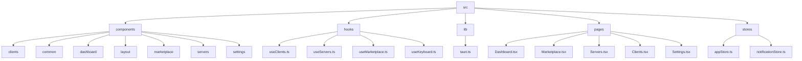

**Diagram sources**

- [src/components](file://src/components)
- [src/hooks](file://src/hooks)
- [src/lib](file://src/lib)
- [src/pages](file://src/pages)
- [src/stores](file://src/stores)

**Section sources**

- [src](file://src)

## Core Components

The MCP Nexus frontend is organized around domain-based component directories (servers, clients, marketplace, etc.) with a clear separation between presentational and container components. The application uses React 19 features and follows modern React patterns for state management and data fetching. The component structure is designed to be scalable and maintainable, with reusable common components and domain-specific components.

**Section sources**

- [App.tsx](file://src/App.tsx)
- [main.tsx](file://src/main.tsx)

## Architecture Overview

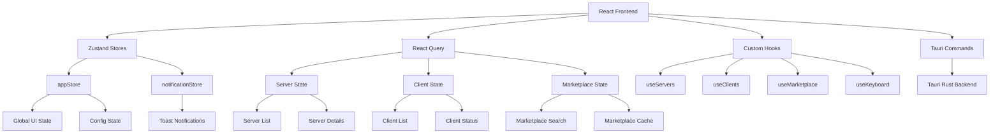

**Diagram sources**

- [appStore.ts](file://src/stores/appStore.ts)
- [notificationStore.ts](file://src/stores/notificationStore.ts)
- [tauri.ts](file://src/lib/tauri.ts)
- [useServers.ts](file://src/hooks/useServers.ts)
- [useClients.ts](file://src/hooks/useClients.ts)
- [useMarketplace.ts](file://src/hooks/useMarketplace.ts)

## Detailed Component Analysis

### Component Hierarchy and Organization

The MCP Nexus frontend follows a domain-driven component organization with clear separation between presentational and container components. Components are organized by domain (servers, clients, marketplace, etc.) with reusable common components shared across the application.

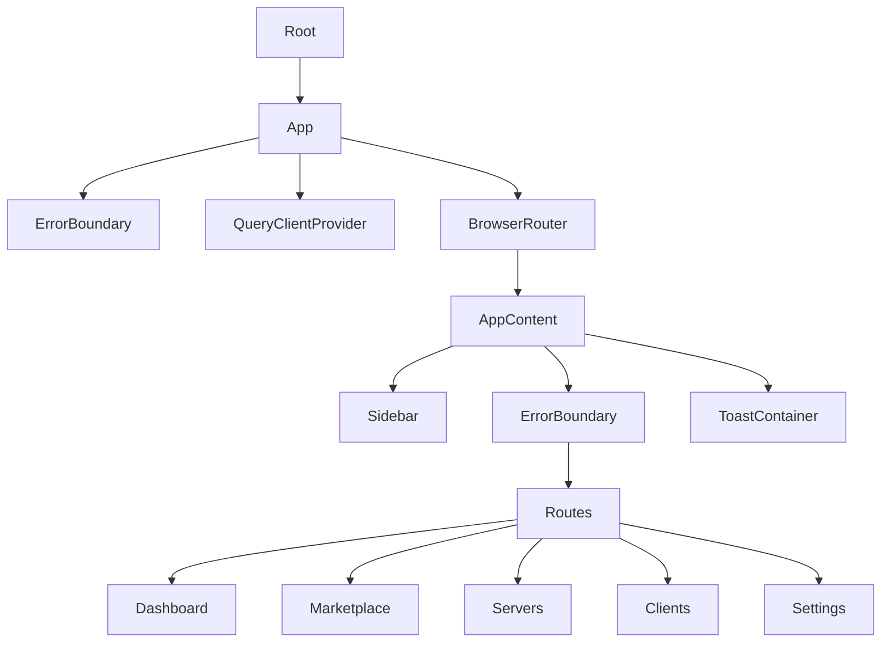

**Diagram sources**

- [App.tsx](file://src/App.tsx)
- [main.tsx](file://src/main.tsx)
- [Sidebar.tsx](file://src/components/layout/Sidebar.tsx)
- [Toast.tsx](file://src/components/common/Toast.tsx)

### State Management Strategy

The application uses a hybrid state management approach combining Zustand for global client state and React Query for server state management. This separation allows for efficient state management with appropriate caching and synchronization strategies.

#### Global State with Zustand

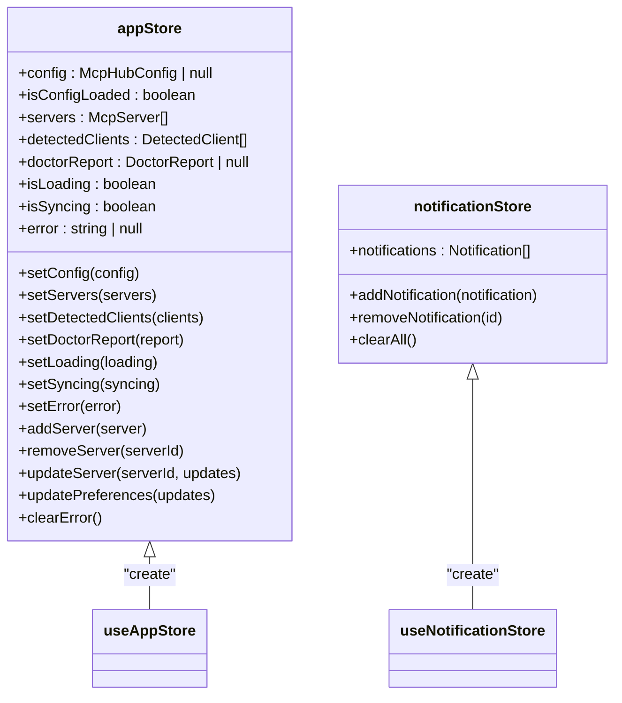

**Diagram sources**

- [appStore.ts](file://src/stores/appStore.ts)
- [notificationStore.ts](file://src/stores/notificationStore.ts)

#### Server State with React Query

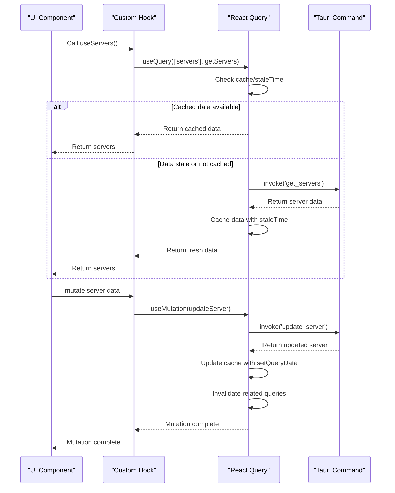

**Diagram sources**

- [useServers.ts](file://src/hooks/useServers.ts)
- [tauri.ts](file://src/lib/tauri.ts)

### Custom Hooks Architecture

The custom hooks architecture abstracts Tauri command interactions and provides data fetching, caching, and synchronization capabilities. These hooks serve as the primary interface between the UI components and the backend services.

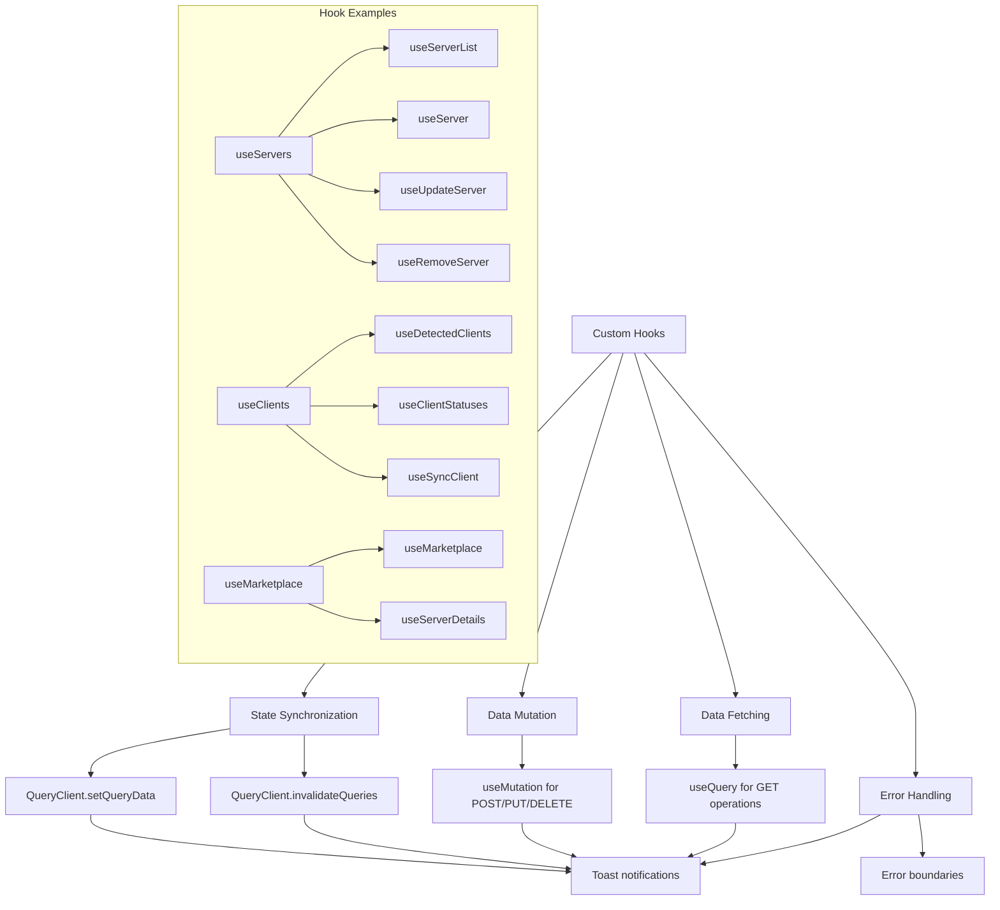

**Diagram sources**

- [useServers.ts](file://src/hooks/useServers.ts)
- [useClients.ts](file://src/hooks/useClients.ts)
- [useMarketplace.ts](file://src/hooks/useMarketplace.ts)
- [tauri.ts](file://src/lib/tauri.ts)

### UI Component Organization

The UI components are organized into reusable common components and domain-specific components. This structure promotes consistency and reusability across the application.

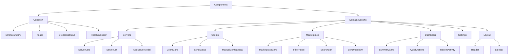

**Diagram sources**

- [components/common](file://src/components/common)
- [components/servers](file://src/components/servers)
- [components/clients](file://src/components/clients)
- [components/marketplace](file://src/components/marketplace)
- [components/dashboard](file://src/components/dashboard)
- [components/layout](file://src/components/layout)

### React Query Caching Strategy

The application implements a comprehensive caching strategy using React Query to optimize data fetching and improve user experience.

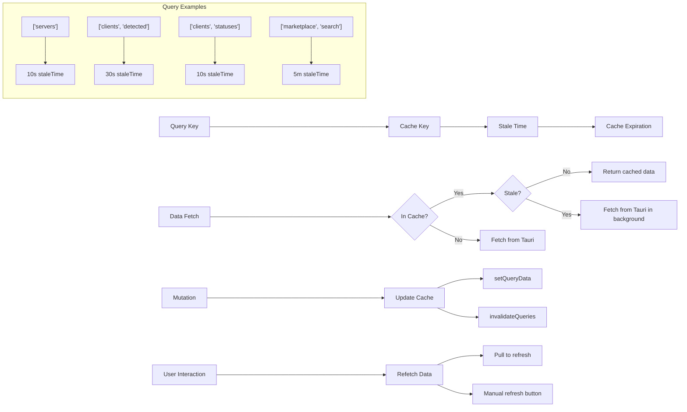

**Diagram sources**

- [useServers.ts](file://src/hooks/useServers.ts)
- [useClients.ts](file://src/hooks/useClients.ts)
- [useMarketplace.ts](file://src/hooks/useMarketplace.ts)

## Dependency Analysis

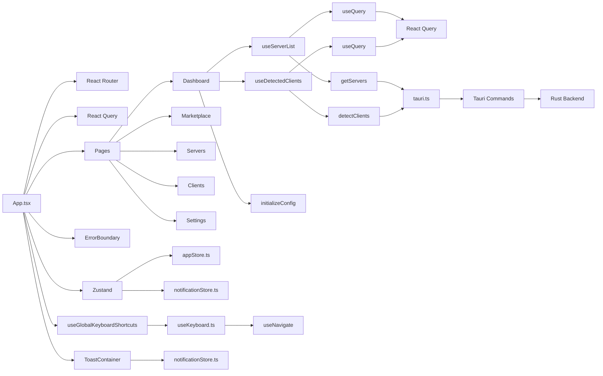

**Diagram sources**

- [App.tsx](file://src/App.tsx)
- [useServers.ts](file://src/hooks/useServers.ts)
- [useClients.ts](file://src/hooks/useClients.ts)
- [tauri.ts](file://src/lib/tauri.ts)
- [appStore.ts](file://src/stores/appStore.ts)
- [notificationStore.ts](file://src/stores/notificationStore.ts)
- [useKeyboard.ts](file://src/hooks/useKeyboard.ts)

## Performance Considerations

The MCP Nexus frontend architecture incorporates several performance optimizations:

1. **React Query Caching**: Strategic use of staleTime and caching to minimize redundant data fetching
2. **Infinite Query**: Implementation of infinite scrolling for marketplace results to handle large datasets efficiently
3. **Selective Re-renders**: Proper use of React.memo and useCallback to prevent unnecessary re-renders
4. **Code Splitting**: Domain-based component organization enables potential code splitting
5. **Efficient State Updates**: Zustand stores provide efficient state updates with minimal re-renders
6. **Background Refetching**: React Query handles background data updates without blocking the UI
7. **Mutation Optimistic Updates**: useMutation with cache updates provides immediate UI feedback

The architecture balances real-time data requirements with performance considerations, ensuring a responsive user interface while maintaining data consistency.

## Troubleshooting Guide

### Error Boundary Implementation

The application implements a comprehensive error boundary system to handle runtime errors gracefully:

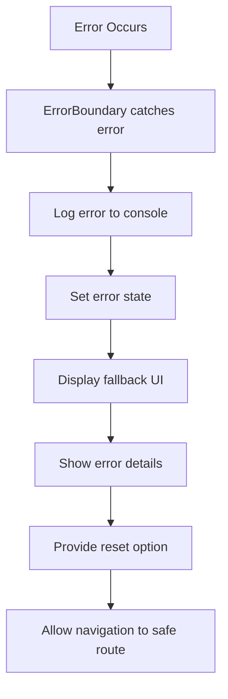

**Section sources**

- [ErrorBoundary.tsx](file://src/components/common/ErrorBoundary.tsx)

### Toast Notification System

The toast notification system provides user feedback for various application events:

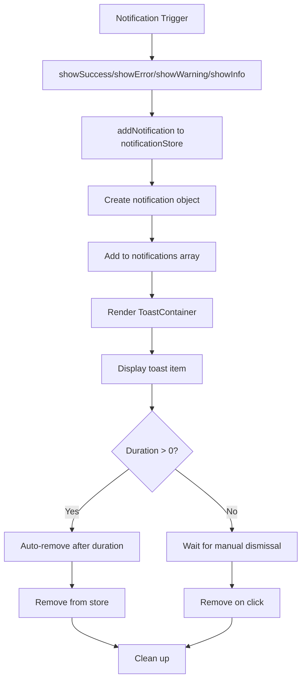

**Section sources**

- [notificationStore.ts](file://src/stores/notificationStore.ts)
- [Toast.tsx](file://src/components/common/Toast.tsx)

### Keyboard Event Handling

The keyboard event handling system provides global keyboard shortcuts for enhanced user experience:

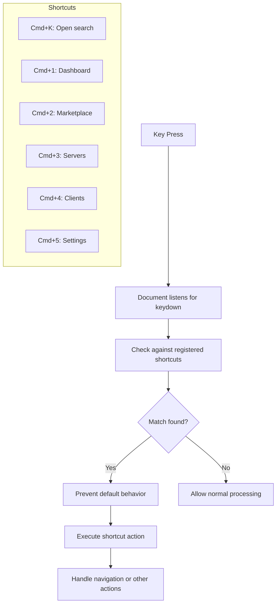

**Section sources**

- [useKeyboard.ts](file://src/hooks/useKeyboard.ts)

### Integration with Tailwind CSS

The component styling approach leverages Tailwind CSS for consistent and maintainable styling:

1. **Utility-First Approach**: Direct application of Tailwind classes in JSX
2. **Consistent Design System**: Reusable components with consistent styling
3. **Dark Mode Support**: Implementation of dark mode using Tailwind's dark variant
4. **Responsive Design**: Mobile-first approach with responsive breakpoints
5. **Component-Specific Styling**: Scoped styles within components
6. **Animation Support**: Use of Tailwind's animation utilities for smooth transitions

The integration with Tailwind CSS enables rapid UI development while maintaining consistency across the application.

## Conclusion

The MCP Nexus frontend architecture demonstrates a well-structured React application with clear separation of concerns, effective state management, and reusable components. The domain-driven organization, combined with modern React patterns and tools, creates a maintainable and scalable codebase. The hybrid state management approach using Zustand for global client state and React Query for server state provides an optimal balance between performance and data consistency. The custom hooks architecture abstracts backend interactions and provides a clean interface for data fetching and mutation. Overall, the architecture supports the application's requirements for managing MCP servers, clients, and marketplace interactions while providing a responsive and user-friendly interface.
