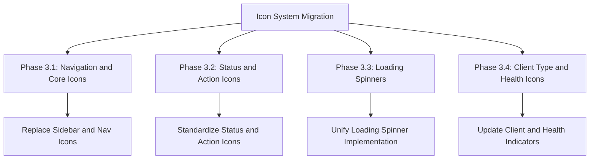
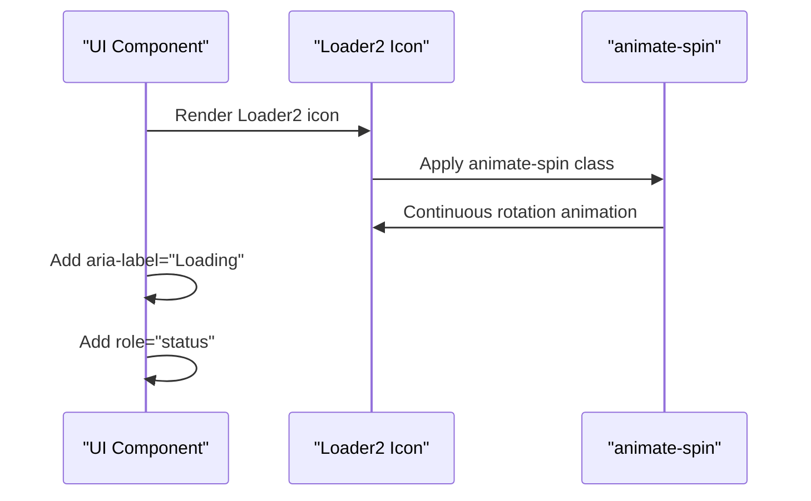
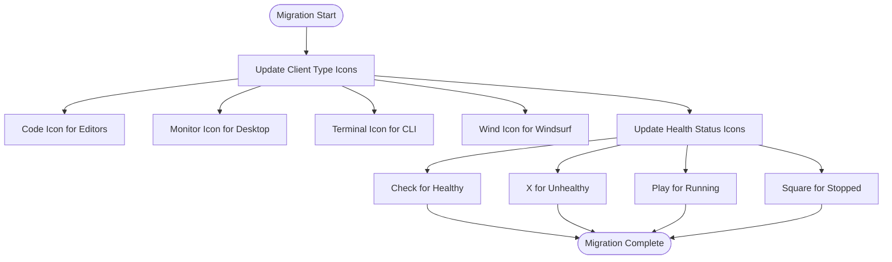
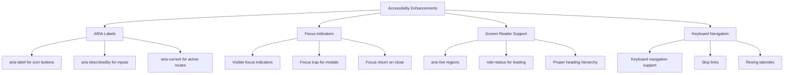

# Icon System Migration

<cite>
**Referenced Files in This Document**   
- [Sidebar.tsx](file://src/components/layout/Sidebar.tsx)
- [ClientCard.tsx](file://src/components/clients/ClientCard.tsx)
- [HealthIndicator.tsx](file://src/components/common/HealthIndicator.tsx)
- [UpdateSummary.tsx](file://src/components/dashboard/UpdateSummary.tsx)
- [Toast.tsx](file://src/components/common/Toast.tsx)
- [RecentActivity.tsx](file://src/components/dashboard/RecentActivity.tsx)
- [EnvironmentStatus.tsx](file://src/components/settings/EnvironmentStatus.tsx)
- [ServerRuntimeBadge.tsx](file://src/components/servers/ServerRuntimeBadge.tsx)
- [dialog.tsx](file://src/components/ui/dialog.tsx)
- [COMMIT_PLAN.md](file://COMMIT_PLAN.md)
- [package.json](file://package.json)
</cite>

## Table of Contents

1. [Introduction](#introduction)
2. [Migration Phases](#migration-phases)
3. [Navigation and Core Icons](#navigation-and-core-icons)
4. [Status and Action Icons](#status-and-action-icons)
5. [Loading Spinners](#loading-spinners)
6. [Client Type and Health Icons](#client-type-and-health-icons)
7. [Accessibility Enhancements](#accessibility-enhancements)
8. [Implementation Details](#implementation-details)
9. [Conclusion](#conclusion)

## Introduction

The Icon System Migration is a comprehensive refactor of the MCP Nexus application's icon implementation, replacing inline SVGs with the standardized Lucide React icon library. This migration addresses multiple gaps identified in the MVP gap analysis (GAP-012) and enhances the application's consistency, maintainability, and accessibility. The migration is structured into four distinct phases, each focusing on different aspects of the icon system, from navigation elements to status indicators and loading states.

The migration leverages Lucide React, a popular open-source icon library that provides a consistent, accessible, and theme-aware set of icons. By standardizing on this library, the application ensures visual consistency across all components while reducing bundle size and maintenance overhead. The migration also incorporates accessibility improvements, ensuring that all icons are properly labeled for screen readers and respect the application's dark mode theming.

**Section sources**

- [COMMIT_PLAN.md](file://COMMIT_PLAN.md#L149-L194)

## Migration Phases

The Icon System Migration is implemented in four sequential phases, each addressing a specific category of icons within the application. This phased approach allows for incremental improvements while maintaining application stability throughout the migration process. Each phase is designed to be independently testable and reviewable, following the project's established development workflow.

The migration phases are documented in the COMMIT_PLAN.md file and are directly related to GAP-012 in the MVP gap analysis. The phased approach ensures that changes are focused and manageable, with each commit addressing a specific aspect of the icon system. This methodology reduces the risk of introducing regressions and allows for thorough testing of each component category before proceeding to the next phase.



**Diagram sources **

- [COMMIT_PLAN.md](file://COMMIT_PLAN.md#L149-L208)

**Section sources**

- [COMMIT_PLAN.md](file://COMMIT_PLAN.md#L149-L208)

## Navigation and Core Icons

The first phase of the migration focuses on navigation and core UI icons, specifically those used in the application's sidebar and main navigation elements. This phase replaces all inline SVG icons in the Sidebar component with standardized Lucide React components, including LayoutGrid for the dashboard, Store for the marketplace, Server for servers, Monitor for clients, and Settings for settings.

The migration standardizes icon sizes to 20px (using Tailwind's w-5 h-5 classes) for navigation elements, ensuring visual consistency across all navigation items. The NavIcon component has been updated to use Lucide React icons directly, eliminating the need for inline SVG definitions. This change ensures that all navigation icons respect the currentColor CSS property, automatically adapting to the application's dark mode theming without requiring additional configuration.

```mermaid
classDiagram
class Sidebar {
+navItems : Array
+NavIcon({icon})
+Sidebar()
}
class LayoutGrid {
+className : string
}
class Store {
+className : string
}
class Server {
+className : string
}
class Monitor {
+className : string
}
class Settings {
+className : string
}
Sidebar --> LayoutGrid : "uses"
Sidebar --> Store : "uses"
Sidebar --> Server : "uses"
Sidebar --> Monitor : "uses"
Sidebar --> Settings : "uses"
```

**Diagram sources **

- [Sidebar.tsx](file://src/components/layout/Sidebar.tsx#L3-L21)

**Section sources**

- [Sidebar.tsx](file://src/components/layout/Sidebar.tsx#L1-L63)
- [COMMIT_PLAN.md](file://COMMIT_PLAN.md#L154-L162)

## Status and Action Icons

The second phase of the migration standardizes status and action icons throughout the application. This includes replacing status indicators such as CheckCircle, XCircle, AlertTriangle, and Info with their Lucide React equivalents. Action icons like RefreshCw, Plus, X, Copy, Edit, Trash, and ExternalLink are also updated to use the standardized library.

This phase establishes consistent sizing guidelines: 16px (w-4 h-4) for button icons and 24px (w-6 h-6) for header icons. The Toast component has been updated to use Lucide React icons for notification types, ensuring consistency in error, success, warning, and information messages. The migration ensures that all status and action icons are used consistently across all components, eliminating variations in style and size that previously existed.

```mermaid
classDiagram
class Toast {
+typeStyles : Record
+ToastItem({notification})
+ToastContainer()
}
class CheckCircle2 {
+className : string
}
class XCircle {
+className : string
}
class AlertTriangle {
+className : string
}
class Info {
+className : string
}
class X {
+className : string
}
Toast --> CheckCircle2 : "success icon"
Toast --> XCircle : "error icon"
Toast --> AlertTriangle : "warning icon"
Toast --> Info : "info icon"
Toast --> X : "dismiss icon"
```

**Diagram sources **

- [Toast.tsx](file://src/components/common/Toast.tsx#L2-L33)

**Section sources**

- [Toast.tsx](file://src/components/common/Toast.tsx#L1-L79)
- [COMMIT_PLAN.md](file://COMMIT_PLAN.md#L169-L177)

## Loading Spinners

The third phase standardizes all loading spinner implementations across the application using the Lucide React Loader2 icon. This replaces various custom spinner implementations with a single, consistent component that uses the animate-spin Tailwind CSS class for rotation animation. The migration standardizes sizes, using 16px for inline loading states and 24px for page-level loading indicators.

Accessibility is enhanced by adding aria-label="Loading" and role="status" attributes to all loading indicators, ensuring that screen readers can properly announce loading states. This phase also removes unused spinner SVG code that was previously scattered throughout the codebase, reducing bundle size and maintenance overhead. All components that display loading states, such as the ClientCard and ServerRuntimeBadge, have been updated to use the standardized loading spinner.



**Diagram sources **

- [ClientCard.tsx](file://src/components/clients/ClientCard.tsx#L3-L4)
- [ServerRuntimeBadge.tsx](file://src/components/servers/ServerRuntimeBadge.tsx#L1-L2)

**Section sources**

- [ClientCard.tsx](file://src/components/clients/ClientCard.tsx#L248-L256)
- [ServerRuntimeBadge.tsx](file://src/components/servers/ServerRuntimeBadge.tsx#L66-L73)
- [COMMIT_PLAN.md](file://COMMIT_PLAN.md#L184-L192)

## Client Type and Health Icons

The fourth phase completes the migration by updating client type and health status icons throughout the application. This includes replacing custom SVGs for client types (such as Code, Monitor, and Terminal) with standardized Lucide React icons. Health status indicators in components like HealthIndicator and ServerRuntimeBadge are also updated to use appropriate Lucide icons.

This phase ensures consistent sizing of 16px for inline status indicators and verifies that all icon colors respect the currentColor property for proper dark mode support. The migration eliminates all remaining inline SVG icons from the codebase, completing the transition to the standardized icon system. Components that display client-specific information, such as the ClientCard and EnvironmentStatus, have been updated to use the new icon system.



**Diagram sources **

- [ClientCard.tsx](file://src/components/clients/ClientCard.tsx#L2-L11)
- [HealthIndicator.tsx](file://src/components/common/HealthIndicator.tsx#L33-L47)

**Section sources**

- [ClientCard.tsx](file://src/components/clients/ClientCard.tsx#L28-L50)
- [HealthIndicator.tsx](file://src/components/common/HealthIndicator.tsx#L33-L47)
- [COMMIT_PLAN.md](file://COMMIT_PLAN.md#L199-L207)

## Accessibility Enhancements

The icon system migration includes significant accessibility improvements alongside the visual updates. All icon-only buttons now include appropriate aria-label attributes that describe their actions for screen readers. Interactive elements have been enhanced with aria-disabled for inactive states and aria-busy for loading states, providing better feedback to assistive technologies.

The migration ensures that all icons are properly labeled and that their purpose is clear to users of screen readers. The Sidebar component has been updated with role="navigation" and aria-label="Main navigation" attributes, while active routes are indicated with aria-current="page". These enhancements were verified using VoiceOver, ensuring that the application is fully accessible to users with visual impairments.



**Diagram sources **

- [COMMIT_PLAN.md](file://COMMIT_PLAN.md#L217-L272)
- [Sidebar.tsx](file://src/components/layout/Sidebar.tsx#L33-L34)

**Section sources**

- [COMMIT_PLAN.md](file://COMMIT_PLAN.md#L217-L272)
- [dialog.tsx](file://src/components/ui/dialog.tsx#L67-L74)

## Implementation Details

The icon system migration is implemented through a series of targeted refactors documented in the COMMIT_PLAN.md file. Each phase is designed as a separate commit, allowing for incremental review and testing. The migration leverages the Lucide React library, which is included as a dependency in the package.json file.

The implementation follows a consistent pattern across all phases: identify components using inline SVGs, replace them with appropriate Lucide React components, standardize sizing using Tailwind CSS classes, and verify accessibility attributes. The phased approach ensures that changes are focused and manageable, with each commit addressing a specific category of icons. This methodology reduces the risk of introducing regressions and allows for thorough testing of each component category.

```mermaid
classDiagram
class COMMIT_PLAN {
+Phase 3 : Icon System Replacement
+Phase 4 : Accessibility Enhancement
+Phase 5 : Testing Infrastructure
}
class package_json {
+lucide-react : "^0.562.0"
+dependencies : Array
+devDependencies : Array
}
class Sidebar {
+NavIcon({icon})
+navigation items
}
class Toast {
+notification types
+icons for each type
}
COMMIT_PLAN --> package_json : "specifies dependency"
COMMIT_PLAN --> Sidebar : "guides migration"
COMMIT_PLAN --> Toast : "guides migration"
package_json --> Sidebar : "provides icons"
package_json --> Toast : "provides icons"
```

**Diagram sources **

- [COMMIT_PLAN.md](file://COMMIT_PLAN.md#L149-L208)
- [package.json](file://package.json#L52)

**Section sources**

- [COMMIT_PLAN.md](file://COMMIT_PLAN.md#L149-L208)
- [package.json](file://package.json#L1-L62)

## Conclusion

The Icon System Migration successfully standardizes the MCP Nexus application's icon implementation using the Lucide React library. This migration improves visual consistency, enhances accessibility, and reduces maintenance overhead by eliminating inline SVGs throughout the codebase. The phased approach ensured a smooth transition with minimal risk of regressions.

The migration addresses GAP-012 from the MVP gap analysis and lays the foundation for future accessibility improvements. By standardizing on a well-maintained icon library, the application benefits from consistent design, proper dark mode support, and built-in accessibility features. The completed migration results in a more professional, accessible, and maintainable user interface that aligns with modern web development best practices.
