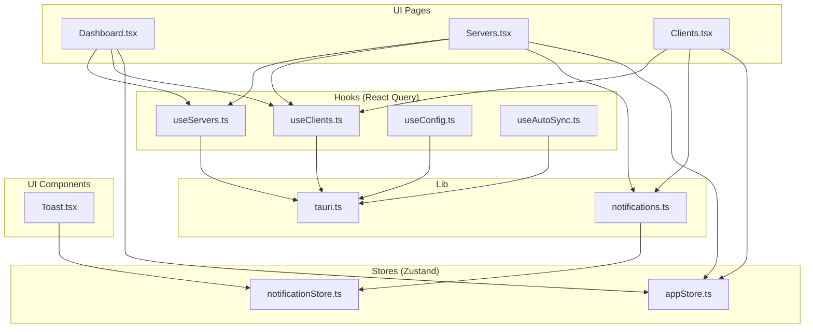
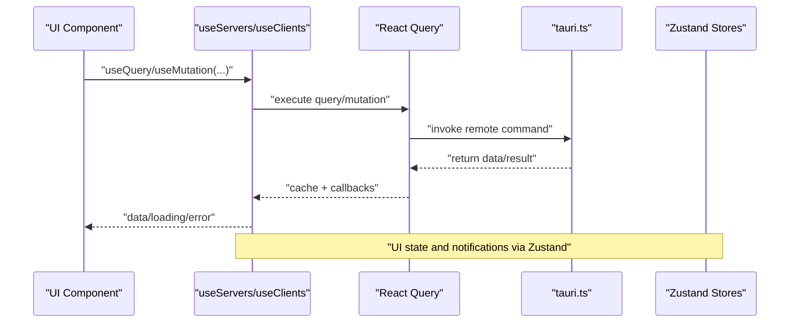
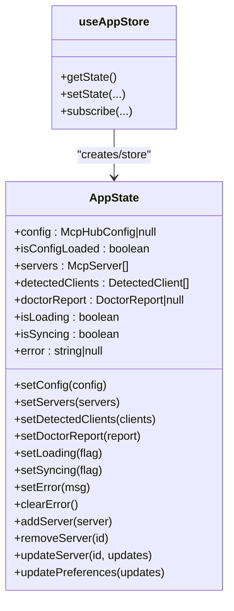
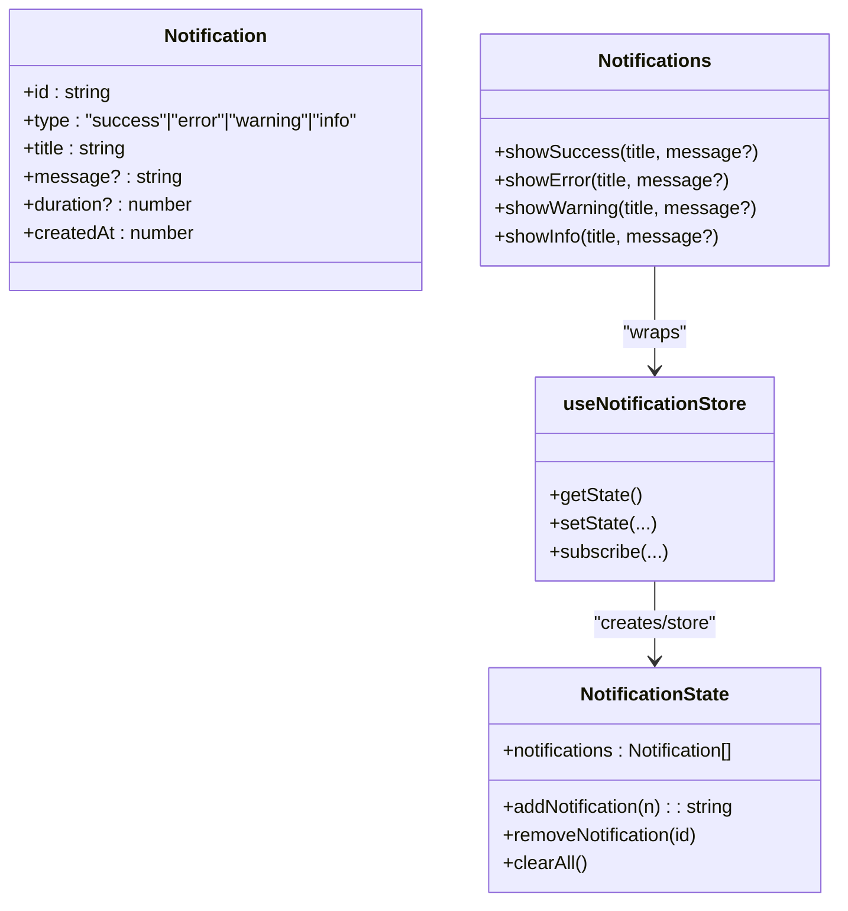
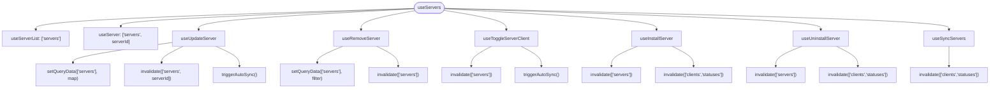
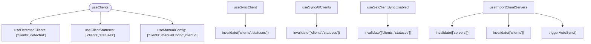
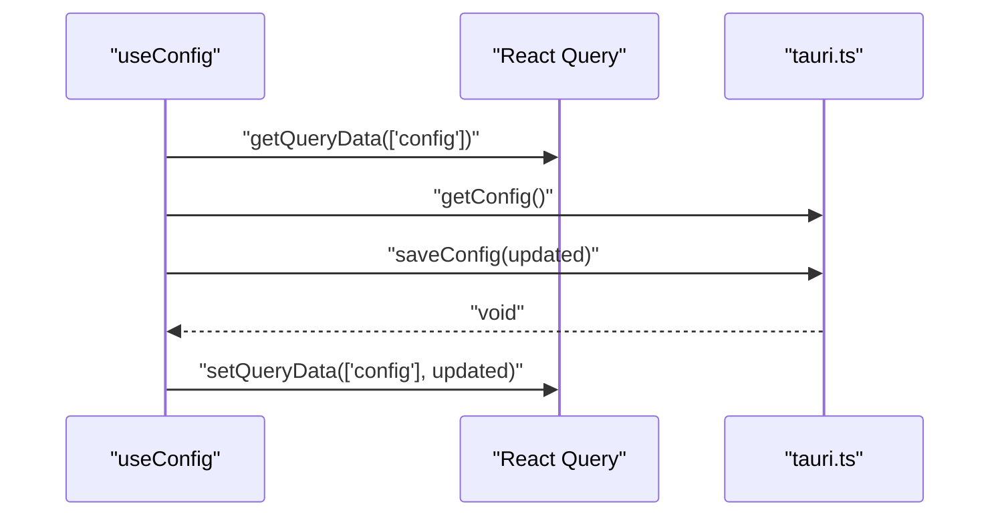
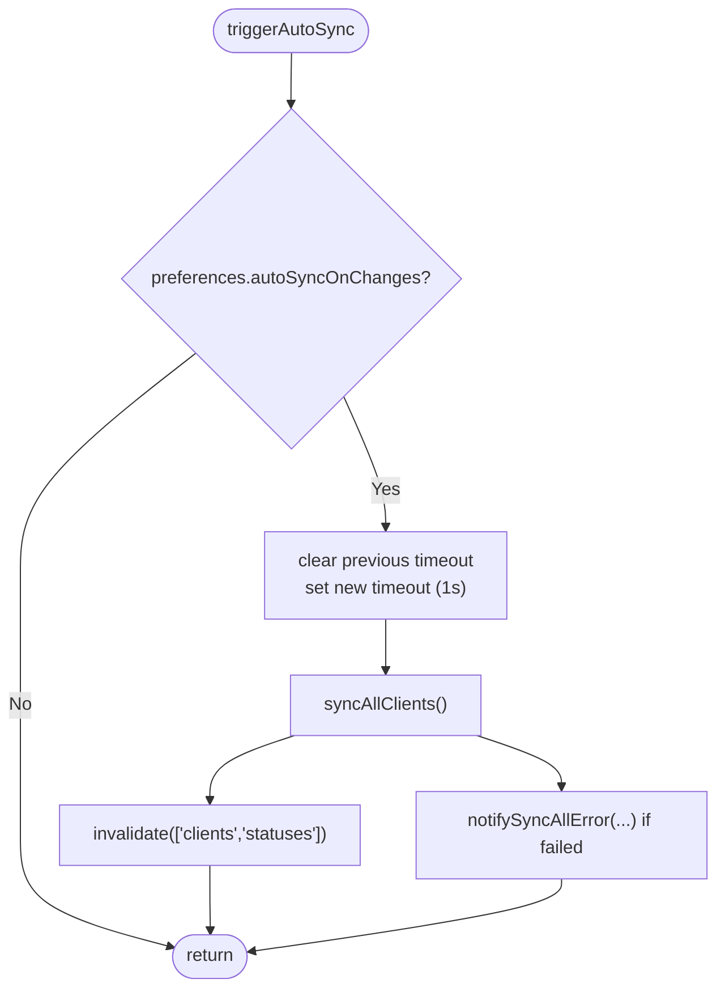
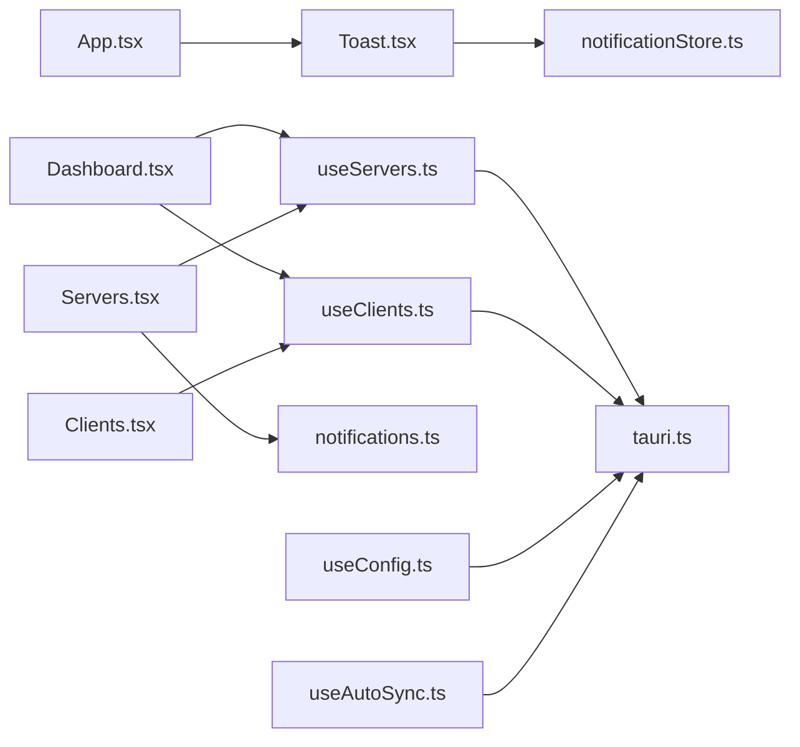

# State Management

<cite>
**Referenced Files in This Document**
- [appStore.ts](file://src/stores/appStore.ts)
- [notificationStore.ts](file://src/stores/notificationStore.ts)
- [useServers.ts](file://src/hooks/useServers.ts)
- [useClients.ts](file://src/hooks/useClients.ts)
- [useConfig.ts](file://src/hooks/useConfig.ts)
- [useAutoSync.ts](file://src/hooks/useAutoSync.ts)
- [tauri.ts](file://src/lib/tauri.ts)
- [notifications.ts](file://src/lib/notifications.ts)
- [types/index.ts](file://src/types/index.ts)
- [Toast.tsx](file://src/components/common/Toast.tsx)
- [App.tsx](file://src/App.tsx)
- [Dashboard.tsx](file://src/pages/Dashboard.tsx)
- [Servers.tsx](file://src/pages/Servers.tsx)
- [Clients.tsx](file://src/pages/Clients.tsx)
</cite>

## Table of Contents

1. [Introduction](#introduction)
2. [Project Structure](#project-structure)
3. [Core Components](#core-components)
4. [Architecture Overview](#architecture-overview)
5. [Detailed Component Analysis](#detailed-component-analysis)
6. [Dependency Analysis](#dependency-analysis)
7. [Performance Considerations](#performance-considerations)
8. [Troubleshooting Guide](#troubleshooting-guide)
9. [Conclusion](#conclusion)

## Introduction

This document explains the MCP Nexus state management system with a dual-strategy approach:

- Global client and application state managed by Zustand stores for UI state, configuration-derived data, and notifications.
- Server and client data synchronization managed by React Query for remote operations, caching, and background refetching.

It documents store shapes, actions, query keys, cache invalidation, error handling, loading states, and how components consume state from both Zustand and React Query.

## Project Structure

The state management spans three layers:

- Stores (Zustand): appStore and notificationStore
- Hooks (React Query): useServers, useClients, useConfig, useAutoSync
- Utilities and Types: tauri.ts (remote commands), notifications.ts (semantic helpers), types/index.ts (data contracts)

**Diagram sources**

- [Dashboard.tsx](file://src/pages/Dashboard.tsx#L1-L125)
- [Servers.tsx](file://src/pages/Servers.tsx#L1-L355)
- [Clients.tsx](file://src/pages/Clients.tsx#L1-L324)
- [useServers.ts](file://src/hooks/useServers.ts#L1-L182)
- [useClients.ts](file://src/hooks/useClients.ts#L1-L138)
- [useConfig.ts](file://src/hooks/useConfig.ts#L1-L42)
- [useAutoSync.ts](file://src/hooks/useAutoSync.ts#L1-L53)
- [tauri.ts](file://src/lib/tauri.ts#L1-L364)
- [notifications.ts](file://src/lib/notifications.ts#L1-L161)
- [notificationStore.ts](file://src/stores/notificationStore.ts#L1-L97)
- [appStore.ts](file://src/stores/appStore.ts#L1-L118)
- [Toast.tsx](file://src/components/common/Toast.tsx#L1-L68)

**Section sources**

- [App.tsx](file://src/App.tsx#L1-L58)
- [types/index.ts](file://src/types/index.ts#L1-L426)

## Core Components

- Zustand stores
  - appStore: holds configuration-derived data (servers), UI flags (loading/syncing/error), and preferences. Provides actions to mutate state and keep derived data consistent.
  - notificationStore: manages toast notifications with auto-dismissal and convenience helpers.
- React Query hooks
  - useServers: fetches servers, updates, removes, toggles client enablement, installs/uninstalls servers, and syncs all clients. Uses query keys like ["servers"] and ["servers", serverId].
  - useClients: detects clients, fetches client sync statuses, syncs individual/all clients, toggles sync enablement, imports servers from clients, and fetches manual config JSON. Uses query keys like ["clients","detected"], ["clients","statuses"], ["clients","manualConfig",clientId].
  - useConfig: fetches and updates the central configuration; persists preferences changes.
  - useAutoSync: debounced orchestration to trigger global sync when configuration allows.

**Section sources**

- [appStore.ts](file://src/stores/appStore.ts#L1-L118)
- [notificationStore.ts](file://src/stores/notificationStore.ts#L1-L97)
- [useServers.ts](file://src/hooks/useServers.ts#L1-L182)
- [useClients.ts](file://src/hooks/useClients.ts#L1-L138)
- [useConfig.ts](file://src/hooks/useConfig.ts#L1-L42)
- [useAutoSync.ts](file://src/hooks/useAutoSync.ts#L1-L53)

## Architecture Overview

The system separates concerns:

- Zustand: fast, synchronous UI state and ephemeral notifications.
- React Query: asynchronous server/client data, caching, invalidation, and background refetching.

**Diagram sources**

- [useServers.ts](file://src/hooks/useServers.ts#L1-L182)
- [useClients.ts](file://src/hooks/useClients.ts#L1-L138)
- [tauri.ts](file://src/lib/tauri.ts#L1-L364)
- [appStore.ts](file://src/stores/appStore.ts#L1-L118)
- [notificationStore.ts](file://src/stores/notificationStore.ts#L1-L97)

## Detailed Component Analysis

### Zustand Stores

#### appStore

- Purpose: Centralize configuration-derived UI state and global flags.
- State shape:
  - config: McpHubConfig | null
  - isConfigLoaded: boolean
  - servers: McpServer[]
  - detectedClients: DetectedClient[]
  - doctorReport: DoctorReport | null
  - UI flags: isLoading, isSyncing, error
- Actions:
  - setConfig, setServers, setDetectedClients, setDoctorReport
  - setLoading, setSyncing, setError, clearError
  - addServer, removeServer, updateServer, updatePreferences
- Behavior:
  - setConfig derives servers from config and marks isConfigLoaded.
  - updateServer/updatePreferences keep config-derived state consistent.
  - No persistence is implemented here; persistence occurs via tauri.saveConfig.

**Diagram sources**

- [appStore.ts](file://src/stores/appStore.ts#L1-L118)

**Section sources**

- [appStore.ts](file://src/stores/appStore.ts#L1-L118)

#### notificationStore

- Purpose: Manage transient notifications with auto-dismissal and convenience helpers.
- State shape:
  - notifications: Notification[]
- Actions:
  - addNotification(notification): returns id; auto-removes after duration (unless persistent).
  - removeNotification(id), clearAll()
- Helpers:
  - showSuccess, showError, showWarning, showInfo for common notification types.

**Diagram sources**

- [notificationStore.ts](file://src/stores/notificationStore.ts#L1-L97)
- [notifications.ts](file://src/lib/notifications.ts#L1-L161)

**Section sources**

- [notificationStore.ts](file://src/stores/notificationStore.ts#L1-L97)
- [notifications.ts](file://src/lib/notifications.ts#L1-L161)

### React Query Hooks

#### useServers

- Queries:
  - useServerList: ["servers"] with staleTime 10s
  - useServer: ["servers", serverId] with enabled when id is present
- Mutations:
  - useUpdateServer: onSuccess updates cache and invalidates ["servers", serverId]; triggers auto-sync
  - useRemoveServer: onSuccess removes from cache and invalidates ["servers"]
  - useToggleServerClient: onSuccess invalidates ["servers"]; triggers auto-sync
  - useInstallServer: onSuccess invalidates ["servers"] and ["clients","statuses"]
  - useUninstallServer: onSuccess invalidates ["servers"] and ["clients","statuses"]
  - useSyncServers: onSuccess invalidates ["clients","statuses"]
- Combined hook:
  - useServers returns servers, isLoading, error, refetch, and mutation helpers with pending/error flags.

**Diagram sources**

- [useServers.ts](file://src/hooks/useServers.ts#L1-L182)
- [useAutoSync.ts](file://src/hooks/useAutoSync.ts#L1-L53)

**Section sources**

- [useServers.ts](file://src/hooks/useServers.ts#L1-L182)

#### useClients

- Queries:
  - useDetectedClients: ["clients","detected"] with staleTime 30s
  - useClientStatuses: ["clients","statuses"] with staleTime 10s
  - useManualConfig: ["clients","manualConfig",clientId] with enabled when clientId is present and staleTime 5s
- Mutations:
  - useSyncClient: onSuccess invalidates ["clients","statuses"]
  - useSyncAllClients: onSuccess invalidates ["clients","statuses"]
  - useSetClientSyncEnabled: onSuccess invalidates ["clients","statuses"]
  - useImportClientServers: onSuccess invalidates ["servers"] and ["clients"], triggers auto-sync
- Combined hook:
  - useClients merges detected clients with their sync statuses and exposes isLoading/error/refetch.

**Diagram sources**

- [useClients.ts](file://src/hooks/useClients.ts#L1-L138)
- [useAutoSync.ts](file://src/hooks/useAutoSync.ts#L1-L53)

**Section sources**

- [useClients.ts](file://src/hooks/useClients.ts#L1-L138)

#### useConfig

- Query:
  - useConfig: ["config"] with staleTime 60s
- Mutation:
  - useUpdatePreferences: computes updated config locally, saves via saveConfig, and sets query data.

**Diagram sources**

- [useConfig.ts](file://src/hooks/useConfig.ts#L1-L42)
- [tauri.ts](file://src/lib/tauri.ts#L1-L120)

**Section sources**

- [useConfig.ts](file://src/hooks/useConfig.ts#L1-L42)

#### useAutoSync

- Debounced orchestration to call syncAllClients when configuration allows auto-sync.
- After successful sync, invalidates ["clients","statuses"] and notifies on failures.

**Diagram sources**

- [useAutoSync.ts](file://src/hooks/useAutoSync.ts#L1-L53)
- [tauri.ts](file://src/lib/tauri.ts#L112-L122)

**Section sources**

- [useAutoSync.ts](file://src/hooks/useAutoSync.ts#L1-L53)

### Data Contracts and Types

- Types define server, client, sync, marketplace, installation, update, and health structures used across stores and hooks.

**Section sources**

- [types/index.ts](file://src/types/index.ts#L1-L426)

### Component Consumption Patterns

#### Dashboard

- Consumes useServerList and useDetectedClients to render summaries and quick actions.
- Initializes configuration on mount.

**Section sources**

- [Dashboard.tsx](file://src/pages/Dashboard.tsx#L1-L125)
- [useServers.ts](file://src/hooks/useServers.ts#L1-L182)
- [useClients.ts](file://src/hooks/useClients.ts#L1-L138)

#### Servers

- Uses useServers to manage server list, mutations, and sync.
- Integrates notifications for install/uninstall/sync outcomes.

**Section sources**

- [Servers.tsx](file://src/pages/Servers.tsx#L1-L355)
- [useServers.ts](file://src/hooks/useServers.ts#L1-L182)
- [notifications.ts](file://src/lib/notifications.ts#L1-L161)

#### Clients

- Uses useClients, useSyncClient, useSyncAllClients, useSetClientSyncEnabled, useManualConfig.
- Displays sync results and manual config modal.

**Section sources**

- [Clients.tsx](file://src/pages/Clients.tsx#L1-L324)
- [useClients.ts](file://src/hooks/useClients.ts#L1-L138)

## Dependency Analysis

- React Query provider is initialized at the root App level.
- Toast container consumes notificationStore to render notifications.
- Components depend on hooks for data and mutations; Zustand stores are used for UI flags and notifications.

**Diagram sources**

- [App.tsx](file://src/App.tsx#L1-L58)
- [Toast.tsx](file://src/components/common/Toast.tsx#L1-L68)
- [notificationStore.ts](file://src/stores/notificationStore.ts#L1-L97)
- [Dashboard.tsx](file://src/pages/Dashboard.tsx#L1-L125)
- [Servers.tsx](file://src/pages/Servers.tsx#L1-L355)
- [Clients.tsx](file://src/pages/Clients.tsx#L1-L324)
- [useServers.ts](file://src/hooks/useServers.ts#L1-L182)
- [useClients.ts](file://src/hooks/useClients.ts#L1-L138)
- [useConfig.ts](file://src/hooks/useConfig.ts#L1-L42)
- [useAutoSync.ts](file://src/hooks/useAutoSync.ts#L1-L53)
- [tauri.ts](file://src/lib/tauri.ts#L1-L364)
- [notifications.ts](file://src/lib/notifications.ts#L1-L161)

**Section sources**

- [App.tsx](file://src/App.tsx#L1-L58)
- [Toast.tsx](file://src/components/common/Toast.tsx#L1-L68)

## Performance Considerations

- Stale times:
  - ["servers"]: 10s
  - ["servers", serverId]: 10s
  - ["clients","detected"]: 30s
  - ["clients","statuses"]: 10s
  - ["clients","manualConfig",clientId]: 5s
  - ["config"]: 60s
- Background refetching: React Query automatically refetches stale data; use invalidateQueries strategically to keep views fresh after mutations.
- Debounced auto-sync: useAutoSync limits frequent sync calls to reduce network overhead.
- Selective re-renders: useServers and useClients combine data and flags; components should only subscribe to the parts they need.

[No sources needed since this section provides general guidance]

## Troubleshooting Guide

- Error handling:
  - React Query hooks expose error fields; components should render error states and offer retry via refetch.
  - useServers and useClients return error from query/mutation; display messages and allow retries.
- Loading states:
  - Use isLoading flags from hooks to show spinners or skeletons.
  - useServers and useClients expose isPending for mutations; disable controls while pending.
- Notifications:
  - Use notifications.ts helpers for consistent messages; errors are surfaced via showError and related functions.
- Auto-sync failures:
  - useAutoSync triggers notifications on failures; check logs indicated by messages.

**Section sources**

- [useServers.ts](file://src/hooks/useServers.ts#L1-L182)
- [useClients.ts](file://src/hooks/useClients.ts#L1-L138)
- [notifications.ts](file://src/lib/notifications.ts#L1-L161)
- [useAutoSync.ts](file://src/hooks/useAutoSync.ts#L1-L53)

## Conclusion

MCP Nexus employs a clean separation of concerns:

- Zustand for UI-centric state and notifications.
- React Query for server/client data, caching, and synchronization.
  This design yields predictable data flows, robust error handling, and efficient rendering through targeted invalidation and stale-time tuning.
