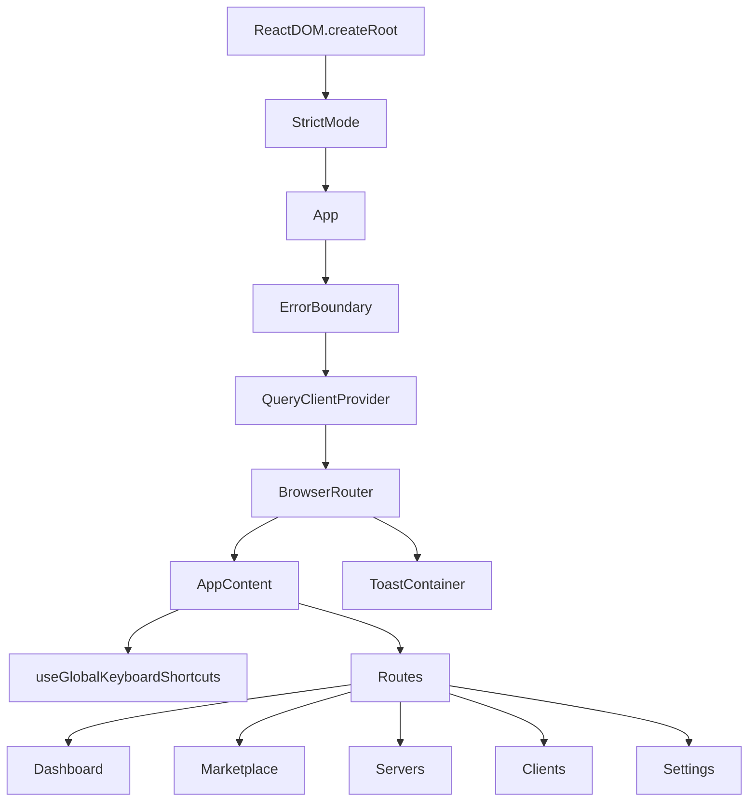
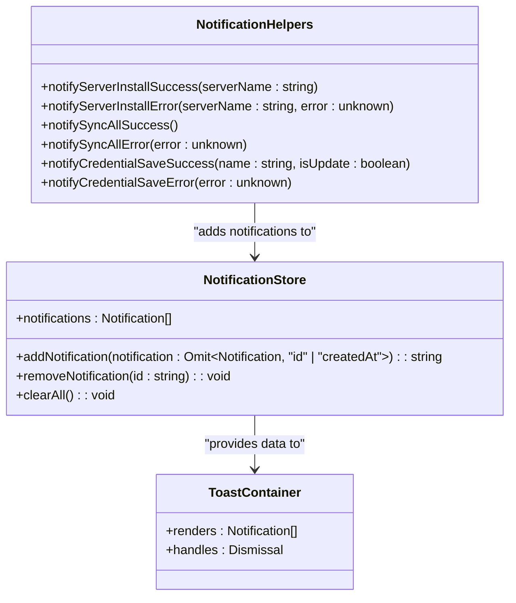

# UI Patterns and Utilities

<cite>
**Referenced Files in This Document**   
- [main.tsx](file://src/main.tsx)
- [App.tsx](file://src/App.tsx)
- [utils.ts](file://src/lib/utils.ts)
- [useKeyboard.ts](file://src/hooks/useKeyboard.ts)
- [CredentialInput.tsx](file://src/components/common/CredentialInput.tsx)
- [FirstRunWelcome.tsx](file://src/components/dashboard/FirstRunWelcome.tsx)
- [Toast.tsx](file://src/components/common/Toast.tsx)
- [ErrorBoundary.tsx](file://src/components/common/ErrorBoundary.tsx)
- [notifications.ts](file://src/lib/notifications.ts)
- [notificationStore.ts](file://src/stores/notificationStore.ts)
</cite>

## Table of Contents

1. [Application Bootstrap Process](#application-bootstrap-process)
2. [Root Component Composition](#root-component-composition)
3. [Utility Functions](#utility-functions)
4. [UI Patterns](#ui-patterns)
5. [Toast Notification System](#toast-notification-system)
6. [Keyboard Event Handling](#keyboard-event-handling)
7. [Accessibility Considerations](#accessibility-considerations)

## Application Bootstrap Process

The application bootstrap process begins in the `main.tsx` file, which serves as the entry point for the MCP Nexus application. This file imports the necessary React and ReactDOM libraries and renders the root App component into the DOM element with the ID "root". The application is wrapped in React's StrictMode for development, which helps identify potential problems in the codebase by highlighting unsafe lifecycles, deprecated APIs, and other issues.

The bootstrap process follows a standard React application pattern, where the ReactDOM.createRoot method is used to create a root for the React tree, and the render method is called with the App component as its child. This approach ensures that the entire application is rendered within a single root container, providing a consistent rendering context for all components.

**Section sources**

- [main.tsx](file://src/main.tsx#L1-L10)

## Root Component Composition

The root App component in `App.tsx` serves as the central orchestrator for the application's core functionality, composing several critical providers and boundaries that enable global application features. The component is structured with a layered approach, where each layer provides specific functionality to the components rendered beneath it.

At the foundation, the ErrorBoundary component wraps the entire application, providing a safety net for unhandled JavaScript errors in the component tree. This boundary catches errors during rendering, in lifecycle methods, and in constructors of the entire component tree, preventing the application from crashing and providing a graceful error recovery mechanism.

Above the ErrorBoundary, the QueryClientProvider from React Query is implemented, creating a global state management system for server state. This provider enables data fetching, caching, synchronization, and updates throughout the application without requiring manual state management. The QueryClient instance is created at the top level to ensure consistent configuration across all queries.

The BrowserRouter from React Router is positioned above the QueryClientProvider, enabling client-side routing and navigation without page reloads. This allows the application to maintain its state while navigating between different views such as Dashboard, Marketplace, Servers, Clients, and Settings.

The AppContent component contains the main application layout with the Sidebar and route definitions, while the ToastContainer is rendered alongside it to provide non-intrusive user feedback. The useGlobalKeyboardShortcuts hook is called within AppContent to enable keyboard navigation throughout the application.

**Diagram sources**

- [App.tsx](file://src/App.tsx#L1-L58)
- [main.tsx](file://src/main.tsx#L1-L10)

**Section sources**

- [App.tsx](file://src/App.tsx#L1-L58)

## Utility Functions

The utility functions in `utils.ts` provide essential formatting and helper methods used across the application. These functions are designed to be pure and side-effect free, ensuring predictable behavior and easy testing.

The `getClientDisplayName` function maps client ID constants to human-readable names, providing a consistent way to display client names throughout the UI. This function uses a record of client IDs to display names, with a fallback to the raw ID if no mapping exists.

The `formatDate` function converts ISO date strings to localized date representations using the browser's locale settings. It displays the date in a short month format with year, day, hour, and minute, making it suitable for displaying timestamps in a user-friendly format.

The `cn` function is a utility for conditionally joining CSS class names, filtering out falsy values. This is particularly useful in React components where class names may be conditionally applied based on component state or props.

The `formatDistanceToNow` function calculates the relative time between a given date and the current time, returning human-readable strings like "just now", "5m ago", "3h ago", or "2d ago". This provides a more intuitive way to display recency than absolute timestamps.

**Section sources**

- [utils.ts](file://src/lib/utils.ts#L1-L46)

## UI Patterns

### CredentialInput Component

The CredentialInput component implements a secure input handling pattern for managing sensitive credential information. This component provides a dual-mode interface that can display either a password field or a keychain reference, depending on the input value.

When the input value starts with "keychain:", the component displays a read-only badge showing the credential name from the keychain, along with an option to clear the reference. This visual distinction helps users understand that the actual credential value is stored securely in the system keychain rather than being entered directly.

For password inputs, the component includes a toggle button that allows users to reveal the password in plain text, improving usability while maintaining security. The input is styled with a monospace font to distinguish it from regular text inputs, and the component integrates with the useCredentials hook to access the list of available credentials.

The component also implements a dropdown menu that appears when the keychain button is clicked, displaying a list of available credentials from the keychain. This allows users to select existing credentials without having to remember or type their names. The dropdown is positioned absolutely and closes when clicking outside, following standard UI patterns for dropdown menus.

The component handles user interactions through several callback functions: `handleSelectCredential` for selecting a credential from the dropdown, `handleClear` for removing the current value, and event handlers for showing/hiding the password and managing the dropdown state.

**Section sources**

- [CredentialInput.tsx](file://src/components/common/CredentialInput.tsx#L1-L192)

### FirstRunWelcome Component

The FirstRunWelcome component implements an onboarding pattern for new users of the application. This component displays a prominent welcome message when the application is launched for the first time, guiding users through the initial setup process.

The component uses state to manage the import process, tracking whether an import is currently in progress and whether it has been completed successfully. When servers are detected in existing clients, the component displays a checklist of clients with their server counts, allowing users to select which clients to import from.

The UI includes visual feedback during the import process, with a loading spinner displayed while servers are being imported. Upon successful import, the component transitions to a completion state with a success message and action buttons to view the imported servers or browse the marketplace.

For users who don't have existing servers, the component provides alternative actions to browse the marketplace or check settings, ensuring that all new users have clear next steps regardless of their starting point.

The component is integrated with the Dashboard component, which determines whether to display the FirstRunWelcome based on the initialization result and the presence of existing servers.

**Section sources**

- [FirstRunWelcome.tsx](file://src/components/dashboard/FirstRunWelcome.tsx#L1-L243)
- [Dashboard.tsx](file://src/pages/Dashboard.tsx#L1-L125)

## Toast Notification System

The toast notification system in MCP Nexus provides a non-intrusive way to deliver feedback to users about application events and operations. The system is built around a centralized notification store using Zustand, which manages the state of all active notifications.

The notification system is implemented across several files, with `notificationStore.ts` defining the core state management logic and `notifications.ts` providing semantic helper functions for common notification types. The `ToastContainer` component renders all active notifications as floating messages in the bottom-right corner of the screen.

The notification store maintains a list of notifications with properties including ID, type (success, error, warning, info), title, message, duration, and creation timestamp. When a new notification is added, it is assigned a unique ID and timestamp, and if it has a duration, a timeout is set to automatically remove it after the specified time.

The system supports four notification types, each with distinct visual styling:

- Success notifications use green color scheme with a checkmark icon
- Error notifications use red color scheme with an X icon
- Warning notifications use yellow color scheme with a warning icon
- Info notifications use blue color scheme with an information icon

The `notifications.ts` file exports semantic helper functions like `notifyServerInstallSuccess`, `notifyServerInstallError`, and others that wrap the generic notification functions with appropriate titles and messages for specific application events. This ensures consistency in messaging across the application and prevents duplication of notification text.

Notifications can be dismissed manually by clicking the close button, or automatically after their duration expires. The system also provides a way to clear all notifications at once.

**Diagram sources**

- [notificationStore.ts](file://src/stores/notificationStore.ts#L1-L97)
- [notifications.ts](file://src/lib/notifications.ts#L1-L161)
- [Toast.tsx](file://src/components/common/Toast.tsx#L1-L68)

**Section sources**

- [notificationStore.ts](file://src/stores/notificationStore.ts#L1-L97)
- [notifications.ts](file://src/lib/notifications.ts#L1-L161)
- [Toast.tsx](file://src/components/common/Toast.tsx#L1-L68)

## Keyboard Event Handling

The keyboard event handling system in MCP Nexus is implemented through the `useKeyboard` hook, which provides both a generic `useKeyboardShortcuts` function and a specialized `useGlobalKeyboardShortcuts` function for application-wide shortcuts.

The `useKeyboardShortcuts` hook accepts an array of shortcut configurations, each defining a key combination (including optional Ctrl/Cmd, Meta, and Shift modifiers) and an associated action. The hook sets up a keydown event listener on the document, which checks each pressed key against the registered shortcuts and executes the corresponding action when a match is found.

The `useGlobalKeyboardShortcuts` function defines the application's global keyboard shortcuts, including:

- Cmd+K to focus the search input or navigate to the marketplace
- Cmd+1 through Cmd+5 to navigate to different sections of the application (Dashboard, Marketplace, Servers, Clients, Settings)

These shortcuts follow platform conventions, using Cmd on Mac and Ctrl on Windows/Linux. The hook uses the useNavigate hook from React Router to handle navigation between routes.

The keyboard system is integrated into the App component through the useGlobalKeyboardShortcuts hook, which is called within the AppContent component. This ensures that keyboard shortcuts are available throughout the application once it has been rendered.

The implementation prevents the default browser behavior when a shortcut is triggered, ensuring that the application's navigation takes precedence over any default browser actions for the same key combinations.

**Section sources**

- [useKeyboard.ts](file://src/hooks/useKeyboard.ts#L1-L97)
- [App.tsx](file://src/App.tsx#L1-L58)

## Accessibility Considerations

The UI design in MCP Nexus incorporates several accessibility considerations to ensure the application is usable by people with various disabilities.

The ErrorBoundary component includes proper semantic HTML with appropriate heading levels, ARIA roles, and accessible error messages. The error display uses sufficient color contrast and provides clear instructions for recovery, including a "Try Again" button and a link to the dashboard. The error details are presented in a collapsible section using the details and summary elements, which are natively accessible and can be expanded/collapsed using keyboard navigation.

The CredentialInput component includes proper labeling and focus management. The input field has an associated placeholder that serves as a visual prompt, and the toggle buttons for password visibility and keychain access have descriptive titles. The dropdown menu is keyboard-navigable, and clicking outside the component closes the dropdown, following standard accessibility patterns.

The toast notifications include appropriate ARIA roles (alert) to notify screen readers of important messages. The notifications have sufficient color contrast between text and background, and the close button has a descriptive aria-label for screen reader users.

The application uses semantic HTML elements throughout, including proper heading hierarchy, lists, and form elements. Interactive elements have visible focus states, and the application supports keyboard navigation through the global keyboard shortcuts.

The FirstRunWelcome component uses high-contrast colors and clear visual hierarchy to guide new users through the onboarding process. The component includes descriptive text for all icons and provides clear calls to action with descriptive button text.

**Section sources**

- [ErrorBoundary.tsx](file://src/components/common/ErrorBoundary.tsx#L1-L136)
- [CredentialInput.tsx](file://src/components/common/CredentialInput.tsx#L1-L192)
- [Toast.tsx](file://src/components/common/Toast.tsx#L1-L68)
- [FirstRunWelcome.tsx](file://src/components/dashboard/FirstRunWelcome.tsx#L1-L243)
