# Frontend-Backend Communication

<cite>
**Referenced Files in This Document**   
- [tauri.ts](file://src/lib/tauri.ts)
- [tauri.conf.json](file://src-tauri/tauri.conf.json)
- [main.rs](file://src-tauri/src/main.rs)
- [lib.rs](file://src-tauri/src/lib.rs)
- [commands/mod.rs](file://src-tauri/src/commands/mod.rs)
- [config.rs](file://src-tauri/src/commands/config.rs)
- [installation.rs](file://src-tauri/src/commands/installation.rs)
- [sync.rs](file://src-tauri/src/commands/sync.rs)
- [health.rs](file://src-tauri/src/commands/health.rs)
- [index.ts](file://src/types/index.ts)
- [useServers.ts](file://src/hooks/useServers.ts)
- [useClients.ts](file://src/hooks/useClients.ts)
</cite>

## Table of Contents

1. [Introduction](#introduction)
2. [Architecture Overview](#architecture-overview)
3. [Tauri Command Pattern Implementation](#tauri-command-pattern-implementation)
4. [Type-Safe Data Exchange](#type-safe-data-exchange)
5. [Error Propagation Mechanism](#error-propagation-mechanism)
6. [Key Workflow Sequence Diagrams](#key-workflow-sequence-diagrams)
7. [Security Considerations](#security-considerations)
8. [Tauri Configuration](#tauri-configuration)

## Introduction

MCP Nexus implements a secure frontend-backend communication architecture using Tauri, a framework that enables building desktop applications with web technologies. The application features a React frontend that communicates with a Rust backend through Tauri's secure Inter-Process Communication (IPC) mechanism. This documentation details how Tauri facilitates secure communication between the React frontend and Rust backend using the command pattern, with type-safe data exchange and robust error handling.

**Section sources**

- [tauri.ts](file://src/lib/tauri.ts)
- [tauri.conf.json](file://src-tauri/tauri.conf.json)

## Architecture Overview

The MCP Nexus architecture follows a clear separation between the frontend and backend, with Tauri serving as the secure communication layer. The React frontend runs in a WebView, while the Rust backend executes native code with system-level access. Tauri commands act as entry points from the frontend to the backend, enabling secure function calls across the boundary.

The backend is organized into three main layers:

1. **Command Layer**: Entry points exposed to the frontend via Tauri's invoke system
2. **Service Layer**: Business logic implementation that performs actual operations
3. **Model Layer**: Data structures that define the application state

The frontend accesses backend functionality through a comprehensive API defined in the tauri.ts file, which exports typed functions corresponding to backend commands. These functions use Tauri's invoke mechanism to call backend commands with type-safe parameters and return type-safe results.

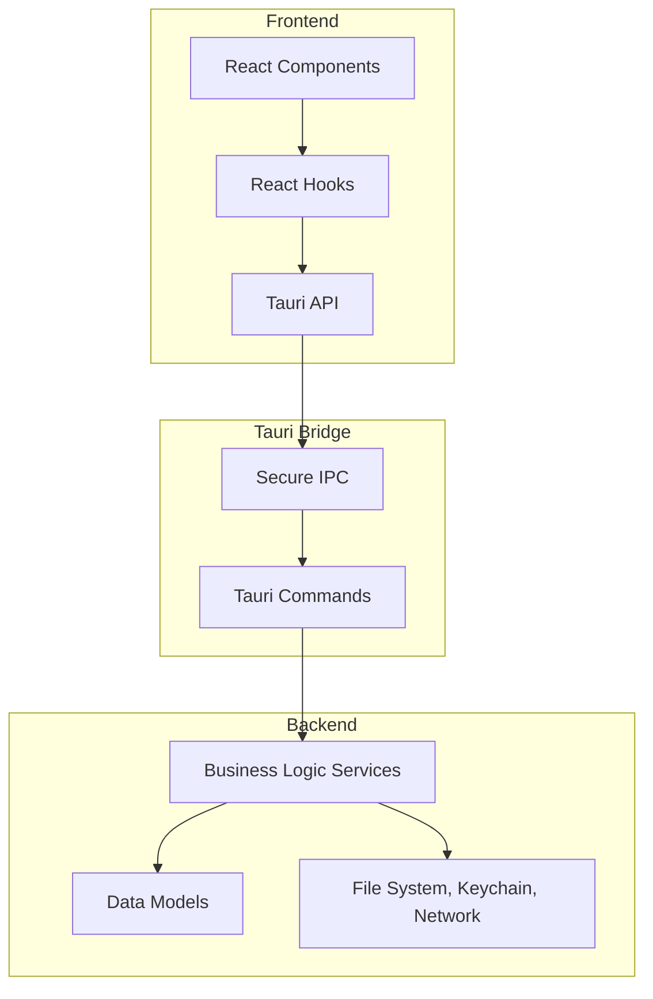

**Diagram sources**

- [lib.rs](file://src-tauri/src/lib.rs#L21-L88)
- [tauri.ts](file://src/lib/tauri.ts#L1-L364)

**Section sources**

- [lib.rs](file://src-tauri/src/lib.rs#L21-L88)
- [main.rs](file://src-tauri/src/main.rs#L1-L7)

## Tauri Command Pattern Implementation

The command pattern is central to MCP Nexus's frontend-backend communication architecture. Tauri commands serve as entry points for frontend requests, providing a secure and type-safe interface between the React frontend and Rust backend.

### Command Structure

Commands are implemented in the src-tauri/src/commands directory, with each module handling a specific domain of functionality:

- **config.rs**: Configuration management commands
- **installation.rs**: Server installation and uninstallation
- **sync.rs**: Client synchronization operations
- **health.rs**: Server health checking
- **marketplace.rs**: Marketplace operations

Each command is annotated with #[tauri::command] and registered in the tauri::generate_handler! macro in lib.rs. The commands follow a consistent pattern of accepting parameters, invoking service layer functions, and returning results or errors.

### Command Registration

In lib.rs, commands are registered with Tauri's invoke handler, making them available to the frontend:

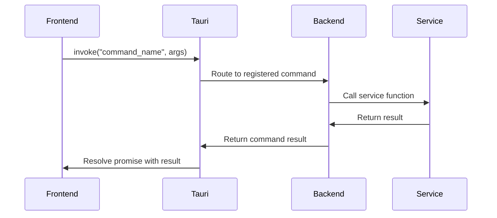

**Diagram sources**

- [lib.rs](file://src-tauri/src/lib.rs#L35-L85)
- [commands/mod.rs](file://src-tauri/src/commands/mod.rs#L1-L36)

**Section sources**

- [lib.rs](file://src-tauri/src/lib.rs#L35-L85)
- [commands/mod.rs](file://src-tauri/src/commands/mod.rs#L1-L36)

## Type-Safe Data Exchange

MCP Nexus implements type-safe data exchange between the frontend and backend using TypeScript interfaces and Rust structs that mirror each other across the boundary.

### Frontend Type Definitions

The frontend defines TypeScript interfaces in src/types/index.ts that correspond to backend data structures. These interfaces are used in the tauri.ts API layer to ensure type safety:

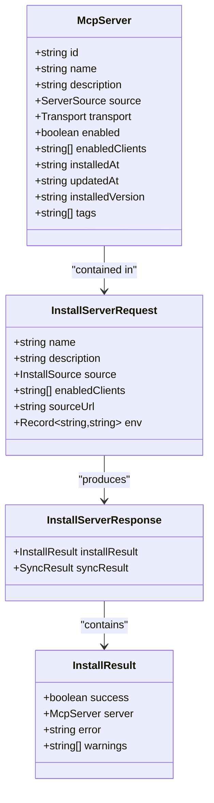

**Diagram sources**

- [index.ts](file://src/types/index.ts#L38-L278)
- [tauri.ts](file://src/lib/tauri.ts#L13-L18)

**Section sources**

- [index.ts](file://src/types/index.ts#L38-L278)
- [tauri.ts](file://src/lib/tauri.ts#L1-L364)

### Backend Type Definitions

The backend defines corresponding Rust structs in src-tauri/src/models that are serialized to JSON for transmission to the frontend. The serde crate handles serialization and deserialization with camelCase naming convention to match JavaScript conventions:

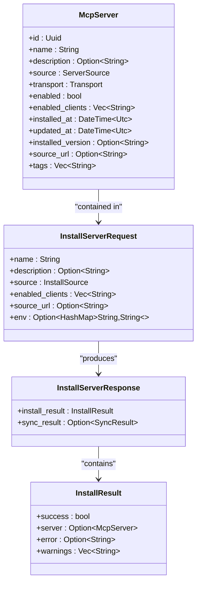

**Diagram sources**

- [models/server.rs](file://src-tauri/src/models/server.rs)
- [models/config.rs](file://src-tauri/src/models/config.rs)

**Section sources**

- [models/mod.rs](file://src-tauri/src/models/mod.rs#L1-L12)
- [commands/config.rs](file://src-tauri/src/commands/config.rs#L1-L151)

## Error Propagation Mechanism

MCP Nexus implements a comprehensive error propagation mechanism that ensures errors are properly handled and communicated from the backend services through commands to frontend hooks and UI components.

### Backend Error Handling

The backend uses Rust's strong type system and the thiserror crate to define domain-specific error types. Each command module defines its own error types that are converted to a common response format:

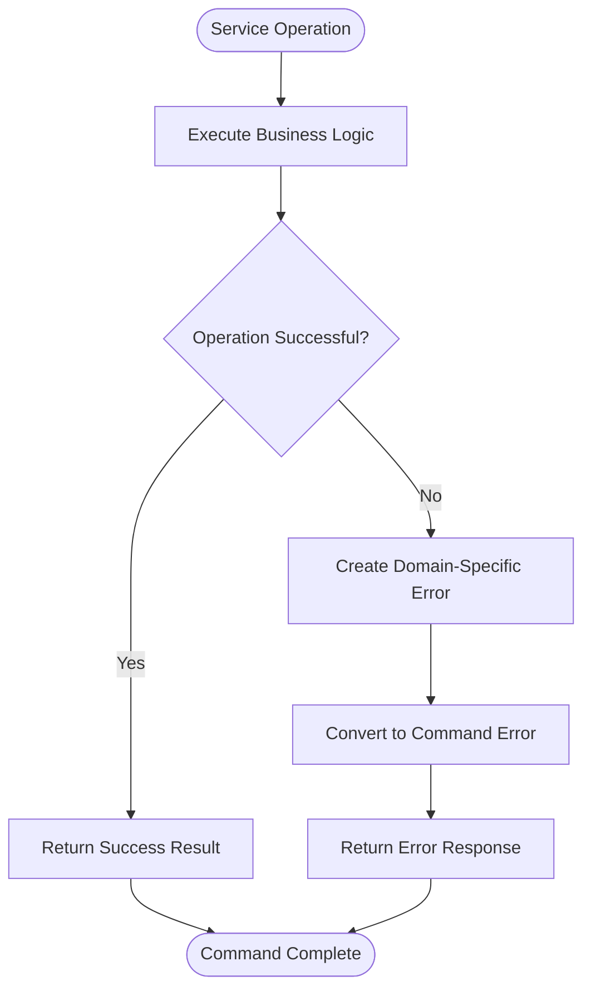

**Diagram sources**

- [config.rs](file://src-tauri/src/commands/config.rs#L11-L23)
- [installation.rs](file://src-tauri/src/commands/installation.rs#L11-L47)

**Section sources**

- [config.rs](file://src-tauri/src/commands/config.rs#L11-L23)
- [installation.rs](file://src-tauri/src/commands/installation.rs#L11-L47)

### Frontend Error Handling

On the frontend, errors are propagated through React Query hooks that wrap Tauri commands. These hooks handle the asynchronous nature of IPC calls and provide a clean interface for components:

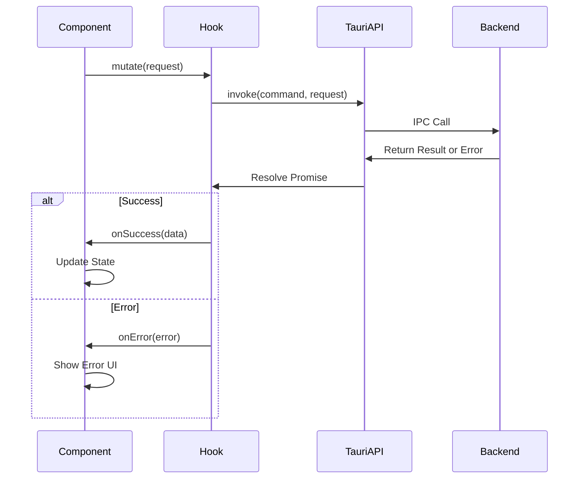

**Diagram sources**

- [useServers.ts](file://src/hooks/useServers.ts#L96-L112)
- [useClients.ts](file://src/hooks/useClients.ts#L89-L106)

**Section sources**

- [useServers.ts](file://src/hooks/useServers.ts#L96-L112)
- [useClients.ts](file://src/hooks/useClients.ts#L89-L106)

## Key Workflow Sequence Diagrams

This section documents the sequence of operations for key workflows in MCP Nexus, illustrating how frontend components interact with backend services through Tauri commands.

### Server Installation Workflow

The server installation workflow demonstrates the complete process of installing a new MCP server, from frontend request to backend execution and synchronization:

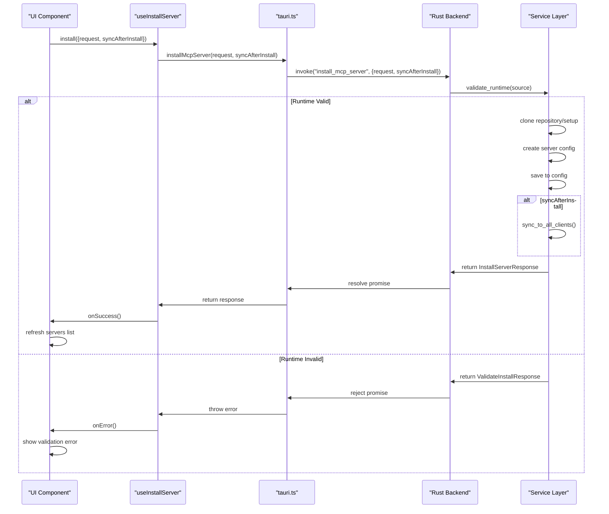

**Diagram sources**

- [installation.rs](file://src-tauri/src/commands/installation.rs#L98-L135)
- [useServers.ts](file://src/hooks/useServers.ts#L96-L112)

**Section sources**

- [installation.rs](file://src-tauri/src/commands/installation.rs#L98-L135)
- [useServers.ts](file://src/hooks/useServers.ts#L96-L112)

### Client Synchronization Workflow

The client synchronization workflow shows how configuration changes are propagated to AI clients:

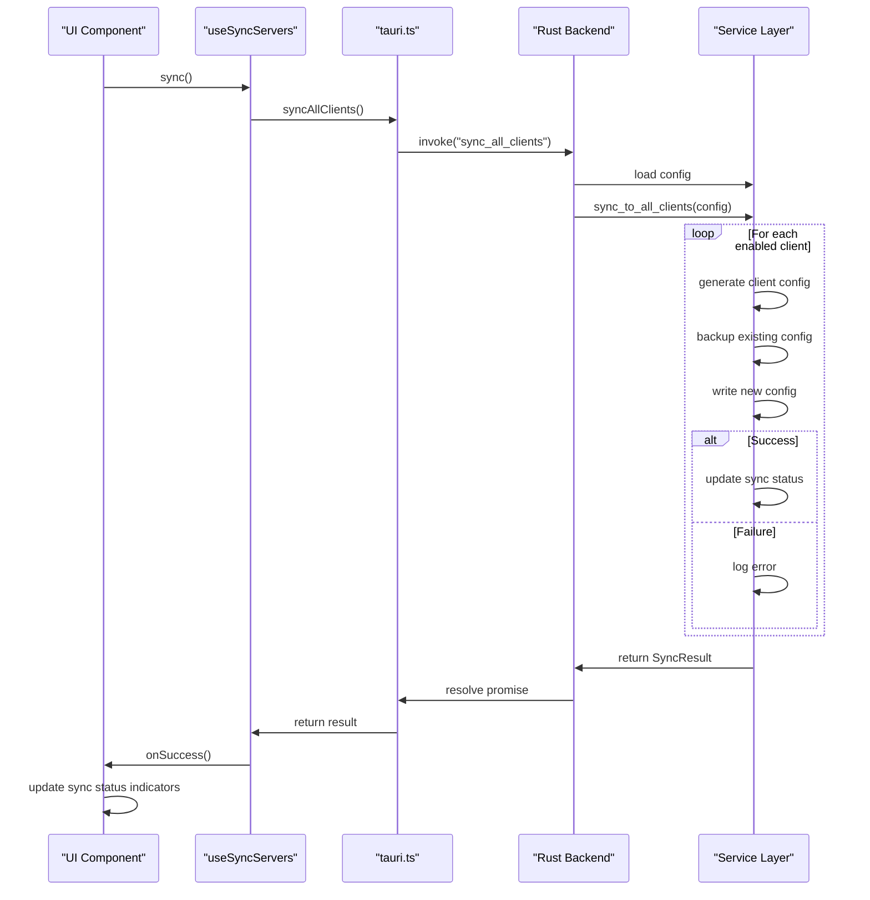

**Diagram sources**

- [sync.rs](file://src-tauri/src/commands/sync.rs#L108-L142)
- [useServers.ts](file://src/hooks/useServers.ts#L134-L143)

**Section sources**

- [sync.rs](file://src-tauri/src/commands/sync.rs#L108-L142)
- [useServers.ts](file://src/hooks/useServers.ts#L134-L143)

### Health Checking Workflow

The health checking workflow demonstrates how server health status is determined:

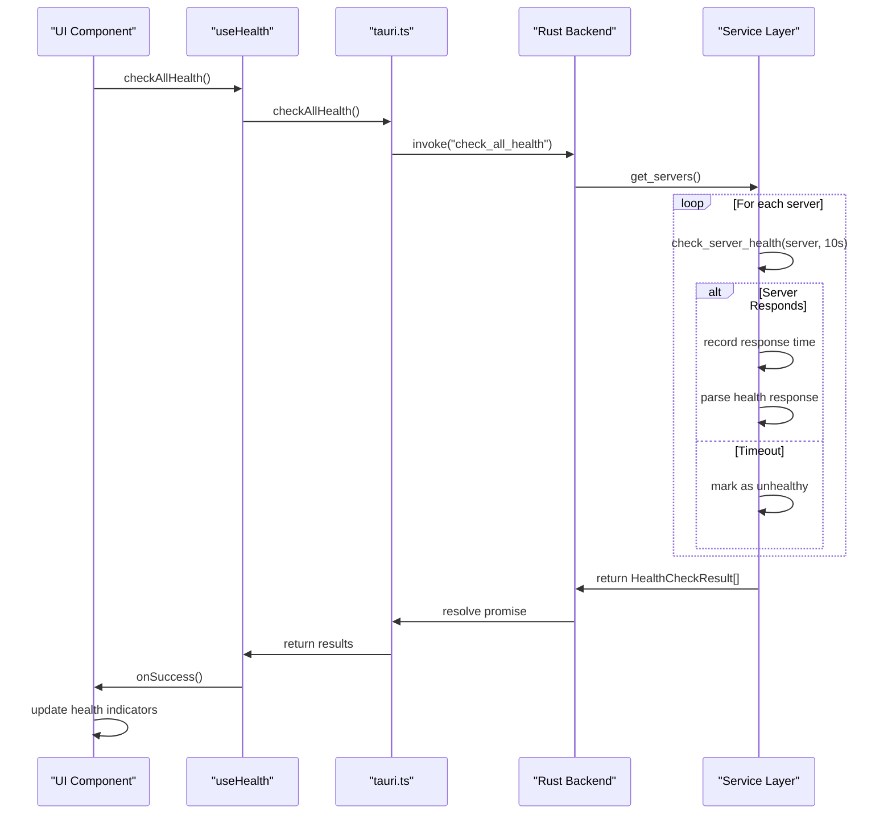

**Diagram sources**

- [health.rs](file://src-tauri/src/commands/health.rs#L54-L74)
- [useHealth.ts](file://src/hooks/useHealth.ts)

**Section sources**

- [health.rs](file://src-tauri/src/commands/health.rs#L54-L74)

## Security Considerations

MCP Nexus implements several security measures in its command implementation, input validation, and data serialization to ensure the integrity and safety of the application.

### Command Security

Tauri provides built-in security features that are configured in tauri.conf.json:

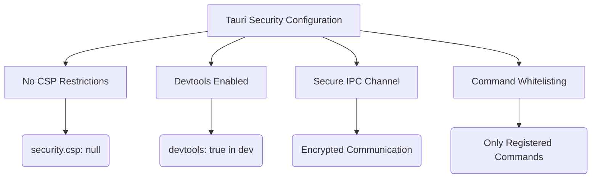

**Diagram sources**

- [tauri.conf.json](file://src-tauri/tauri.conf.json#L20-L22)

**Section sources**

- [tauri.conf.json](file://src-tauri/tauri.conf.json#L20-L22)
- [Cargo.toml](file://src-tauri/Cargo.toml#L21)

### Input Validation

The application implements rigorous input validation at multiple levels:

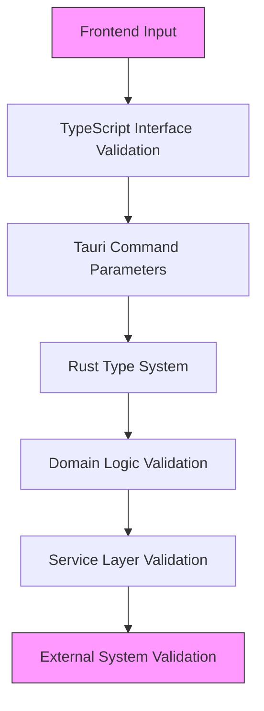

**Section sources**

- [config.rs](file://src-tauri/src/commands/config.rs#L89-L92)
- [installation.rs](file://src-tauri/src/commands/installation.rs#L150-L153)

### Data Serialization Security

The application uses serde for secure data serialization with the following features:

- Automatic JSON serialization/deserialization
- Strong type checking
- Custom serialization rules
- Protection against injection attacks

**Section sources**

- [Cargo.toml](file://src-tauri/Cargo.toml#L23)
- [config.rs](file://src-tauri/src/commands/config.rs#L27-L35)

## Tauri Configuration

The tauri.conf.json file contains critical configuration that impacts command availability and security settings for the application.

### Configuration Overview

The configuration defines essential application properties and build settings:

```json
{
  "productName": "mcp-nexus",
  "version": "0.1.0",
  "identifier": "com.joshsmbp.mcp-nexus",
  "build": {
    "beforeDevCommand": "npm run dev",
    "devUrl": "http://localhost:1420",
    "beforeBuildCommand": "npm run build",
    "frontendDist": "../dist"
  },
  "app": {
    "windows": [
      {
        "title": "mcp-nexus",
        "width": 800,
        "height": 600
      }
    ],
    "security": {
      "csp": null
    }
  },
  "bundle": {
    "active": true,
    "targets": "all",
    "icon": [
      "icons/32x32.png",
      "icons/128x128.png",
      "icons/128x128@2x.png",
      "icons/icon.icns",
      "icons/icon.ico"
    ]
  }
}
```

### Impact on Commands and Security

The configuration has several important implications for command functionality and security:

- **security.csp: null**: Disables Content Security Policy, allowing greater flexibility but requiring careful input validation
- **devUrl**: Specifies the development server URL for hot reloading
- **frontendDist**: Defines the location of compiled frontend assets
- **windows**: Configures the main application window properties

The configuration also affects how commands are exposed and accessed, as Tauri uses this configuration to determine which commands are available and how they are secured.

**Section sources**

- [tauri.conf.json](file://src-tauri/tauri.conf.json#L1-L36)
- [Cargo.toml](file://src-tauri/Cargo.toml#L21)
