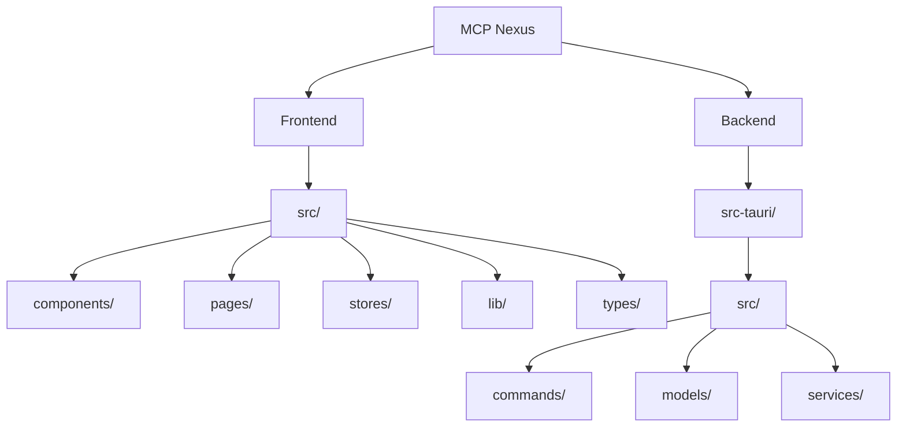
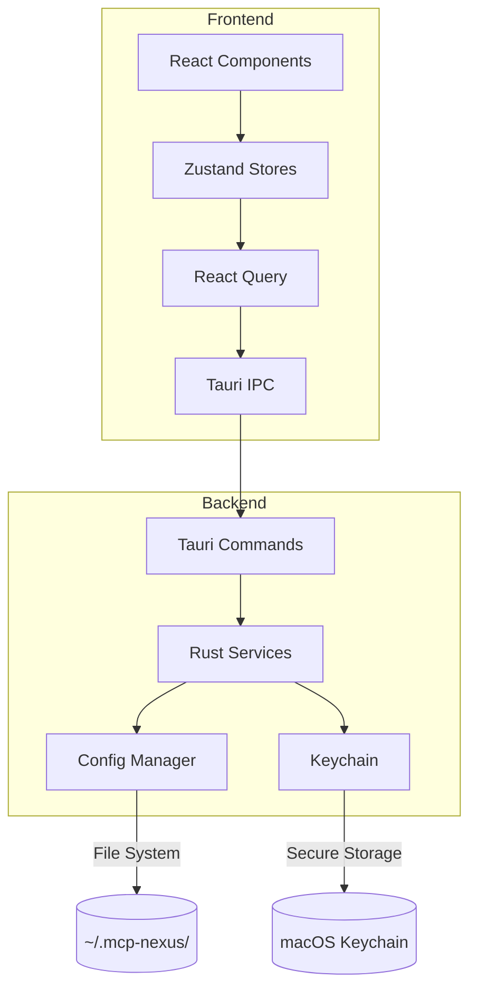
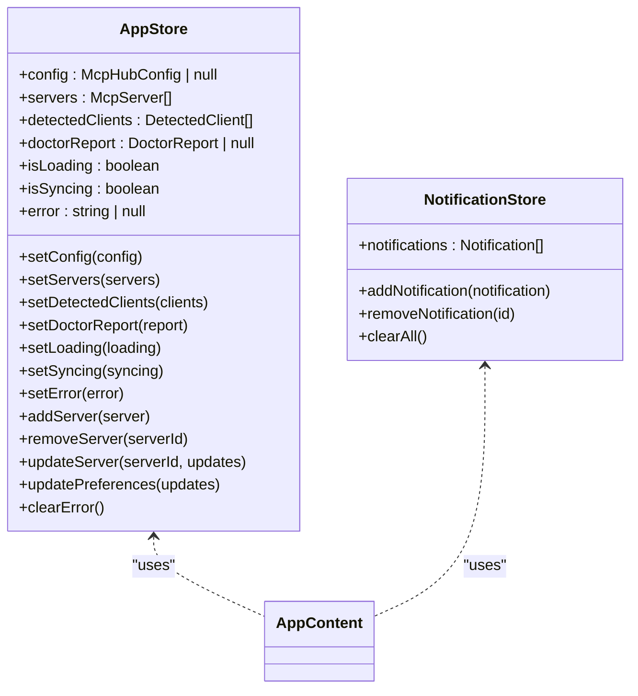
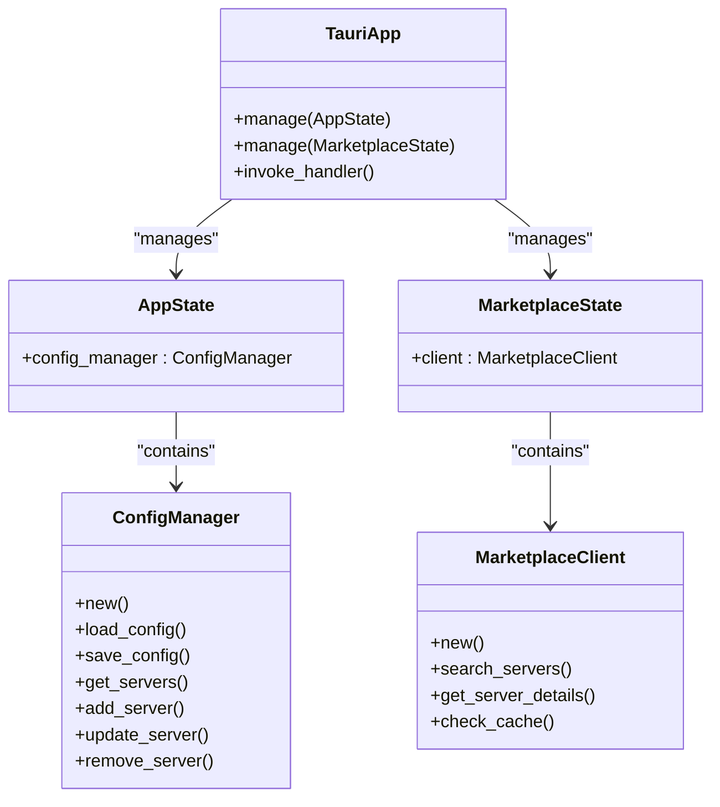
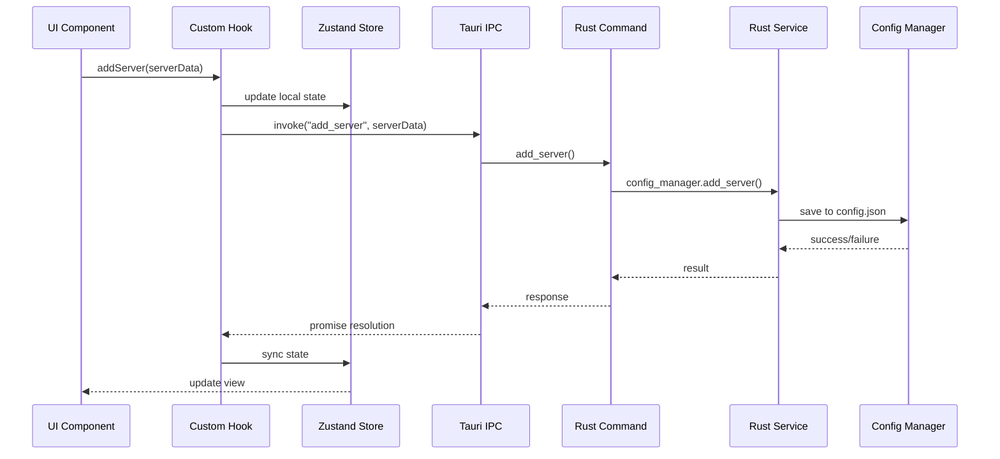
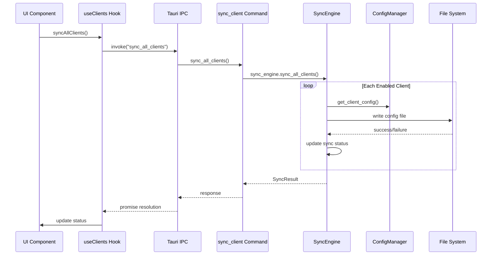
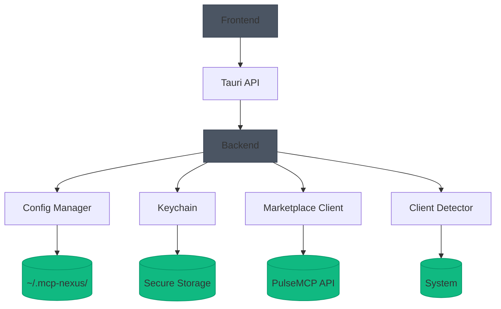
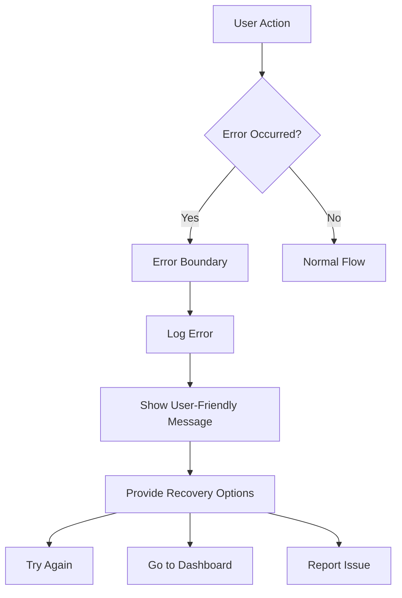

# Technical Architecture

<cite>
**Referenced Files in This Document**   
- [main.tsx](file://src/main.tsx)
- [App.tsx](file://src/App.tsx)
- [tauri.ts](file://src/lib/tauri.ts)
- [appStore.ts](file://src/stores/appStore.ts)
- [notificationStore.ts](file://src/stores/notificationStore.ts)
- [main.rs](file://src-tauri/src/main.rs)
- [lib.rs](file://src-tauri/src/lib.rs)
- [mod.rs](file://src-tauri/src/commands/mod.rs)
- [ErrorBoundary.tsx](file://src/components/common/ErrorBoundary.tsx)
</cite>

## Table of Contents

1. [Introduction](#introduction)
2. [Project Structure](#project-structure)
3. [Core Components](#core-components)
4. [Architecture Overview](#architecture-overview)
5. [Detailed Component Analysis](#detailed-component-analysis)
6. [Dependency Analysis](#dependency-analysis)
7. [Performance Considerations](#performance-considerations)
8. [Troubleshooting Guide](#troubleshooting-guide)
9. [Conclusion](#conclusion)

## Introduction

MCP Nexus is a hybrid desktop application that provides centralized management of Model Context Protocol (MCP) servers across multiple AI clients. The application combines a React frontend with a Rust backend through the Tauri framework, creating a secure and performant desktop experience. This document details the architectural design, component interactions, and data flow patterns that enable MCP Nexus to manage server configurations, synchronize across clients, and provide a seamless user experience.

## Project Structure

**Diagram sources**

- [src/](file://src/)
- [src-tauri/](file://src-tauri/)

**Section sources**

- [README.md](file://README.md#L158-L178)

## Core Components

The MCP Nexus application is built around a hybrid architecture that separates concerns between the React frontend and Rust backend, connected through Tauri's secure IPC mechanism. The frontend handles user interface rendering and state management using React, Zustand, and React Query, while the backend manages configuration, client synchronization, and system interactions using Rust. Tauri serves as the bridge between these components, enabling secure communication through a command pattern that prevents direct access to system resources from the frontend.

**Section sources**

- [README.md](file://README.md#L180-L186)
- [package.json](file://package.json#L20-L28)
- [Cargo.toml](file://src-tauri/Cargo.toml#L20-L33)

## Architecture Overview

**Diagram sources**

- [App.tsx](file://src/App.tsx#L1-L58)
- [lib.rs](file://src-tauri/src/lib.rs#L1-L89)
- [tauri.ts](file://src/lib/tauri.ts#L1-L364)

## Detailed Component Analysis

### Frontend Architecture

The frontend architecture of MCP Nexus follows a domain-based component organization with clear separation of concerns. The application uses React 19 with TypeScript for type safety, Tailwind CSS for styling, and React Router for navigation. State management is handled through a combination of Zustand for global state and React Query for server state management.

#### State Management with Zustand

**Diagram sources**

- [appStore.ts](file://src/stores/appStore.ts#L1-L118)
- [notificationStore.ts](file://src/stores/notificationStore.ts#L1-L97)

**Section sources**

- [appStore.ts](file://src/stores/appStore.ts#L1-L118)
- [notificationStore.ts](file://src/stores/notificationStore.ts#L1-L97)

### Backend Service Layer

The backend service layer is implemented in Rust and follows a clean architecture with dependency injection through Tauri's manage system. Services are organized by domain (config, client detection, synchronization, etc.) and expose their functionality through command handlers that are accessible to the frontend via Tauri's invoke pattern.

#### Service Architecture and Dependency Injection

**Diagram sources**

- [lib.rs](file://src-tauri/src/lib.rs#L1-L89)
- [services/mod.rs](file://src-tauri/src/services/mod.rs#L1-L30)
- [config_manager.rs](file://src-tauri/src/services/config_manager.rs)

**Section sources**

- [lib.rs](file://src-tauri/src/lib.rs#L1-L89)
- [services/mod.rs](file://src-tauri/src/services/mod.rs#L1-L30)

### Data Flow Analysis

The data flow in MCP Nexus follows a consistent pattern from user interaction through UI components, hooks, Tauri commands, and Rust services. This section details the sequence of operations for key workflows in the application.

#### Server Addition Workflow

**Diagram sources**

- [tauri.ts](file://src/lib/tauri.ts#L62-L65)
- [config.rs](file://src-tauri/src/commands/config.rs)
- [config_manager.rs](file://src-tauri/src/services/config_manager.rs)

**Section sources**

- [tauri.ts](file://src/lib/tauri.ts#L62-L65)
- [appStore.ts](file://src/stores/appStore.ts#L79-L87)

#### Client Synchronization Workflow

**Diagram sources**

- [tauri.ts](file://src/lib/tauri.ts#L120-L122)
- [sync.rs](file://src-tauri/src/commands/sync.rs)
- [sync_engine.rs](file://src-tauri/src/services/sync_engine.rs)

**Section sources**

- [tauri.ts](file://src/lib/tauri.ts#L120-L122)
- [useClients.ts](file://src/hooks/useClients.ts)

## Dependency Analysis

**Diagram sources**

- [Cargo.toml](file://src-tauri/Cargo.toml#L20-L33)
- [package.json](file://package.json#L20-L28)
- [lib.rs](file://src-tauri/src/lib.rs#L1-L89)

**Section sources**

- [Cargo.toml](file://src-tauri/Cargo.toml#L20-L33)
- [package.json](file://package.json#L20-L28)

## Performance Considerations

The MCP Nexus application employs several performance optimization strategies across both frontend and backend. On the frontend, React Query provides efficient data fetching with caching, deduplication, and background refetching capabilities. The Zustand stores enable efficient state updates with minimal re-renders through granular subscriptions. On the backend, the Tokio async runtime allows for non-blocking I/O operations, enabling concurrent processing of multiple client synchronization tasks. The application also implements caching strategies for marketplace data and client detection results to minimize redundant system calls and network requests.

## Troubleshooting Guide

**Diagram sources**

- [ErrorBoundary.tsx](file://src/components/common/ErrorBoundary.tsx#L1-L136)
- [App.tsx](file://src/App.tsx#L19-L39)

**Section sources**

- [ErrorBoundary.tsx](file://src/components/common/ErrorBoundary.tsx#L1-L136)
- [App.tsx](file://src/App.tsx#L19-L39)

## Conclusion

MCP Nexus demonstrates a well-architected hybrid desktop application that effectively leverages the strengths of both React and Rust through the Tauri framework. The clear separation between frontend and backend concerns, combined with a secure IPC communication pattern, creates a robust foundation for managing MCP servers across multiple AI clients. The application's modular design, with domain-based component organization and service-oriented backend architecture, enables maintainability and extensibility. Future enhancements could include additional error monitoring, performance profiling, and expanded cross-platform support while maintaining the current architectural principles.
