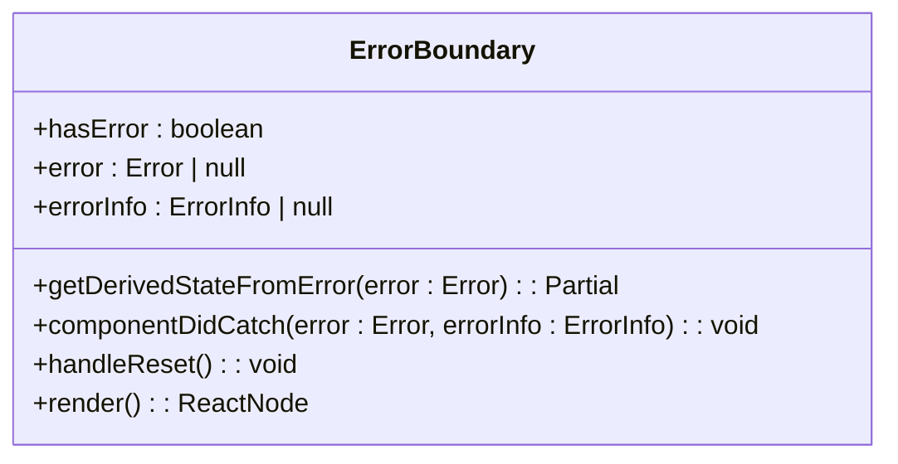
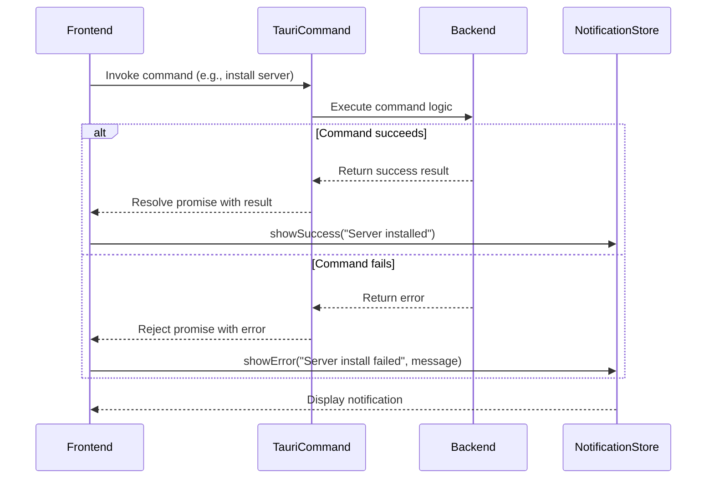
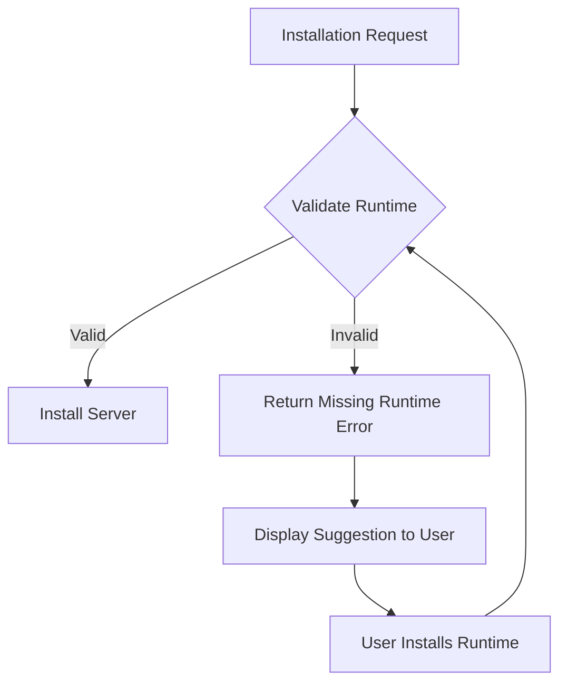
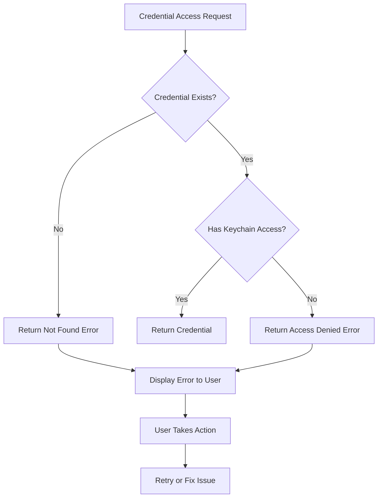
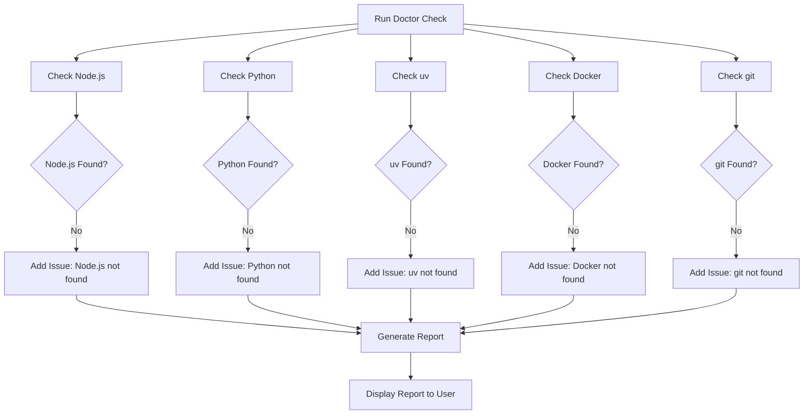
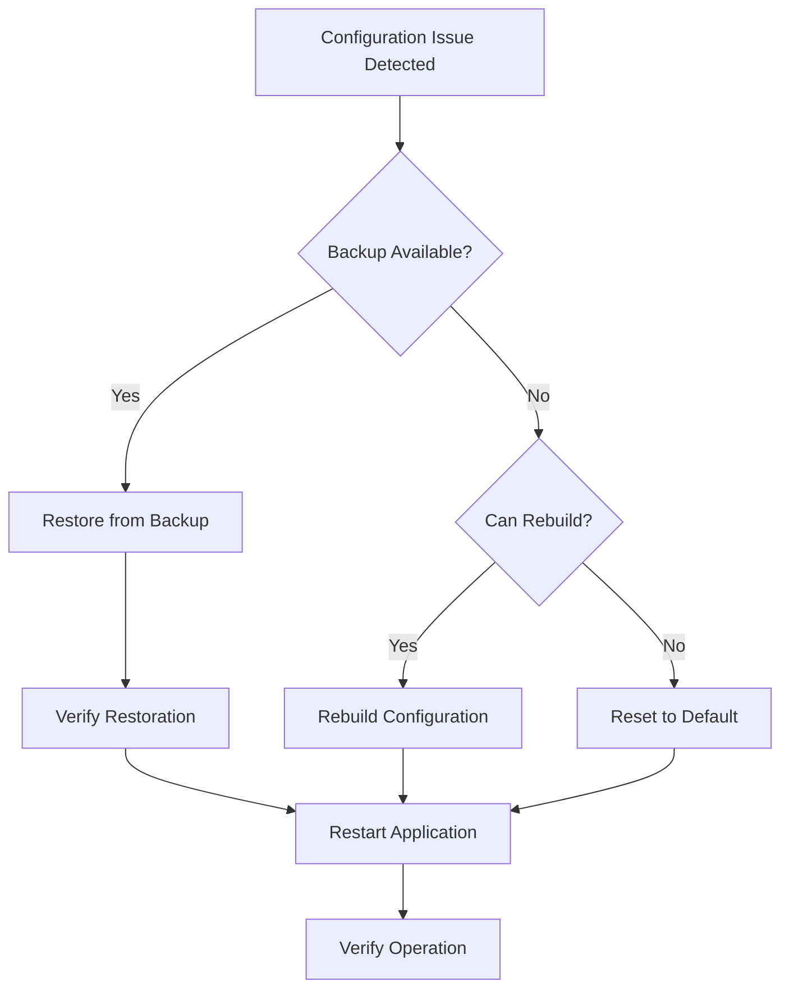
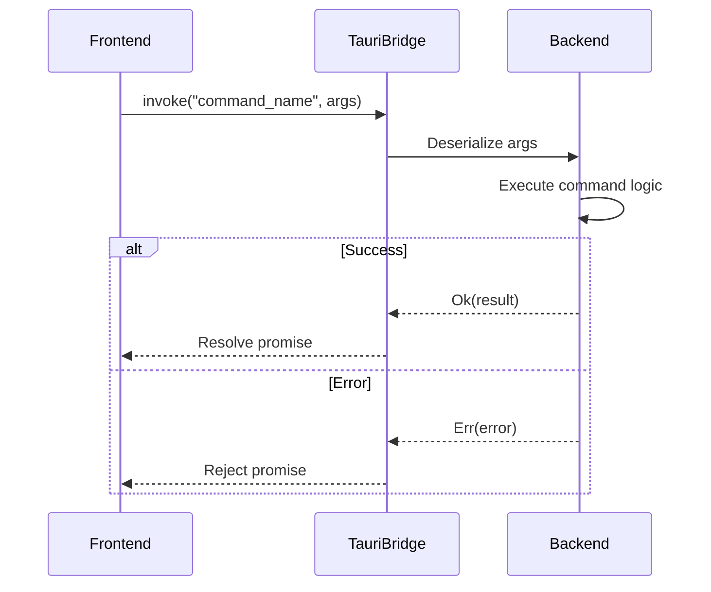

# Troubleshooting

<cite>
**Referenced Files in This Document**   
- [ErrorBoundary.tsx](file://src/components/common/ErrorBoundary.tsx)
- [notifications.ts](file://src/lib/notifications.ts)
- [notificationStore.ts](file://src/stores/notificationStore.ts)
- [tauri.ts](file://src/lib/tauri.ts)
- [useDoctor.ts](file://src/hooks/useDoctor.ts)
- [doctor.rs](file://src-tauri/src/commands/doctor.rs)
- [doctor.rs](file://src-tauri/src/services/doctor.rs)
- [health.rs](file://src-tauri/src/commands/health.rs)
- [health.rs](file://src-tauri/src/services/health.rs)
- [installation.rs](file://src-tauri/src/commands/installation.rs)
- [keychain.rs](file://src-tauri/src/commands/keychain.rs)
- [keychain.rs](file://src-tauri/src/services/keychain.rs)
- [index.ts](file://src/types/index.ts)
</cite>

## Table of Contents

1. [Introduction](#introduction)
2. [Error Handling Patterns](#error-handling-patterns)
3. [Common Issues and Solutions](#common-issues-and-solutions)
4. [Diagnostic Information Collection](#diagnostic-information-collection)
5. [Network Troubleshooting](#network-troubleshooting)
6. [File Permission and Configuration Recovery](#file-permission-and-configuration-recovery)
7. [Frontend and Backend Debugging](#frontend-and-backend-debugging)
8. [Development Tools Usage](#development-tools-usage)
9. [Conclusion](#conclusion)

## Introduction

This document provides comprehensive troubleshooting guidance for MCP Nexus, a tool for managing MCP (Model Context Protocol) servers. The document covers error handling patterns, common issues, diagnostic information collection, network troubleshooting, file permission and configuration recovery, frontend and backend debugging, and development tools usage.

**Section sources**

- [ErrorBoundary.tsx](file://src/components/common/ErrorBoundary.tsx#L1-L136)
- [notifications.ts](file://src/lib/notifications.ts#L1-L161)
- [notificationStore.ts](file://src/stores/notificationStore.ts#L1-L97)

## Error Handling Patterns

MCP Nexus implements a robust error handling system that spans both the frontend (React) and backend (Rust) components. The system is designed to provide meaningful error messages to users while maintaining application stability.

### ErrorBoundary Component

The ErrorBoundary component is a React error boundary that catches JavaScript errors anywhere in the child component tree, logs those errors, and displays a fallback UI instead of the component tree that crashed. This prevents the entire application from crashing due to a single component error.

The ErrorBoundary component captures both the error object and the error information, including the component stack trace. When an error occurs, it displays a user-friendly error message with an option to view detailed error information. Users can attempt to recover by clicking "Try Again" or navigate back to the dashboard.



**Diagram sources**

- [ErrorBoundary.tsx](file://src/components/common/ErrorBoundary.tsx#L14-L136)

### Structured Error Reporting from Tauri Commands

The backend Rust code uses Tauri commands to communicate with the frontend. These commands follow a structured error reporting pattern using specific error types that are serialized and sent to the frontend.

For example, the health check commands use a HealthError type that contains a message field. This error type implements the From trait for String, &str, allowing easy conversion from string literals to HealthError instances. When a command fails, it returns a Result type with the appropriate error, which is then serialized and sent to the frontend.

The installation commands use a more complex error hierarchy with InstallError containing both a message and an error_type field. This allows the frontend to handle different types of installation errors differently, such as missing runtime errors versus configuration errors.

### User-Facing Notifications

MCP Nexus uses a notification system to provide feedback to users about the success or failure of operations. The system is built around a notification store that manages a collection of notifications, each with a type (success, error, warning, info), title, message, and duration.

The frontend code provides semantic notification helpers in the notifications.ts file that wrap the generic notification store. These helpers standardize titles and messages for critical operations and avoid including sensitive values. For example, notifyServerInstallSuccess displays a success notification when a server is installed, while notifyServerInstallError displays an error notification with a user-friendly message.

The notification system is designed to be non-intrusive, with success and info notifications auto-dismissing after 5 seconds, while error notifications persist for 8 seconds to ensure users see them.



**Diagram sources**

- [notifications.ts](file://src/lib/notifications.ts#L6-L161)
- [notificationStore.ts](file://src/stores/notificationStore.ts#L1-L97)
- [tauri.ts](file://src/lib/tauri.ts#L1-L364)

**Section sources**

- [notifications.ts](file://src/lib/notifications.ts#L6-L161)
- [notificationStore.ts](file://src/stores/notificationStore.ts#L1-L97)
- [tauri.ts](file://src/lib/tauri.ts#L1-L364)

## Common Issues and Solutions

This section catalogs common problems encountered when using MCP Nexus, categorized by component, with diagnostic steps and solutions.

### Server Installation Failures

Server installation failures are one of the most common issues. These can occur due to missing runtime dependencies, network connectivity issues, or permission problems.

#### Missing Runtime Dependencies

When installing a server that requires a specific runtime (Node.js, Python, Docker, etc.), the installation will fail if the runtime is not available on the system. The error message will typically indicate which runtime is missing.

**Diagnostic Steps:**

1. Run the "Environment Doctor" check from the dashboard
2. Check the DoctorReport for missing runtimes
3. Verify the specific runtime is installed and in the system PATH

**Solutions:**

- For Node.js: Install via nvm (recommended) or from nodejs.org
- For Python: Install Python 3.x from python.org
- For Docker: Install Docker Desktop from docker.com
- For git: Install from git-scm.com or via Xcode Command Line Tools



**Diagram sources**

- [doctor.rs](file://src-tauri/src/services/doctor.rs#L5-L330)
- [installation.rs](file://src-tauri/src/commands/installation.rs#L1-L288)

#### Network Connectivity Issues

Network issues can prevent the installation of servers from remote sources like npm, PyPI, or GitHub.

**Diagnostic Steps:**

1. Check internet connectivity
2. Verify firewall settings are not blocking connections
3. Check if corporate proxy is interfering with connections

**Solutions:**

- Ensure stable internet connection
- Configure proxy settings if behind corporate firewall
- Try again during off-peak hours if network is congested

### Sync Errors

Sync errors occur when MCP Nexus fails to synchronize server configurations to AI clients.

#### Client Configuration Conflicts

When multiple instances of MCP Nexus are running or when clients modify their configuration files externally, sync conflicts can occur.

**Diagnostic Steps:**

1. Check if the client configuration file has been modified externally
2. Verify no other instances of MCP Nexus are running
3. Check file permissions on the configuration file

**Solutions:**

- Allow MCP Nexus to create a backup before syncing
- Manually resolve conflicts by comparing the current configuration with the backup
- Ensure only one instance of MCP Nexus is running at a time

#### Manual Configuration Required

Some clients like Warp require manual configuration rather than automatic syncing.

**Diagnostic Steps:**

1. Check the client's sync mode in the configuration
2. Verify the client supports automatic configuration

**Solutions:**

- Use the "Copy Manual Config" button to copy the configuration to clipboard
- Manually paste the configuration into the client's settings
- Refer to the client's documentation for configuration instructions

### Health Check Timeouts

Health check timeouts occur when MCP Nexus cannot establish a connection to a server within the expected timeframe.

#### Server Not Responding

The server may not be running or may be unresponsive.

**Diagnostic Steps:**

1. Verify the server process is running
2. Check server logs for errors
3. Verify the server's transport configuration is correct

**Solutions:**

- Restart the server
- Check server configuration for errors
- Verify network connectivity between MCP Nexus and the server

#### Network Latency

High network latency can cause health checks to timeout.

**Diagnostic Steps:**

1. Test network connectivity to the server
2. Check for network congestion
3. Verify firewall settings are not delaying packets

**Solutions:**

- Optimize network configuration
- Move server closer to MCP Nexus instance
- Increase health check timeout threshold

### Credential Access Issues

Credential access issues occur when MCP Nexus cannot access credentials stored in the system keychain.

#### Credential Not Found

The requested credential does not exist in the keychain.

**Diagnostic Steps:**

1. Verify the credential name is correct
2. Check if the credential was deleted
3. Verify keychain access permissions

**Solutions:**

- Re-add the credential through the Credential Manager
- Verify the application has permission to access the keychain
- Check for typos in the credential name

#### Keychain Access Denied

The application does not have permission to access the keychain.

**Diagnostic Steps:**

1. Check system security settings
2. Verify application permissions
3. Check if keychain is locked

**Solutions:**

- Grant keychain access permission to MCP Nexus
- Unlock the keychain if it's locked
- Restart the application to re-request permissions



**Diagram sources**

- [keychain.rs](file://src-tauri/src/commands/keychain.rs#L1-L144)
- [keychain.rs](file://src-tauri/src/services/keychain.rs#L1-L438)

**Section sources**

- [doctor.rs](file://src-tauri/src/services/doctor.rs#L5-L330)
- [installation.rs](file://src-tauri/src/commands/installation.rs#L1-L288)
- [health.rs](file://src-tauri/src/commands/health.rs#L1-L100)
- [keychain.rs](file://src-tauri/src/commands/keychain.rs#L1-L144)
- [keychain.rs](file://src-tauri/src/services/keychain.rs#L1-L438)

## Diagnostic Information Collection

Effective troubleshooting requires collecting diagnostic information from various sources within MCP Nexus.

### Log Files

MCP Nexus generates log files that contain detailed information about application operations and errors. These logs are essential for diagnosing issues.

**Log Locations:**

- Application logs: ~/.mcp-nexus/logs/
- Auto-sync logs: ~/.mcp-nexus/logs/auto-sync.log
- Error logs: ~/.mcp-nexus/logs/error.log

**Log Levels:**

- DEBUG: Detailed information for debugging
- INFO: General operational information
- WARN: Potential issues that don't prevent operation
- ERROR: Errors that prevent operations from completing

### Debug Mode

Enabling debug mode provides additional diagnostic information and disables certain optimizations that might hide issues.

**Enabling Debug Mode:**

1. Open the Settings page
2. Navigate to the Advanced section
3. Toggle "Enable Debug Mode"
4. Restart MCP Nexus

When debug mode is enabled, the application will:

- Log additional diagnostic information
- Disable error boundaries to allow errors to propagate
- Show additional debugging UI elements
- Validate data more thoroughly

### Environment Doctor Check

The Environment Doctor check is a comprehensive diagnostic tool that verifies the system environment is properly configured for MCP Nexus operation.

**Running the Doctor Check:**

1. Navigate to the Dashboard
2. Click on the "Environment" summary card
3. Click "Run Doctor Check"
4. Review the generated report

The doctor check verifies:

- Node.js installation and version
- Python installation and version
- uv package manager availability
- Docker installation and version
- git installation and version
- Required runtime dependencies for server types



**Diagram sources**

- [doctor.rs](file://src-tauri/src/services/doctor.rs#L5-L330)
- [useDoctor.ts](file://src/hooks/useDoctor.ts#L1-L80)

### Support Package Generation

When contacting support, it's helpful to provide a comprehensive package of diagnostic information.

**Generating a Support Package:**

1. Run the Environment Doctor check
2. Collect relevant log files
3. Export the current configuration
4. Take screenshots of error messages
5. Document the steps to reproduce the issue

The support package should include:

- DoctorReport.json
- config.json
- Recent log files
- Screenshots of error messages
- Steps to reproduce the issue

**Section sources**

- [useDoctor.ts](file://src/hooks/useDoctor.ts#L1-L80)
- [doctor.rs](file://src-tauri/src/services/doctor.rs#L5-L330)
- [tauri.ts](file://src/lib/tauri.ts#L1-L364)

## Network Troubleshooting

Network issues can affect various aspects of MCP Nexus operation, from server installation to health checks.

### Connectivity Testing

Testing network connectivity is the first step in diagnosing network issues.

**Testing Methods:**

- Ping test to verify basic connectivity
- Port check to verify specific ports are accessible
- DNS lookup to verify domain name resolution
- HTTP request to verify web service accessibility

### Firewall and Proxy Configuration

Firewall and proxy settings can block necessary network connections.

**Common Issues:**

- Corporate firewalls blocking connections to package registries
- Antivirus software interfering with network traffic
- Proxy servers requiring authentication
- NAT configurations preventing inbound connections

**Solutions:**

- Configure firewall exceptions for MCP Nexus
- Set up proxy authentication credentials
- Adjust NAT settings to allow necessary traffic
- Use VPN if network restrictions are too restrictive

### DNS Resolution Problems

DNS issues can prevent access to remote servers and package registries.

**Diagnostic Steps:**

1. Test DNS resolution with nslookup or dig
2. Check DNS server configuration
3. Verify domain names are correct
4. Test with alternative DNS servers

**Solutions:**

- Use reliable DNS servers (e.g., Google DNS, Cloudflare DNS)
- Configure DNS caching
- Add entries to hosts file for critical domains
- Implement DNS failover

## File Permission and Configuration Recovery

File permission issues and corrupted configurations can prevent MCP Nexus from operating correctly.

### File Permission Repair

Incorrect file permissions can prevent MCP Nexus from reading or writing necessary files.

**Common Permission Issues:**

- Configuration directory not writable
- Log files not writable
- Keychain access denied
- Server installation directories not writable

**Repair Procedures:**

1. Verify the user owns the MCP Nexus directories
2. Set appropriate permissions on configuration files
3. Ensure the application has necessary access rights
4. Repair keychain permissions if necessary

### Configuration Recovery

Corrupted configurations can occur due to improper shutdowns, disk errors, or software bugs.

**Recovery Methods:**

- Restore from backup: MCP Nexus creates backups before major operations
- Revert to last known good configuration
- Rebuild configuration from server definitions
- Reset to default configuration

**Prevention Strategies:**

- Regularly backup configuration files
- Use version control for configuration management
- Implement configuration validation
- Monitor disk health



**Diagram sources**

- [config_manager.rs](file://src-tauri/src/services/config_manager.rs#L36-L166)
- [sync_engine.rs](file://src-tauri/src/services/sync_engine.rs#L245-L338)

**Section sources**

- [config_manager.rs](file://src-tauri/src/services/config_manager.rs#L36-L166)
- [sync_engine.rs](file://src-tauri/src/services/sync_engine.rs#L245-L338)

## Frontend and Backend Debugging

Effective debugging requires understanding both the frontend (React) and backend (Rust) components of MCP Nexus.

### Frontend Debugging

The frontend is built with React and TypeScript, running in a Tauri environment.

**Debugging Tools:**

- Browser Developer Tools (when running in development mode)
- React Developer Tools extension
- TypeScript compiler error messages
- Console logging

**Common Frontend Issues:**

- Component rendering errors
- State management problems
- API communication failures
- UI responsiveness issues

**Debugging Strategies:**

- Use React error boundaries to catch and display errors
- Implement comprehensive logging
- Use TypeScript to catch type errors at compile time
- Test components in isolation

### Backend Debugging

The backend is written in Rust and runs as a Tauri backend service.

**Debugging Tools:**

- Rust compiler error messages
- println! debugging (in development)
- Logging with env_logger
- Debugger (e.g., lldb, gdb)

**Common Backend Issues:**

- Panics and unwraps
- Result handling errors
- Concurrency issues
- Memory management problems

**Debugging Strategies:**

- Use proper error handling with Result types
- Implement comprehensive logging
- Use Rust's strong type system to prevent errors
- Test with property-based testing

### Integrated Debugging

Since MCP Nexus is a hybrid application, debugging often requires understanding the interaction between frontend and backend.

**Debugging the Tauri Bridge:**

- Verify command names match between frontend and backend
- Check argument serialization/deserialization
- Monitor command execution timing
- Handle errors appropriately on both sides



**Diagram sources**

- [tauri.ts](file://src/lib/tauri.ts#L1-L364)
- [installation.rs](file://src-tauri/src/commands/installation.rs#L1-L288)
- [health.rs](file://src-tauri/src/commands/health.rs#L1-L100)

**Section sources**

- [tauri.ts](file://src/lib/tauri.ts#L1-L364)
- [installation.rs](file://src-tauri/src/commands/installation.rs#L1-L288)
- [health.rs](file://src-tauri/src/commands/health.rs#L1-L100)

## Development Tools Usage

Effective troubleshooting and development require proper use of development tools.

### Browser Developer Tools

When running in development mode, browser developer tools provide access to:

- Console for JavaScript errors and logs
- Network tab for API request monitoring
- Elements tab for DOM inspection
- Sources tab for JavaScript debugging
- Application tab for storage inspection

### Rust Development Tools

Rust provides several tools for development and debugging:

- cargo: Build and package management
- rustc: Rust compiler
- rust-analyzer: Language server for IDEs
- clippy: Linter for Rust code
- rustfmt: Code formatter

### Testing Frameworks

MCP Nexus uses several testing frameworks:

- Vitest for frontend unit and integration tests
- Rust's built-in test framework for backend tests
- Tauri's testing utilities for integration tests

**Running Tests:**

```bash
# Run frontend tests
npm run test

# Run backend tests
cargo test

# Run all tests
npm run test:all
```

### Logging Configuration

Proper logging configuration is essential for troubleshooting.

**Log Levels:**

- Set appropriate log levels for different environments
- Use structured logging for machine-readable logs
- Include timestamps and component identifiers
- Rotate logs to prevent disk space issues

## Conclusion

MCP Nexus provides a comprehensive set of tools and patterns for troubleshooting common issues. By understanding the error handling patterns, common issues, diagnostic information collection methods, network troubleshooting techniques, file permission repair procedures, and debugging strategies, users and developers can effectively resolve problems and maintain a stable environment.

The key to successful troubleshooting is systematic diagnosis, starting with the most common issues and progressively investigating more complex problems. Using the diagnostic tools provided by MCP Nexus, such as the Environment Doctor check and comprehensive logging, can quickly identify the root cause of most issues.

When issues cannot be resolved with the information in this document, collecting a complete support package with logs, configuration, and reproduction steps will enable support teams to provide effective assistance.

**Section sources**

- [ErrorBoundary.tsx](file://src/components/common/ErrorBoundary.tsx#L1-L136)
- [notifications.ts](file://src/lib/notifications.ts#L1-L161)
- [useDoctor.ts](file://src/hooks/useDoctor.ts#L1-L80)
- [tauri.ts](file://src/lib/tauri.ts#L1-L364)
