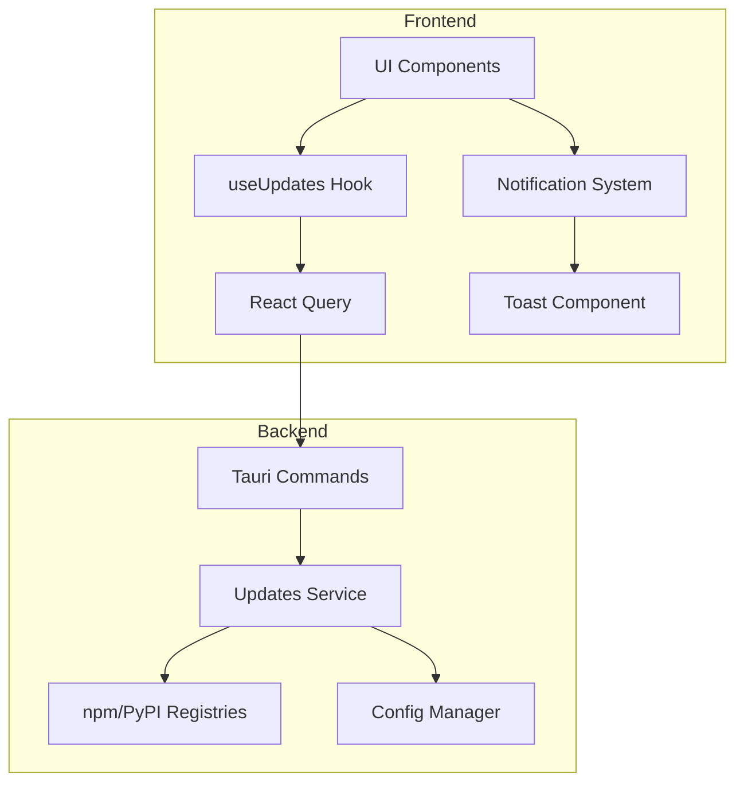
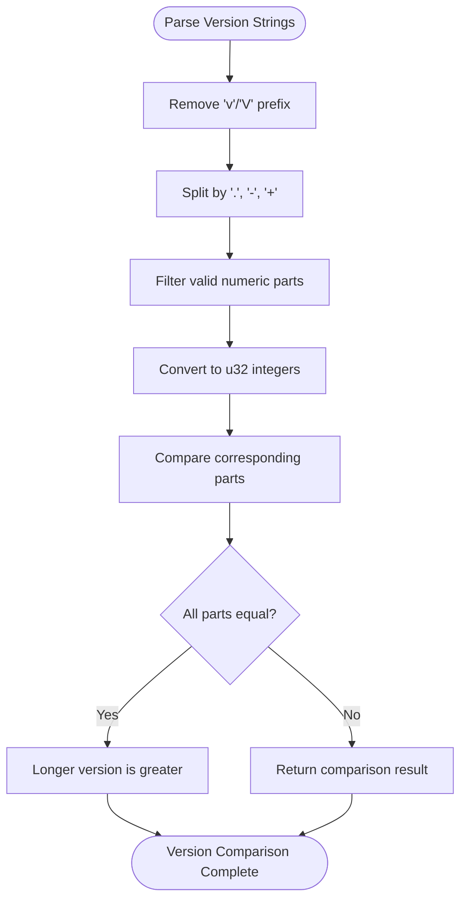
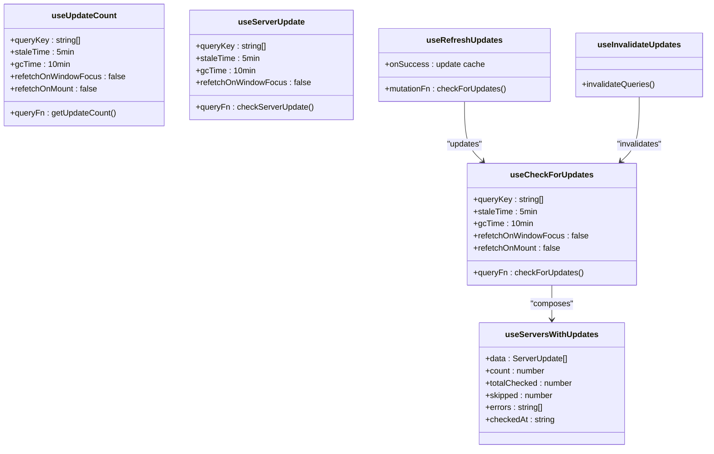
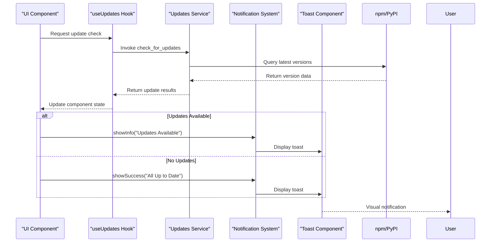
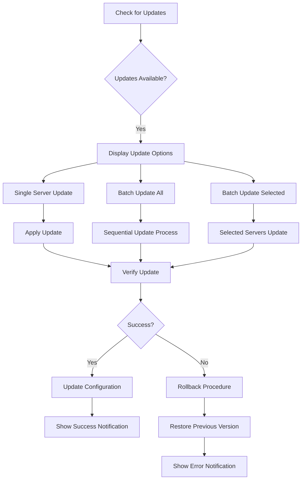
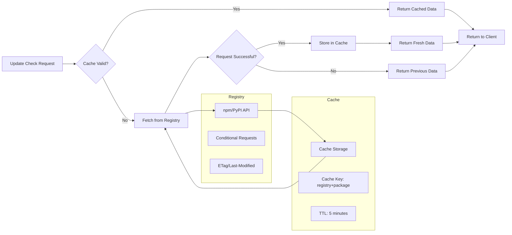
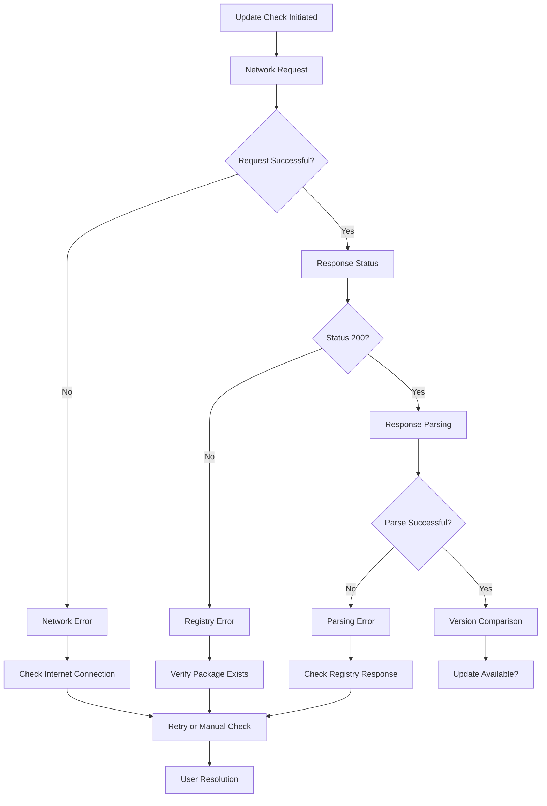
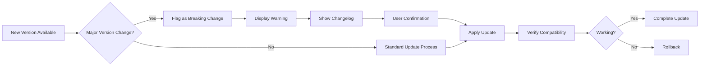

# Update Management

<cite>
**Referenced Files in This Document**   
- [useUpdates.ts](file://src/hooks/useUpdates.ts)
- [updates.rs](file://src-tauri/src/services/updates.rs)
- [updates.rs](file://src-tauri/src/commands/updates.rs)
- [tauri.ts](file://src/lib/tauri.ts)
- [UpdateSummary.tsx](file://src/components/dashboard/UpdateSummary.tsx)
- [notificationStore.ts](file://src/stores/notificationStore.ts)
- [notifications.ts](file://src/lib/notifications.ts)
- [index.ts](file://src/types/index.ts)
- [server.rs](file://src-tauri/src/models/server.rs)
</cite>

## Table of Contents

1. [Introduction](#introduction)
2. [Update Service Architecture](#update-service-architecture)
3. [Version Comparison and Semantic Versioning](#version-comparison-and-semantic-versioning)
4. [useUpdates Hook Implementation](#useupdates-hook-implementation)
5. [Update Notification System](#update-notification-system)
6. [Batch Update Operations and Rollback Procedures](#batch-update-operations-and-rollback-procedures)
7. [Network Efficiency and Caching Strategies](#network-efficiency-and-caching-strategies)
8. [Troubleshooting Update Failures](#troubleshooting-update-failures)
9. [Handling Breaking Changes](#handling-breaking-changes)
10. [Conclusion](#conclusion)

## Introduction

The update management system in MCP Nexus provides a comprehensive solution for tracking and notifying users of available updates for managed MCP servers. This system enables users to maintain their server configurations with the latest features, security patches, and performance improvements. The architecture combines frontend React hooks with backend Rust services to deliver a seamless update experience, from detection to application.

The system is designed to check for updates across multiple package registries, including npm and PyPI, supporting both JavaScript/Node.js and Python-based MCP servers. It provides real-time status updates through a sophisticated notification system and offers both individual and batch update capabilities. The implementation prioritizes network efficiency through caching and conditional requests while maintaining a user-friendly interface for managing server updates.

**Section sources**

- [useUpdates.ts](file://src/hooks/useUpdates.ts#L1-L120)
- [updates.rs](file://src-tauri/src/services/updates.rs#L1-L318)

## Update Service Architecture

The update management system follows a layered architecture with clear separation between frontend presentation, state management, and backend services. The core components work together to provide a cohesive update experience:

**Diagram sources**

- [useUpdates.ts](file://src/hooks/useUpdates.ts#L1-L120)
- [updates.rs](file://src-tauri/src/commands/updates.rs#L1-L243)
- [updates.rs](file://src-tauri/src/services/updates.rs#L1-L318)

The architecture begins with UI components that consume the `useUpdates` hook to access update status information. This hook leverages React Query for efficient state management, including caching, background refetching, and stale data handling. When update information is requested, the hook invokes Tauri commands that bridge the frontend and backend.

On the backend, the updates service handles the core logic for checking and comparing versions. It interacts with the config manager to retrieve server information and queries external package registries to obtain the latest version data. The service then performs version comparison and returns structured results to the frontend.

The notification system integrates throughout this architecture, providing feedback to users about update availability, check status, and operation results. This ensures users are always informed about the state of their server updates.

**Section sources**

- [useUpdates.ts](file://src/hooks/useUpdates.ts#L1-L120)
- [updates.rs](file://src-tauri/src/services/updates.rs#L1-L318)
- [updates.rs](file://src-tauri/src/commands/updates.rs#L1-L243)

## Version Comparison and Semantic Versioning

The update management system implements a robust version comparison algorithm that supports semantic versioning (semver) principles while accommodating various versioning formats used across different package ecosystems. The version comparison logic is implemented in the `compare_versions` function in the updates service.

**Diagram sources**

- [updates.rs](file://src-tauri/src/services/updates.rs#L51-L76)

The version parsing process begins by removing any 'v' or 'V' prefix from version strings, ensuring compatibility with common versioning conventions. The remaining string is then split by period ('.'), hyphen ('-'), and plus ('+') characters, which are common separators in version strings. Only numeric components are retained and converted to unsigned 32-bit integers for comparison.

The comparison algorithm iterates through corresponding version parts, returning the first non-equal comparison result. If all compared parts are equal, the version with more parts is considered greater, implementing a lexicographic ordering. This approach handles common semver patterns like 1.0.0, 1.0.0-beta.1, and 1.0.0+build.123.

The system also includes special handling for cases where the installed version is unknown. In such scenarios, the system assumes an update is available to ensure users are prompted to check for the latest version. This conservative approach prevents users from potentially running outdated server versions.

**Section sources**

- [updates.rs](file://src-tauri/src/services/updates.rs#L51-L81)
- [index.ts](file://src/types/index.ts#L327-L362)

## useUpdates Hook Implementation

The `useUpdates` hook provides a comprehensive React interface for accessing update status information and triggering update operations. Implemented using React Query, the hook offers multiple functions tailored to different use cases within the application.

**Diagram sources**

- [useUpdates.ts](file://src/hooks/useUpdates.ts#L1-L120)

The primary function, `useCheckForUpdates`, performs a comprehensive update check across all installed servers. It queries external package registries to compare installed versions against the latest available versions. Given the network-intensive nature of this operation, the hook is configured with a 5-minute stale time and disabled automatic refetching on window focus or mount to optimize performance.

For UI elements requiring only update count information, such as dashboard badges, the `useUpdateCount` hook provides a lightweight alternative. This hook returns only the number of servers with available updates, reducing data transfer and processing overhead.

The `useServerUpdate` hook enables granular update checking for individual servers, accepting a server ID parameter. This is particularly useful in server detail views where users need specific update information for a particular server.

To support manual update checks, the `useRefreshUpdates` mutation hook allows users to trigger an update check on demand, such as through a "Check for Updates" button. Upon successful completion, it updates the React Query cache with the latest results, ensuring all dependent components receive the updated information.

The `useInvalidateUpdates` helper function provides a mechanism to invalidate all update-related queries, which is called after server installation or removal to ensure the update status reflects the current configuration.

Finally, the `useServersWithUpdates` hook composes the results of `useCheckForUpdates` to filter and return only servers with available updates, along with additional metadata such as the total number checked and any errors encountered.

**Section sources**

- [useUpdates.ts](file://src/hooks/useUpdates.ts#L1-L120)
- [tauri.ts](file://src/lib/tauri.ts#L286-L334)

## Update Notification System

The update management system integrates with the application's notification system to provide timely feedback about update availability and operations. This integration ensures users are informed about important update events without disrupting their workflow.

**Diagram sources**

- [useUpdates.ts](file://src/hooks/useUpdates.ts#L1-L120)
- [notificationStore.ts](file://src/stores/notificationStore.ts#L1-L97)
- [notifications.ts](file://src/lib/notifications.ts#L1-L161)

The notification system is built on a Zustand store that manages a collection of notification objects, each with a type (success, error, warning, info), title, message, and duration. The store provides methods to add, remove, and clear notifications, with automatic dismissal for non-persistent notifications.

The `UpdateSummary` component on the dashboard demonstrates a key use case for update notifications. It uses the `useUpdateCount` hook to determine update status and displays an appropriate visual indicator. When updates are available, it shows an amber update icon with the count of updatable servers. When all servers are up to date, it displays a green check icon.

For more detailed notifications, the system provides semantic helper functions in the `notifications.ts` file. These functions standardize message content and ensure consistent user experience across different parts of the application. For example, when a user manually checks for updates, the system can display a success notification if no updates are found or an info notification if updates are available.

The notification system also handles error conditions, such as network failures when checking for updates. In these cases, error notifications with appropriate duration (8 seconds) are displayed to ensure users notice the issue without being overly disruptive.

**Section sources**

- [UpdateSummary.tsx](file://src/components/dashboard/UpdateSummary.tsx#L1-L104)
- [notificationStore.ts](file://src/stores/notificationStore.ts#L1-L97)
- [notifications.ts](file://src/lib/notifications.ts#L1-L161)

## Batch Update Operations and Rollback Procedures

The update management system supports both individual and batch update operations, allowing users to efficiently manage multiple server updates. While the current implementation focuses on update detection and status reporting, the architecture supports future expansion to include update application and rollback capabilities.

**Diagram sources**

- [useUpdates.ts](file://src/hooks/useUpdates.ts#L1-L120)
- [updates.rs](file://src-tauri/src/services/updates.rs#L147-L231)

The batch update workflow begins with a comprehensive update check that identifies all servers with available updates. Users can then choose to update servers individually, update all updatable servers at once, or select specific servers for updating.

For batch operations, the system processes updates sequentially to avoid overwhelming system resources and to provide clear feedback on each update's progress. Each update operation follows a consistent pattern: download the new version, apply the update, verify the update succeeded, and update the local configuration with the new version information.

In the event of a failed update, the rollback procedure restores the previous version of the server. This involves reinstalling the previously installed version and restoring any configuration changes. The system maintains information about the previous version to facilitate this process.

The architecture is designed to support atomic updates where possible, ensuring that either the entire update succeeds or the system reverts to the previous state. This prevents partial updates that could leave servers in an inconsistent or non-functional state.

While the current implementation does not include the actual update application logic, the data structures and service interfaces are designed to support this functionality. The `ServerUpdate` and `UpdateCheckResult` types contain all necessary information for implementing update operations, including package names, registries, and version information.

**Section sources**

- [updates.rs](file://src-tauri/src/services/updates.rs#L12-L49)
- [index.ts](file://src/types/index.ts#L327-L362)

## Network Efficiency and Caching Strategies

The update management system implements several strategies to optimize network usage and improve performance. These include caching mechanisms, conditional requests, and intelligent refresh policies that balance freshness with efficiency.

**Diagram sources**

- [updates.rs](file://src-tauri/src/services/updates.rs#L83-L144)
- [updates.rs](file://src-tauri/src/commands/updates.rs#L49-L242)

The system employs a multi-layered caching strategy to minimize redundant network requests. On the frontend, React Query provides client-side caching with configurable stale and garbage collection times. The `useCheckForUpdates` and related hooks are configured with a 5-minute stale time and 10-minute garbage collection time, striking a balance between data freshness and performance.

On the backend, the updates service could implement additional caching layers, particularly for registry responses. Each package registry lookup could be cached with a time-to-live (TTL) policy, preventing repeated requests for the same package within a short period. The cache key would typically include the registry name and package identifier.

For registry requests, the system can leverage HTTP conditional requests using ETag or Last-Modified headers. When available, these mechanisms allow the server to respond with a 304 Not Modified status when the resource hasn't changed, significantly reducing bandwidth usage.

The system also implements intelligent refresh policies. Automatic update checks are disabled by default, requiring user initiation or scheduled tasks. This prevents unnecessary network activity when the user is not actively managing updates. The `useRefreshUpdates` mutation allows users to manually trigger update checks when they want the most current information.

Batch operations are optimized to minimize the number of network requests. Instead of checking each server individually, the system can batch requests to the same registry, further improving efficiency.

**Section sources**

- [useUpdates.ts](file://src/hooks/useUpdates.ts#L1-L120)
- [updates.rs](file://src-tauri/src/services/updates.rs#L83-L144)

## Troubleshooting Update Failures

The update management system includes comprehensive error handling and diagnostic capabilities to assist users in troubleshooting update failures. The system captures and reports various error conditions, providing actionable information for resolution.

**Diagram sources**

- [updates.rs](file://src-tauri/src/services/updates.rs#L83-L144)
- [updates.rs](file://src-tauri/src/commands/updates.rs#L14-L243)

The system categorizes update failures into several types, each with specific troubleshooting guidance:

1. **Network Errors**: These occur when the application cannot reach the package registry. Users should check their internet connection and firewall settings. The system provides clear error messages indicating network connectivity issues.

2. **Registry Errors**: These happen when the registry returns an error status, such as 404 Not Found or 429 Too Many Requests. For 404 errors, users should verify the package name is correct. For rate limiting (429), users may need to wait before retrying.

3. **Parsing Errors**: These occur when the registry response cannot be parsed correctly. This might indicate a change in the registry API format. The system captures these errors and provides details for diagnostic purposes.

4. **Authentication Errors**: Some registries may require authentication for certain packages. The system can detect these conditions and prompt users to configure appropriate credentials.

The `UpdateCheckResult` structure includes an `errors` field that collects all errors encountered during the update check process. This allows users to see a comprehensive list of issues rather than just the first error encountered.

For troubleshooting, users can:

- Verify their internet connection
- Check the package name and registry URL
- Review application logs for detailed error information
- Try a manual update check to get fresh results
- Clear the application cache if stale data is suspected

The system also provides success metrics, such as the number of servers checked and skipped, which can help identify configuration issues. Servers with local, Docker, or GitHub sources are typically skipped, as their update status cannot be determined through registry queries.

**Section sources**

- [updates.rs](file://src-tauri/src/services/updates.rs#L33-L48)
- [updates.rs](file://src-tauri/src/commands/updates.rs#L14-L243)

## Handling Breaking Changes

The update management system includes mechanisms to handle breaking changes in server updates, ensuring users are aware of potential compatibility issues before applying updates. While the current implementation focuses on version comparison, the architecture supports future enhancements for breaking change detection.

**Diagram sources**

- [updates.rs](file://src-tauri/src/services/updates.rs#L63-L76)
- [index.ts](file://src/types/index.ts#L327-L362)

The system can detect potential breaking changes by analyzing version number changes. According to semantic versioning principles, a change in the major version number (the first number in X.Y.Z) indicates a breaking change. The version comparison logic can be extended to flag such updates with appropriate warnings.

When a potential breaking change is detected, the system can:

- Display a prominent warning in the UI
- Provide access to the changelog for the new version
- Require explicit user confirmation before applying the update
- Suggest backup procedures before proceeding

The `ServerUpdate` structure includes fields for `sourceUrl`, which can point to the server's repository or documentation. This allows users to review the changelog and understand the nature of changes before updating.

For servers that provide API compatibility information, the system could integrate with that metadata to provide more detailed compatibility assessments. This might include information about deprecated features, changed configuration options, or required runtime updates.

The system also supports a conservative update approach by default. When the installed version is unknown, it assumes an update is available, prompting users to check for the latest version. This ensures users are not left running potentially outdated or insecure versions.

Future enhancements could include:

- Integration with changelog parsing to automatically identify breaking changes
- Compatibility scoring based on version history and user reports
- Pre-update validation that checks for known compatibility issues
- Backup and restore functionality to simplify rollback procedures

**Section sources**

- [updates.rs](file://src-tauri/src/services/updates.rs#L63-L81)
- [index.ts](file://src/types/index.ts#L327-L362)

## Conclusion

The update management system in MCP Nexus provides a robust and user-friendly solution for tracking and applying updates to managed MCP servers. By combining efficient backend services with a well-designed frontend interface, the system ensures users can maintain their server configurations with minimal effort.

The architecture leverages React Query for efficient state management, providing caching, background updates, and stale data handling. The backend updates service implements comprehensive version comparison logic that supports semantic versioning principles while accommodating various versioning formats.

Key features of the system include:

- Support for multiple package registries (npm, PyPI)
- Efficient caching and network optimization
- Comprehensive error handling and troubleshooting
- Integration with the application's notification system
- Scalable architecture for future enhancements

The system is designed to be extensible, with clear pathways for adding features such as automatic update application, detailed changelog presentation, and advanced compatibility analysis. By following semantic versioning principles and providing clear user feedback, the system helps users maintain secure and up-to-date server configurations while minimizing the risk of breaking changes.

As the MCP ecosystem continues to evolve, this update management system will play a crucial role in ensuring users can easily access new features, security patches, and performance improvements for their managed servers.
