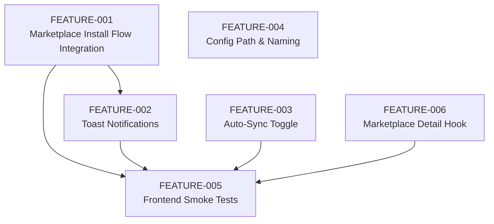

### High-Level Architecture & Scope

MCP Nexus is a Tauri 2 + React/TS desktop app that centralizes MCP server configuration (`~/.mcp-nexus/config.json`) and syncs to 8+ clients via a Rust backend (config manager + sync engine + marketplace/installation/update/keychain services), a Tauri command layer, and a React frontend (hooks + components). This spec covers an MVP readiness gap analysis and produces implementable feature specs for each identified gap, without changing code.

---

## Phase 1 – Current State Audit

### 1.1 Implemented Features & Completion Estimates

- Central config & server CRUD (95–100%)
  - Rust `ConfigManager` handles `~/.mcp-nexus/config.json` with atomic writes, caching, and 0600 permissions (`src-tauri/src/services/config_manager.rs`).
  - `McpHubConfig`/`McpServer` models encapsulate server definitions and per-client enablement (`src-tauri/src/models`).
  - Tauri commands expose config/servers (`config.rs`), wired through `src-tauri/src/lib.rs` and consumed by `src/lib/tauri.ts` and `src/hooks/useServers.ts`.
  - Frontend `Servers` page and `ServerList` / `ServerCard` provide view, enable/disable, and remove flows.
  - Status: Functionally complete, with good Rust test coverage around config, server CRUD, and permissions.

- Multi-client detection & sync (90–100%)
  - `client_detector` resolves config paths for all supported clients and infers detection based on config presence or app/directory existence.
  - `sync_engine` transforms central config into per-client formats (standard, VS Code, Continue.dev, Windsurf; Warp manual-only), preserving permissions.
  - Tauri commands (`sync.rs`, `clients.rs`) expose detect/sync/import/manual-config.
  - React hooks in `src/hooks/useClients.ts` wrap detect/sync/import; `Clients` page, `ClientCard`, `SyncStatus`, and `ManualConfigModal` provide UI.
  - `FirstRunWelcome` dashboard component implements first-run import for detected clients with existing servers.
  - Status: End-to-end flow for detection, sync and import appears wired and supported by Rust tests (`sync_engine`, `client_detector`).

- Marketplace browsing (80–90%)
  - `marketplace_client` wraps PulseMCP API with 5-minute in-memory caching.
  - Tauri commands `search_servers`, `get_server_details`, `clear_marketplace_cache`, `check_marketplace_cache` are defined and wired.
  - `useMarketplace` implements infinite scrolling, filters, and cache invalidation; `Marketplace` page wires search, sort, filter chips, and pagination.
  - `MarketplaceCard` and `ServerDetailModal` provide browsing and detail UX.
  - Status: Browsing/filtering is implemented and integrated; install action from Marketplace is stubbed (see P0 gap).

- Secure credentials (90–100%)
  - Rust `keychain` service and commands implement `save_credential`, `get_credential_value`, `delete_credential`, `list_credentials`, `check_credential_exists`, `validate_credential_references`, using macOS Keychain via `keyring`.
  - `src/hooks/useCredentials.ts` and `useCredentialValue` encapsulate list/create/delete and retrieval.
  - `CredentialManager` component in Settings page uses these hooks for UI.
  - Keychain reference semantics (`keychain:credential-name`) are respected in sync engine (no plaintext credentials in client configs).
  - Status: Core credential management flow is present and tested; frontend lacks explicit error/success toasts but is otherwise functional.

- Health monitoring (90–100%)
  - Rust `health` service + commands implement per-server and bulk health checks and quick status.
  - `useHealth` hooks (`useServerHealth`, `useAllServerHealth`, `useServerStatus`, mutations) wrap Tauri commands and cache results.
  - `HealthStatusBadge` / `HealthStatusDot` components render status badges, used in server cards.
  - Status: Implemented with appropriate query keys and refresh intervals.

- Updates & notifications (80–90%)
  - Rust `updates` service checks registries (npm/PyPI) and exposes `check_for_updates`, `check_server_update`, `check_package_version`, `get_update_count`, with tests.
  - `useUpdates` hooks provide `useCheckForUpdates`, `useUpdateCount`, `useServerUpdate`, `useRefreshUpdates`, `useServersWithUpdates`.
  - `Settings` page “Updates” section displays update counts and per-server versions; `UpdateSummary` dashboard component surfaces counts.
  - Status: Functional for manual “check updates”; auto-install is intentionally roadmap-only.

- Keyboard shortcuts & layout (85–95%)
  - Global keyboard shortcuts implemented for Cmd+K, Cmd+1–5 via `useGlobalKeyboardShortcuts` and activated in `AppContent`.
  - `Sidebar` and `Header` provide consistent layout; `ErrorBoundary` guards routing and app root.
  - No “keyboard shortcuts help overlay” yet (README says “? = coming soon”).

- First-run experience (80–90%)
  - `FirstRunWelcome` uses detected clients and import hooks to bulk-import servers from existing configs.
  - Flow is likely gated by an initialization check (not inspected in full, but Tauri `initialize_config` and dashboard composition support it).
  - Status: Appears functional but lacks explicit telemetry/toasts for success/failure, and doesn’t surface errors from `importClientServers` in UI.

### 1.2 Broken / Incomplete Functionality

- Marketplace Install flow is stubbed:
  - In `src/pages/Marketplace.tsx`, `handleInstall` logs to console, sleeps for 1s, and closes the modal.
  - No call to `installMcpServer` / `useInstallServer`, no sync triggers, no update invalidation, no toast feedback.

- Toast notifications missing for critical operations:
  - `Servers` page uses console logging and has TODOs for toasts on install and sync errors/success.
  - Marketplace install error path has a TODO for error toast.
  - `NotificationStore` and `ToastContainer` are implemented but not consistently used on critical flows.

- Settings “Auto-sync on changes” is a non-functional checkbox:
  - The “Sync Settings” section shows an “Auto-sync on changes” toggle that is not wired to any state or backend behavior.
  - Roadmap mentions “File watcher for auto-sync,” but the flag is purely cosmetic.

- Config location string is incorrect:
  - Settings “Config Location” shows `~/.mcp-manager/config.json`, but the actual path and README use `~/.mcp-nexus/config.json`.

- Naming inconsistency:
  - `FirstRunWelcome` heading says “Welcome to MCP Manager” while project and README call the app “MCP Nexus”.

- Unused/stubbed hook:
  - `useServerDetails` returns an empty object and is not currently used; future detail view work is implied.

### 1.3 Hardcoded Values, TODOs, Placeholder Logic

- Hardcoded paths:
  - Client config paths for all supported clients are hardcoded in `client_detector.rs` using macOS-specific defaults, consistent with README and constraints.
  - Warp config path is a placeholder, used only for documentation/manual config JSON.

- TODOs:
  - `src/pages/Servers.tsx`:
    - TODO: Show error toast on install failure.
    - TODO: Show success toast on sync success.
    - TODO: Show error toast on sync failure.
  - `src/pages/Marketplace.tsx`:
    - TODO: Implement actual installation in Phase 4.1.
    - TODO: Show error toast on install failure.

- Placeholder logic:
  - Marketplace install simulates delay instead of calling backend installation.
  - Auto-sync checkbox in Settings has no effect.
  - `useServerDetails` is intentionally stubbed.

### 1.4 Test Coverage Assessment

- Backend (Rust)
  - Multiple `#[cfg(test)]` modules across `models` and `services`:
    - `config_manager`, `sync_engine`, `client_detector`, `installation`, `updates`, `keychain`, `health`, `doctor`, `marketplace_client` and various model structs.
  - `README.md` mentions `cargo test` with 91 tests; static inspection confirms many unit tests focused on:
    - Config file semantics, permissions, cache behavior.
    - Client detection, sync formats, environment doctor.
    - Installation error handling, marketplace caching, keychain operations, updates.
  - Assessment: Backend core logic has good unit coverage; there are no explicit integration tests across multiple services, but critical paths are reasonably exercised.

- Frontend (React/TS)
  - No Jest/Vitest or React Testing Library setup detected.
  - No `__tests__` or `.test.tsx` files in `src/`.
  - TypeScript type checking and linting are wired but no behavioral tests exist.
  - Assessment: Critical UX flows (Marketplace install, manual install, client sync, credentials) are untested at the UI/hook level.

---

## Phase 2 – Gap Analysis → Feature Specs

Below are standalone feature specs for each identified gap. IDs are sequential and stable for use in Zenflow/issue trackers.

---

### FEATURE-001: Marketplace Install Flow Integration

**Priority:** P0 (Launch Blocker)

**Current State:**  
Marketplace browsing, filtering, and detail modal are implemented. `handleInstall` in `src/pages/Marketplace.tsx` logs the request, simulates a delay, and closes the modal. Backend installation commands (`install_mcp_server`, `validate_install`, `check_runtime_for_registry`) and frontend hooks (`useInstallServer`, `useServers`) are complete and used by `AddServerModal` for manual installs.

**Gap Description:**  
Clicking “Install” from the Marketplace does not actually install servers or sync them to clients. This breaks the documented “Installing Your First Server” flow in README, where Marketplace is the canonical path for installation. Users must instead discover and use manual server installation, which is not the advertised primary path.

**Acceptance Criteria:**
- [ ] From the Marketplace detail modal, installing a server creates an entry in the central config via the Rust installation service.
- [ ] Installed servers from Marketplace are visible in the Servers page with correct name, description, transport, source metadata, and enabled clients.
- [ ] After a successful Marketplace install, client sync runs (if requested) and client statuses reflect the new server.
- [ ] Failure cases (missing runtime, invalid source, network errors) are surfaced to the user via toasts with meaningful messages.
- [ ] React Query caches for `["servers"]`, `["clients","statuses"]`, and `["updates"]` are invalidated or updated appropriately after install.

**Technical Approach:**
- Files to modify:
  - `src/pages/Marketplace.tsx` (wire `handleInstall` to `useInstallServer` / `installMcpServer`).
  - `src/hooks/useServers.ts` (optionally expose a dedicated `installFromMarketplace` wrapper if needed).
  - `src/components/marketplace/ServerDetailModal.tsx` (ensure selection of clients and SSE URL are passed to handler in a compatible shape).
  - `src/stores/notificationStore.ts` (import use in Marketplace for success/error toasts).
- New files needed:
  - None required; optional: a small utility for mapping `MarketplaceServer` metadata into `InstallServerRequest`.
- Dependencies:
  - Existing Tauri commands `install_mcp_server`, `validate_install`.
  - `InstallSource` mapping from marketplace metadata (e.g., npm, uvx, docker, github, remote/SSE).
- Breaking changes: No, provided types are preserved. New optional fields may be added to `InstallServerRequest` if additional metadata is mapped (ensure Rust `InstallServerRequest` stays in sync with TS).

**Verification Steps:**
1. Unit test:
   - Add Rust tests (if mapping logic moves server-side) or TS unit tests (if mapping stays in frontend) to ensure correct mapping from marketplace metadata to `InstallSource` variants.
2. Integration test:
   - Add a frontend integration test (e.g., Vitest + RTL) that mocks Tauri `invoke`, simulates search, opens a server modal, triggers install, and asserts that `install_mcp_server` is called with expected payload and that React Query caches are invalidated.
3. Manual verification:
   - Start the app against a live or mocked PulseMCP API.
   - Install a server from Marketplace (npm, uvx, docker, and remote/SSE variants at minimum).
   - Confirm server appears on Servers page and is enabled for selected clients.
   - Run client sync and confirm client configs contain the new server entries; manually verify config files for at least one client.

**Effort Estimate:** M (2–8 hrs)

**Blocks/Blocked By:** None.

---

### FEATURE-002: Toast Notifications for Critical Operations

**Priority:** P1 (Should Have)

**Current State:**  
`useNotificationStore` and `ToastContainer` are implemented and wired into `App.tsx`. However, several critical flows rely on console logging and inline loading text only:
- `Servers` page install and “Sync All” use console logs and have TODOs for toasts.
- Marketplace install error path has a TODO for error toast.
- Other flows (client sync, credential changes) do not consistently surface success/failure via toasts.

**Gap Description:**  
Users do not receive consistent, actionable feedback when operations succeed or fail. Given the multi-client file operations and potential for subtle errors (permissions, missing runtimes, invalid configs), lack of notifications makes the app feel unreliable and opaque.

**Acceptance Criteria:**
- [ ] Server install/uninstall from Servers and Marketplace pages shows success/error toasts with meaningful titles and messages.
- [ ] “Sync All” and per-client sync operations show a toast on completion (success or failure) including basic summary counts.
- [ ] Credential create/delete operations show success/error toasts.
- [ ] Toasts do not expose sensitive data (no raw secrets or full paths).
- [ ] Notifications use consistent wording and severity (success/info/error) across the app.

**Technical Approach:**
- Files to modify:
  - `src/pages/Servers.tsx` (wire `handleInstall` and `handleSyncAll` success/error callbacks to `showSuccess` / `showError`).
  - `src/pages/Marketplace.tsx` (error path in `handleInstall`; success toast after a real install once FEATURE-001 is done).
  - `src/pages/Clients.tsx` (leverage `SyncStatus` plus toasts on sync completion; optional).
  - `src/components/settings/CredentialManager.tsx` (wrap `saveCredential` / `deleteCredential` promises with notifications).
- New files needed:
  - Optional: `src/lib/notifications.ts` providing small helpers (`notifyInstallSuccess`, `notifySyncFailure`, etc.) to standardize messages.
- Dependencies:
  - `showSuccess`, `showError`, `showWarning`, `showInfo` from `notificationStore`.
- Breaking changes: No.

**Verification Steps:**
1. Unit test:
   - Add lightweight tests (if test harness exists) for notification helpers to ensure they call `useNotificationStore.getState().addNotification` with expected parameters.
2. Integration test:
   - UI tests that simulate server install/sync, client sync, and credential changes and assert that toast components render with expected text.
3. Manual verification:
   - Run through main workflows (install from Marketplace and manual, sync servers/clients, create/delete credentials) and ensure notifications appear with correct severity and copy.

**Effort Estimate:** S–M (2–4 hrs)

**Blocks/Blocked By:** FEATURE-001 (for final Marketplace install success path); can be partially implemented independently.

---

### FEATURE-003: Settings Auto-Sync Behavior or Hide Non-Functional Toggle

**Priority:** P1 (Should Have)

**Current State:**  
In `src/pages/Settings.tsx`, the “Sync Settings” section displays an “Auto-sync on changes” checkbox. The input is not bound to any state or persisted setting, and there is no backend support or file watching logic. Roadmap lists “File watcher for auto-sync” as a future feature.

**Gap Description:**  
The UI suggests that automatic sync-on-change is available, but the toggle does nothing. For MVP, either the functionality must be implemented, or the toggle must be removed/hidden to avoid misleading users.

**Acceptance Criteria (Option A – Implement Minimal Auto-Sync):**
- [ ] A persisted setting (e.g., in central config or a separate app prefs store) controls whether auto-sync is enabled.
- [ ] When enabled, relevant config changes (server add/update/remove, toggle client, install/uninstall) trigger a sync to enabled clients after a short debounce.
- [ ] Auto-sync failures are surfaced (toasts + visible indicators on Clients page).
- [ ] When disabled, sync happens only on explicit user action (button clicks).

**Acceptance Criteria (Option B – Hide/Defer):**
- [ ] The “Auto-sync on changes” UI is removed or clearly labeled as “Coming soon” and disabled so users are not misled.
- [ ] README and in-app copy do not claim auto-sync as a current feature.

**Technical Approach:**
- Files to modify:
  - `src/pages/Settings.tsx` (bind checkbox to real state or remove/annotate).
  - `src-tauri/src/models/config.rs` and `src-tauri/src/services/config_manager.rs` (if the setting becomes part of central config).
  - `src/hooks/useServers.ts`, `src/hooks/useClients.ts` (if implementing frontend-based auto-sync trigger logic).
  - `src-tauri/src/services/sync_engine.rs` / commands (if auto-sync is driven from backend on config write).
- New files needed:
  - Optional: `src-tauri/src/services/preferences.rs` if we separate UI preferences from MCP config.
- Dependencies:
  - Existing sync commands, React Query invalidation, and ConfigManager write paths.
- Breaking changes:
  - Option B: No.
  - Option A: Central config schema change; must keep TS types in sync with Rust models.

**Verification Steps:**
1. Unit test:
   - For Option A, tests around preferences persistence and triggering behavior (e.g., config change → sync call when flag is enabled).
2. Integration test:
   - UI test toggling auto-sync and performing a server change, verifying that a sync is triggered (mock Tauri layer).
3. Manual verification:
   - With auto-sync enabled, add/edit/delete a server and confirm client configs are updated without pressing “Sync” buttons.
   - With auto-sync disabled, confirm no implicit sync occurs.

**Effort Estimate:**  
Option A: M–L (1–2 days, depending on design of preferences and debounce).  
Option B: S (< 2 hrs).

**Blocks/Blocked By:** Product decision on whether auto-sync is required for MVP or is post-launch.

---

### FEATURE-004: Correct Config Location & Naming Consistency

**Priority:** P1 (Should Have)

**Current State:**  
Settings “Config Location” text shows `~/.mcp-manager/config.json`, and `FirstRunWelcome` uses the heading “Welcome to MCP Manager”. The codebase and README use the project name “MCP Nexus” and central config path `~/.mcp-nexus/config.json`. Rust `ConfigManager` actually writes to `~/.mcp-nexus`.

**Gap Description:**  
Inconsistent naming and incorrect config path string will confuse users and support documentation. Users may look in the wrong directory for central config, and name inconsistencies suggest a partially-rebranded product.

**Acceptance Criteria:**
- [ ] Settings page displays the correct config path (`~/.mcp-nexus/config.json`) and ideally makes it copyable.
- [ ] First-run welcome and any other “MCP Manager” labels are updated to “MCP Nexus” (or a clearly decided product name).
- [ ] README, help text, and UI strings are aligned on product name and config path.

**Technical Approach:**
- Files to modify:
  - `src/pages/Settings.tsx` (config location string).
  - `src/components/dashboard/FirstRunWelcome.tsx` (heading and any textual references).
  - Optional: other text components if additional “MCP Manager” references exist.
- New files needed:
  - Optional: `src/lib/constants.ts` for centralizing app name and config path strings used in UI.
- Dependencies:
  - Must match Rust `ConfigManager::new()` behavior in `src-tauri/src/services/config_manager.rs`.
- Breaking changes: No (UI-only).

**Verification Steps:**
1. Unit test:
   - If constants file is added, unit test that UI uses constants that match backend config path.
2. Integration test:
   - Snapshot tests verifying that Settings and FirstRunWelcome render the expected strings.
3. Manual verification:
   - Open Settings and confirm displayed path matches actual `config_dir`/`config_path` on disk.

**Effort Estimate:** S (< 2 hrs)

**Blocks/Blocked By:** Product decision on final branding (“MCP Nexus” vs “MCP Manager”).

---

### FEATURE-005: Frontend Smoke Test Suite for Critical Flows

**Priority:** P1 (Should Have)

**Current State:**  
There is no frontend test harness (no Jest/Vitest/RTL). TypeScript and ESLint are configured and used, but critical flows are untested:
- Marketplace install and manual install flows.
- Client detection/sync flows.
- Credential management.
- Dashboard first-run import.

**Gap Description:**  
Without automated UI or hook-level tests, regressions in routing, Tauri command wiring, and core flows may ship unnoticed. The backend has good unit coverage; frontend does not.

**Acceptance Criteria:**
- [ ] Test runner (Vitest or Jest) and React Testing Library are configured for the project.
- [ ] At least one smoke test per critical flow exists:
  - Install server from Marketplace (once FEATURE-001 is implemented).
  - Install server manually via `AddServerModal`.
  - Sync all clients and verify that `sync_all_clients` is invoked.
  - Create/delete credential via `CredentialManager`.
  - Render Dashboard and simulate first-run import path (mocking Tauri commands).
- [ ] Tests can run in CI via `npm test` (or equivalent) and are mentioned in README.

**Technical Approach:**
- Files to modify:
  - `package.json` (add test script and dev dependencies: Vitest/Jest, RTL).
  - `tsconfig.json` (if needed to support test files).
- New files needed:
  - `vitest.config.ts` or Jest configuration.
  - `src/test/setup.ts` (RTL/Vitest setup).
  - Test files under `src/__tests__/` or colocated `*.test.tsx` for:
    - `Servers` page install/sync.
    - `Marketplace` page install.
    - `Clients` page sync.
    - `Settings` credential workflow.
    - `Dashboard` first-run.
- Dependencies:
  - Chosen test runner and RTL.
  - Mock layer for `@tauri-apps/api/core` `invoke` calls.
- Breaking changes: No.

**Verification Steps:**
1. Unit/integration tests:
   - Implement tests as described and ensure they run and pass locally.
2. Integration test:
   - Add minimal CI config (GitHub Actions or similar) to run the test suite on PRs (optional for this spec).
3. Manual verification:
   - Run `npm test` and confirm key flows are covered and stable.

**Effort Estimate:** M (2–8 hrs) for initial harness and smoke tests.

**Blocks/Blocked By:** None.

---

### FEATURE-006: Marketplace Server Detail Data Hook (Optional Post-MVP)

**Priority:** P2 (Nice to Have)

**Current State:**  
`useServerDetails` in `src/hooks/useMarketplace.ts` returns an empty object and is not used. The `ServerDetailModal` currently receives a `MarketplaceServer` object from the list and renders details without extra data.

**Gap Description:**  
The initial design likely envisioned a dedicated detail fetch for richer server info (additional metadata, versions, documentation links). This is not required for core MVP functionality but would improve UX and justify the `get_server_details` Tauri command.

**Acceptance Criteria:**
- [ ] `useServerDetails` is implemented to call `getServerDetails(name)` and cache per-server details.
- [ ] `ServerDetailModal` can use richer data (if available) and fall back gracefully when additional info is missing.
- [ ] Errors in details fetch are surfaced in the modal without breaking the rest of the Marketplace page.

**Technical Approach:**
- Files to modify:
  - `src/hooks/useMarketplace.ts` (`useServerDetails` implementation).
  - `src/components/marketplace/ServerDetailModal.tsx` (optional enhancements).
- New files needed:
  - None.
- Dependencies:
  - Tauri command `get_server_details`.
- Breaking changes: No.

**Verification Steps:**
1. Unit test:
   - Test `useServerDetails` with mocked `getServerDetails` to ensure query keys and error handling are correct.
2. Integration test:
   - UI test that opens detail modal, triggers detail fetch, and verifies rendering.
3. Manual verification:
   - Confirm additional metadata appears in detail modal when available.

**Effort Estimate:** S–M (2–4 hrs)

**Blocks/Blocked By:** None.

---

## Phase 3 – Launch Readiness Summary

### 3.1 P0 Launch Blockers

- FEATURE-001: Marketplace Install Flow Integration

If Marketplace install remains stubbed, the advertised “Installing Your First Server” flow in README is broken, and users cannot install servers via the primary UI path.

### 3.2 P1 Should Haves

- FEATURE-002: Toast Notifications for Critical Operations  
- FEATURE-003: Settings Auto-Sync Behavior or Hide Non-Functional Toggle  
- FEATURE-004: Correct Config Location & Naming Consistency  
- FEATURE-005: Frontend Smoke Test Suite for Critical Flows  

These significantly improve reliability, transparency, and maintainability but do not strictly prevent use of core features (central config, multi-client sync, manual install, health, updates, credentials).

### 3.3 P2 Post-Launch / Nice to Have

- FEATURE-006: Marketplace Server Detail Data Hook
- Roadmap items from README (not specced individually here unless promoted to MVP):
  - Linux and Windows support.
  - Per-tool enable/disable within servers.
  - Request logging and debugging.
  - CLI interface.
  - Automatic update installation.
  - File watcher for auto-sync (if deferred).
  - Hot reload for supported clients.

### 3.4 Technical Debt Register

- Unused or stubbed code:
  - `useServerDetails` placeholder.
  - Any unused Tauri commands or model fields that accumulate if not wired.
- Inconsistent naming:
  - “MCP Manager” vs “MCP Nexus” in UI and code comments.
- Missing frontend tests:
  - No Jest/Vitest/RTL harness; reliance on manual QA for UI.
- Minimal observability:
  - No explicit request logging/debugging surface beyond console logs.

### 3.5 Estimated Total Effort for P0 Items

- FEATURE-001 (Marketplace Install Flow Integration): M (2–8 hrs)

Total P0 effort: **M (2–8 hrs)**, assuming familiarity with existing installation and sync services and no major backend refactors.

### 3.6 P0 Dependency Diagram (Mermaid)

