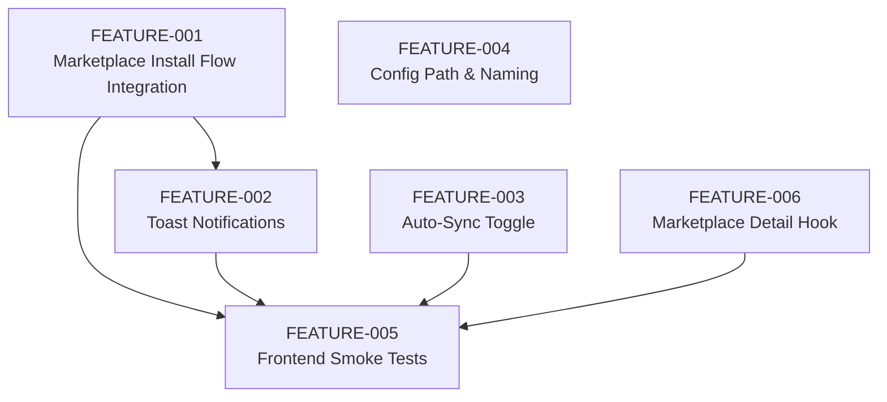

### MVP Readiness Gap Analysis – MCP Nexus

---

## Phase 1 – Current State Audit

### 1.1 Implemented Features & Completion Estimates

- Central config & server CRUD (95–100%)
  - Rust `ConfigManager` manages `~/.mcp-nexus/config.json` with atomic writes, caching, and 0600 permissions.
  - `McpHubConfig` / `McpServer` models encapsulate server definitions and per-client enablement.
  - Tauri commands expose config/server CRUD; consumed via `src/lib/tauri.ts` and `src/hooks/useServers.ts`.
  - Servers page supports listing, enabling/disabling per client, and removal.
- Multi-client detection & sync (90–100%)
  - `client_detector` resolves all supported client paths and detects presence.
  - `sync_engine` maps central config into per-client formats (standard, VS Code, Continue.dev, Windsurf); Warp is manual-only.
  - Tauri commands and `useClients` hooks provide detect/sync/import; Clients UI surfaces status and manual config.
- Marketplace browsing (80–90%)
  - `marketplace_client` wraps PulseMCP API with 5-minute in-memory cache.
  - Commands: `search_servers`, `get_server_details`, `clear_marketplace_cache`, `check_marketplace_cache`.
  - `useMarketplace` implements search, filters, infinite scroll; Marketplace UI renders list and detail modal.
- Secure credentials (90–100%)
  - Keychain service stores credentials in macOS Keychain; commands expose CRUD and validation.
  - `useCredentials` / `useCredentialValue` hooks and Settings credential UI present a reasonable UX.
  - `sync_engine` preserves `keychain:` references and never writes secrets into client configs.
- Health monitoring (90–100%)
  - Health service and commands implement per-server and bulk checks; `useHealth` hooks wrap them.
  - Health badges/dots integrated into server UI.
- Updates & notifications (80–90%)
  - `updates` service checks npm/PyPI and counts pending updates.
  - `useUpdates` hooks and Settings/UpdateSummary components surface update counts.
- Keyboard shortcuts & layout (85–95%)
  - Global shortcuts (Cmd+K, Cmd+1–5) wired via `useGlobalKeyboardShortcuts`.
  - Sidebar/Header layout and ErrorBoundary in place.
- First-run experience (80–90%)
  - `FirstRunWelcome` flows import from existing client configs on first run.
  - Dashboard surfaces high-level status and quick actions.

### 1.2 Broken / Incomplete Functionality

- Marketplace “Install” button is wired but the actual install flow is stubbed; no end-to-end path from Marketplace to central config to client sync. For MVP this is treated as a browse-only surface with manual install via the Servers page, and the streamlined install path is explicitly deferred to post-MVP.
- Auto-sync toggle in Settings is non-functional (no persisted state, no effect on sync behavior).
- Historically, config location text and branding were inconsistent between UI/docs and backend. This has been resolved so all user-facing surfaces use “MCP Nexus” and `~/.mcp-nexus/config.json`.
- Frontend lacks a test harness; critical UI flows are untested.
- `useServerDetails` hook and `get_server_details` command are not fully utilized.

### 1.3 Hardcoded Values, TODOs, Placeholders

- Earlier UI copy referenced a deprecated config path that differed from the backend’s `~/.mcp-nexus/config.json`; this has been updated so all references are consistent.
- Marketplace install and several operations have TODOs for toasts and proper error handling.
- `useServerDetails` returns placeholder data.
- Auto-sync checkbox is a placeholder without backing state.

### 1.4 Test Coverage Assessment

- Rust backend:
  - Good unit coverage for config management, sync engine, client detection, marketplace client, updates, and keychain integration.
- Frontend:
  - No Jest/Vitest harness configured.
  - No automated tests for Servers/Clients/Marketplace/Settings/Dashboard flows.
  - Critical UI paths (install, sync, credential workflows) rely on manual testing.

---

## Phase 2 – Gap Analysis → Feature Specs

---

### FEATURE-001: Marketplace Install Flow Integration

**Priority:** P2 (Post-Launch)

**Current State:**  
Marketplace browsing, filtering, and details are implemented via PulseMCP API and React Query. A Tauri install command and Rust installation service exist for servers from various sources (npm, uvx, docker, remote/SSE). However, the Marketplace “Install” action is not wired through to the installation pipeline, and installed servers do not automatically appear in the Servers list or sync to clients through this path. Today, users discover servers in Marketplace and then install them manually via the Servers page using the commands shown in the detail modal.

**Gap Description:**  
There is no streamlined “install from Marketplace” workflow that takes users directly from search → evaluate → install → sync to clients in a single flow. For MVP, Marketplace is intentionally scoped as a discovery/browse surface only; this feature spec captures the post-MVP enhancement to make Marketplace the primary, one-click installation channel.

**Acceptance Criteria:**
- [ ] Clicking “Install” on a Marketplace server triggers a full install flow that:
  - [ ] Maps Marketplace metadata to an `InstallServerRequest` (including `InstallSource`, transport, and default clients).
  - [ ] Invokes the Rust install command and waits for completion.
  - [ ] Adds the server to central config and marks it enabled for at least one client.
- [ ] On success, the server appears on the Servers page without manual refresh and is eligible for sync to clients.
- [ ] On failure, a meaningful error toast is shown, and no partial/invalid server is persisted.
- [ ] Marketplace install triggers any relevant React Query invalidations (servers, updates, health, clients if needed).

**Technical Approach:**
- Files to modify:
  - `src/hooks/useMarketplace.ts` to add a `useInstallFromMarketplace` mutation that:
    - Translates `MarketplaceServer` into install payload.
    - Invokes the Tauri `install_mcp_server` command.
    - Invalidates `["servers"]`, `["updates"]`, and related queries on success.
  - `src/pages/Marketplace.tsx` and `ServerDetailModal` to call the new mutation and wire loading/error states.
  - `src/hooks/useServers.ts` if a shared install helper is needed, or to reuse existing install mutation.
- New files needed:
  - Optional: `src/lib/installMapping.ts` to encapsulate mapping from marketplace metadata to `InstallSource` variants and transports.
- Dependencies:
  - Rust installation service and Tauri command (`install_mcp_server` or equivalent).
  - TS types for `InstallServerRequest` aligned with Rust structs.
- Breaking changes: No, provided Rust/TS types remain compatible and mapping is additive.

**Verification Steps:**
1. Unit test:
   - TS tests for mapping logic from `MarketplaceServer` to `InstallServerRequest` (including handling npm/uvx/docker/remote).
2. Integration test:
   - Frontend test that simulates search, opens details, triggers install, and asserts invoke payload plus query invalidations.
3. Manual verification:
   - Install one server from each major source type.
   - Confirm appearance in Servers UI and presence in at least one client config after sync.

**Effort Estimate:** M (2–8 hrs)

**Blocks/Blocked By:** None.

---

### FEATURE-002: Toast Notifications for Critical Operations

**Priority:** P1 (Should Have)

**Current State:**  
`useNotificationStore` and `ToastContainer` exist and are wired into `App.tsx`. Several critical flows (Marketplace install, server install/uninstall, “Sync All”, client sync, credential operations) either log to console or update inline text only. Some TODOs exist noting missing toasts.

**Gap Description:**  
Users lack consistent feedback for success/failure of high-impact operations. Given multi-client config writes and possible subtle failure modes (permissions, invalid paths, missing runtimes), silent failures degrade trust and diagnosability.

**Acceptance Criteria:**
- [ ] Server install/uninstall (from Servers and Marketplace) shows success/error toasts with concise, informative messages.
- [ ] “Sync All” and per-client sync operations display completion toasts including at least success/failure state.
- [ ] Credential create/delete operations display success/error toasts.
- [ ] Toast messages avoid secrets and overly sensitive details.
- [ ] Notification semantics (title, severity, copy) are consistent across the app.

**Technical Approach:**
- Files to modify:
  - `src/pages/Servers.tsx` to wrap install/uninstall and “Sync All” handlers with `showSuccess`/`showError`.
  - `src/pages/Marketplace.tsx` to add success/error toasts in Marketplace install flow (post FEATURE-001).
  - `src/pages/Clients.tsx` or sync-related components to add toasts around client sync operations.
  - `src/components/settings/CredentialManager.tsx` to wrap credential mutations with notifications.
- New files needed:
  - Optional: `src/lib/notifications.ts` containing helpers (`notifyInstallSuccess`, `notifySyncFailure`, etc.).
- Dependencies:
  - `showSuccess`, `showError`, `showWarning`, `showInfo` from `notificationStore`.
- Breaking changes: No.

**Verification Steps:**
1. Unit test:
   - Tests for notification helpers to ensure they emit expected payloads to the store.
2. Integration test:
   - UI tests for server install/uninstall, sync, and credential workflows asserting rendered toast content.
3. Manual verification:
   - Run each critical workflow and confirm correct toasts on success and failure.

**Effort Estimate:** S–M (2–4 hrs)

**Blocks/Blocked By:** FEATURE-001 (for complete Marketplace install success path; others can proceed independently).

---

### FEATURE-003: Settings Auto-Sync Behavior or Hide Non-Functional Toggle

**Priority:** P1 (Should Have) – Preferred Option A (implement minimal auto-sync for MVP)

**Current State:**  
Settings “Sync Settings” section exposes an “Auto-sync on changes” checkbox that is not bound to any state, is not persisted, and has no observable effect. Sync currently occurs only on explicit user actions (buttons).

**Gap Description:**  
The UI suggests an auto-sync capability that does not exist. This is misleading and can cause confusion about expected behavior. For MVP, the toggle must either be wired to real behavior or clearly removed/de-scoped. Product preference is to implement a minimal auto-sync.

**Acceptance Criteria (Option A – Implement Minimal Auto-Sync):**
- [ ] Auto-sync preference is persisted (central config or a separate app preferences store).
- [ ] When enabled, server changes (add/update/remove, enable/disable for clients, install/uninstall) automatically trigger a debounced sync to enabled clients.
- [ ] Auto-sync errors are surfaced via toasts and visible indicators on Clients page.
- [ ] When disabled, sync occurs only via explicit user actions.

**Technical Approach:**
- Files to modify:
  - `src/pages/Settings.tsx` to bind the checkbox to real state and wire it to stored preference.
  - `src-tauri/src/models/config.rs` and `src-tauri/src/services/config_manager.rs` if storing the flag in central config.
  - `src/hooks/useServers.ts` / `src/hooks/useClients.ts` to trigger sync after relevant mutations when auto-sync is enabled.
  - `src-tauri/src/services/sync_engine.rs` / sync commands if auto-sync is driven from backend on config writes.
- New files needed:
  - Optional: `src-tauri/src/services/preferences.rs` for UI-level preferences separate from MCP config.
- Dependencies:
  - Existing sync commands and config write flows.
- Breaking changes:
  - Option A: central config schema changes; TS types must be updated in lockstep.

**Verification Steps:**
1. Unit test:
   - Tests around preference persistence and trigger logic (config change → sync when flag is enabled).
2. Integration test:
   - UI test toggling auto-sync and performing a server change, verifying sync triggers (mocking Tauri).
3. Manual verification:
   - With auto-sync enabled, modify servers and confirm clients update without explicit sync button.
   - With auto-sync disabled, confirm no implicit sync occurs.

**Effort Estimate:** M–L (1–2 days)

**Blocks/Blocked By:** None (product decision already favors Option A).

---

### FEATURE-004: Correct Config Location & Naming Consistency

**Priority:** P1 (Should Have)

**Current State:**  
All UI strings and documentation now consistently reference “MCP Nexus” and `~/.mcp-nexus/config.json`. Backend and project branding also use “MCP Nexus”, and `ConfigManager` writes to `~/.mcp-nexus`. Earlier references to the previous name and path have been removed or clarified.

**Gap Description:**  
Inconsistent naming and config path references create confusion for users and complicate troubleshooting. Users may look at the wrong path when debugging and may not realize which product name is canonical.

**Acceptance Criteria:**
- [ ] All user-facing references to the app name use “MCP Nexus”.
- [ ] All user-facing references to the central config path use `~/.mcp-nexus/config.json`.
- [ ] README and Settings “Config Location” display consistent, correct values.
- [ ] No stale references to the previous config directory name or path remain in strings or docs (migrations, if any, are clearly described).

**Technical Approach:**
- Files to modify:
  - Settings and FirstRun components for headings and config path text.
  - `README.md` and any other top-level docs referencing old names.
- New files needed:
  - Optional: `docs/configuration.md` consolidating config path and client locations.
- Dependencies:
  - Existing path logic in `ConfigManager` and client detector.
- Breaking changes: No runtime changes; user perception/UX only.

**Verification Steps:**
1. Unit test:
   - Optional string snapshot tests for key components to guard against regressions.
2. Integration test:
   - None required; visual regression or snapshot coverage is sufficient.
3. Manual verification:
   - Visually confirm Settings, FirstRun, and README show “MCP Nexus” and `~/.mcp-nexus/config.json`.
   - Search codebase for remaining legacy naming or outdated config-path references.

**Effort Estimate:** S (< 2 hrs)

**Blocks/Blocked By:** None.

---

### FEATURE-005: Frontend Smoke Test Suite for Critical Flows

**Priority:** P1 (Should Have)

**Current State:**  
Rust backend has good unit test coverage. The React frontend does not have a configured test runner (Jest/Vitest) or RTL. No automated tests cover core flows like install, sync, credentials, or first-run.

**Gap Description:**  
Without frontend tests, critical workflows can regress silently. Given the multi-client nature and file operations, even small UI regressions can have outsized impact. MVP should include at least smoke tests for primary flows.

**Acceptance Criteria:**
- [ ] A test runner (Vitest recommended, Jest acceptable) is configured for the React frontend, with sensible defaults (TypeScript, JSX, jsdom).
- [ ] At least one smoke test exists for each of:
  - [ ] Server install/sync (Servers page).
  - [ ] Marketplace install (once FEATURE-001 is implemented).
  - [ ] Client sync (Clients page).
  - [ ] Credential create/delete (Settings).
  - [ ] First-run import (Dashboard/FirstRun).
- [ ] Tests run via `npm test` and can be wired into CI.
- [ ] Tests mock Tauri `invoke` and do not require actual backend.

**Technical Approach:**
- Files to modify:
  - `package.json` to add `test` script and test dependencies.
  - Source files as needed to make components testable (exporting hooks/components cleanly).
- New files needed:
  - `vitest.config.ts` (recommended) or `jest.config.ts`.
  - `src/test/setup.ts` for RTL and test env setup.
  - Test files for key pages/components (e.g., `Servers.test.tsx`, `Marketplace.test.tsx`, etc.).
- Dependencies:
  - Vitest + React Testing Library + jsdom.
  - Mocks for `@tauri-apps/api/core` and other Tauri modules.
- Breaking changes: No.

**Verification Steps:**
1. Unit/integration tests:
   - Implement and run the defined smoke tests.
2. Integration test:
   - Optional CI workflow step to run tests on PRs.
3. Manual verification:
   - Run `npm test` locally and ensure coverage of critical flows.

**Effort Estimate:** M (2–8 hrs)

**Blocks/Blocked By:** FEATURE-001 (for Marketplace install test only; other tests can land earlier).

---

### FEATURE-006: Marketplace Server Detail Data Hook (Post-MVP)

**Priority:** P2 (Nice to Have)

**Current State:**  
`useServerDetails` in `useMarketplace.ts` is stubbed and returns an empty object. `ServerDetailModal` operates on the basic `MarketplaceServer` item from the list. The Tauri `get_server_details` command exists for richer metadata but is not actively used.

**Gap Description:**  
The design anticipates a richer details view per Marketplace server (additional metadata, documentation links, versions). Current implementation underutilizes the backend capability. This is non-blocking but would improve UX and justify the Tauri command.

**Acceptance Criteria:**
- [ ] `useServerDetails` calls `getServerDetails(name)` and caches results per server.
- [ ] `ServerDetailModal` consumes detailed data when available and gracefully falls back to basic list data.
- [ ] Errors in details fetch are handled in-modal without impacting the rest of the Marketplace page.

**Technical Approach:**
- Files to modify:
  - `src/hooks/useMarketplace.ts` to implement `useServerDetails`.
  - `src/components/marketplace/ServerDetailModal.tsx` to use the hook and render richer metadata.
- New files needed:
  - None.
- Dependencies:
  - Tauri command `get_server_details`.
- Breaking changes: No.

**Verification Steps:**
1. Unit test:
   - Tests for `useServerDetails` verifying query keys, success, and error behavior.
2. Integration test:
   - UI test opening the detail modal and asserting additional metadata rendering.
3. Manual verification:
   - Inspect several Marketplace servers and confirm enhanced detail rendering and error resilience.

**Effort Estimate:** S–M (2–4 hrs)

**Blocks/Blocked By:** None.

---

## Phase 3 – Launch Readiness Summary

### 3.1 P0 Launch Blockers

None. Marketplace install and other gaps have been reclassified as P1/P2 and can be scheduled according to risk tolerance and capacity.

### 3.2 P1 Should Haves

- FEATURE-002: Toast Notifications for Critical Operations  
- FEATURE-003: Settings Auto-Sync Behavior (Option A)  
- FEATURE-004: Correct Config Location & Naming Consistency  
- FEATURE-005: Frontend Smoke Test Suite for Critical Flows  

### 3.3 P2 Post-Launch

- FEATURE-001: Marketplace Install Flow Integration  
- FEATURE-006: Marketplace Server Detail Data Hook  
  - Additional roadmap items not specced here (Linux/Windows support, per-tool enable/disable, request logging, CLI, automatic update installation, file watcher for auto-sync if deferred, hot reload for supported clients).

### 3.4 Technical Debt Register

- Unused/stubbed code:
  - `useServerDetails` and related detail command underutilized.
- Inconsistent naming:
  - Any future reintroductions of legacy naming or incorrect config-path references in UI/docs.
- Missing frontend tests:
  - No harness or coverage for critical UI workflows.
- Limited observability:
  - No structured request logging or dedicated debugging surfaces beyond console.

### 3.5 Estimated Total Effort (P0 Items Only)

There are currently no P0-classified items. Previous P0 effort for Marketplace install (FEATURE-001, estimated M / 2–8 hrs) is now tracked as part of the P2/post-launch roadmap.

### 3.6 Dependency Diagram (Mermaid)

